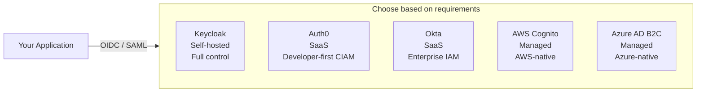

# Identity Providers Comparison

## Category

CIAM / IAM — Identity Providers, Keycloak, Auth0, Okta, AWS Cognito, Azure AD B2C, Platform Selection

## Context

Choosing an Identity Provider (IdP) is a high-impact architectural decision — migrating users away from an IdP later is painful. The choice depends on hosting model, scale, B2B/B2C requirements, compliance, and team expertise.

### Platform Comparison

| Dimension | Keycloak | Auth0 | Okta | AWS Cognito | Azure AD B2C |
|-----------|---------|-------|------|-------------|-------------|
| **Hosting** | Self-hosted / Keycloak Cloud | SaaS | SaaS | Managed AWS | Managed Azure |
| **Open source** | ✅ | ❌ | ❌ | ❌ | ❌ |
| **Primary use case** | IAM / CIAM | CIAM + developer-first | Workforce IAM | AWS-native CIAM | Azure-native CIAM |
| **CIAM (customers)** | ✅ | ✅ | ✅ (via CIC) | ✅ | ✅ |
| **Workforce (employees)** | ✅ | Limited | ✅ | Limited | ✅ (Azure AD) |
| **Social login** | ✅ (plugins) | ✅ Best-in-class | ✅ | ✅ | ✅ |
| **WebAuthn / Passkeys** | ✅ | ✅ | ✅ | Limited | ✅ |
| **SAML 2.0** | ✅ | ✅ | ✅ | Limited | ✅ |
| **SCIM** | ✅ | ✅ | ✅ | Limited | ✅ |
| **Custom UI / flows** | Full control | Actions + Custom Pages | Low-code + Hooks | Lambda triggers | Custom policies (complex) |
| **Scale (free tier)** | Unlimited | 7,500 MAU | 100 MAU | 50k MAU | 50k MAU |
| **MFA** | ✅ TOTP, OTP | ✅ All methods | ✅ All methods | ✅ | ✅ |
| **Pricing model** | Infra cost | Per-MAU | Per-user/month | Per-MAU (low cost) | Per-MAU (low cost) |
| **Compliance** | Self-managed | SOC2, ISO27001 | SOC2, FedRAMP | AWS compliance | Azure compliance |

### Selection Guide

| Scenario | Recommendation |
|---------|---------------|
| Full control, open-source, self-hosted | **Keycloak** |
| Consumer app, fastest time-to-market, social login | **Auth0** |
| Enterprise workforce + partners + MFA | **Okta** |
| AWS-native, serverless, cost-sensitive | **Cognito** |
| Azure enterprise, M365 integration | **Azure AD B2C** |
| Regulated industry (banking/healthcare), data residency | **Keycloak** (self-hosted) or **Auth0** (EU tenant) |

---

## Pros

- **Keycloak**: No per-user cost, full protocol support (SAML, OIDC, SCIM, Kerberos), full UI customisation.
- **Auth0**: Best developer experience; Actions (serverless hooks), rich social login connectors, strong CIAM features.
- **Okta**: Enterprise-grade workforce IAM; deep AD/LDAP integration, compliance certifications.
- **Cognito**: Extremely low cost at scale; native AWS integration (API Gateway, ALB, Lambda).
- **Azure AD B2C**: Seamless M365 tenant integration; custom policy engine (IEF) for complex flows.

---

## Cons

- **Keycloak**: Operational burden — upgrades, HA, tuning required; complex UI customisation via Freemarker.
- **Auth0**: Expensive at high MAU; Actions have cold-start latency; some enterprise features require higher tiers.
- **Okta**: Primary focus is workforce; CIAM (CIC) is a separate product; expensive for high-volume consumer.
- **Cognito**: Limited customisation; hosted UI is basic; complex flows require Lambda triggers; limited SAML.
- **Azure AD B2C**: Custom Identity Experience Framework (IEF) XML is notoriously difficult; limited modern protocol support.

---

## Design Diagram



---

## Code Sample

### Keycloak — Docker Compose for local development

```yaml
# docker-compose.yml
services:
  keycloak:
    image: quay.io/keycloak/keycloak:24.0
    command: start-dev
    environment:
      KEYCLOAK_ADMIN: admin
      KEYCLOAK_ADMIN_PASSWORD: admin
      KC_DB: postgres
      KC_DB_URL: jdbc:postgresql://postgres:5432/keycloak
      KC_DB_USERNAME: keycloak
      KC_DB_PASSWORD: keycloak
    ports:
      - "8080:8080"
    depends_on:
      - postgres

  postgres:
    image: postgres:16
    environment:
      POSTGRES_DB: keycloak
      POSTGRES_USER: keycloak
      POSTGRES_PASSWORD: keycloak
```

```typescript
// Keycloak Admin REST API — create user programmatically
async function createKeycloakUser(realm: string, userData: {
  email: string;
  firstName: string;
  lastName: string;
  enabled?: boolean;
}) {
  const adminToken = await getKeycloakAdminToken();

  const response = await fetch(
    `${process.env.KEYCLOAK_URL}/admin/realms/${realm}/users`,
    {
      method: 'POST',
      headers: {
        Authorization: `Bearer ${adminToken}`,
        'Content-Type': 'application/json',
      },
      body: JSON.stringify({
        email: userData.email,
        firstName: userData.firstName,
        lastName: userData.lastName,
        enabled: userData.enabled ?? true,
        emailVerified: false,
        requiredActions: ['VERIFY_EMAIL'],
      }),
    }
  );

  if (!response.ok) {
    throw new Error(`Failed to create user: ${await response.text()}`);
  }

  const location = response.headers.get('Location')!;
  return location.split('/').at(-1)!; // returns user ID
}
```

### Auth0 — Management API operations

```typescript
import { ManagementClient } from 'auth0';

const management = new ManagementClient({
  domain: process.env.AUTH0_DOMAIN!,
  clientId: process.env.AUTH0_MGMT_CLIENT_ID!,
  clientSecret: process.env.AUTH0_MGMT_CLIENT_SECRET!,
});

// Create user
async function createAuth0User(email: string, name: string) {
  return management.users.create({
    connection: 'Username-Password-Authentication',
    email,
    name,
    password: crypto.randomBytes(20).toString('base64'), // temp password
    email_verified: false,
  });
}

// Assign roles
async function assignRole(userId: string, roleName: string) {
  const roles = await management.roles.getAll();
  const role = roles.data.find(r => r.name === roleName);
  if (!role) throw new Error(`Role ${roleName} not found`);

  await management.users.assignRoles({ id: userId }, { roles: [role.id!] });
}

// Auth0 Action — add custom claims to access token
// (saved in Auth0 Dashboard → Actions → Flows → Login)
const auth0Action = `
exports.onExecutePostLogin = async (event, api) => {
  const namespace = 'https://api.myapp.com';
  api.accessToken.setCustomClaim(\`\${namespace}/tenant_id\`, event.user.app_metadata.tenant_id);
  api.accessToken.setCustomClaim(\`\${namespace}/roles\`, event.authorization?.roles ?? []);
};
`;
```

### AWS Cognito — User Pool with Lambda triggers

```typescript
// CDK stack for Cognito User Pool
import * as cognito from 'aws-cdk-lib/aws-cognito';

const userPool = new cognito.UserPool(this, 'UserPool', {
  selfSignUpEnabled: true,
  signInAliases: { email: true },
  autoVerify: { email: true },
  standardAttributes: {
    email: { required: true, mutable: true },
    fullname: { required: false, mutable: true },
  },
  passwordPolicy: {
    minLength: 12,
    requireUppercase: true,
    requireDigits: true,
    requireSymbols: true,
  },
  mfa: cognito.Mfa.OPTIONAL,
  mfaSecondFactor: { sms: false, otp: true },
  lambdaTriggers: {
    // Add custom claims to JWT
    preTokenGeneration: preTokenLambda,
    // Custom email templates
    customMessage: customEmailLambda,
    // Block disposable email domains
    preSignUp: preSignUpLambda,
  },
});

// Lambda: add tenant_id to Cognito JWT
// pre-token-generation/index.ts
export const handler = async (event: any) => {
  event.response.claimsOverrideDetails = {
    claimsToAddOrOverride: {
      tenant_id: event.request.userAttributes['custom:tenant_id'] ?? '',
    },
  };
  return event;
};
```

---

## Related

- [01 — OAuth 2.0 & OIDC](./01-oauth2-oidc.md) — all IdPs implement OIDC; configuration details differ
- [03 — SAML & Enterprise SSO](./03-saml-enterprise-sso.md) — Keycloak, Okta, Azure AD all act as SAML IdPs
- [04 — SCIM User Provisioning](./04-scim-user-provisioning.md) — SCIM provisioning into your app from any of these IdPs
- [10 — Identity Federation](./10-identity-federation.md) — configure these IdPs as federation sources for B2B tenants
