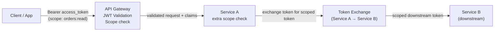

# API Security with OAuth

## Category

CIAM / IAM — API Protection, OAuth 2.0, Bearer Tokens, mTLS, DPoP, Token Exchange, API Gateway

## Context

Securing APIs with OAuth 2.0 means treating every request as a **token-bearing call** from a verified client. The API enforces that tokens are valid, unexpired, scoped to the right audience, and optionally bound to the client's cryptographic identity (mTLS / DPoP) to prevent stolen-token replay.

### Token Validation at API Layer

| Check | How |
|-------|-----|
| Signature valid | Verify against JWKS |
| Issuer (`iss`) | Must match expected auth server |
| Audience (`aud`) | Must include this API's identifier |
| Expiry (`exp`) | Must be in the future |
| Scope (`scope`) | Must include required scope for this endpoint |
| Algorithm | Explicit allow-list (RS256) |
| Revocation | Denylist check for sensitive APIs |
| Token binding | DPoP proof or mTLS cert hash (high-assurance) |

### Scope Design

```
# Format: resource:action
orders:read
orders:write
payments:initiate
payments:approve
admin:users
```

Scopes should be **resource-scoped**, not role-scoped. A token with `orders:read` can read orders regardless of the user's role — the combination of scope + role + resource checks provides complete authorisation.

---

## Pros

- Bearer tokens are stateless — any instance of a service can validate them without a shared store.
- Scopes enable least-privilege — the OAuth client only requests what it needs, limiting breach impact.
- mTLS / DPoP binding prevents token replay across different clients even after theft.
- API gateways (Kong, AWS API GW, NGINX) can handle JWT validation centrally, offloading all services.
- Token Exchange (RFC 8693) enables microservices to pass identity downstream without re-authenticating.

---

## Cons

- JWT validation at every service adds minor CPU overhead — JWKS caching is essential.
- Bearer tokens (without DPoP/mTLS) are usable by anyone who obtains them — TLS in transit is mandatory.
- Scope explosion: too many fine-grained scopes become unmaintainable; too few lose least-privilege benefit.
- Downstream token propagation patterns (token exchange vs forwarding) require careful design.
- mTLS requires certificate management infrastructure — complex to operate at scale.

---

## Design Diagram



---

## Code Sample

### TypeScript — API gateway JWT validation middleware

```typescript
import { createRemoteJWKSet, jwtVerify } from 'jose';

const JWKS = createRemoteJWKSet(
  new URL(`${process.env.OIDC_ISSUER}/.well-known/jwks.json`),
  { cacheMaxAge: 10 * 60 * 1000 }
);

// Validate Bearer token and attach claims to request
export async function validateBearerToken(req: any, res: any, next: any) {
  const auth = req.headers.authorization;

  if (!auth?.startsWith('Bearer ')) {
    return res.status(401).json({ error: 'missing_token', error_description: 'Bearer token required' });
  }

  try {
    const { payload } = await jwtVerify(auth.slice(7), JWKS, {
      issuer: process.env.OIDC_ISSUER!,
      audience: process.env.API_AUDIENCE!,
      algorithms: ['RS256'],
    });
    req.claims = payload;
    next();
  } catch (err: any) {
    const code = err.code === 'ERR_JWT_EXPIRED' ? 'token_expired' : 'invalid_token';
    res.status(401).json({ error: code });
  }
}

// Scope enforcement
function requireScope(...requiredScopes: string[]) {
  return (req: any, res: any, next: any) => {
    const tokenScopes = (req.claims?.scope as string ?? '').split(' ');
    const hasScope = requiredScopes.every(s => tokenScopes.includes(s));

    if (!hasScope) {
      return res.status(403).json({
        error: 'insufficient_scope',
        error_description: `Required scopes: ${requiredScopes.join(', ')}`,
      });
    }
    next();
  };
}

// Routes with scope enforcement
router.get('/orders',
  validateBearerToken,
  requireScope('orders:read'),
  listOrdersHandler
);

router.post('/payments',
  validateBearerToken,
  requireScope('payments:initiate'),
  initiatePaymentHandler
);
```

### TypeScript — client credentials with scope caching

```typescript
class ServiceTokenManager {
  private cache = new Map<string, { token: string; expiresAt: number }>();

  async getToken(scopes: string[]): Promise<string> {
    const key = scopes.sort().join(' ');
    const cached = this.cache.get(key);

    if (cached && cached.expiresAt > Date.now() + 30_000) { // 30s buffer
      return cached.token;
    }

    const response = await fetch(`${process.env.OIDC_ISSUER}/token`, {
      method: 'POST',
      headers: { 'Content-Type': 'application/x-www-form-urlencoded' },
      body: new URLSearchParams({
        grant_type: 'client_credentials',
        client_id: process.env.SERVICE_CLIENT_ID!,
        client_secret: process.env.SERVICE_CLIENT_SECRET!,
        scope: key,
      }),
    });

    const { access_token, expires_in } = await response.json();
    this.cache.set(key, { token: access_token, expiresAt: Date.now() + expires_in * 1000 });
    return access_token;
  }

  async fetch(url: string, scopes: string[], options: RequestInit = {}): Promise<Response> {
    const token = await this.getToken(scopes);
    return fetch(url, {
      ...options,
      headers: { ...options.headers, Authorization: `Bearer ${token}` },
    });
  }
}

export const serviceTokens = new ServiceTokenManager();

// Usage
const res = await serviceTokens.fetch(
  'http://payment-service/payments',
  ['payments:read'],
  { method: 'GET' }
);
```

### TypeScript — Token Exchange for microservice identity propagation (RFC 8693)

```typescript
// Service A exchanges its service token to act on behalf of the user
// downstream in Service B — preserving user identity without re-auth

async function exchangeTokenForService(
  userAccessToken: string,
  targetAudience: string
): Promise<string> {
  const response = await fetch(`${process.env.OIDC_ISSUER}/token`, {
    method: 'POST',
    headers: { 'Content-Type': 'application/x-www-form-urlencoded' },
    body: new URLSearchParams({
      grant_type: 'urn:ietf:params:oauth:grant-type:token-exchange',
      subject_token: userAccessToken,
      subject_token_type: 'urn:ietf:params:oauth:token-type:access_token',
      audience: targetAudience,
      scope: 'orders:read',      // downscope to minimum needed
      client_id: process.env.SERVICE_A_CLIENT_ID!,
      client_secret: process.env.SERVICE_A_CLIENT_SECRET!,
    }),
  });

  const { access_token } = await response.json();
  return access_token;
}

// In Service A handler — propagate user identity to Service B
router.get('/enriched-order/:id', validateBearerToken, async (req, res) => {
  const rawToken = req.headers.authorization!.slice(7);

  // Exchange for Service B scoped token
  const serviceBToken = await exchangeTokenForService(rawToken, 'https://service-b.internal');

  const orderData = await fetch(`http://service-b/orders/${req.params.id}`, {
    headers: { Authorization: `Bearer ${serviceBToken}` },
  }).then(r => r.json());

  res.json(orderData);
});
```

### Kong API Gateway — JWT validation plugin

```yaml
# Kong declarative config (deck)
plugins:
  - name: jwt
    config:
      uri_param_names: []
      header_names:
        - authorization
      claims_to_verify:
        - exp
        - nbf
      key_claim_name: kid
      secret_is_base64: false
      anonymous: ~
      run_on_preflight: true

  - name: oidc
    config:
      client_id: api-gateway
      client_secret: ${OIDC_CLIENT_SECRET}
      discovery: ${OIDC_ISSUER}/.well-known/openid-configuration
      bearer_only: "yes"
      realm: api
      scope: openid
```

### DPoP — token binding at API layer

```typescript
import { createRemoteJWKSet, jwtVerify, importJWK } from 'jose';
import crypto from 'crypto';

async function validateDPoPBoundRequest(req: any): Promise<boolean> {
  const dpopProof = req.headers.dpop;
  const authHeader = req.headers.authorization;

  if (!dpopProof || !authHeader?.startsWith('DPoP ')) return false;

  const accessToken = authHeader.slice(5);

  // 1. Verify the DPoP JWT
  const dpopHeader = JSON.parse(
    Buffer.from(dpopProof.split('.')[0], 'base64url').toString()
  );

  if (dpopHeader.typ !== 'dpop+jwt') return false;

  const dpopKey = await importJWK(dpopHeader.jwk);
  const { payload: dpopClaims } = await jwtVerify(dpopProof, dpopKey, {
    algorithms: ['ES256', 'RS256'],
  });

  // 2. Check htm (HTTP method) and htu (HTTP URI)
  if (dpopClaims.htm !== req.method.toUpperCase()) return false;
  if (dpopClaims.htu !== `${process.env.BASE_URL}${req.path}`) return false;

  // 3. Verify access token's `cnf.jkt` (key thumbprint) matches DPoP key
  const { payload: tokenClaims } = await jwtVerify(accessToken, JWKS, {
    issuer: process.env.OIDC_ISSUER!,
    audience: process.env.API_AUDIENCE!,
    algorithms: ['RS256'],
  });

  const expectedThumbprint = (tokenClaims.cnf as any)?.jkt;
  if (!expectedThumbprint) return false; // Token is not DPoP-bound

  const actualThumbprint = await computeJwkThumbprint(dpopHeader.jwk);
  return expectedThumbprint === actualThumbprint;
}

async function computeJwkThumbprint(jwk: any): Promise<string> {
  const keyData = JSON.stringify({ crv: jwk.crv, kty: jwk.kty, x: jwk.x, y: jwk.y });
  const hash = await crypto.subtle.digest('SHA-256', new TextEncoder().encode(keyData));
  return Buffer.from(hash).toString('base64url');
}
```

---

## Related

- [01 — OAuth 2.0 & OIDC](./01-oauth2-oidc.md) — token issuance and the OAuth grant types that produce access tokens
- [02 — JWT & Token Management](./02-jwt-token-management.md) — JWT validation, key rotation, denylist
- [07 — RBAC](./07-rbac.md) — combine scope check (OAuth) with role check (RBAC) for complete authorisation
- [08 — ABAC & Policy Engines](./08-abac-policy-engines.md) — OPA at API gateway for policy-based enforcement
