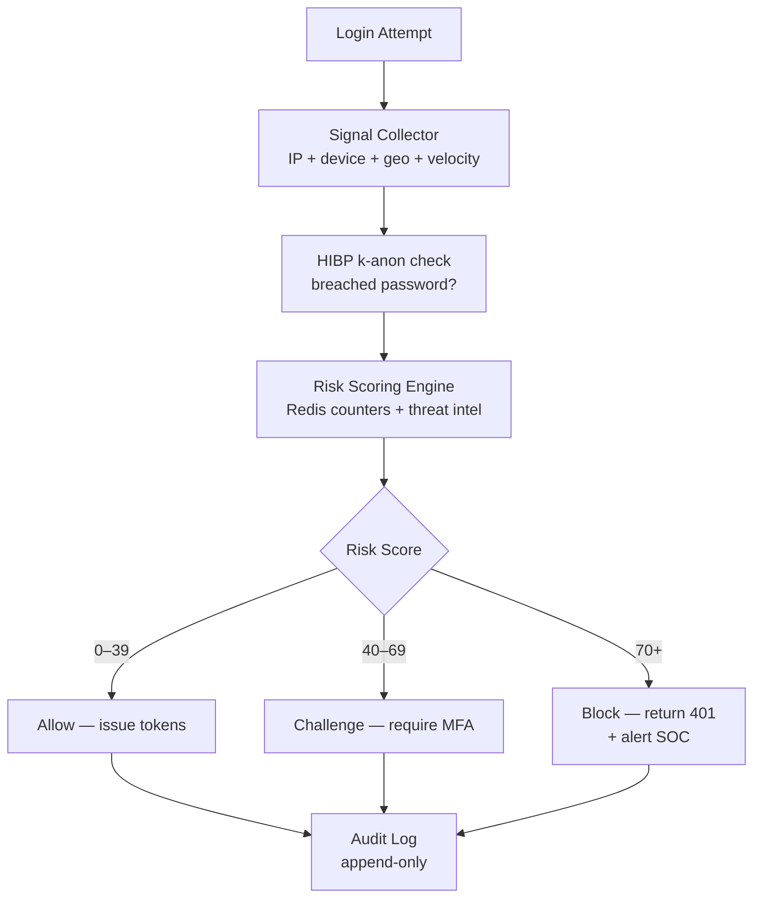

# Identity Threat Detection

## Category

CIAM / IAM — Security, ATO, Credential Stuffing, Anomaly Detection, Risk Scoring, Brute Force

## Context

Identity attacks are the leading vector for data breaches. Unlike application vulnerabilities, they exploit valid credentials obtained through phishing, credential stuffing, or social engineering. Effective detection layers **signals from multiple dimensions** (velocity, geography, device, behaviour) into a per-request **risk score** that gates authentication in real time.

### Attack Type → Detection Signal

| Attack | Primary Signal | Secondary Signal | Response |
|--------|---------------|-----------------|---------|
| Credential stuffing | High request volume from one IP | Low success rate, many accounts | Rate-limit + CAPTCHA + IP block |
| Brute force | Many attempts against single account | Known username probe | Lockout + alerting |
| Account takeover (ATO) | Impossible travel | New device after dormant period | Step-up MFA |
| Password spray | Normal per-account rate, distributed IP | Common password list patterns | Global velocity check |
| Session hijacking | Device fingerprint change mid-session | IP country change mid-session | Force re-auth |
| Token theft / replay | Same JWT from two IPs concurrently | Sudden scope escalation request | Invalidate + alert |

### Risk Score Components

| Signal | Weight | Source |
|--------|--------|--------|
| IP in blocklist | +50 | Threat intel feed |
| IP reputation score | 0–30 | MaxMind / AbuseIPDB |
| Impossible travel | +40 | Login history distance check |
| New device | +15 | Device fingerprint store |
| Breached password | +35 | HIBP k-anonymity API |
| Login failure rate (15 min) | 0–30 | Redis counter |
| Bot score (Cloudflare / reCAPTCHA) | 0–40 | Front-end signal |
| Unusual hour for user | +10 | Per-user baseline |

Score: 0–39 = allow, 40–69 = require MFA, 70+ = block and alert.

---

## Pros

- Risk-based scoring reduces friction for legitimate users (low-risk logins pass without MFA).
- HIBP k-anonymity check detects compromised passwords without sending them in plaintext.
- Impossible travel catches account sharing and ATO without user involvement.
- Device fingerprinting provides a stable low-friction signal that persists across sessions.
- Centralising detection in a service lets you update thresholds without deploying services.

---

## Cons

- False positives from VPNs, corporate NAT, and legitimate travel erode user trust.
- IP blocklists decay quickly — attackers rotate through residential proxies / botnets.
- Impossible travel logic must account for time zones, fast-travel edge cases, and CDN exits.
- Storing behavioural baselines per user is PII — requires GDPR-compliant retention policies.
- Sophisticated attackers who have full session context evade most heuristic checks.

---

## Design Diagram



---

## Code Sample

### TypeScript — login velocity + account lockout (Redis)

```typescript
import Redis from 'ioredis';

const redis = new Redis(process.env.REDIS_URL);

const LOCKOUT_ATTEMPTS = 5;
const LOCKOUT_WINDOW_SEC = 300;  // 5-minute window
const LOCKOUT_DURATION_SEC = 900; // 15-minute lockout

async function checkAndRecordLoginAttempt(
  accountId: string,
  ip: string,
  success: boolean
): Promise<{ allowed: boolean; lockedOut: boolean; remainingAttempts: number }> {
  const lockKey = `lockout:${accountId}`;
  const attemptsKey = `login_attempts:${accountId}`;

  // Check existing lockout
  const isLocked = await redis.exists(lockKey);
  if (isLocked) {
    const ttl = await redis.ttl(lockKey);
    return { allowed: false, lockedOut: true, remainingAttempts: 0 };
  }

  if (success) {
    await redis.del(attemptsKey); // reset on success
    return { allowed: true, lockedOut: false, remainingAttempts: LOCKOUT_ATTEMPTS };
  }

  // Increment failure counter
  const pipeline = redis.pipeline();
  pipeline.incr(attemptsKey);
  pipeline.expire(attemptsKey, LOCKOUT_WINDOW_SEC);
  const [[, failCount]] = await pipeline.exec() as any;

  if (failCount >= LOCKOUT_ATTEMPTS) {
    await redis.setex(lockKey, LOCKOUT_DURATION_SEC, '1');
    await redis.del(attemptsKey);

    // Emit event for alerting
    await emitSecurityEvent('account_locked', { accountId, ip, failCount });

    return { allowed: false, lockedOut: true, remainingAttempts: 0 };
  }

  return {
    allowed: true,
    lockedOut: false,
    remainingAttempts: LOCKOUT_ATTEMPTS - failCount,
  };
}

// IP-level velocity (credential stuffing)
async function checkIPVelocity(ip: string): Promise<boolean> {
  const key = `ip_logins:${ip}:${Math.floor(Date.now() / 60_000)}`; // per-minute bucket
  const count = await redis.incr(key);
  await redis.expire(key, 120);

  if (count === 1) return true;       // first in window
  if (count > 30) return false;       // >30 logins/min from single IP
  return true;
}
```

### TypeScript — HIBP breached password check (k-anonymity)

```typescript
import crypto from 'crypto';

async function isPasswordBreached(plainPassword: string): Promise<boolean> {
  const sha1 = crypto.createHash('sha1').update(plainPassword).digest('hex').toUpperCase();
  const prefix = sha1.slice(0, 5);
  const suffix = sha1.slice(5);

  // k-anonymity: only send first 5 chars
  const response = await fetch(`https://api.pwnedpasswords.com/range/${prefix}`, {
    headers: { 'Add-Padding': 'true' }, // prevent response-size timing attacks
  });

  if (!response.ok) {
    // Fail open — don't block login if HIBP is unavailable
    console.warn('HIBP API unavailable — skipping breached password check');
    return false;
  }

  const text = await response.text();
  const match = text.split('\n').find(line => line.startsWith(suffix));

  if (match) {
    const count = parseInt(match.split(':')[1].trim(), 10);
    return count > 0;
  }

  return false;
}

// Usage in registration
router.post('/register', async (req, res) => {
  const { password } = req.body;

  if (await isPasswordBreached(password)) {
    return res.status(400).json({
      error: 'breached_password',
      error_description: 'This password appears in known data breaches. Please choose a different one.',
    });
  }

  // continue registration...
});
```

### TypeScript — impossible travel detection

```typescript
import geoip from 'geoip-lite';

interface LoginRecord {
  accountId: string;
  ip: string;
  timestamp: number;
  lat: number;
  lon: number;
}

const MAX_SPEED_KMH = 900; // max plausible travel: commercial plane

function haversineKm(lat1: number, lon1: number, lat2: number, lon2: number): number {
  const R = 6371;
  const dLat = ((lat2 - lat1) * Math.PI) / 180;
  const dLon = ((lon2 - lon1) * Math.PI) / 180;
  const a =
    Math.sin(dLat / 2) ** 2 +
    Math.cos((lat1 * Math.PI) / 180) *
    Math.cos((lat2 * Math.PI) / 180) *
    Math.sin(dLon / 2) ** 2;
  return R * 2 * Math.atan2(Math.sqrt(a), Math.sqrt(1 - a));
}

async function detectImpossibleTravel(
  accountId: string,
  currentIp: string
): Promise<{ impossible: boolean; riskScore: number }> {
  const geo = geoip.lookup(currentIp);
  if (!geo) return { impossible: false, riskScore: 0 };

  const lastLogin = await redis.get(`last_login:${accountId}`);
  if (!lastLogin) {
    // First login — store and allow
    await redis.setex(
      `last_login:${accountId}`,
      86_400, // 24h
      JSON.stringify({ ip: currentIp, timestamp: Date.now(), lat: geo.ll[0], lon: geo.ll[1] })
    );
    return { impossible: false, riskScore: 0 };
  }

  const prev: LoginRecord = JSON.parse(lastLogin);
  const distanceKm = haversineKm(prev.lat, prev.lon, geo.ll[0], geo.ll[1]);
  const elapsedHours = (Date.now() - prev.timestamp) / 3_600_000;
  const requiredSpeedKmh = elapsedHours > 0 ? distanceKm / elapsedHours : Infinity;

  // Update last login record
  await redis.setex(
    `last_login:${accountId}`,
    86_400,
    JSON.stringify({ ip: currentIp, timestamp: Date.now(), lat: geo.ll[0], lon: geo.ll[1] })
  );

  if (requiredSpeedKmh > MAX_SPEED_KMH && distanceKm > 100) {
    await emitSecurityEvent('impossible_travel', {
      accountId,
      prevIp: prev.ip,
      currentIp,
      distanceKm: Math.round(distanceKm),
      requiredSpeedKmh: Math.round(requiredSpeedKmh),
    });
    return { impossible: true, riskScore: 40 };
  }

  return { impossible: false, riskScore: 0 };
}
```

### TypeScript — composite risk scoring at login

```typescript
interface RiskContext {
  accountId: string;
  ip: string;
  userAgent: string;
  deviceFingerprint: string;
  password?: string;
}

interface RiskResult {
  score: number;
  action: 'allow' | 'challenge' | 'block';
  reasons: string[];
}

async function computeLoginRisk(ctx: RiskContext): Promise<RiskResult> {
  const reasons: string[] = [];
  let score = 0;

  // 1. IP reputation (AbuseIPDB)
  const abuseScore = await getIPAbuseScore(ctx.ip);
  if (abuseScore > 50) {
    score += Math.round(abuseScore * 0.3);
    reasons.push(`ip_abuse_score:${abuseScore}`);
  }

  // 2. Known blocklist
  const isBlocked = await redis.sismember('ip:blocklist', ctx.ip);
  if (isBlocked) {
    score += 50;
    reasons.push('ip_blocklisted');
  }

  // 3. IP velocity (stuffing)
  const velocityOk = await checkIPVelocity(ctx.ip);
  if (!velocityOk) {
    score += 30;
    reasons.push('ip_velocity_exceeded');
  }

  // 4. Impossible travel
  const { riskScore: travelRisk, impossible } = await detectImpossibleTravel(ctx.accountId, ctx.ip);
  if (impossible) {
    score += travelRisk;
    reasons.push('impossible_travel');
  }

  // 5. New device
  const knownDevice = await redis.sismember(`devices:${ctx.accountId}`, ctx.deviceFingerprint);
  if (!knownDevice) {
    score += 15;
    reasons.push('new_device');
  }

  // 6. Breached password (only at registration / password change, or optionally at login)
  if (ctx.password) {
    const breached = await isPasswordBreached(ctx.password);
    if (breached) {
      score += 35;
      reasons.push('breached_password');
    }
  }

  let action: RiskResult['action'];
  if (score >= 70) action = 'block';
  else if (score >= 40) action = 'challenge';
  else action = 'allow';

  if (action !== 'allow') {
    await emitSecurityEvent('risk_action', { accountId: ctx.accountId, score, action, reasons });
  }

  return { score, action, reasons };
}

// Integrate in login handler
router.post('/login', async (req, res) => {
  const { username, password } = req.body;
  const ip = req.ip!;
  const fingerprint = req.headers['x-device-fingerprint'] as string ?? 'unknown';

  const risk = await computeLoginRisk({
    accountId: username,
    ip,
    userAgent: req.headers['user-agent'] ?? '',
    deviceFingerprint: fingerprint,
    password,
  });

  if (risk.action === 'block') {
    return res.status(401).json({ error: 'access_denied', reasons: risk.reasons });
  }

  // Validate credentials
  const user = await db.user.findUnique({ where: { email: username } });
  const { allowed, lockedOut } = await checkAndRecordLoginAttempt(username, ip, false);

  if (lockedOut) {
    return res.status(401).json({ error: 'account_locked', retryAfter: 900 });
  }

  const valid = user && await bcrypt.compare(password, user.passwordHash);
  await checkAndRecordLoginAttempt(username, ip, valid ?? false);

  if (!valid) {
    return res.status(401).json({ error: 'invalid_credentials' });
  }

  // Step-up if medium risk
  if (risk.action === 'challenge') {
    // Store partial session, require MFA before issuing tokens
    const challengeToken = crypto.randomBytes(32).toString('hex');
    await redis.setex(`mfa_required:${challengeToken}`, 300, JSON.stringify({ userId: user.id }));
    return res.status(200).json({ mfaRequired: true, challengeToken, reasons: risk.reasons });
  }

  // Register device
  await redis.sadd(`devices:${user.id}`, fingerprint);

  // Issue tokens
  res.json(await issueTokens(user.id));
});
```

### TypeScript — security event emitter (webhook / SIEM)

```typescript
interface SecurityEvent {
  type: string;
  accountId?: string;
  ip?: string;
  timestamp: string;
  metadata: Record<string, unknown>;
}

async function emitSecurityEvent(type: string, metadata: Record<string, unknown>): Promise<void> {
  const event: SecurityEvent = {
    type,
    accountId: metadata.accountId as string | undefined,
    ip: metadata.ip as string | undefined,
    timestamp: new Date().toISOString(),
    metadata,
  };

  // Persist to audit log
  await db.securityEvent.create({ data: event });

  // Forward to SIEM webhook (e.g. Splunk HEC, Elastic, Datadog)
  if (process.env.SIEM_WEBHOOK_URL) {
    fetch(process.env.SIEM_WEBHOOK_URL, {
      method: 'POST',
      headers: {
        'Content-Type': 'application/json',
        Authorization: `Splunk ${process.env.SIEM_HEC_TOKEN}`,
      },
      body: JSON.stringify({ event }),
    }).catch(err => console.error('SIEM forward failed', err));
  }
}
```

---

## Related

- [05 — MFA & Step-Up Auth](./05-mfa-step-up-auth.md) — step-up triggered by risk score
- [09 — CIAM & Customer Identity](./09-ciam-customer-identity.md) — registration hardening and GDPR consent
- [12 — Session Management](./12-session-management.md) — session anomaly, device fingerprint, refresh token reuse detection
- [02 — JWT & Token Management](./02-jwt-token-management.md) — token revocation and denylist on ATO detection
