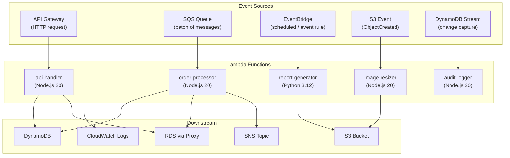

# AWS Serverless & Lambda Patterns

## Category
Cloud Native, Serverless, Event-Driven, AWS Lambda

## Context

**AWS Lambda** is the building block of serverless on AWS. Instead of provisioning and managing servers, you deploy individual functions that execute in response to events — HTTP requests via API Gateway, messages from SQS/SNS/EventBridge, object uploads to S3, DynamoDB stream records, or scheduled CloudWatch Events. Lambda abstracts away all infrastructure: patching, scaling, and availability are managed by AWS.

**Key design patterns for Lambda**:

| Pattern | Description |
|---------|-------------|
| **Single-purpose function** | One function = one business action (not a monolith) |
| **Fan-out** | One event triggers multiple Lambda functions via SNS/EventBridge |
| **Function composition** | Step Functions orchestrate multi-step workflows |
| **Strangler Fig** | Gradually migrate monolith endpoints to Lambda functions |
| **Cache aside** | Warm ElastiCache / DynamoDB DAX on reuse to reduce latency |
| **Cold start mitigation** | Provisioned concurrency, Lambda SnapStart (Java), container reuse |

**Cold start**: The time Lambda takes to initialise a new execution environment when no warm container is available. Typically 100–500 ms for Node.js/Python, up to 3 s for JVM.

**Mitigation strategies**:
1. Use Node.js / Python (lightweight runtimes).
2. Minimise deployment package size (tree-shake, exclude dev deps).
3. Move SDK clients and DB connections outside the handler (initialised once per container).
4. Use `Provisioned Concurrency` for latency-sensitive workloads.
5. Use Lambda SnapStart for Java 21.

**Lambda limits (2024)**:
- Max execution: 15 minutes.
- Max memory: 10,240 MB.
- Max deployment package: 50 MB (zipped), 250 MB unzipped.
- Max concurrent executions per account/region: 1,000 (soft limit, can be raised).

---

## Pros

- **Zero server management**: No patching, no capacity planning.
- **Pay-per-use**: Billed in 1 ms increments — idle = $0.
- **Automatic scaling**: From 0 to thousands of parallel invocations in seconds.
- **Tight AWS integration**: Native event sources from 200+ AWS services.
- **Operational simplicity**: No OS, no runtime administration.

---

## Cons

- **Cold starts**: Latency spikes on first invocation or after idle period.
- **15-minute timeout**: Not suitable for long-running batch jobs.
- **Stateless**: Any state must be externalised (DynamoDB, S3, ElastiCache).
- **Debugging complexity**: Distributed tracing required (X-Ray) for multi-function workflows.
- **Vendor lock-in**: Lambda APIs are AWS-specific; portability requires abstraction.
- **Local development friction**: Requires SAM CLI / LocalStack to simulate locally.

---

## Design Diagram



---

## Code Sample

### Lambda Handler (best practices)

```typescript
// src/handlers/order-processor.ts
import { SQSEvent, SQSRecord, SQSBatchResponse, SQSBatchItemFailure, Context } from 'aws-lambda';
import { DynamoDBClient, PutItemCommand } from '@aws-sdk/client-dynamodb';
import { marshall } from '@aws-sdk/util-dynamodb';
import { Logger } from '@aws-lambda-powertools/logger';
import { Tracer } from '@aws-lambda-powertools/tracer';
import { Metrics, MetricUnit } from '@aws-lambda-powertools/metrics';

// ─── Initialise clients OUTSIDE the handler (reused across warm invocations) ──
const dynamo = new DynamoDBClient({});   // Uses env region automatically
const logger = new Logger({ serviceName: 'order-processor' });
const tracer = new Tracer({ serviceName: 'order-processor' });
const metrics = new Metrics({ namespace: 'OrderService', serviceName: 'order-processor' });

interface OrderMessage {
  orderId: string;
  customerId: string;
  items: Array<{ productId: string; quantity: number; unitPrice: number }>;
  currency: string;
}

// ─── Handler ──────────────────────────────────────────────────────────────────
export const handler = async (
  event: SQSEvent,
  context: Context,
): Promise<SQSBatchResponse> => {
  logger.addContext(context);
  logger.info('Processing batch', { batchSize: event.Records.length });

  const batchItemFailures: SQSBatchItemFailure[] = [];

  await Promise.all(
    event.Records.map(record => processRecord(record, batchItemFailures)),
  );

  metrics.publishStoredMetrics();

  // Return partial batch failure — only failed messages are retried
  return { batchItemFailures };
};

async function processRecord(
  record: SQSRecord,
  failures: SQSBatchItemFailure[],
): Promise<void> {
  const segment = tracer.getSegment();
  const subsegment = segment?.addNewSubsegment('processOrder');

  try {
    const order: OrderMessage = JSON.parse(record.body);

    // Validate
    if (!order.orderId || !order.customerId || !order.items?.length) {
      throw new Error(`Invalid order payload: ${record.messageId}`);
    }

    const total = order.items.reduce(
      (sum, item) => sum + item.quantity * item.unitPrice,
      0,
    );

    await dynamo.send(new PutItemCommand({
      TableName: process.env.ORDERS_TABLE!,
      Item: marshall({
        pk: `ORDER#${order.orderId}`,
        sk: `CUSTOMER#${order.customerId}`,
        orderId: order.orderId,
        customerId: order.customerId,
        items: order.items,
        total,
        currency: order.currency,
        status: 'RECEIVED',
        createdAt: new Date().toISOString(),
        ttl: Math.floor(Date.now() / 1000) + 60 * 60 * 24 * 90, // 90-day TTL
      }),
      ConditionExpression: 'attribute_not_exists(pk)', // Idempotency guard
    }));

    metrics.addMetric('OrderProcessed', MetricUnit.Count, 1);
    metrics.addMetric('OrderTotal', MetricUnit.Count, total);
    logger.info('Order processed', { orderId: order.orderId, total });
  } catch (err) {
    logger.error('Failed to process record', { messageId: record.messageId, err });
    metrics.addMetric('OrderFailed', MetricUnit.Count, 1);
    // Add to partial failure list — SQS will only retry this specific message
    failures.push({ itemIdentifier: record.messageId });
  } finally {
    subsegment?.close();
  }
}
```

### SAM Template (Infrastructure as Code)

```yaml
# template.yaml
AWSTemplateFormatVersion: '2010-09-09'
Transform: AWS::Serverless-2016-10-31

Globals:
  Function:
    Runtime: nodejs20.x
    MemorySize: 256
    Timeout: 30
    Tracing: Active
    Environment:
      Variables:
        POWERTOOLS_SERVICE_NAME: order-service
        LOG_LEVEL: INFO
    Layers:
      - !Sub 'arn:aws:lambda:${AWS::Region}:017000801446:layer:AWSLambdaPowertoolsTypeScriptV2:16'

Resources:
  # ─── DLQ for failed messages ─────────────────────────────────────────────
  OrderDLQ:
    Type: AWS::SQS::Queue
    Properties:
      QueueName: order-dlq
      MessageRetentionPeriod: 1209600  # 14 days

  # ─── Main queue with DLQ ─────────────────────────────────────────────────
  OrderQueue:
    Type: AWS::SQS::Queue
    Properties:
      QueueName: order-queue
      VisibilityTimeout: 180           # 6× Lambda timeout (30s)
      RedrivePolicy:
        deadLetterTargetArn: !GetAtt OrderDLQ.Arn
        maxReceiveCount: 3             # Retry 3× before DLQ

  # ─── Orders DynamoDB table ───────────────────────────────────────────────
  OrdersTable:
    Type: AWS::DynamoDB::Table
    Properties:
      TableName: orders
      BillingMode: PAY_PER_REQUEST
      PointInTimeRecoverySpecification:
        PointInTimeRecoveryEnabled: true
      SSESpecification:
        SSEEnabled: true
      AttributeDefinitions:
        - AttributeName: pk
          AttributeType: S
        - AttributeName: sk
          AttributeType: S
      KeySchema:
        - AttributeName: pk
          KeyType: HASH
        - AttributeName: sk
          KeyType: RANGE

  # ─── Lambda function ─────────────────────────────────────────────────────
  OrderProcessorFunction:
    Type: AWS::Serverless::Function
    Properties:
      Handler: dist/handlers/order-processor.handler
      Description: Processes orders from SQS queue
      Environment:
        Variables:
          ORDERS_TABLE: !Ref OrdersTable
      Policies:
        - DynamoDBWritePolicy:
            TableName: !Ref OrdersTable
      Events:
        OrderQueue:
          Type: SQS
          Properties:
            Queue: !GetAtt OrderQueue.Arn
            BatchSize: 10
            MaximumBatchingWindowInSeconds: 5
            FunctionResponseTypes:
              - ReportBatchItemFailures    # Partial batch failure support
    Metadata:
      BuildMethod: esbuild
      BuildProperties:
        Minify: true
        Target: es2022
        Sourcemap: false
        EntryPoints:
          - src/handlers/order-processor.ts

  # ─── Provisioned concurrency for API handler ─────────────────────────────
  ApiHandlerFunction:
    Type: AWS::Serverless::Function
    Properties:
      Handler: dist/handlers/api-handler.handler
      Description: Handles synchronous API requests
      AutoPublishAlias: live
      ProvisionedConcurrencyConfig:
        ProvisionedConcurrentExecutions: 5   # Eliminates cold starts
      Events:
        Api:
          Type: HttpApi
          Properties:
            Path: /orders
            Method: POST
    Metadata:
      BuildMethod: esbuild
      BuildProperties:
        EntryPoints:
          - src/handlers/api-handler.ts

Outputs:
  OrderQueueUrl:
    Value: !Ref OrderQueue
  OrdersTableName:
    Value: !Ref OrdersTable
```

### Step Functions — Multi-step Order Workflow

```json
{
  "Comment": "Order fulfilment workflow",
  "StartAt": "ValidateOrder",
  "States": {
    "ValidateOrder": {
      "Type": "Task",
      "Resource": "arn:aws:lambda:us-east-1:123456789012:function:validate-order",
      "Retry": [{ "ErrorEquals": ["States.TaskFailed"], "MaxAttempts": 2, "IntervalSeconds": 2 }],
      "Catch": [{ "ErrorEquals": ["ValidationError"], "Next": "OrderRejected" }],
      "Next": "ReserveInventory"
    },
    "ReserveInventory": {
      "Type": "Task",
      "Resource": "arn:aws:lambda:us-east-1:123456789012:function:reserve-inventory",
      "Next": "ChargePayment"
    },
    "ChargePayment": {
      "Type": "Task",
      "Resource": "arn:aws:lambda:us-east-1:123456789012:function:charge-payment",
      "Catch": [{ "ErrorEquals": ["PaymentFailed"], "Next": "ReleaseInventory" }],
      "Next": "FulfillOrder"
    },
    "FulfillOrder": {
      "Type": "Task",
      "Resource": "arn:aws:lambda:us-east-1:123456789012:function:fulfill-order",
      "End": true
    },
    "ReleaseInventory": {
      "Type": "Task",
      "Resource": "arn:aws:lambda:us-east-1:123456789012:function:release-inventory",
      "Next": "OrderRejected"
    },
    "OrderRejected": {
      "Type": "Fail",
      "Error": "OrderRejected",
      "Cause": "Order could not be fulfilled"
    }
  }
}
```
