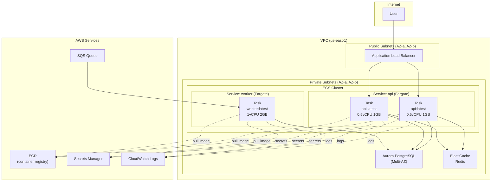

# AWS ECS & Fargate Container Patterns

## Category
Cloud Native, Containers, AWS ECS, AWS Fargate

## Context

**Amazon ECS (Elastic Container Service)** is AWS's native container orchestrator. Containers run on one of two launch types:

- **EC2**: You manage the EC2 instances (worker nodes) in the cluster. More control, lower cost at scale.
- **Fargate**: AWS manages the underlying compute. You specify CPU/memory; AWS provisions and patches the infrastructure. Recommended default — zero node management.

**Key ECS concepts**:
| Concept | Description |
|---------|-------------|
| **Cluster** | Logical grouping of services and tasks |
| **Task Definition** | Blueprint (image, CPU, memory, env vars, volumes, IAM role) |
| **Service** | Desired-state controller — maintains N running task replicas |
| **Task** | A running instantiation of a task definition (one or more containers) |
| **Task Role** | IAM role assumed by the containers for AWS API calls |
| **Execution Role** | IAM role used by ECS agent to pull images and push logs |

**Networking modes**:
| Mode | Use case |
|------|----------|
| `awsvpc` | Each task gets its own ENI and private IP. Required for Fargate. Recommended for EC2. |
| `bridge` | Docker bridge networking. Legacy EC2 pattern. Not recommended. |
| `host` | Container shares EC2 host network. High performance, low isolation. |

**Service Auto Scaling**:
- Scale on CPU utilisation, memory utilisation, or custom CloudWatch metrics.
- Use **Application Auto Scaling** with Target Tracking (e.g., keep CPU at 60%).
- Scale-in cooldown: 300 s; Scale-out cooldown: 60 s (be aggressive on scale-out, conservative on scale-in).

---

## Pros

- **No node management with Fargate**: No EC2 patching, AMI updates, or capacity planning.
- **Deep AWS integration**: Works natively with ALB, NLB, Route53, ACM, CloudWatch, IAM, Secrets Manager.
- **Task-level IAM**: Fine-grained permissions per task definition (unlike EC2 instance profiles).
- **Service discovery**: Cloud Map integration for service-to-service DNS resolution.
- **Predictable cost**: CPU/memory billed per second; no idle EC2 waste.
- **Simpler than EKS**: No control plane to manage; lower operational overhead.

---

## Cons

- **Less control than EKS**: No access to Kubernetes primitives (CRDs, operators, Helm charts).
- **Fargate cold start**: New Fargate tasks take 5–30 seconds to start (EC2 launch type is faster once nodes are warm).
- **No DaemonSets on Fargate**: Sidecar pattern must be co-located in task definition.
- **Container limit per task**: Max 10 containers per task definition.
- **No GPU on Fargate**: GPU workloads require EC2 launch type.
- **VPC ENI limits**: Each awsvpc task consumes one ENI — can hit per-subnet ENI limits at scale.

---

## Design Diagram



---

## Code Sample

### Terraform — ECS Fargate Service

```hcl
# infrastructure/terraform/ecs/main.tf

# ─── ECR Repository ─────────────────────────────────────────────────────────
resource "aws_ecr_repository" "api" {
  name                 = "myapp/api"
  image_tag_mutability = "IMMUTABLE"   # Prevent overwriting tags

  image_scanning_configuration {
    scan_on_push = true                # Trivy-backed vulnerability scan
  }

  encryption_configuration {
    encryption_type = "KMS"
    kms_key         = aws_kms_key.ecr.arn
  }
}

resource "aws_ecr_lifecycle_policy" "api" {
  repository = aws_ecr_repository.api.name
  policy = jsonencode({
    rules = [{
      rulePriority = 1
      description  = "Keep last 10 images"
      selection = {
        tagStatus   = "any"
        countType   = "imageCountMoreThan"
        countNumber = 10
      }
      action = { type = "expire" }
    }]
  })
}

# ─── ECS Cluster ─────────────────────────────────────────────────────────────
resource "aws_ecs_cluster" "main" {
  name = "myapp-cluster"

  configuration {
    execute_command_configuration {
      logging = "OVERRIDE"
      log_configuration {
        cloud_watch_log_group_name = aws_cloudwatch_log_group.ecs_exec.name
      }
    }
  }

  setting {
    name  = "containerInsights"
    value = "enabled"
  }
}

# ─── Task IAM Roles ──────────────────────────────────────────────────────────
resource "aws_iam_role" "task_execution" {
  name = "myapp-task-execution-role"
  assume_role_policy = jsonencode({
    Version = "2012-10-17"
    Statement = [{
      Action    = "sts:AssumeRole"
      Effect    = "Allow"
      Principal = { Service = "ecs-tasks.amazonaws.com" }
    }]
  })
}

resource "aws_iam_role_policy_attachment" "task_execution" {
  role       = aws_iam_role.task_execution.name
  policy_arn = "arn:aws:iam::aws:policy/service-role/AmazonECSTaskExecutionRolePolicy"
}

# Grant execution role access to pull secrets from Secrets Manager
resource "aws_iam_role_policy" "task_execution_secrets" {
  role = aws_iam_role.task_execution.id
  policy = jsonencode({
    Version = "2012-10-17"
    Statement = [{
      Effect   = "Allow"
      Action   = ["secretsmanager:GetSecretValue"]
      Resource = [aws_secretsmanager_secret.db_password.arn]
    }]
  })
}

# Minimal task role — only what this service needs
resource "aws_iam_role" "api_task" {
  name = "myapp-api-task-role"
  assume_role_policy = jsonencode({
    Version = "2012-10-17"
    Statement = [{
      Action    = "sts:AssumeRole"
      Effect    = "Allow"
      Principal = { Service = "ecs-tasks.amazonaws.com" }
    }]
  })
}

resource "aws_iam_role_policy" "api_task" {
  role = aws_iam_role.api_task.id
  policy = jsonencode({
    Version = "2012-10-17"
    Statement = [
      {
        Effect   = "Allow"
        Action   = ["sqs:SendMessage"]
        Resource = [aws_sqs_queue.orders.arn]
      },
      {
        Effect   = "Allow"
        Action   = ["dynamodb:PutItem", "dynamodb:GetItem", "dynamodb:Query"]
        Resource = [aws_dynamodb_table.orders.arn]
      }
    ]
  })
}

# ─── Task Definition ─────────────────────────────────────────────────────────
resource "aws_ecs_task_definition" "api" {
  family                   = "myapp-api"
  network_mode             = "awsvpc"
  requires_compatibilities = ["FARGATE"]
  cpu                      = "512"     # 0.5 vCPU
  memory                   = "1024"   # 1 GB
  execution_role_arn       = aws_iam_role.task_execution.arn
  task_role_arn            = aws_iam_role.api_task.arn

  container_definitions = jsonencode([
    {
      name      = "api"
      image     = "${aws_ecr_repository.api.repository_url}:${var.image_tag}"
      essential = true

      portMappings = [{ containerPort = 3000, protocol = "tcp" }]

      environment = [
        { name = "NODE_ENV",   value = "production" },
        { name = "PORT",       value = "3000" },
        { name = "QUEUE_URL",  value = aws_sqs_queue.orders.url }
      ]

      # Secrets injected from Secrets Manager — never stored in task definition
      secrets = [
        { name = "DB_PASSWORD", valueFrom = aws_secretsmanager_secret.db_password.arn },
        { name = "JWT_SECRET",  valueFrom = "${aws_secretsmanager_secret.app_secrets.arn}:JWT_SECRET::" }
      ]

      logConfiguration = {
        logDriver = "awslogs"
        options = {
          awslogs-group         = "/ecs/myapp-api"
          awslogs-region        = var.aws_region
          awslogs-stream-prefix = "api"
        }
      }

      healthCheck = {
        command     = ["CMD-SHELL", "curl -f http://localhost:3000/health || exit 1"]
        interval    = 30
        timeout     = 5
        retries     = 3
        startPeriod = 10
      }

      # Read-only root filesystem — security hardening
      readonlyRootFilesystem = true
      mountPoints = [
        { containerPath = "/tmp", sourceVolume = "tmp", readOnly = false }
      ]
    }
  ])

  volume {
    name = "tmp"
  }
}

# ─── ECS Service ─────────────────────────────────────────────────────────────
resource "aws_ecs_service" "api" {
  name                              = "myapp-api"
  cluster                           = aws_ecs_cluster.main.id
  task_definition                   = aws_ecs_task_definition.api.arn
  desired_count                     = 2
  launch_type                       = "FARGATE"
  platform_version                  = "LATEST"
  enable_execute_command            = true    # ECS Exec for debugging (disable in production)
  health_check_grace_period_seconds = 60

  network_configuration {
    subnets          = var.private_subnet_ids
    security_groups  = [aws_security_group.api_tasks.id]
    assign_public_ip = false
  }

  load_balancer {
    target_group_arn = aws_lb_target_group.api.arn
    container_name   = "api"
    container_port   = 3000
  }

  deployment_circuit_breaker {
    enable   = true
    rollback = true          # Auto-rollback on failed deployments
  }

  deployment_controller {
    type = "ECS"             # Use CODE_DEPLOY for blue/green
  }

  lifecycle {
    ignore_changes = [desired_count]  # Managed by Auto Scaling
  }
}

# ─── Auto Scaling ─────────────────────────────────────────────────────────────
resource "aws_appautoscaling_target" "api" {
  max_capacity       = 20
  min_capacity       = 2
  resource_id        = "service/${aws_ecs_cluster.main.name}/${aws_ecs_service.api.name}"
  scalable_dimension = "ecs:service:DesiredCount"
  service_namespace  = "ecs"
}

resource "aws_appautoscaling_policy" "api_cpu" {
  name               = "myapp-api-cpu-scaling"
  policy_type        = "TargetTrackingScaling"
  resource_id        = aws_appautoscaling_target.api.resource_id
  scalable_dimension = aws_appautoscaling_target.api.scalable_dimension
  service_namespace  = aws_appautoscaling_target.api.service_namespace

  target_tracking_scaling_policy_configuration {
    predefined_metric_specification {
      predefined_metric_type = "ECSServiceAverageCPUUtilization"
    }
    target_value       = 60.0    # Scale out when avg CPU > 60%
    scale_out_cooldown = 60
    scale_in_cooldown  = 300
  }
}
```

### GitHub Actions — Build, Scan & Deploy to ECS

```yaml
# .github/workflows/deploy-ecs.yml
name: Deploy to ECS

on:
  push:
    branches: [main]

env:
  AWS_REGION: us-east-1
  ECR_REPOSITORY: myapp/api
  ECS_SERVICE: myapp-api
  ECS_CLUSTER: myapp-cluster

permissions:
  id-token: write
  contents: read

jobs:
  deploy:
    name: Build, Scan & Deploy
    runs-on: ubuntu-latest
    steps:
      - uses: actions/checkout@v4

      - name: Configure AWS credentials (OIDC — no long-lived keys)
        uses: aws-actions/configure-aws-credentials@v4
        with:
          role-to-assume: ${{ secrets.AWS_DEPLOY_ROLE_ARN }}
          aws-region: ${{ env.AWS_REGION }}

      - name: Log in to ECR
        id: ecr-login
        uses: aws-actions/amazon-ecr-login@v2

      - name: Build image
        env:
          IMAGE_TAG: ${{ github.sha }}
          ECR_REGISTRY: ${{ steps.ecr-login.outputs.registry }}
        run: |
          docker build \
            --tag "$ECR_REGISTRY/$ECR_REPOSITORY:$IMAGE_TAG" \
            --cache-from "$ECR_REGISTRY/$ECR_REPOSITORY:latest" \
            --build-arg BUILDKIT_INLINE_CACHE=1 \
            .

      - name: Scan image with Trivy
        uses: aquasecurity/trivy-action@master
        with:
          image-ref: ${{ steps.ecr-login.outputs.registry }}/${{ env.ECR_REPOSITORY }}:${{ github.sha }}
          severity: CRITICAL
          exit-code: '1'
          ignore-unfixed: true

      - name: Push image to ECR
        env:
          IMAGE_TAG: ${{ github.sha }}
          ECR_REGISTRY: ${{ steps.ecr-login.outputs.registry }}
        run: |
          docker push "$ECR_REGISTRY/$ECR_REPOSITORY:$IMAGE_TAG"

      - name: Render new ECS task definition
        id: task-def
        uses: aws-actions/amazon-ecs-render-task-definition@v1
        with:
          task-definition: .aws/task-definition.json
          container-name: api
          image: ${{ steps.ecr-login.outputs.registry }}/${{ env.ECR_REPOSITORY }}:${{ github.sha }}

      - name: Deploy to ECS
        uses: aws-actions/amazon-ecs-deploy-task-definition@v1
        with:
          task-definition: ${{ steps.task-def.outputs.task-definition }}
          service: ${{ env.ECS_SERVICE }}
          cluster: ${{ env.ECS_CLUSTER }}
          wait-for-service-stability: true
```
