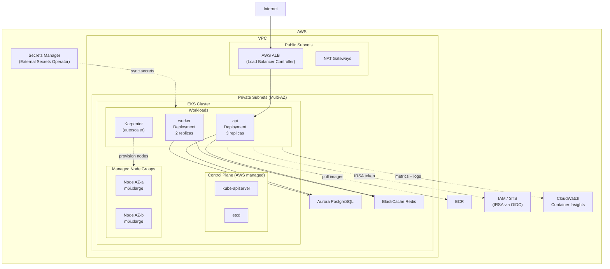

# AWS EKS — Kubernetes on AWS

## Category
Cloud Native, Containers, Kubernetes, AWS EKS

## Context

**Amazon EKS (Elastic Kubernetes Service)** is AWS's managed Kubernetes control plane. AWS manages the API server and etcd cluster (control plane). You manage worker nodes (EC2 or Fargate). EKS is the preferred choice when you need full Kubernetes compatibility — Helm charts, CRDs, operators, DaemonSets, and ecosystem tooling.

**Node group options**:
| Type | Description | Use case |
|------|-------------|----------|
| **Managed Node Groups** | AWS provisions and updates EC2 nodes; drain-safe upgrades | General purpose, recommended default |
| **Self-managed Node Groups** | Full control over AMI and lifecycle scripts | Custom AMI, specific OS config |
| **Fargate Profiles** | Serverless — AWS manages underlying compute | Burstable/batch workloads |
| **Karpenter** | Open-source autoscaler — provisions right-sized nodes on demand | Dynamic, cost-optimal scaling |

**Add-ons managed by AWS**:
- `vpc-cni` — Pod networking (each pod gets a VPC IP via ENI)
- `coredns` — In-cluster DNS
- `kube-proxy` — Service networking
- `aws-load-balancer-controller` — Provisions ALB/NLB from Ingress/Service resources
- `ebs-csi-driver` / `efs-csi-driver` — Persistent volume CSI drivers

**Authentication**: EKS uses IAM for authentication (via `aws eks get-token`) and Kubernetes RBAC for authorisation. Map IAM roles to Kubernetes groups via `aws-auth` ConfigMap or EKS Access Entries (newer, recommended).

---

## Pros

- **Full Kubernetes API compatibility**: Use any Kubernetes tooling — Helm, Kustomize, ArgoCD, FluxCD.
- **Managed control plane**: AWS handles etcd backups, API server scaling, version upgrades.
- **AWS integrations**: IAM, ALB, EBS, EFS, ECR, Secrets Manager, CloudWatch all natively integrated.
- **IRSA (IAM Roles for Service Accounts)**: Pod-level IAM permissions via OIDC — no node instance profiles.
- **Karpenter**: Far more efficient and faster autoscaling than Cluster Autoscaler.
- **Multi-AZ by default**: Spread nodes and pods across availability zones.

---

## Cons

- **Complexity**: Kubernetes learning curve; requires cluster add-on management.
- **Cost**: Control plane: $0.10/hour (~$72/month). Plus node costs.
- **Upgrade burden**: Kubernetes minor versions supported for ~14 months; must upgrade before EOL.
- **Networking complexity**: VPC CNI + security groups + NACLs + Kubernetes NetworkPolicy = multi-layer mental model.
- **Cold start with Karpenter**: New nodes take 60–90 seconds to provision and register.
- **IRSA setup**: Requires OIDC provider configuration per cluster.

---

## Design Diagram



---

## Code Sample

### Terraform — EKS Cluster with Karpenter

```hcl
# infrastructure/terraform/eks/main.tf

module "eks" {
  source  = "terraform-aws-modules/eks/aws"
  version = "~> 20.0"

  cluster_name    = "myapp-cluster"
  cluster_version = "1.29"

  cluster_endpoint_public_access  = true
  cluster_endpoint_private_access = true

  # Enable EKS Access Entries (replaces aws-auth ConfigMap)
  authentication_mode = "API"

  vpc_id     = module.vpc.vpc_id
  subnet_ids = module.vpc.private_subnets

  # Enable cluster creator admin access
  enable_cluster_creator_admin_permissions = true

  # Managed add-ons
  cluster_addons = {
    coredns = {
      most_recent              = true
      resolve_conflicts_on_update = "OVERWRITE"
    }
    kube-proxy = { most_recent = true }
    vpc-cni = {
      most_recent = true
      configuration_values = jsonencode({
        env = {
          ENABLE_PREFIX_DELEGATION = "true"    # More IPs per node via prefix delegation
          WARM_PREFIX_TARGET       = "1"
        }
      })
    }
    aws-ebs-csi-driver = {
      most_recent              = true
      service_account_role_arn = module.ebs_csi_irsa.iam_role_arn
    }
  }

  # System node group — always-on for critical system pods
  eks_managed_node_groups = {
    system = {
      name           = "system"
      instance_types = ["m6i.large"]

      min_size     = 2
      max_size     = 4
      desired_size = 2

      labels = { role = "system" }
      taints = [{
        key    = "CriticalAddonsOnly"
        value  = "true"
        effect = "NO_SCHEDULE"
      }]
    }
  }

  tags = {
    Environment                              = var.environment
    "karpenter.sh/discovery"                 = "myapp-cluster"  # Karpenter discovery tag
  }
}

# ─── Karpenter ────────────────────────────────────────────────────────────
resource "helm_release" "karpenter" {
  namespace        = "karpenter"
  create_namespace = true
  name             = "karpenter"
  repository       = "oci://public.ecr.aws/karpenter"
  chart            = "karpenter"
  version          = "0.36.0"

  values = [yamlencode({
    settings = {
      clusterName       = module.eks.cluster_name
      interruptionQueue = aws_sqs_queue.karpenter_interruption.name
    }
    serviceAccount = {
      annotations = {
        "eks.amazonaws.com/role-arn" = module.karpenter_irsa.iam_role_arn
      }
    }
  })]
}
```

### Karpenter NodePool & EC2NodeClass

```yaml
# k8s/karpenter/nodepool.yaml
apiVersion: karpenter.sh/v1beta1
kind: NodePool
metadata:
  name: default
spec:
  template:
    metadata:
      labels:
        managed-by: karpenter

    spec:
      nodeClassRef:
        apiVersion: karpenter.k8s.aws/v1beta1
        kind: EC2NodeClass
        name: default

      requirements:
        - key: karpenter.sh/capacity-type
          operator: In
          values: ["on-demand", "spot"]
        - key: karpenter.k8s.aws/instance-category
          operator: In
          values: ["c", "m", "r"]
        - key: karpenter.k8s.aws/instance-generation
          operator: Gt
          values: ["5"]
        - key: kubernetes.io/arch
          operator: In
          values: ["amd64"]

  limits:
    cpu: 1000        # Max 1000 vCPU across all Karpenter nodes

  disruption:
    consolidationPolicy: WhenUnderutilized
    consolidateAfter: 30s
    expireAfter: 720h   # Rotate nodes every 30 days (security patching)

---
apiVersion: karpenter.k8s.aws/v1beta1
kind: EC2NodeClass
metadata:
  name: default
spec:
  amiFamily: AL2023
  role: "KarpenterNodeRole-myapp-cluster"

  subnetSelectorTerms:
    - tags:
        karpenter.sh/discovery: "myapp-cluster"

  securityGroupSelectorTerms:
    - tags:
        karpenter.sh/discovery: "myapp-cluster"

  blockDeviceMappings:
    - deviceName: /dev/xvda
      ebs:
        volumeSize: 50Gi
        volumeType: gp3
        encrypted: true
        iops: 3000
        throughput: 125
```

### IRSA — Pod IAM Permissions via Service Account

```yaml
# k8s/api/serviceaccount.yaml
apiVersion: v1
kind: ServiceAccount
metadata:
  name: api-service-account
  namespace: myapp
  annotations:
    # IRSA — binds this SA to an IAM role via OIDC
    eks.amazonaws.com/role-arn: arn:aws:iam::123456789012:role/myapp-api-role
    eks.amazonaws.com/token-expiration-seconds: "86400"
```

```hcl
# IRSA IAM role for the api service account
module "api_irsa" {
  source  = "terraform-aws-modules/iam/aws//modules/iam-role-for-service-accounts-eks"
  version = "~> 5.0"

  role_name = "myapp-api-role"

  oidc_providers = {
    main = {
      provider_arn               = module.eks.oidc_provider_arn
      namespace_service_accounts = ["myapp:api-service-account"]
    }
  }

  role_policy_arns = {
    sqs   = aws_iam_policy.api_sqs.arn
    dynamo = aws_iam_policy.api_dynamodb.arn
  }
}
```

### External Secrets Operator — Sync Secrets Manager to K8s Secrets

```yaml
# k8s/secrets/external-secret.yaml
apiVersion: external-secrets.io/v1beta1
kind: SecretStore
metadata:
  name: aws-secrets-manager
  namespace: myapp
spec:
  provider:
    aws:
      service: SecretsManager
      region: us-east-1
      auth:
        jwt:
          serviceAccountRef:
            name: external-secrets-sa   # IRSA-annotated SA
---
apiVersion: external-secrets.io/v1beta1
kind: ExternalSecret
metadata:
  name: myapp-secrets
  namespace: myapp
spec:
  refreshInterval: 1h
  secretStoreRef:
    name: aws-secrets-manager
    kind: SecretStore
  target:
    name: myapp-secrets      # K8s Secret name
    creationPolicy: Owner
    template:
      type: Opaque
  data:
    - secretKey: DB_PASSWORD
      remoteRef:
        key: myapp/production/db
        property: password
    - secretKey: JWT_SECRET
      remoteRef:
        key: myapp/production/app
        property: jwt_secret
```

### ArgoCD Application — GitOps Deployment

```yaml
# argocd/applications/myapp.yaml
apiVersion: argoproj.io/v1alpha1
kind: Application
metadata:
  name: myapp
  namespace: argocd
  finalizers:
    - resources-finalizer.argocd.argoproj.io
spec:
  project: default
  source:
    repoURL: https://github.com/myorg/myapp-gitops
    targetRevision: HEAD
    path: k8s/overlays/production
  destination:
    server: https://kubernetes.default.svc
    namespace: myapp
  syncPolicy:
    automated:
      prune: true        # Remove resources deleted from Git
      selfHeal: true     # Fix out-of-sync resources automatically
    syncOptions:
      - CreateNamespace=true
      - ServerSideApply=true
    retry:
      limit: 3
      backoff:
        duration: 5s
        factor: 2
        maxDuration: 3m
```
