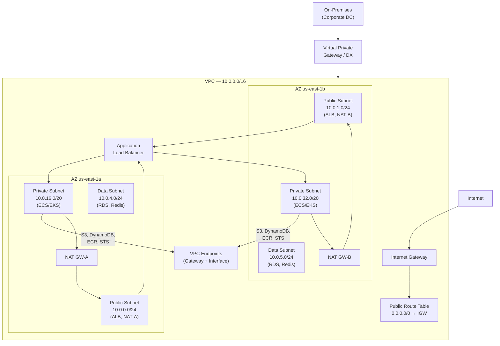

# AWS VPC & Networking Patterns

## Category
Cloud Native, Networking, AWS VPC, Infrastructure

## Context

**Amazon VPC (Virtual Private Cloud)** is the foundational network layer for all AWS workloads. A well-designed VPC architecture provides isolation, security, high availability, and connectivity — both within AWS and to on-premises networks.

**Core VPC components**:
| Component | Purpose |
|-----------|---------|
| **VPC** | Isolated virtual network with a defined CIDR block |
| **Subnet** | Subdivision of a VPC tied to a single Availability Zone |
| **Internet Gateway (IGW)** | Enables internet ↔ VPC traffic for public subnets |
| **NAT Gateway** | Allows private subnet resources to reach the internet (outbound only) |
| **Route Table** | Rules that control where subnet traffic is routed |
| **Security Group** | Stateful, instance-level firewall |
| **NACL** | Stateless, subnet-level firewall |
| **VPC Endpoints** | Private connectivity to AWS services without traversing the internet |
| **Transit Gateway** | Hub-and-spoke multi-VPC and on-premises connectivity |
| **PrivateLink** | Expose services privately without VPC peering or IGW |

**Subnet design (3-tier)**:
```
Public Subnets     — ALB, NAT Gateways, Bastion (if needed)
Private Subnets    — Application containers, Lambda, EC2
Data Subnets       — RDS, ElastiCache, OpenSearch
```

**CIDR sizing guidelines**:
- VPC: `/16` (65,534 IPs) — leave room to grow.
- Public subnets: `/24` per AZ (254 IPs each).
- Private subnets: `/20` per AZ (4,094 IPs each) — pods consume IPs rapidly in EKS.
- Data subnets: `/24` per AZ.

**Best practices**:
1. Always deploy across ≥ 2 AZs (3 preferred).
2. NAT Gateway per AZ (avoid cross-AZ NAT traffic costs).
3. Use VPC Endpoints for S3, DynamoDB, STS, ECR to avoid NAT costs and improve security.
4. Enable VPC Flow Logs to CloudWatch/S3 for audit and troubleshooting.
5. Use AWS Network Firewall or WAF at the perimeter.

---

## Pros

- **Complete isolation**: VPCs are logically separate; no cross-VPC traffic by default.
- **Fine-grained security**: Security groups (stateful) + NACLs (stateless) + route tables = layered defence.
- **AWS service integration**: Virtually every AWS service can be placed in a VPC.
- **VPC Endpoints**: Eliminate public internet exposure for service calls (S3, DynamoDB, ECR).
- **Transit Gateway**: Scalable hub-and-spoke for hundreds of VPCs and on-premises connections.
- **Flow Logs**: Packet-level visibility for security analysis and cost attribution.

---

## Cons

- **IP exhaustion**: EKS pods each need a VPC IP — `/16` can run out on large clusters. Use prefix delegation.
- **NAT Gateway cost**: ~$0.045/hour + $0.045/GB data processed — significant at scale.
- **Complexity at scale**: Multi-account, multi-region VPC topology with Transit Gateway becomes complex.
- **VPC Peering is not transitive**: A peers with B, B peers with C — A cannot reach C. Use Transit Gateway instead.
- **CIDR conflicts**: Once set, VPC CIDR cannot be changed (only extended with secondary CIDRs).

---

## Design Diagram



---

## Code Sample

### Terraform — Production VPC Module

```hcl
# infrastructure/terraform/networking/main.tf

module "vpc" {
  source  = "terraform-aws-modules/vpc/aws"
  version = "~> 5.0"

  name = "myapp-${var.environment}"
  cidr = "10.0.0.0/16"

  azs = ["us-east-1a", "us-east-1b", "us-east-1c"]

  # Public subnets — ALB, NAT Gateways
  public_subnets  = ["10.0.0.0/24", "10.0.1.0/24", "10.0.2.0/24"]

  # Private subnets — ECS tasks, EKS pods (large, pods use many IPs)
  private_subnets = ["10.0.16.0/20", "10.0.32.0/20", "10.0.48.0/20"]

  # Data subnets — RDS, ElastiCache, OpenSearch
  database_subnets = ["10.0.4.0/24", "10.0.5.0/24", "10.0.6.0/24"]

  # NAT Gateway per AZ — avoid inter-AZ traffic ($0.01/GB)
  enable_nat_gateway     = true
  one_nat_gateway_per_az = true
  single_nat_gateway     = false

  enable_dns_hostnames = true
  enable_dns_support   = true

  # VPC Flow Logs — capture all traffic for security audit
  enable_flow_log                      = true
  create_flow_log_cloudwatch_log_group = true
  create_flow_log_cloudwatch_iam_role  = true
  flow_log_max_aggregation_interval    = 60

  # Tags required by EKS and Karpenter
  public_subnet_tags = {
    "kubernetes.io/role/elb"              = "1"
    "kubernetes.io/cluster/myapp-cluster" = "shared"
  }

  private_subnet_tags = {
    "kubernetes.io/role/internal-elb"     = "1"
    "kubernetes.io/cluster/myapp-cluster" = "shared"
    "karpenter.sh/discovery"              = "myapp-cluster"
  }

  tags = {
    Environment = var.environment
    ManagedBy   = "terraform"
  }
}

# ─── VPC Endpoints ─────────────────────────────────────────────────────────
# Gateway endpoints (free)
resource "aws_vpc_endpoint" "s3" {
  vpc_id            = module.vpc.vpc_id
  service_name      = "com.amazonaws.${var.aws_region}.s3"
  vpc_endpoint_type = "Gateway"
  route_table_ids   = concat(module.vpc.private_route_table_ids, module.vpc.database_route_table_ids)

  tags = { Name = "s3-gateway-endpoint" }
}

resource "aws_vpc_endpoint" "dynamodb" {
  vpc_id            = module.vpc.vpc_id
  service_name      = "com.amazonaws.${var.aws_region}.dynamodb"
  vpc_endpoint_type = "Gateway"
  route_table_ids   = module.vpc.private_route_table_ids

  tags = { Name = "dynamodb-gateway-endpoint" }
}

# Interface endpoints (cost ~$7/month each but eliminate NAT traffic)
locals {
  interface_endpoints = [
    "ecr.api",
    "ecr.dkr",
    "sts",
    "secretsmanager",
    "ssm",
    "logs",
    "monitoring",
  ]
}

resource "aws_vpc_endpoint" "interface" {
  for_each = toset(local.interface_endpoints)

  vpc_id              = module.vpc.vpc_id
  service_name        = "com.amazonaws.${var.aws_region}.${each.value}"
  vpc_endpoint_type   = "Interface"
  subnet_ids          = module.vpc.private_subnets
  security_group_ids  = [aws_security_group.vpc_endpoints.id]
  private_dns_enabled = true

  tags = { Name = "${each.value}-endpoint" }
}

# ─── Security Groups ────────────────────────────────────────────────────────

# ALB — accepts HTTPS from internet
resource "aws_security_group" "alb" {
  name        = "alb-sg"
  description = "Application Load Balancer"
  vpc_id      = module.vpc.vpc_id

  ingress {
    description = "HTTPS from internet"
    from_port   = 443
    to_port     = 443
    protocol    = "tcp"
    cidr_blocks = ["0.0.0.0/0"]
  }

  ingress {
    description = "HTTP redirect"
    from_port   = 80
    to_port     = 80
    protocol    = "tcp"
    cidr_blocks = ["0.0.0.0/0"]
  }

  egress {
    description = "To application"
    from_port   = 3000
    to_port     = 3000
    protocol    = "tcp"
    security_groups = [aws_security_group.app.id]
  }
}

# App — accepts traffic only from ALB
resource "aws_security_group" "app" {
  name        = "app-sg"
  description = "Application containers/functions"
  vpc_id      = module.vpc.vpc_id

  ingress {
    description     = "From ALB only"
    from_port       = 3000
    to_port         = 3000
    protocol        = "tcp"
    security_groups = [aws_security_group.alb.id]
  }

  egress {
    description = "HTTPS to AWS services (via VPC endpoints)"
    from_port   = 443
    to_port     = 443
    protocol    = "tcp"
    cidr_blocks = [module.vpc.vpc_cidr_block]
  }

  egress {
    description     = "To database"
    from_port       = 5432
    to_port         = 5432
    protocol        = "tcp"
    security_groups = [aws_security_group.rds.id]
  }

  egress {
    description     = "To Redis"
    from_port       = 6379
    to_port         = 6379
    protocol        = "tcp"
    security_groups = [aws_security_group.redis.id]
  }
}

# RDS — accepts traffic only from app
resource "aws_security_group" "rds" {
  name        = "rds-sg"
  description = "RDS / Aurora PostgreSQL"
  vpc_id      = module.vpc.vpc_id

  ingress {
    description     = "PostgreSQL from app only"
    from_port       = 5432
    to_port         = 5432
    protocol        = "tcp"
    security_groups = [aws_security_group.app.id]
  }
}

# Redis — accepts traffic only from app
resource "aws_security_group" "redis" {
  name        = "redis-sg"
  description = "ElastiCache Redis"
  vpc_id      = module.vpc.vpc_id

  ingress {
    description     = "Redis from app only"
    from_port       = 6379
    to_port         = 6379
    protocol        = "tcp"
    security_groups = [aws_security_group.app.id]
  }
}

# VPC Endpoints — accepts HTTPS from private subnets
resource "aws_security_group" "vpc_endpoints" {
  name        = "vpc-endpoints-sg"
  description = "Interface VPC Endpoints"
  vpc_id      = module.vpc.vpc_id

  ingress {
    description = "HTTPS from VPC"
    from_port   = 443
    to_port     = 443
    protocol    = "tcp"
    cidr_blocks = [module.vpc.vpc_cidr_block]
  }
}
```

### AWS Network Firewall — Egress Filtering

```hcl
# Optional: strict egress filtering for regulated workloads

resource "aws_networkfirewall_rule_group" "egress_allow" {
  name     = "egress-allow"
  type     = "STATEFUL"
  capacity = 100

  rule_group {
    rules_source {
      rules_source_list {
        generated_rules_type = "ALLOWLIST"
        target_types         = ["HTTP_HOST", "TLS_SNI"]
        targets = [
          ".amazonaws.com",
          ".ecr.aws",
          ".docker.io",         # Docker Hub
          "registry.npmjs.org", # npm
        ]
      }
    }
  }
}
```
