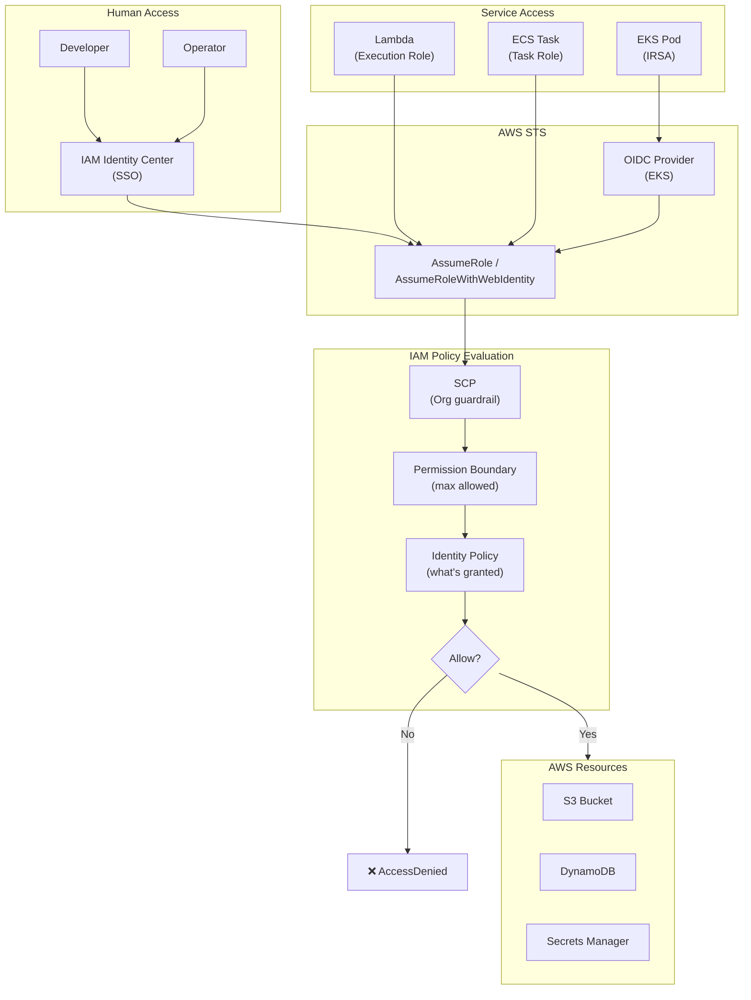

# AWS IAM — Least Privilege & Identity Patterns

## Category
Cloud Native, Security, AWS IAM, Identity & Access Management

## Context

**AWS IAM (Identity and Access Management)** controls who can do what to which AWS resource, under what conditions. It is the most critical security control in AWS — a misconfigured IAM policy is responsible for the majority of AWS breaches.

**IAM principals**:
| Principal | Description |
|-----------|-------------|
| **IAM User** | Long-term credential for a human (avoid; prefer SSO) |
| **IAM Role** | Short-term credential assumed by services, users, or cross-account principals |
| **IAM Group** | Collection of users; attach policies to groups, not users |
| **Service principal** | AWS service (Lambda, ECS) that assumes a role |

**Key patterns**:

1. **Least Privilege**: Grant only the permissions required for the specific task — nothing more.
2. **ABAC (Attribute-Based Access Control)**: Use resource tags + IAM conditions to scale permissions without policy sprawl.
3. **Permission Boundaries**: Hard limit on the maximum permissions a role can ever have (safe delegation).
4. **Service Control Policies (SCPs)**: Organisation-wide guardrails applied at the account or OU level.
5. **IRSA**: IAM Roles for Service Accounts — pod-level permissions in EKS via OIDC.
6. **AWS SSO / IAM Identity Center**: Centralised human access via federated SSO (no IAM users needed).
7. **Cross-account role assumption**: Allow workloads in Account A to access resources in Account B via `sts:AssumeRole`.

**Policy types (evaluation order)**:
```
SCP (org) → Resource-based policy → Permission boundary → Identity policy → Session policy
```
A request is allowed only if EVERY applicable policy layer allows it and no SCP denies it.

---

## Pros

- **Fine-grained control**: Conditions on IP, time of day, MFA, VPC, tags, source service.
- **No credentials to manage for workloads**: EC2 instance profiles, IRSA, and ECS task roles use temporary credentials via STS.
- **ABAC scales well**: Tag-based policies grow with resources without new policy statements.
- **Auditable**: CloudTrail logs every IAM API call.
- **SCPs provide hard guardrails**: Even account admins cannot override SCPs.

---

## Cons

- **Policy complexity**: JSON syntax; easy to accidentally grant too much access.
- **`*` sprawl**: Teams often default to `*` for actions or resources out of convenience.
- **Policy size limits**: 6 KB for inline policies, 6 KB for managed policies.
- **Privilege escalation risk**: Any role that can `iam:CreatePolicy` + `iam:AttachRolePolicy` can escalate their own privileges.
- **Condition confusion**: Multiple conditions in same statement are ANDed; conditions across statements are ORed.

---

## Design Diagram



---

## Code Sample

### Terraform — Least-Privilege IAM Policies

```hcl
# infrastructure/terraform/iam/api-role.tf

# ─── API Service Role ────────────────────────────────────────────────────────
resource "aws_iam_role" "api" {
  name = "myapp-api-${var.environment}"
  description = "Role for the API service — least privilege"

  assume_role_policy = jsonencode({
    Version = "2012-10-17"
    Statement = [
      # ECS task assumption
      {
        Sid    = "ECSTaskAssume"
        Effect = "Allow"
        Principal = { Service = "ecs-tasks.amazonaws.com" }
        Action = "sts:AssumeRole"
        Condition = {
          ArnLike = {
            "aws:SourceArn" = "arn:aws:ecs:${var.aws_region}:${var.account_id}:*"
          }
        }
      }
    ]
  })

  # Permission boundary — hard cap on max permissions (safe delegation pattern)
  permissions_boundary = aws_iam_policy.developer_boundary.arn
}

# ─── Minimal policy: only what the API actually needs ─────────────────────
resource "aws_iam_policy" "api" {
  name        = "myapp-api-policy-${var.environment}"
  description = "Minimal permissions for the API service"

  policy = jsonencode({
    Version = "2012-10-17"
    Statement = [
      # DynamoDB — only specific table, only required actions
      {
        Sid    = "DynamoDBOrders"
        Effect = "Allow"
        Action = [
          "dynamodb:PutItem",
          "dynamodb:GetItem",
          "dynamodb:Query",
          "dynamodb:UpdateItem"
        ]
        Resource = [
          "arn:aws:dynamodb:${var.aws_region}:${var.account_id}:table/orders",
          "arn:aws:dynamodb:${var.aws_region}:${var.account_id}:table/orders/index/*"
        ]
      },
      # SQS — only send to the orders queue
      {
        Sid    = "SQSSend"
        Effect = "Allow"
        Action = ["sqs:SendMessage", "sqs:GetQueueUrl"]
        Resource = "arn:aws:sqs:${var.aws_region}:${var.account_id}:order-queue"
      },
      # Secrets Manager — only read the app secret, not list or modify
      {
        Sid    = "SecretsRead"
        Effect = "Allow"
        Action = ["secretsmanager:GetSecretValue"]
        Resource = "arn:aws:secretsmanager:${var.aws_region}:${var.account_id}:secret:myapp/${var.environment}/*"
      },
      # X-Ray — for distributed tracing
      {
        Sid    = "XRay"
        Effect = "Allow"
        Action = ["xray:PutTraceSegments", "xray:PutTelemetryRecords"]
        Resource = "*"
      },
      # Explicit deny — prevent privilege escalation
      {
        Sid    = "DenyPrivilegeEscalation"
        Effect = "Deny"
        Action = [
          "iam:CreatePolicy",
          "iam:AttachRolePolicy",
          "iam:PutRolePolicy",
          "iam:CreateRole"
        ]
        Resource = "*"
      }
    ]
  })
}

resource "aws_iam_role_policy_attachment" "api" {
  role       = aws_iam_role.api.name
  policy_arn = aws_iam_policy.api.arn
}

# ─── Permission Boundary — cap on developer-created roles ─────────────────
resource "aws_iam_policy" "developer_boundary" {
  name        = "DeveloperPermissionBoundary"
  description = "Maximum permissions any developer-created role can have"

  policy = jsonencode({
    Version = "2012-10-17"
    Statement = [
      {
        Effect = "Allow"
        Action = [
          "s3:*", "dynamodb:*", "sqs:*",
          "sns:*", "lambda:*", "logs:*",
          "xray:*", "secretsmanager:GetSecretValue"
        ]
        Resource = "*"
      },
      # Hard deny — even with boundary, can never touch IAM or billing
      {
        Effect   = "Deny"
        Action   = ["iam:*", "organizations:*", "account:*", "billing:*"]
        Resource = "*"
      }
    ]
  })
}
```

### ABAC — Tag-Based Access Control

```hcl
# ABAC policy: service can only access resources tagged with its own team
resource "aws_iam_policy" "abac_team" {
  name = "abac-team-access"

  policy = jsonencode({
    Version = "2012-10-17"
    Statement = [{
      Effect = "Allow"
      Action = ["dynamodb:*", "s3:*", "sqs:*"]
      Resource = "*"
      Condition = {
        StringEquals = {
          # Principal's team tag must match the resource's team tag
          "aws:ResourceTag/Team" = "$${aws:PrincipalTag/Team}"
          # Principal's environment tag must match resource's
          "aws:ResourceTag/Environment" = "$${aws:PrincipalTag/Environment}"
        }
      }
    }]
  })
}
```

### SCP — Organisation Guardrails

```json
{
  "Version": "2012-10-17",
  "Statement": [
    {
      "Sid": "DenyRootAccess",
      "Effect": "Deny",
      "Action": "*",
      "Resource": "*",
      "Condition": {
        "StringLike": { "aws:PrincipalArn": "arn:aws:iam::*:root" }
      }
    },
    {
      "Sid": "RequireMFAForConsole",
      "Effect": "Deny",
      "NotAction": ["iam:CreateVirtualMFADevice", "iam:EnableMFADevice", "sts:GetSessionToken"],
      "Resource": "*",
      "Condition": {
        "BoolIfExists": { "aws:MultiFactorAuthPresent": "false" }
      }
    },
    {
      "Sid": "DenyRegionsOutsideEU",
      "Effect": "Deny",
      "Action": "*",
      "Resource": "*",
      "Condition": {
        "StringNotEquals": {
          "aws:RequestedRegion": ["eu-west-1", "eu-central-1", "eu-west-2"]
        }
      }
    },
    {
      "Sid": "RequireEncryptionAtRest",
      "Effect": "Deny",
      "Action": ["rds:CreateDBInstance", "rds:CreateDBCluster"],
      "Resource": "*",
      "Condition": {
        "Bool": { "rds:StorageEncrypted": "false" }
      }
    }
  ]
}
```

### TypeScript — IAM Policy Validator (CI gate)

```typescript
// scripts/validate-iam-policies.ts
// Checks that no policy statement uses wildcard '*' for both Action and Resource

import * as fs from 'fs';
import * as path from 'path';
import { glob } from 'glob';

interface PolicyStatement {
  Sid?: string;
  Effect: 'Allow' | 'Deny';
  Action: string | string[];
  NotAction?: string | string[];
  Resource: string | string[];
  Condition?: Record<string, unknown>;
}

interface IAMPolicy {
  Version: string;
  Statement: PolicyStatement[];
}

const WILDCARD_ACTION_EXEMPTIONS = new Set([
  'XRay',  // X-Ray requires Resource: * by design
]);

function checkPolicy(filePath: string, policy: IAMPolicy): string[] {
  const violations: string[] = [];

  for (const stmt of policy.Statement) {
    if (stmt.Effect !== 'Allow') continue;
    if (stmt.Sid && WILDCARD_ACTION_EXEMPTIONS.has(stmt.Sid)) continue;

    const actions = Array.isArray(stmt.Action) ? stmt.Action : [stmt.Action ?? ''];
    const resources = Array.isArray(stmt.Resource) ? stmt.Resource : [stmt.Resource ?? ''];

    const hasWildcardAction = actions.some(a => a === '*');
    const hasWildcardResource = resources.some(r => r === '*');

    if (hasWildcardAction && hasWildcardResource) {
      violations.push(
        `[${filePath}] Statement "${stmt.Sid ?? 'unnamed'}" grants Action:* on Resource:* — severe over-privilege`,
      );
    }

    if (hasWildcardAction && !hasWildcardResource) {
      violations.push(
        `[${filePath}] Statement "${stmt.Sid ?? 'unnamed'}" grants Action:* — prefer explicit actions`,
      );
    }
  }

  return violations;
}

async function validateAllPolicies(): Promise<void> {
  const policyFiles = await glob('infrastructure/**/*.json', { ignore: ['**/node_modules/**'] });
  const allViolations: string[] = [];

  for (const file of policyFiles) {
    try {
      const content = JSON.parse(fs.readFileSync(file, 'utf-8'));
      if (!content.Statement) continue;
      allViolations.push(...checkPolicy(file, content));
    } catch {
      // Not a JSON policy file — skip
    }
  }

  if (allViolations.length > 0) {
    console.error('❌ IAM Policy violations found:');
    allViolations.forEach(v => console.error(' ', v));
    process.exit(1);
  }

  console.log(`✅ All ${policyFiles.length} policy files passed least-privilege check`);
}

validateAllPolicies().catch(err => {
  console.error(err);
  process.exit(1);
});
```
