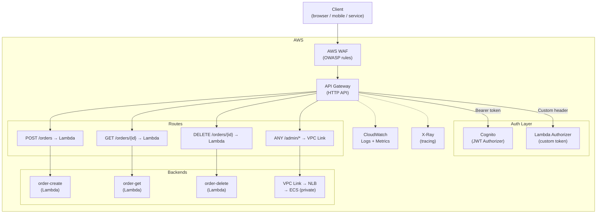

# AWS API Gateway Patterns

## Category
Cloud Native, API Management, AWS API Gateway, REST/HTTP/WebSocket

## Context

**AWS API Gateway** is a fully managed service for creating, publishing, securing, and monitoring APIs at any scale. It acts as the "front door" for serverless backends (Lambda), container services (ECS/EKS via ALB), or any HTTP backend.

**Three API types**:
| Type | Best for | Max payload | WebSocket |
|------|---------|-------------|-----------|
| **HTTP API** | Low-latency, cost-efficient REST APIs with Lambda | 10 MB | No |
| **REST API** | Advanced features: usage plans, API keys, request/response transform, caching | 10 MB | No |
| **WebSocket API** | Persistent bidirectional connections | 128 KB | Yes |

**HTTP API vs REST API** (cost comparison):
- HTTP API: $1.00 per million requests.
- REST API: $3.50 per million requests.
- Use HTTP API unless you need caching, API keys, or request/response transformation.

**Key capabilities**:
| Feature | HTTP API | REST API |
|---------|---------|---------|
| JWT authoriser (Cognito/custom) | ✅ | ✅ (Custom Authorizer) |
| IAM auth | ✅ | ✅ |
| Lambda Authorizer | ✅ | ✅ |
| Per-stage throttling | ✅ | ✅ |
| Per-method throttling | ❌ | ✅ |
| Response caching | ❌ | ✅ |
| Request validation | Basic | Full |
| VPC Link (private integration) | ✅ | ✅ (NLB only) |
| CORS | Auto | Manual |

**Throttling**: Default 10,000 RPS with 5,000 burst. Configurable per stage or per-method.

**Lambda integration modes**:
- **Lambda proxy**: API Gateway passes the raw request to Lambda and returns the raw response.
- **Lambda non-proxy (custom)**: API Gateway transforms request/response using Velocity templates.
- Prefer Lambda proxy — simpler and more flexible.

---

## Pros

- **Fully managed**: No infrastructure to run, TLS handled, auto-scales.
- **Tight Lambda integration**: Invoke Lambda per route with request/response passthrough.
- **Built-in auth**: Cognito JWT, IAM SigV4, Lambda Authorizer (custom token logic).
- **Usage plans**: Rate limit and track usage per API key / partner.
- **WAF integration**: Attach AWS WAF to REST API for OWASP protection.
- **Private APIs**: VPC interface endpoint — expose API only inside VPC.

---

## Cons

- **29-second timeout**: Hard limit — cannot serve long-running Lambda invocations synchronously.
- **Payload size limits**: 10 MB maximum — not suitable for large file uploads (use pre-signed S3 URLs).
- **WebSocket connection limit**: 500 per execution environment.
- **Cold starts visible to clients**: Lambda cold starts add latency to first requests.
- **Vendor lock-in**: AWS-specific integration patterns.

---

## Design Diagram



---

## Code Sample

### Terraform — HTTP API with Cognito JWT Authorizer

```hcl
# infrastructure/terraform/api-gateway/main.tf

# ─── HTTP API ────────────────────────────────────────────────────────────────
resource "aws_apigatewayv2_api" "main" {
  name          = "myapp-api"
  protocol_type = "HTTP"
  description   = "MyApp HTTP API"

  cors_configuration {
    allow_headers  = ["Authorization", "Content-Type", "X-Request-ID"]
    allow_methods  = ["GET", "POST", "PUT", "DELETE", "OPTIONS"]
    allow_origins  = var.cors_allowed_origins
    expose_headers = ["X-Request-ID"]
    max_age        = 86400
  }
}

# ─── Stage ────────────────────────────────────────────────────────────────────
resource "aws_apigatewayv2_stage" "prod" {
  api_id      = aws_apigatewayv2_api.main.id
  name        = "prod"
  auto_deploy = true

  default_route_settings {
    throttling_burst_limit   = 500
    throttling_rate_limit    = 1000
    detailed_metrics_enabled = true
    logging_level            = "INFO"
  }

  access_log_settings {
    destination_arn = aws_cloudwatch_log_group.api_access_logs.arn
    format = jsonencode({
      requestId      = "$context.requestId"
      requestTime    = "$context.requestTime"
      httpMethod     = "$context.httpMethod"
      path           = "$context.path"
      status         = "$context.status"
      responseLength = "$context.responseLength"
      integrationLatency = "$context.integrationLatency"
      authorizer     = "$context.authorizer.claims.sub"
      errorMessage   = "$context.error.message"
    })
  }
}

# ─── JWT Authorizer (Cognito) ────────────────────────────────────────────────
resource "aws_apigatewayv2_authorizer" "cognito" {
  api_id           = aws_apigatewayv2_api.main.id
  authorizer_type  = "JWT"
  identity_sources = ["$request.header.Authorization"]
  name             = "cognito-jwt"

  jwt_configuration {
    audience = [aws_cognito_user_pool_client.web.id]
    issuer   = "https://cognito-idp.${var.aws_region}.amazonaws.com/${aws_cognito_user_pool.main.id}"
  }
}

# ─── Lambda Integrations ──────────────────────────────────────────────────────
resource "aws_apigatewayv2_integration" "order_create" {
  api_id                 = aws_apigatewayv2_api.main.id
  integration_type       = "AWS_PROXY"
  integration_uri        = aws_lambda_function.order_create.invoke_arn
  payload_format_version = "2.0"  # Newer, simpler event format
  timeout_milliseconds   = 29000
}

resource "aws_apigatewayv2_integration" "order_get" {
  api_id                 = aws_apigatewayv2_api.main.id
  integration_type       = "AWS_PROXY"
  integration_uri        = aws_lambda_function.order_get.invoke_arn
  payload_format_version = "2.0"
}

# ─── Routes ────────────────────────────────────────────────────────────────
resource "aws_apigatewayv2_route" "create_order" {
  api_id             = aws_apigatewayv2_api.main.id
  route_key          = "POST /orders"
  target             = "integrations/${aws_apigatewayv2_integration.order_create.id}"
  authorization_type = "JWT"
  authorizer_id      = aws_apigatewayv2_authorizer.cognito.id

  # Require 'orders:write' scope from Cognito
  authorization_scopes = ["orders:write"]
}

resource "aws_apigatewayv2_route" "get_order" {
  api_id             = aws_apigatewayv2_api.main.id
  route_key          = "GET /orders/{orderId}"
  target             = "integrations/${aws_apigatewayv2_integration.order_get.id}"
  authorization_type = "JWT"
  authorizer_id      = aws_apigatewayv2_authorizer.cognito.id
  authorization_scopes = ["orders:read"]
}

# Health check — no auth required
resource "aws_apigatewayv2_route" "health" {
  api_id    = aws_apigatewayv2_api.main.id
  route_key = "GET /health"
  target    = "integrations/${aws_apigatewayv2_integration.order_get.id}"
}

# ─── Lambda permission to be invoked by API Gateway ──────────────────────────
resource "aws_lambda_permission" "apigw_create" {
  statement_id  = "AllowAPIGatewayInvoke"
  action        = "lambda:InvokeFunction"
  function_name = aws_lambda_function.order_create.function_name
  principal     = "apigateway.amazonaws.com"
  source_arn    = "${aws_apigatewayv2_api.main.execution_arn}/*/*/orders"
}

# ─── WAF Association (REST API only) ─────────────────────────────────────────
resource "aws_wafv2_web_acl_association" "api" {
  count        = var.api_type == "REST" ? 1 : 0
  resource_arn = aws_api_gateway_stage.prod.arn
  web_acl_arn  = aws_wafv2_web_acl.api.arn
}

resource "aws_wafv2_web_acl" "api" {
  name  = "api-waf"
  scope = "REGIONAL"

  default_action { allow {} }

  # AWS Managed Rules — OWASP Top 10 coverage
  rule {
    name     = "AWSManagedRulesCommonRuleSet"
    priority = 1
    override_action { none {} }
    statement {
      managed_rule_group_statement {
        name        = "AWSManagedRulesCommonRuleSet"
        vendor_name = "AWS"
      }
    }
    visibility_config {
      cloudwatch_metrics_enabled = true
      metric_name                = "CommonRuleSet"
      sampled_requests_enabled   = true
    }
  }

  rule {
    name     = "RateLimitPerIP"
    priority = 2
    action { block {} }
    statement {
      rate_based_statement {
        limit              = 2000   # 2000 req/5min per IP
        aggregate_key_type = "IP"
      }
    }
    visibility_config {
      cloudwatch_metrics_enabled = true
      metric_name                = "RateLimit"
      sampled_requests_enabled   = true
    }
  }

  visibility_config {
    cloudwatch_metrics_enabled = true
    metric_name                = "api-waf"
    sampled_requests_enabled   = true
  }
}
```

### Lambda Handler — API Gateway v2 Proxy (TypeScript)

```typescript
// src/handlers/api-handler.ts
import {
  APIGatewayProxyEventV2WithJWTAuthorizer,
  APIGatewayProxyResultV2,
  Context,
} from 'aws-lambda';
import { Logger } from '@aws-lambda-powertools/logger';
import { Tracer } from '@aws-lambda-powertools/tracer';

const logger = new Logger({ serviceName: 'api-handler' });
const tracer = new Tracer({ serviceName: 'api-handler' });

export const handler = async (
  event: APIGatewayProxyEventV2WithJWTAuthorizer,
  context: Context,
): Promise<APIGatewayProxyResultV2> => {
  logger.addContext(context);

  // Extract caller identity from JWT (injected by authorizer — no need to verify again)
  const sub = event.requestContext.authorizer.jwt.claims['sub'] as string;
  const email = event.requestContext.authorizer.jwt.claims['email'] as string;

  logger.info('API request', {
    method: event.requestContext.http.method,
    path: event.requestContext.http.path,
    caller: sub,
  });

  const requestId = event.requestContext.requestId;

  try {
    const orderId = event.pathParameters?.['orderId'];
    if (!orderId) {
      return errorResponse(400, 'MISSING_PARAM', 'orderId path parameter is required', requestId);
    }

    // Parse and validate body
    if (!event.body) {
      return errorResponse(400, 'MISSING_BODY', 'Request body is required', requestId);
    }

    const body = event.isBase64Encoded
      ? JSON.parse(Buffer.from(event.body, 'base64').toString())
      : JSON.parse(event.body);

    // Business logic...
    const result = { orderId, status: 'CREATED', createdBy: sub };

    return {
      statusCode: 201,
      headers: {
        'Content-Type': 'application/json',
        'X-Request-ID': requestId,
      },
      body: JSON.stringify(result),
    };
  } catch (err) {
    logger.error('Unhandled error', { err });
    return errorResponse(500, 'INTERNAL_ERROR', 'An unexpected error occurred', requestId);
  }
};

function errorResponse(
  statusCode: number,
  code: string,
  message: string,
  requestId: string,
): APIGatewayProxyResultV2 {
  return {
    statusCode,
    headers: {
      'Content-Type': 'application/json',
      'X-Request-ID': requestId,
    },
    body: JSON.stringify({ error: { code, message } }),
  };
}
```

### WebSocket API — Real-time Notifications

```hcl
# infrastructure/terraform/api-gateway/websocket.tf

resource "aws_apigatewayv2_api" "websocket" {
  name                       = "myapp-websocket"
  protocol_type              = "WEBSOCKET"
  route_selection_expression = "$request.body.action"
}

resource "aws_apigatewayv2_route" "connect" {
  api_id    = aws_apigatewayv2_api.websocket.id
  route_key = "$connect"
  target    = "integrations/${aws_apigatewayv2_integration.ws_connect.id}"
  authorization_type = "CUSTOM"
  authorizer_id      = aws_apigatewayv2_authorizer.ws_lambda.id
}

resource "aws_apigatewayv2_route" "disconnect" {
  api_id    = aws_apigatewayv2_api.websocket.id
  route_key = "$disconnect"
  target    = "integrations/${aws_apigatewayv2_integration.ws_disconnect.id}"
}

resource "aws_apigatewayv2_route" "default" {
  api_id    = aws_apigatewayv2_api.websocket.id
  route_key = "$default"
  target    = "integrations/${aws_apigatewayv2_integration.ws_message.id}"
}
```
