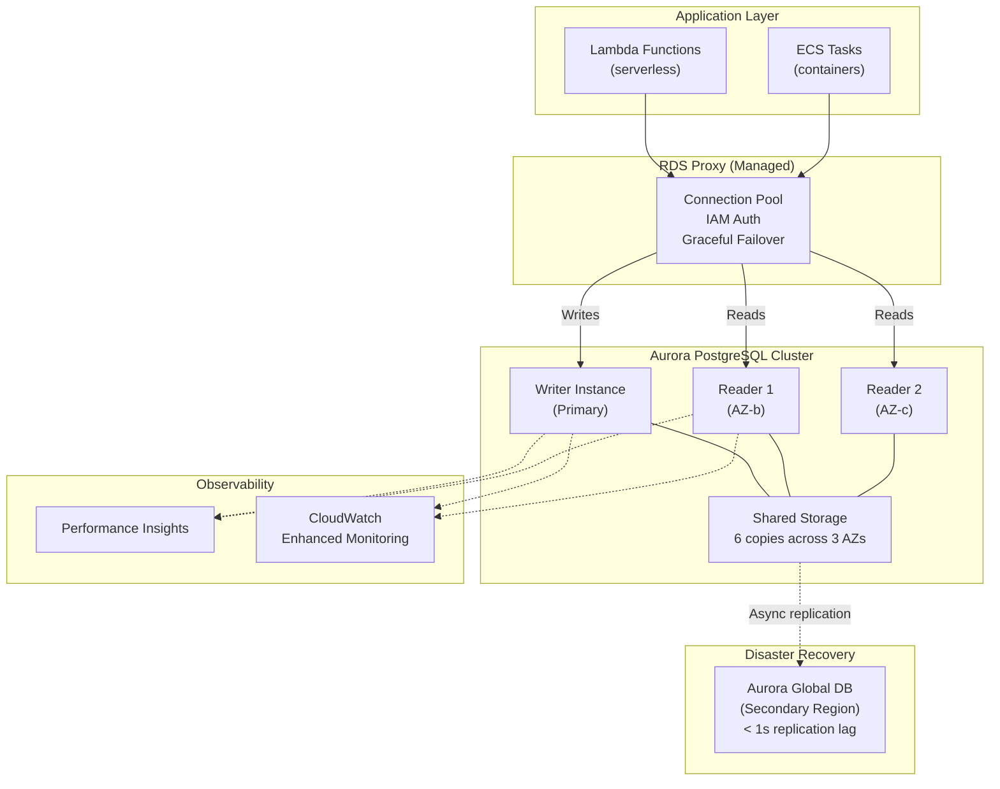

# AWS RDS & Aurora Patterns

## Category
Cloud Native, Database, AWS RDS, Aurora, PostgreSQL

## Context

**Amazon RDS (Relational Database Service)** manages relational database infrastructure — provisioning, patching, backups, and failover. **Aurora** is AWS's cloud-native relational engine, API-compatible with MySQL and PostgreSQL but with a distributed storage layer that delivers up to 5× MySQL throughput and 3× PostgreSQL throughput.

**Aurora architecture**:
- Shared storage layer replicates data across 6 copies in 3 AZs automatically.
- A read replica shares the same underlying storage (no replication lag for reads from storage perspective — only ephemeral buffer cache differences).
- Failover to a read replica typically completes in < 30 seconds.
- Up to 15 read replicas.

**Aurora variants**:
| Variant | Description | Use case |
|---------|-------------|----------|
| **Aurora PostgreSQL** | Postgres-compatible, serverless v2 capable | Primary OLTP database |
| **Aurora MySQL** | MySQL-compatible | Legacy MySQL workloads |
| **Aurora Serverless v2** | Auto-scales capacity from 0.5 to 128 ACUs in seconds | Spiky / unpredictable workloads |
| **Aurora Global Database** | Cross-region replication (< 1s lag) | DR, read-local multi-region |

**RDS Proxy**:
- Pools and multiplexes connections between the application and Aurora.
- Critical for Lambda and serverless workloads that cannot maintain persistent DB connections.
- Each Lambda invocation creates a new connection — without Proxy, a spike in concurrent Lambdas = connection exhaustion.
- Supports IAM authentication (no password in config — short-lived IAM token).

**Key operational patterns**:
1. Always use **Multi-AZ** in production (synchronous standby in second AZ).
2. Use **Aurora Serverless v2** for dev/test to reduce costs (scales to 0 ACU when idle).
3. **Parameter Groups** to tune PostgreSQL settings (work_mem, max_connections, etc.).
4. Enable **Performance Insights** (1 week free, up to 2 years for a cost).
5. Enable **Enhanced Monitoring** (OS-level metrics every 1 second).

---

## Pros

- **Managed**: No OS or DB engine patching; automated backups + PITR (up to 35 days).
- **High availability**: Multi-AZ with automatic failover; Aurora typically fails over in < 30 s.
- **Aurora storage performance**: Distributed, fault-tolerant; no storage I/O bottleneck.
- **RDS Proxy**: Solves serverless connection pooling; enables IAM auth; graceful failover.
- **Aurora Serverless v2**: True auto-scaling database — zero management for variable load.
- **Encryption at rest**: KMS encryption with no performance impact.

---

## Cons

- **Cost**: Aurora costs ~20% more than standard RDS PostgreSQL at the same instance size.
- **Connection limits**: Still bounded by instance size (e.g., `db.r6g.large` ≈ 3,000 max connections). RDS Proxy helps.
- **No super-user access**: Cannot install custom extensions not in the `rds.extensions` allow list.
- **Cross-region Aurora Global**: RPO near-zero but RTO is still 1–2 minutes for planned failover.
- **Aurora Serverless v2**: Minimum 0.5 ACU (still billed even at zero load unless you add an idle scaling to 0 with Serverless v1 style config).

---

## Design Diagram



---

## Code Sample

### Terraform — Aurora PostgreSQL with RDS Proxy

```hcl
# infrastructure/terraform/database/aurora.tf

# ─── Subnet Group ─────────────────────────────────────────────────────────────
resource "aws_db_subnet_group" "main" {
  name        = "myapp-${var.environment}"
  description = "Aurora subnet group"
  subnet_ids  = var.database_subnet_ids

  tags = { Name = "myapp-${var.environment}" }
}

# ─── Cluster Parameter Group ──────────────────────────────────────────────────
resource "aws_rds_cluster_parameter_group" "pg16" {
  name        = "myapp-aurora-pg16"
  family      = "aurora-postgresql16"
  description = "Aurora PostgreSQL 16 parameters"

  parameter {
    name  = "shared_preload_libraries"
    value = "pg_stat_statements,auto_explain"
  }
  parameter {
    name  = "log_min_duration_statement"
    value = "1000"   # Log queries taking > 1 second
  }
  parameter {
    name  = "auto_explain.log_min_duration"
    value = "5000"   # Log query plans for > 5 second queries
  }
  parameter {
    name  = "log_connections"
    value = "1"
  }
}

# ─── Aurora Cluster ────────────────────────────────────────────────────────────
resource "aws_rds_cluster" "main" {
  cluster_identifier     = "myapp-${var.environment}"
  engine                 = "aurora-postgresql"
  engine_version         = "16.2"
  engine_mode            = "provisioned"  # For Serverless v2, set instance_class to db.serverless below

  database_name   = "myapp"
  master_username = "myapp_admin"

  # Password managed via Secrets Manager rotation
  manage_master_user_password = true
  master_user_secret_kms_key_id = aws_kms_key.rds.arn

  db_subnet_group_name            = aws_db_subnet_group.main.name
  vpc_security_group_ids          = [var.rds_security_group_id]
  db_cluster_parameter_group_name = aws_rds_cluster_parameter_group.pg16.name

  backup_retention_period   = 14          # 14 days PITR
  preferred_backup_window   = "03:00-04:00"
  preferred_maintenance_window = "sun:04:00-sun:05:00"
  copy_tags_to_snapshot     = true
  deletion_protection       = true        # Prevent accidental deletion
  skip_final_snapshot       = false
  final_snapshot_identifier = "myapp-${var.environment}-final"

  storage_encrypted = true
  kms_key_id        = aws_kms_key.rds.arn

  enabled_cloudwatch_logs_exports = ["postgresql"]

  # Aurora Serverless v2 scaling configuration
  serverlessv2_scaling_configuration {
    min_capacity = 0.5   # 0.5 ACU minimum
    max_capacity = 16    # 16 ACU maximum
  }
}

# ─── Aurora Instances ────────────────────────────────────────────────────────
resource "aws_rds_cluster_instance" "writer" {
  identifier         = "${aws_rds_cluster.main.cluster_identifier}-writer"
  cluster_identifier = aws_rds_cluster.main.id
  instance_class     = "db.serverless"    # Serverless v2
  engine             = aws_rds_cluster.main.engine
  engine_version     = aws_rds_cluster.main.engine_version

  performance_insights_enabled          = true
  performance_insights_retention_period = 7
  monitoring_interval                   = 15    # Enhanced monitoring every 15s
  monitoring_role_arn                   = aws_iam_role.rds_monitoring.arn
  auto_minor_version_upgrade            = false  # Control upgrades manually
}

resource "aws_rds_cluster_instance" "reader" {
  count = var.environment == "production" ? 1 : 0

  identifier         = "${aws_rds_cluster.main.cluster_identifier}-reader-${count.index}"
  cluster_identifier = aws_rds_cluster.main.id
  instance_class     = "db.serverless"
  engine             = aws_rds_cluster.main.engine
  engine_version     = aws_rds_cluster.main.engine_version

  performance_insights_enabled          = true
  performance_insights_retention_period = 7
  monitoring_interval                   = 15
  monitoring_role_arn                   = aws_iam_role.rds_monitoring.arn
}

# ─── RDS Proxy ─────────────────────────────────────────────────────────────
resource "aws_db_proxy" "main" {
  name                   = "myapp-${var.environment}"
  debug_logging          = false
  engine_family          = "POSTGRESQL"
  idle_client_timeout    = 1800   # 30 minutes
  require_tls            = true
  role_arn               = aws_iam_role.rds_proxy.arn
  vpc_security_group_ids = [var.rds_proxy_security_group_id]
  vpc_subnet_ids         = var.private_subnet_ids

  auth {
    auth_scheme  = "SECRETS"
    description  = "Aurora master credentials"
    iam_auth     = "REQUIRED"   # IAM auth only — no password auth
    secret_arn   = aws_rds_cluster.main.master_user_secret[0].secret_arn
  }
}

resource "aws_db_proxy_default_target_group" "main" {
  db_proxy_name = aws_db_proxy.main.name

  connection_pool_config {
    connection_borrow_timeout    = 120
    max_connections_percent      = 100
    max_idle_connections_percent = 50
  }
}

resource "aws_db_proxy_target" "main" {
  db_cluster_identifier = aws_rds_cluster.main.cluster_identifier
  db_proxy_name         = aws_db_proxy.main.name
  target_group_name     = aws_db_proxy_default_target_group.main.name
}
```

### TypeScript — Database Client with IAM Auth via RDS Proxy

```typescript
// src/database/client.ts
import { Pool, PoolClient } from 'pg';
import { Signer } from '@aws-sdk/rds-signer';

// RDS Proxy connection with IAM authentication
// No password ever stored — short-lived IAM token generated per connection

const signer = new Signer({
  hostname: process.env.DB_PROXY_ENDPOINT!,
  port: 5432,
  region: process.env.AWS_REGION!,
  username: 'myapp_user',
});

// Pool is created once per Lambda container (outside handler)
let pool: Pool | null = null;

async function getPool(): Promise<Pool> {
  if (pool) return pool;

  const token = await signer.getAuthToken();

  pool = new Pool({
    host:     process.env.DB_PROXY_ENDPOINT!,
    port:     5432,
    database: process.env.DB_NAME!,
    user:     'myapp_user',
    password: token,              // IAM token as password
    ssl:      { rejectUnauthorized: true },   // TLS required by RDS Proxy
    max:      10,
    idleTimeoutMillis: 30_000,
    connectionTimeoutMillis: 5_000,
  });

  // Refresh token before it expires (15 min IAM token lifetime)
  setInterval(async () => {
    const newToken = await signer.getAuthToken();
    pool!.options.password = newToken;
  }, 10 * 60 * 1000);  // Refresh every 10 min

  return pool;
}

// Transactional helper
export async function withTransaction<T>(
  fn: (client: PoolClient) => Promise<T>,
): Promise<T> {
  const p = await getPool();
  const client = await p.connect();
  try {
    await client.query('BEGIN');
    const result = await fn(client);
    await client.query('COMMIT');
    return result;
  } catch (err) {
    await client.query('ROLLBACK');
    throw err;
  } finally {
    client.release();
  }
}

// Usage example
export async function createOrder(order: {
  id: string;
  customerId: string;
  total: number;
}): Promise<void> {
  await withTransaction(async client => {
    await client.query(
      `INSERT INTO orders (id, customer_id, total, status, created_at)
       VALUES ($1, $2, $3, 'PENDING', NOW())`,
      [order.id, order.customerId, order.total],
    );
    await client.query(
      `INSERT INTO audit_log (entity, entity_id, action, created_at)
       VALUES ('order', $1, 'created', NOW())`,
      [order.id],
    );
  });
}
```
