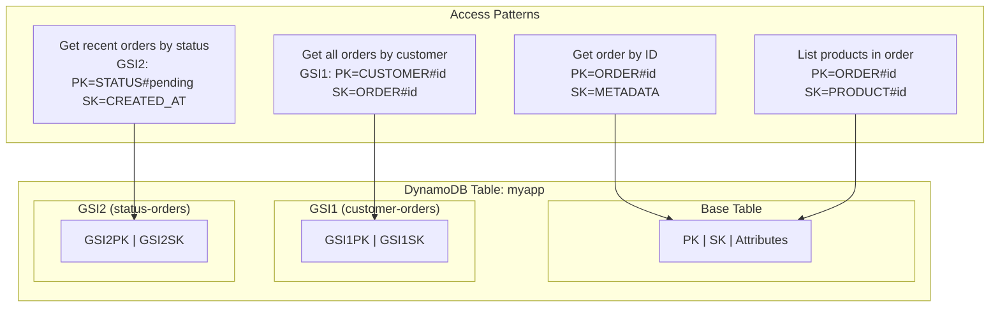

# AWS DynamoDB Patterns

## Category
Cloud Native, NoSQL, AWS DynamoDB, Single-Table Design

## Context

**Amazon DynamoDB** is a fully managed, serverless, key-value and document database delivering single-digit millisecond performance at any scale. It auto-scales storage and throughput, with no servers to manage, patch, or size.

**Core concepts**:
| Concept | Description |
|---------|-------------|
| **Table** | The top-level container for items |
| **Item** | A row — collection of attributes (max 400 KB) |
| **Partition Key (PK)** | Mandatory hash key that determines the partition |
| **Sort Key (SK)** | Optional range key; enables range queries within a partition |
| **GSI** | Global Secondary Index — an alternate key projection onto a new PK/SK |
| **LSI** | Local Secondary Index — alternate SK on same PK (must be defined at creation) |
| **Streams** | Change data capture — ordered stream of item-level changes |

**Capacity modes**:
| Mode | Best for |
|------|---------|
| **On-demand** | Unpredictable traffic; pay per request ($1.25/million writes, $0.25/million reads) |
| **Provisioned + Auto Scaling** | Predictable workload; significant cost savings |

**Single-Table Design (STD)**:
The recommended DynamoDB pattern — store all entity types in a single table using composite keys (`PK` + `SK`) and overloaded GSI projections.

Benefits:
- **Efficient**: All related data in one request (no joins, no N+1).
- **Cost**: One table = one read unit per access, regardless of how many entities are stored.
- **Scale**: Hot-spot avoidance by designing key prefixes that spread load evenly.

**Key design rules**:
1. Design access patterns first — DynamoDB is access-pattern driven, not entity-driven.
2. Use descriptive prefixes: `ORDER#`, `CUSTOMER#`, `PRODUCT#`.
3. Use GSIs (max 20) to support alternate access patterns.
4. Use TTL (`ttl` attribute) to automatically expire transient data.
5. Avoid "hot partitions" — never have one PK receive > 3,000 WCU/1,000 RCU (hard limit per partition).

---

## Pros

- **No scaling decisions**: On-demand mode handles any traffic spike.
- **Single-digit millisecond latency**: Consistent performance at scale.
- **Serverless**: No connection pools, no engine tuning, no vacuuming.
- **Global Tables**: Multi-region active-active with < 1s replication.
- **DynamoDB Streams**: Change capture for event-driven architectures.
- **DAX**: In-memory caching layer — reduces read latency to microseconds.
- **Point-in-time recovery**: Up to 35 days of continuous backups.

---

## Cons

- **No joins**: Requires careful access-pattern modelling upfront; schema changes are painful.
- **400 KB item limit**: Large items require chunking or S3 offloading.
- **Single-table complexity**: Steep learning curve; requires discipline.
- **Eventual consistency on GSIs**: GSI reads can lag behind the base table by milliseconds.
- **Cost at scale**: On-demand is expensive at high write throughput — switch to provisioned mode above ~2M writes/day.
- **No aggregations**: SUM, GROUP BY, COUNT require application-side logic or DynamoDB Streams + Lambda.

---

## Design Diagram



---

## Code Sample

### Terraform — DynamoDB Table (Single-Table Design)

```hcl
# infrastructure/terraform/database/dynamodb.tf

resource "aws_dynamodb_table" "main" {
  name         = "myapp-${var.environment}"
  billing_mode = "PAY_PER_REQUEST"    # On-demand

  hash_key  = "pk"
  range_key = "sk"

  # Point-in-time recovery
  point_in_time_recovery {
    enabled = true
  }

  # Encryption with customer-managed KMS key
  server_side_encryption {
    enabled     = true
    kms_key_arn = aws_kms_key.dynamodb.arn
  }

  # Attributes referenced by base table or GSIs
  attribute {
    name = "pk"
    type = "S"
  }
  attribute {
    name = "sk"
    type = "S"
  }
  attribute {
    name = "gsi1pk"   # Alternate PK for GSI1
    type = "S"
  }
  attribute {
    name = "gsi1sk"
    type = "S"
  }
  attribute {
    name = "gsi2pk"
    type = "S"
  }
  attribute {
    name = "gsi2sk"
    type = "S"
  }

  # GSI 1 — query by customer
  global_secondary_index {
    name            = "gsi1-customer-orders"
    hash_key        = "gsi1pk"
    range_key       = "gsi1sk"
    projection_type = "ALL"
  }

  # GSI 2 — query by order status + date
  global_secondary_index {
    name            = "gsi2-status-orders"
    hash_key        = "gsi2pk"
    range_key       = "gsi2sk"
    projection_type = "INCLUDE"
    non_key_attributes = ["total", "currency", "customerId"]
  }

  # TTL for transient items (sessions, idempotency keys, etc.)
  ttl {
    attribute_name = "ttl"
    enabled        = true
  }

  # DynamoDB Streams for event-driven processing
  stream_enabled   = true
  stream_view_type = "NEW_AND_OLD_IMAGES"

  tags = { Environment = var.environment }
}
```

### TypeScript — Single-Table Repository

```typescript
// src/repositories/order-repository.ts
import {
  DynamoDBClient,
  TransactWriteItemsCommand,
  QueryCommand,
  GetItemCommand,
} from '@aws-sdk/client-dynamodb';
import { marshall, unmarshall } from '@aws-sdk/util-dynamodb';

const client = new DynamoDBClient({});
const TABLE = process.env.DYNAMODB_TABLE!;

// ─── Item key schema ──────────────────────────────────────────────────────────
// Base table
//   ORDER item:        pk=ORDER#{orderId}       sk=METADATA
//   ORDER product:     pk=ORDER#{orderId}       sk=PRODUCT#{productId}
//
// GSI1 (customer-orders):
//   gsi1pk=CUSTOMER#{customerId}   gsi1sk=ORDER#{createdAt}#{orderId}
//
// GSI2 (status-orders):
//   gsi2pk=STATUS#{status}         gsi2sk={createdAt}#{orderId}

interface Order {
  orderId: string;
  customerId: string;
  items: Array<{ productId: string; quantity: number; unitPrice: number }>;
  total: number;
  currency: string;
  status: 'PENDING' | 'CONFIRMED' | 'SHIPPED' | 'DELIVERED' | 'CANCELLED';
  createdAt: string;
}

// ─── Create order (transactional — atomically write order + audit log) ────────
export async function createOrder(order: Order): Promise<void> {
  const now = order.createdAt;
  const ttl90Days = Math.floor(Date.now() / 1000) + 90 * 24 * 60 * 60;

  await client.send(new TransactWriteItemsCommand({
    TransactItems: [
      // Main order item
      {
        Put: {
          TableName: TABLE,
          Item: marshall({
            pk: `ORDER#${order.orderId}`,
            sk: 'METADATA',
            gsi1pk: `CUSTOMER#${order.customerId}`,
            gsi1sk: `ORDER#${now}#${order.orderId}`,
            gsi2pk: `STATUS#${order.status}`,
            gsi2sk: `${now}#${order.orderId}`,
            orderId: order.orderId,
            customerId: order.customerId,
            items: order.items,
            total: order.total,
            currency: order.currency,
            status: order.status,
            createdAt: now,
            ttl: ttl90Days,
          }),
          // Idempotency: fail if order already exists
          ConditionExpression: 'attribute_not_exists(pk)',
        },
      },
      // Audit log item
      {
        Put: {
          TableName: TABLE,
          Item: marshall({
            pk: `ORDER#${order.orderId}`,
            sk: `AUDIT#${now}`,
            action: 'ORDER_CREATED',
            timestamp: now,
            ttl: ttl90Days,
          }),
        },
      },
    ],
  }));
}

// ─── Get order by ID ─────────────────────────────────────────────────────────
export async function getOrderById(orderId: string): Promise<Order | null> {
  const res = await client.send(new GetItemCommand({
    TableName: TABLE,
    Key: marshall({
      pk: `ORDER#${orderId}`,
      sk: 'METADATA',
    }),
    ConsistentRead: true,  // Strong consistency when reading by PK
  }));

  return res.Item ? (unmarshall(res.Item) as Order) : null;
}

// ─── Get orders by customer (using GSI1) ─────────────────────────────────────
export async function getOrdersByCustomer(
  customerId: string,
  options?: { limit?: number; after?: string },
): Promise<{ orders: Order[]; nextToken?: string }> {
  const res = await client.send(new QueryCommand({
    TableName: TABLE,
    IndexName: 'gsi1-customer-orders',
    KeyConditionExpression: 'gsi1pk = :gsi1pk',
    ExpressionAttributeValues: marshall({
      ':gsi1pk': `CUSTOMER#${customerId}`,
    }),
    Limit: options?.limit ?? 20,
    ScanIndexForward: false,   // Latest orders first
    ExclusiveStartKey: options?.after
      ? JSON.parse(Buffer.from(options.after, 'base64url').toString())
      : undefined,
  }));

  const orders = (res.Items ?? []).map(i => unmarshall(i) as Order);

  const nextToken = res.LastEvaluatedKey
    ? Buffer.from(JSON.stringify(res.LastEvaluatedKey)).toString('base64url')
    : undefined;

  return { orders, nextToken };
}

// ─── Get pending orders (using GSI2) ─────────────────────────────────────────
export async function getPendingOrders(
  since: string,
  limit = 50,
): Promise<Order[]> {
  const res = await client.send(new QueryCommand({
    TableName: TABLE,
    IndexName: 'gsi2-status-orders',
    KeyConditionExpression: 'gsi2pk = :status AND gsi2sk >= :since',
    ExpressionAttributeValues: marshall({
      ':status': 'STATUS#PENDING',
      ':since': since,
    }),
    Limit: limit,
    ScanIndexForward: true,
  }));

  return (res.Items ?? []).map(i => unmarshall(i) as Order);
}

// ─── Update order status (conditional — optimistic concurrency) ───────────────
export async function updateOrderStatus(
  orderId: string,
  currentStatus: Order['status'],
  newStatus: Order['status'],
): Promise<void> {
  const { UpdateItemCommand } = await import('@aws-sdk/client-dynamodb');

  await client.send(new UpdateItemCommand({
    TableName: TABLE,
    Key: marshall({ pk: `ORDER#${orderId}`, sk: 'METADATA' }),
    UpdateExpression: 'SET #s = :newStatus, gsi2pk = :newGsiPk, updatedAt = :now',
    ConditionExpression: '#s = :currentStatus',  // Optimistic lock
    ExpressionAttributeNames: { '#s': 'status' },
    ExpressionAttributeValues: marshall({
      ':newStatus': newStatus,
      ':currentStatus': currentStatus,
      ':newGsiPk': `STATUS#${newStatus}`,
      ':now': new Date().toISOString(),
    }),
  }));
}
```

### DynamoDB Streams → Lambda — Event-Driven Processing

```typescript
// src/handlers/dynamo-stream-processor.ts
import { DynamoDBStreamEvent, DynamoDBRecord } from 'aws-lambda';
import { unmarshall } from '@aws-sdk/util-dynamodb';
import { AttributeValue } from '@aws-sdk/client-dynamodb';
import { SNSClient, PublishCommand } from '@aws-sdk/client-sns';

const sns = new SNSClient({});

export const handler = async (event: DynamoDBStreamEvent): Promise<void> => {
  for (const record of event.Records) {
    await processRecord(record);
  }
};

async function processRecord(record: DynamoDBRecord): Promise<void> {
  if (record.eventName !== 'INSERT' && record.eventName !== 'MODIFY') return;

  const newImage = record.dynamodb?.NewImage;
  if (!newImage) return;

  const item = unmarshall(newImage as Record<string, AttributeValue>);

  // Only process order metadata changes
  if (!item['pk']?.startsWith('ORDER#') || item['sk'] !== 'METADATA') return;

  const eventType = record.eventName === 'INSERT' ? 'ORDER_CREATED' : 'ORDER_UPDATED';

  await sns.send(new PublishCommand({
    TopicArn: process.env.ORDER_EVENTS_TOPIC_ARN!,
    Message: JSON.stringify({
      eventType,
      orderId: item['orderId'],
      customerId: item['customerId'],
      status: item['status'],
      total: item['total'],
      timestamp: new Date().toISOString(),
    }),
    MessageAttributes: {
      eventType: { DataType: 'String', StringValue: eventType },
      status: { DataType: 'String', StringValue: item['status'] },
    },
  }));
}
```
