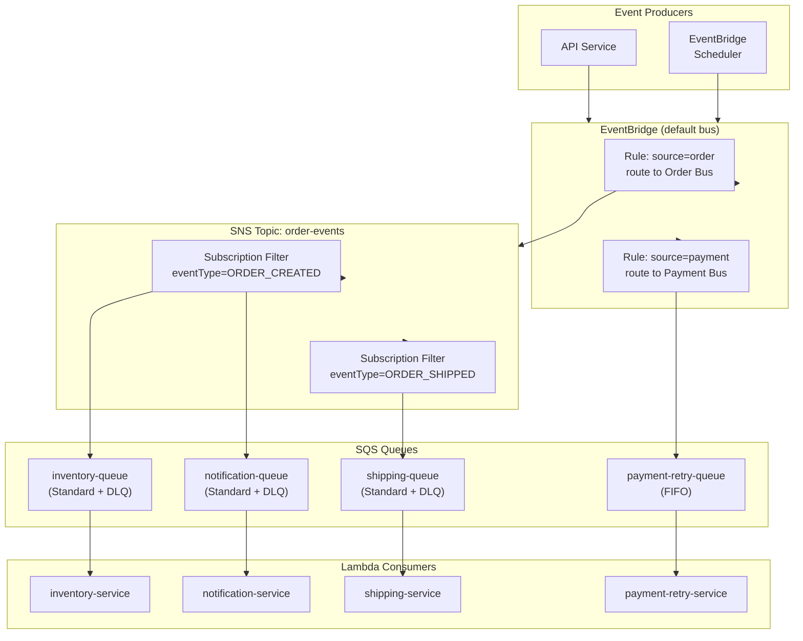

# AWS Messaging — SQS, SNS & EventBridge

## Category
Cloud Native, Messaging, Event-Driven, AWS SQS, SNS, EventBridge

## Context

AWS provides three complementary messaging primitives for decoupling and event-driven architectures:

| Service | Model | Delivery | Use case |
|---------|-------|----------|----------|
| **SQS** | Queue (point-to-point) | Pull (polling) | Work queues, task processing, load levelling |
| **SNS** | Topic (pub/sub fanout) | Push (HTTP, SQS, Lambda, Email) | Broadcast to multiple subscribers |
| **EventBridge** | Event bus (content-based routing) | Push (Lambda, SQS, StepFunctions, API Dest) | Event routing with filtering, scheduling, SaaS integration |

**SQS types**:
| Type | Ordering | Deduplication | Throughput |
|------|---------|---------------|-----------|
| **Standard** | Best-effort | No | Near-unlimited |
| **FIFO** | Strict (per group) | Yes (5-min dedup window) | 3,000 msg/s (with batching) |

**Key SQS patterns**:
- **Visibility timeout**: Message becomes invisible during processing. If not deleted within timeout, it reappears (allows retry on failure). Set to 6× your consumer Lambda timeout.
- **Dead-Letter Queue (DLQ)**: After `maxReceiveCount` failed attempts, messages move to DLQ for inspection.
- **Long polling**: `WaitTimeSeconds=20` reduces empty receive calls and costs.
- **Message batching**: Lambda SQS trigger can batch up to 10,000 messages.

**SNS fanout**:
Classic pattern: one SNS topic with multiple SQS subscribers. Each subscriber gets its own copy. Used for order-of-magnitude scaling of event processing across isolated consumers.

**EventBridge**:
- Content-based routing: route events by source, detail-type, or any field in the event payload.
- Scheduled rules: cron-based or rate-based invocations.
- Schema registry: auto-discover and version event schemas.
- Pipes: point-to-point integrations with filtering, enrichment, and transformation.
- Archive & replay: store all events and replay them for debugging or migration.

**Choosing the right service**:
```
Need guaranteed ordering?    → SQS FIFO
Need fanout to N consumers?  → SNS → SQS (per consumer)
Need content-based routing?  → EventBridge
Need scheduled invocations?  → EventBridge Scheduler
Need retry + DLQ?            → All three support DLQ
```

---

## Pros

- **Fully managed**: No brokers to operate, patch, or size.
- **Infinite scale**: SQS standard handles essentially unlimited throughput.
- **At-least-once delivery**: Guaranteed delivery with visibility timeout mechanism.
- **Decoupling**: Producer and consumer are fully independent.
- **EventBridge Schema Registry**: Centralised event schema governance.
- **Cross-account, cross-region**: Native support for multi-account event routing.

---

## Cons

- **SQS at-least-once**: Messages may be delivered more than once — consumers must be idempotent.
- **FIFO throughput limit**: 3,000 msg/s vs near-unlimited for Standard.
- **No message header inspection in SNS filtering**: Filter must be on message attributes, not body.
- **EventBridge 256 KB payload limit**: Large events require offloading body to S3.
- **SQS message size limit**: 256 KB. Larger payloads need the Claim-Check pattern (S3 reference).
- **EventBridge is eventually consistent**: Cross-region replication has no strict SLA.

---

## Design Diagram



---

## Code Sample

### Terraform — SQS + SNS + EventBridge

```hcl
# infrastructure/terraform/messaging/main.tf

# ─── SNS Topic ───────────────────────────────────────────────────────────────
resource "aws_sns_topic" "order_events" {
  name              = "order-events"
  kms_master_key_id = aws_kms_key.sns.id   # Encryption at rest
}

# ─── SQS Queues with DLQ ─────────────────────────────────────────────────────
locals {
  queues = {
    inventory    = { fifo = false, visibility_timeout = 180 }
    notification = { fifo = false, visibility_timeout = 180 }
    shipping     = { fifo = false, visibility_timeout = 180 }
  }
}

resource "aws_sqs_queue" "dlq" {
  for_each = local.queues

  name                       = "${each.key}-dlq"
  message_retention_seconds  = 1209600   # 14 days
  kms_master_key_id          = aws_kms_key.sqs.id

  tags = { Queue = "${each.key}-dlq" }
}

resource "aws_sqs_queue" "main" {
  for_each = local.queues

  name                       = "${each.key}-queue"
  visibility_timeout_seconds = each.value.visibility_timeout
  message_retention_seconds  = 86400    # 1 day (DLQ holds longer)
  receive_wait_time_seconds  = 20       # Long polling
  kms_master_key_id          = aws_kms_key.sqs.id

  redrive_policy = jsonencode({
    deadLetterTargetArn = aws_sqs_queue.dlq[each.key].arn
    maxReceiveCount     = 3
  })
}

# SQS access policy — allow SNS to send messages
resource "aws_sqs_queue_policy" "allow_sns" {
  for_each  = local.queues
  queue_url = aws_sqs_queue.main[each.key].id

  policy = jsonencode({
    Version = "2012-10-17"
    Statement = [{
      Effect    = "Allow"
      Principal = { Service = "sns.amazonaws.com" }
      Action    = "sqs:SendMessage"
      Resource  = aws_sqs_queue.main[each.key].arn
      Condition = {
        ArnEquals = { "aws:SourceArn" = aws_sns_topic.order_events.arn }
      }
    }]
  })
}

# ─── SNS Subscriptions with Filter Policies ───────────────────────────────────
resource "aws_sns_topic_subscription" "inventory" {
  topic_arn = aws_sns_topic.order_events.arn
  protocol  = "sqs"
  endpoint  = aws_sqs_queue.main["inventory"].arn

  filter_policy = jsonencode({
    eventType = ["ORDER_CREATED", "ORDER_CANCELLED"]
  })

  filter_policy_scope = "MessageAttributes"
}

resource "aws_sns_topic_subscription" "notification" {
  topic_arn = aws_sns_topic.order_events.arn
  protocol  = "sqs"
  endpoint  = aws_sqs_queue.main["notification"].arn
  # No filter — receives all events
}

resource "aws_sns_topic_subscription" "shipping" {
  topic_arn = aws_sns_topic.order_events.arn
  protocol  = "sqs"
  endpoint  = aws_sqs_queue.main["shipping"].arn

  filter_policy = jsonencode({
    eventType = ["ORDER_CONFIRMED", "ORDER_READY_TO_SHIP"]
  })

  filter_policy_scope = "MessageAttributes"
}

# ─── EventBridge ─────────────────────────────────────────────────────────────
resource "aws_cloudwatch_event_rule" "order_events" {
  name        = "route-order-events"
  description = "Route order domain events to SNS"
  event_bus_name = "default"

  event_pattern = jsonencode({
    source      = ["myapp.orders"]
    detail-type = ["OrderCreated", "OrderConfirmed", "OrderShipped", "OrderCancelled"]
  })
}

resource "aws_cloudwatch_event_target" "sns" {
  rule      = aws_cloudwatch_event_rule.order_events.name
  target_id = "SendToSNS"
  arn       = aws_sns_topic.order_events.arn

  # Transform: extract fields from event detail and set as SNS message attributes
  input_transformer {
    input_paths = {
      orderId   = "$.detail.orderId"
      eventType = "$.detail-type"
    }
    input_template = <<EOF
{
  "orderId": "<orderId>",
  "eventType": "<eventType>"
}
EOF
  }
}

# ─── EventBridge Scheduler — nightly report ──────────────────────────────────
resource "aws_scheduler_schedule" "nightly_report" {
  name = "nightly-order-report"

  flexible_time_window {
    mode                      = "FLEXIBLE"
    maximum_window_in_minutes = 15
  }

  schedule_expression          = "cron(0 2 * * ? *)"   # 02:00 UTC daily
  schedule_expression_timezone = "UTC"

  target {
    arn      = aws_lambda_function.report_generator.arn
    role_arn = aws_iam_role.scheduler.arn

    input = jsonencode({
      reportType = "daily-orders"
      date       = "<aws.scheduler.scheduled-time>"
    })

    retry_policy {
      maximum_retry_attempts       = 2
      maximum_event_age_in_seconds = 3600
    }
  }
}
```

### TypeScript — Publishing Events to SNS/EventBridge

```typescript
// src/events/event-publisher.ts
import { SNSClient, PublishCommand, MessageAttributeValue } from '@aws-sdk/client-sns';
import { EventBridgeClient, PutEventsCommand } from '@aws-sdk/client-eventbridge';

const sns = new SNSClient({});
const eb = new EventBridgeClient({});

interface OrderEvent {
  eventType:
    | 'ORDER_CREATED'
    | 'ORDER_CONFIRMED'
    | 'ORDER_SHIPPED'
    | 'ORDER_CANCELLED';
  orderId: string;
  customerId: string;
  total?: number;
  currency?: string;
  timestamp: string;
}

// Publish via EventBridge (preferred for new services — routing flexibility)
export async function publishOrderEventEB(event: OrderEvent): Promise<void> {
  const result = await eb.send(new PutEventsCommand({
    Entries: [{
      EventBusName: 'default',
      Source:       'myapp.orders',
      DetailType:   event.eventType,
      Detail:       JSON.stringify(event),
      Time:         new Date(event.timestamp),
    }],
  }));

  // PutEvents does not throw on partial failure — check each entry
  const failed = result.Entries?.filter(e => e.ErrorCode);
  if (failed?.length) {
    throw new Error(`EventBridge publish failed: ${JSON.stringify(failed)}`);
  }
}

// Publish directly to SNS (simpler, lower latency when EventBridge routing not needed)
export async function publishOrderEventSNS(event: OrderEvent): Promise<void> {
  // Message attributes used for SNS filter policies
  const messageAttributes: Record<string, MessageAttributeValue> = {
    eventType: { DataType: 'String', StringValue: event.eventType },
    customerId: { DataType: 'String', StringValue: event.customerId },
  };

  await sns.send(new PublishCommand({
    TopicArn:          process.env.ORDER_EVENTS_TOPIC_ARN!,
    Message:           JSON.stringify(event),
    MessageAttributes: messageAttributes,
    MessageDeduplicationId: `${event.orderId}-${event.eventType}`, // FIFO topics only
    MessageGroupId:         event.orderId,                          // FIFO topics only
  }));
}
```

### TypeScript — Idempotent SQS Consumer

```typescript
// src/handlers/inventory-consumer.ts
import { SQSEvent, SQSBatchResponse, SQSBatchItemFailure } from 'aws-lambda';
import { DynamoDBClient, PutItemCommand, ConditionalCheckFailedException } from '@aws-sdk/client-dynamodb';
import { marshall } from '@aws-sdk/util-dynamodb';

// Idempotency: record processed message IDs in DynamoDB with TTL
// If a duplicate arrives (SQS at-least-once), the conditional write fails → skip

const dynamo = new DynamoDBClient({});

export const handler = async (event: SQSEvent): Promise<SQSBatchResponse> => {
  const failures: SQSBatchItemFailure[] = [];

  await Promise.all(event.Records.map(async record => {
    try {
      // Mark as processing (idempotency check)
      await dynamo.send(new PutItemCommand({
        TableName: process.env.IDEMPOTENCY_TABLE!,
        Item: marshall({
          messageId: record.messageId,
          processedAt: new Date().toISOString(),
          ttl: Math.floor(Date.now() / 1000) + 24 * 60 * 60, // 24h
        }),
        ConditionExpression: 'attribute_not_exists(messageId)',
      }));

      const body = JSON.parse(record.body);
      const event = JSON.parse(body.Message ?? record.body);

      // Process...
      await reserveInventory(event);
    } catch (err) {
      if (err instanceof ConditionalCheckFailedException) {
        // Duplicate message — already processed, skip silently
        return;
      }
      // Real failure — return to SQS for retry
      failures.push({ itemIdentifier: record.messageId });
    }
  }));

  return { batchItemFailures: failures };
};

async function reserveInventory(event: unknown): Promise<void> {
  // Business logic...
}
```
