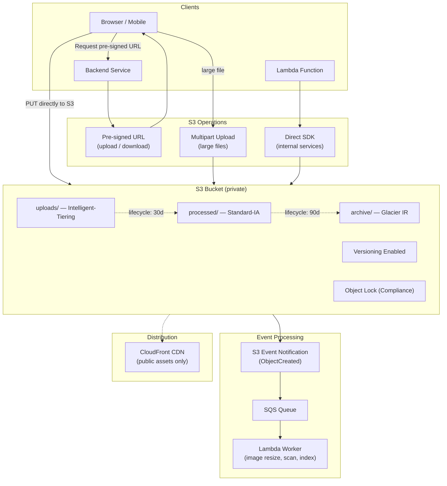

# AWS S3 Storage Patterns

## Category
Cloud Native, Storage, AWS S3, Object Storage

## Context

**Amazon S3 (Simple Storage Service)** is AWS's object storage service — durable (11 nines), highly available, and infinitely scalable. S3 is used for static assets, data lakes, backups, event triggers, large-file uploads, and artifact storage.

**Storage classes** (from hot to cold):
| Class | Access frequency | Retrieval time | Cost |
|-------|------------------|---------------|------|
| **S3 Standard** | Frequent | Immediate | Highest |
| **S3 Intelligent-Tiering** | Unknown / variable | Immediate | Auto-optimises |
| **S3 Standard-IA** | Infrequent | Immediate | Lower storage, higher per-GB retrieval |
| **S3 One Zone-IA** | Infrequent | Immediate | Single AZ, cheapest IA |
| **S3 Glacier Instant Retrieval** | Archive (quarterly) | Milliseconds | Very low |
| **S3 Glacier Flexible Retrieval** | Archive (rare) | Minutes to hours | Near-cheapest |
| **S3 Glacier Deep Archive** | Compliance archive | 12 hours | Cheapest |

**Key patterns**:

| Pattern | Description |
|---------|-------------|
| **Pre-signed URL** | Grant time-limited, scoped access to private objects without exposing credentials |
| **Multipart Upload** | Upload large files (> 100 MB) in parallel parts for reliability and speed |
| **Event Notifications** | S3 events trigger Lambda, SQS, or SNS on object creation/deletion |
| **Lifecycle Rules** | Automatically transition or expire objects based on age or prefix |
| **S3 Access Points** | Named endpoints with access policies — simplify access for large-scale bucket sharing |
| **Replication** | Cross-region (CRR) or same-region (SRR) replication for DR and compliance |
| **Object Lock** | WORM (write-once-read-many) — compliance-grade immutability |
| **Versioning** | Retain previous versions; recover from accidental deletes |

**Security baseline**:
1. Block all public access (account-level setting).
2. Enable SSE-KMS encryption.
3. Enable access logging.
4. Use pre-signed URLs instead of public objects.
5. Use bucket policies (not ACLs — ACLs are legacy).
6. Enable S3 Object Lock for compliance buckets.

---

## Pros

- **Virtually unlimited scale**: No capacity to provision.
- **11 nines durability**: Data redundantly stored across ≥ 3 AZs.
- **Event-driven**: Native integration with Lambda for processing uploaded files immediately.
- **Lifecycle management**: Automate cost optimisation by tiering data to cheaper storage classes.
- **Pre-signed URLs**: Secure, time-limited, client-to-S3 direct upload — offloads bandwidth from your service.
- **Versioning + Object Lock**: Protect against ransomware and accidental deletion.

---

## Cons

- **Eventual consistency for list operations**: `ListObjectsV2` may not immediately reflect newly uploaded objects.
- **No real-time streaming**: Not a message queue; poll-based event triggers only.
- **Cost at egress scale**: Data transfer out of S3 to internet is billed — use CloudFront to cache.
- **Multipart upload cleanup**: Incomplete multipart uploads accumulate costs; lifecycle rules must abort them.
- **Key design**: Object key design affects performance — avoid sequential prefix hotspots (though this is now largely mitigated by S3's automatic partitioning).

---

## Design Diagram



---

## Code Sample

### Terraform — Secure S3 Bucket

```hcl
# infrastructure/terraform/storage/s3.tf

resource "aws_s3_bucket" "uploads" {
  bucket = "myapp-uploads-${var.account_id}-${var.aws_region}"

  # Prevent accidental deletion of non-empty bucket
  force_destroy = false

  tags = {
    Environment = var.environment
    DataClass   = "Internal"
  }
}

# Block all public access — account-level setting overrides bucket level
resource "aws_s3_bucket_public_access_block" "uploads" {
  bucket                  = aws_s3_bucket.uploads.id
  block_public_acls       = true
  block_public_policy     = true
  ignore_public_acls      = true
  restrict_public_buckets = true
}

# Versioning — recover from accidental deletes
resource "aws_s3_bucket_versioning" "uploads" {
  bucket = aws_s3_bucket.uploads.id
  versioning_configuration {
    status = "Enabled"
  }
}

# SSE-KMS encryption
resource "aws_s3_bucket_server_side_encryption_configuration" "uploads" {
  bucket = aws_s3_bucket.uploads.id
  rule {
    apply_server_side_encryption_by_default {
      sse_algorithm     = "aws:kms"
      kms_master_key_id = aws_kms_key.s3.arn
    }
    bucket_key_enabled = true    # Reduces KMS API calls and costs
  }
}

# Lifecycle rules
resource "aws_s3_bucket_lifecycle_configuration" "uploads" {
  bucket = aws_s3_bucket.uploads.id
  # Must have versioning enabled before lifecycle rules on versions
  depends_on = [aws_s3_bucket_versioning.uploads]

  rule {
    id     = "abort-incomplete-multipart"
    status = "Enabled"
    abort_incomplete_multipart_upload {
      days_after_initiation = 7   # Clean up stale multipart uploads
    }
    filter {}
  }

  rule {
    id     = "transition-to-ia"
    status = "Enabled"
    filter { prefix = "uploads/" }
    transition {
      days          = 30
      storage_class = "STANDARD_IA"
    }
    transition {
      days          = 90
      storage_class = "GLACIER_IR"
    }
    expiration {
      days = 365    # Delete after 1 year
    }
    noncurrent_version_expiration {
      noncurrent_days = 30   # Delete old versions after 30 days
    }
  }
}

# Access logging
resource "aws_s3_bucket_logging" "uploads" {
  bucket        = aws_s3_bucket.uploads.id
  target_bucket = aws_s3_bucket.access_logs.id
  target_prefix = "s3-access-logs/uploads/"
}

# Event notifications — trigger processing on upload
resource "aws_s3_bucket_notification" "uploads" {
  bucket = aws_s3_bucket.uploads.id

  queue {
    id            = "notify-upload"
    queue_arn     = aws_sqs_queue.upload_events.arn
    events        = ["s3:ObjectCreated:*"]
    filter_prefix = "uploads/"
    filter_suffix = ".pdf"
  }
}

# Bucket policy — enforce TLS and restrict to VPC endpoint only
resource "aws_s3_bucket_policy" "uploads" {
  bucket = aws_s3_bucket.uploads.id
  policy = jsonencode({
    Version = "2012-10-17"
    Statement = [
      {
        Sid    = "DenyNonTLS"
        Effect = "Deny"
        Principal = "*"
        Action = "s3:*"
        Resource = [
          aws_s3_bucket.uploads.arn,
          "${aws_s3_bucket.uploads.arn}/*"
        ]
        Condition = {
          Bool = { "aws:SecureTransport" = "false" }
        }
      },
      {
        Sid    = "AllowVPCEndpointOnly"
        Effect = "Deny"
        Principal = "*"
        Action = "s3:*"
        Resource = [
          aws_s3_bucket.uploads.arn,
          "${aws_s3_bucket.uploads.arn}/*"
        ]
        Condition = {
          StringNotEquals = {
            "aws:SourceVpce" = aws_vpc_endpoint.s3.id
          }
          StringNotLike = {
            # Allow CodePipeline, Lambda service principals that may not use VPC endpoint
            "aws:PrincipalArn" = [
              "arn:aws:iam::${var.account_id}:role/myapp-*"
            ]
          }
        }
      }
    ]
  })
}
```

### TypeScript — Pre-signed Upload & Download URLs

```typescript
// src/storage/s3-service.ts
import {
  S3Client,
  PutObjectCommand,
  GetObjectCommand,
  HeadObjectCommand,
  DeleteObjectCommand,
} from '@aws-sdk/client-s3';
import { getSignedUrl } from '@aws-sdk/s3-request-presigner';

const s3 = new S3Client({});
const BUCKET = process.env.UPLOADS_BUCKET!;
const MAX_FILE_SIZE = 50 * 1024 * 1024;  // 50 MB

interface PresignedUploadUrl {
  uploadUrl: string;
  key: string;
  expiresIn: number;
}

// Generate pre-signed PUT URL — client uploads directly to S3 (no server bandwidth)
export async function generateUploadUrl(
  userId: string,
  fileName: string,
  contentType: string,
): Promise<PresignedUploadUrl> {
  // Validate content type
  const allowedTypes = ['image/jpeg', 'image/png', 'image/webp', 'application/pdf'];
  if (!allowedTypes.includes(contentType)) {
    throw new Error(`Content type ${contentType} not allowed`);
  }

  // Sanitise file name — never trust user input for S3 keys
  const sanitisedName = fileName.replace(/[^a-zA-Z0-9._-]/g, '_').slice(0, 100);
  const key = `uploads/${userId}/${Date.now()}-${sanitisedName}`;
  const expiresIn = 300;  // 5 minutes

  const command = new PutObjectCommand({
    Bucket:        BUCKET,
    Key:           key,
    ContentType:   contentType,
    // Metadata stored alongside the object
    Metadata: {
      'uploaded-by': userId,
      'original-name': sanitisedName,
    },
  });

  const uploadUrl = await getSignedUrl(s3, command, { expiresIn });

  return { uploadUrl, key, expiresIn };
}

// Generate pre-signed GET URL — time-limited read access for private objects
export async function generateDownloadUrl(
  key: string,
  userId: string,
): Promise<string> {
  // Verify the object belongs to this user (authorisation check)
  if (!key.startsWith(`uploads/${userId}/`)) {
    throw new Error('Access denied');
  }

  // Verify object exists before generating URL
  try {
    await s3.send(new HeadObjectCommand({ Bucket: BUCKET, Key: key }));
  } catch {
    throw new Error('Object not found');
  }

  const command = new GetObjectCommand({
    Bucket: BUCKET,
    Key:    key,
    ResponseContentDisposition: `attachment; filename="${key.split('/').pop()}"`,
  });

  return getSignedUrl(s3, command, { expiresIn: 3600 });  // 1 hour
}

// Multipart upload helper — for files > 100 MB
export async function initiateMultipartUpload(
  key: string,
  contentType: string,
): Promise<{ uploadId: string; urls: string[] }> {
  const {
    CreateMultipartUploadCommand,
    UploadPartCommand,
  } = await import('@aws-sdk/client-s3');

  const { UploadId } = await s3.send(new CreateMultipartUploadCommand({
    Bucket:      BUCKET,
    Key:         key,
    ContentType: contentType,
  }));

  if (!UploadId) throw new Error('Failed to initiate multipart upload');

  // Pre-sign 10 part URLs (each up to 100 MB = 1 GB total)
  const partUrls = await Promise.all(
    Array.from({ length: 10 }, (_, i) =>
      getSignedUrl(s3, new UploadPartCommand({
        Bucket:     BUCKET,
        Key:        key,
        UploadId,
        PartNumber: i + 1,
      }), { expiresIn: 3600 }),
    ),
  );

  return { uploadId: UploadId, urls: partUrls };
}
```
