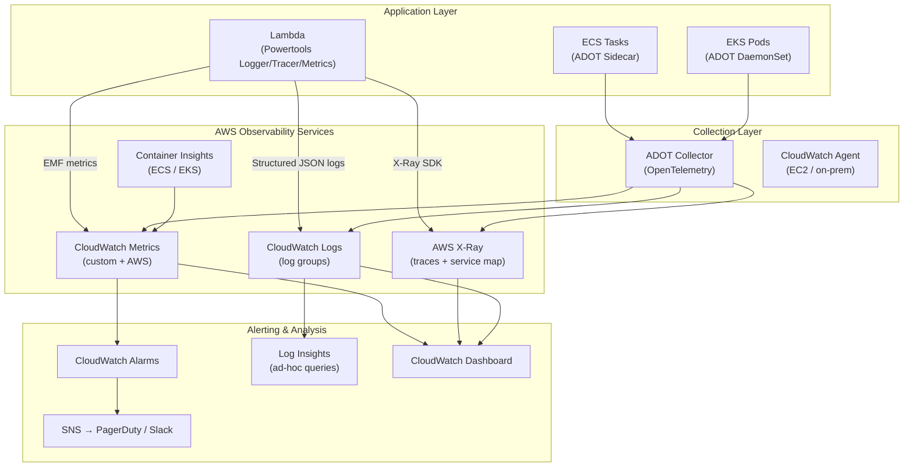

# AWS Observability — CloudWatch, X-Ray & OpenTelemetry

## Category

Cloud Native, Observability, AWS CloudWatch, X-Ray, OpenTelemetry

## Context

**Observability** in AWS combines three pillars — metrics, logs, and traces — to give you full operational visibility into distributed applications. AWS provides native services for each:

| Pillar      | AWS Service        | Open Standard               |
| ----------- | ------------------ | --------------------------- |
| **Metrics** | CloudWatch Metrics | OpenTelemetry (OTLP)        |
| **Logs**    | CloudWatch Logs    | OpenTelemetry Logs          |
| **Traces**  | AWS X-Ray          | OpenTelemetry Traces → ADOT |

**CloudWatch key concepts**:
| Concept | Description |
|---------|-------------|
| **Metric** | Time-series data point (CPUUtilisation, request count, custom business metric) |
| **Log Group** | Logical container for log streams |
| **Log Insight** | CloudWatch Logs query language for log analysis |
| **Alarm** | Trigger on metric threshold → notify SNS, stop EC2, invoke Auto Scaling |
| **Dashboard** | Visualise metrics and alarms on a shared screen |
| **Container Insights** | Enhanced ECS/EKS metrics (pod-level CPU, memory, network) |
| **Lambda Insights** | Enhanced Lambda metrics (init duration, memory usage, cold starts) |

**X-Ray**:

- Distributed tracing — traces requests across Lambda → API Gateway → SQS → Lambda → DynamoDB.
- Service map: auto-generated topology of all services and their error rates/latencies.
- Sampling: configurable to reduce cost (default: 5% of requests + 1 per second reservoir).

**AWS Distro for OpenTelemetry (ADOT)**:

- AWS-managed distribution of the OpenTelemetry Collector.
- Instruments applications once; route telemetry to CloudWatch, X-Ray, or any OTLP-compatible backend (Datadog, Grafana, Jaeger).

**AWS Lambda Powertools for TypeScript**:

- `Logger` — structured JSON logging with correlation IDs, cold start annotation.
- `Tracer` — X-Ray subsegment creation, automatic patching of AWS SDK v3.
- `Metrics` — EMF (Embedded Metrics Format) — publish custom metrics with zero additional API calls.
- `Idempotency` — built-in idempotency with DynamoDB backing.

---

## Pros

- **Fully managed**: No Prometheus/Grafana/Jaeger cluster to run (unless desired).
- **Native AWS integration**: Lambda, ECS, EKS, RDS, ALB — metrics flow automatically.
- **End-to-end traces**: X-Ray traces span Lambda → SQS → Lambda → DynamoDB in one trace.
- **Logs Insights**: SQL-like queries over petabytes of logs in seconds.
- **EMF**: Publish high-cardinality custom metrics from Lambda with no additional API calls.
- **CloudWatch Synthetics**: Canary monitoring — proactively test endpoints globally.

---

## Cons

- **Cost**: CloudWatch costs add up — custom metrics ($0.30/metric/month), logs ingestion ($0.50/GB), dashboards ($3/dashboard/month).
- **Log Insights latency**: Not real-time — logs take 30–60 seconds to appear.
- **X-Ray sampling**: Default sampling misses 95% of requests — increase for debugging but raises cost.
- **No long-term metric storage**: CloudWatch stores high-resolution metrics for 3 hours, standard for 63 days. For longer retention, export to S3 or use Timestream.
- **Vendor lock-in for CloudWatch**: Migrating to Grafana/Datadog requires re-instrumentation unless using OTEL.

---

## Design Diagram



---

## Code Sample

### Lambda Powertools — Structured Logging, Tracing & Metrics

```typescript
// src/handlers/order-handler.ts
import {
  APIGatewayProxyEventV2,
  APIGatewayProxyResultV2,
  Context,
} from "aws-lambda";
import { Logger } from "@aws-lambda-powertools/logger";
import { Tracer } from "@aws-lambda-powertools/tracer";
import { Metrics, MetricUnit } from "@aws-lambda-powertools/metrics";

const logger = new Logger({
  serviceName: "order-service",
  logLevel: (process.env.LOG_LEVEL as any) ?? "INFO",
  persistentLogAttributes: {
    environment: process.env.ENVIRONMENT ?? "unknown",
    version: process.env.SERVICE_VERSION ?? "unknown",
  },
});

const tracer = new Tracer({ serviceName: "order-service" });
// Patches AWS SDK v3 clients to auto-create X-Ray subsegments
tracer.provider.setLogger(logger);

const metrics = new Metrics({
  namespace: "OrderService",
  serviceName: "order-service",
});

export const handler = async (
  event: APIGatewayProxyEventV2,
  context: Context,
): Promise<APIGatewayProxyResultV2> => {
  // Inject Lambda context (requestId, functionName, etc.)
  logger.addContext(context);

  // Add correlation ID from request header (passed through API Gateway)
  const correlationId =
    event.headers?.["x-correlation-id"] ?? context.awsRequestId;
  logger.appendKeys({ correlationId });

  const segment = tracer.getSegment();
  const subsegment = segment?.addNewSubsegment("## handler");

  try {
    logger.info("Received request", {
      method: event.requestContext.http.method,
      path: event.requestContext.http.path,
      caller:
        event.requestContext.authorizer?.jwt?.claims?.["sub"] ?? "anonymous",
    });

    if (!event.body) {
      metrics.addMetric("RequestValidationError", MetricUnit.Count, 1);
      return {
        statusCode: 400,
        body: JSON.stringify({ error: "Body required" }),
      };
    }

    const order = JSON.parse(event.body);

    // Annotate trace with business data (searchable in X-Ray)
    tracer.putAnnotation("orderId", order.orderId ?? "unknown");
    tracer.putAnnotation("customerId", order.customerId ?? "unknown");

    // Add metadata (not indexed, but visible in trace detail)
    tracer.putMetadata("orderItems", order.items);

    const result = await processOrder(order);

    // Publish custom business metrics via EMF
    metrics.addMetric("OrderCreated", MetricUnit.Count, 1);
    metrics.addMetric("OrderValue", MetricUnit.Count, result.total);
    metrics.addDimension("Currency", order.currency ?? "USD");

    logger.info("Order created", {
      orderId: result.orderId,
      total: result.total,
    });

    return {
      statusCode: 201,
      headers: {
        "Content-Type": "application/json",
        "X-Correlation-ID": correlationId,
      },
      body: JSON.stringify(result),
    };
  } catch (err) {
    logger.error("Failed to create order", { err });
    metrics.addMetric("OrderError", MetricUnit.Count, 1);
    tracer.addErrorAsMetadata(err as Error);

    return {
      statusCode: 500,
      body: JSON.stringify({ error: "Internal error" }),
    };
  } finally {
    subsegment?.close();
    metrics.publishStoredMetrics(); // Flush EMF metrics before Lambda returns
  }
};

async function processOrder(
  order: unknown,
): Promise<{ orderId: string; total: number }> {
  // Business logic stub
  return { orderId: "ORD-123", total: 99.99 };
}
```

### Terraform — CloudWatch Alarms & Dashboard

```hcl
# infrastructure/terraform/observability/alarms.tf

# ─── Lambda Error Rate Alarm ─────────────────────────────────────────────────
resource "aws_cloudwatch_metric_alarm" "lambda_error_rate" {
  alarm_name          = "myapp-lambda-error-rate-high"
  alarm_description   = "Lambda error rate > 1% for 5 consecutive minutes"
  comparison_operator = "GreaterThanThreshold"
  evaluation_periods  = 5
  threshold           = 1

  # Use metric math to compute error rate %
  metric_query {
    id = "error_rate"
    expression = "100*(errors/invocations)"
    label       = "Error Rate (%)"
    return_data = true
  }

  metric_query {
    id = "errors"
    metric {
      namespace   = "AWS/Lambda"
      metric_name = "Errors"
      dimensions  = { FunctionName = "myapp-api-handler" }
      period      = 60
      stat        = "Sum"
    }
  }

  metric_query {
    id = "invocations"
    metric {
      namespace   = "AWS/Lambda"
      metric_name = "Invocations"
      dimensions  = { FunctionName = "myapp-api-handler" }
      period      = 60
      stat        = "Sum"
    }
  }

  alarm_actions = [aws_sns_topic.alerts.arn]
  ok_actions    = [aws_sns_topic.alerts.arn]
  treat_missing_data = "notBreaching"
}

# ─── API Latency P99 Alarm ───────────────────────────────────────────────────
resource "aws_cloudwatch_metric_alarm" "api_latency_p99" {
  alarm_name          = "myapp-api-latency-p99-high"
  alarm_description   = "API P99 latency > 2000ms"
  comparison_operator = "GreaterThanThreshold"
  evaluation_periods  = 3
  threshold           = 2000

  metric_name = "IntegrationLatency"
  namespace   = "AWS/ApiGateway"
  dimensions  = {
    ApiId = aws_apigatewayv2_api.main.id
    Stage = "prod"
  }
  period    = 60
  statistic = "p99"
  extended_statistic = "p99"

  alarm_actions = [aws_sns_topic.alerts.arn]
}

# ─── SQS DLQ — message count alarm ──────────────────────────────────────────
resource "aws_cloudwatch_metric_alarm" "dlq_messages" {
  for_each = toset(["inventory", "notification", "shipping"])

  alarm_name          = "myapp-${each.value}-dlq-messages"
  alarm_description   = "Messages in ${each.value} DLQ — review processing failures"
  comparison_operator = "GreaterThanThreshold"
  evaluation_periods  = 1
  threshold           = 0

  metric_name = "ApproximateNumberOfMessagesVisible"
  namespace   = "AWS/SQS"
  dimensions  = { QueueName = "${each.value}-dlq" }
  period      = 60
  statistic   = "Sum"

  alarm_actions = [aws_sns_topic.alerts.arn]
}

# ─── Dashboard ───────────────────────────────────────────────────────────────
resource "aws_cloudwatch_dashboard" "main" {
  dashboard_name = "myapp-${var.environment}"

  dashboard_body = jsonencode({
    widgets = [
      {
        type   = "metric"
        width  = 12
        height = 6
        properties = {
          title  = "API — Requests, Errors, Latency (P50/P95/P99)"
          period = 60
          view   = "timeSeries"
          metrics = [
            ["AWS/ApiGateway", "Count", "ApiId", aws_apigatewayv2_api.main.id, "Stage", "prod"],
            ["AWS/ApiGateway", "5XXError", "ApiId", aws_apigatewayv2_api.main.id, "Stage", "prod"],
            [{ expression = "METRICS(\"latency\")", id = "e1", label = "Latency" }],
            ["AWS/ApiGateway", "IntegrationLatency", "ApiId", aws_apigatewayv2_api.main.id, "Stage", "prod", { id = "latency", visible = false }],
          ]
        }
      },
      {
        type   = "metric"
        width  = 12
        height = 6
        properties = {
          title  = "Lambda — Invocations, Errors, Duration, Cold Starts"
          period = 60
          metrics = [
            ["AWS/Lambda", "Invocations", "FunctionName", "myapp-api-handler"],
            ["AWS/Lambda", "Errors", "FunctionName", "myapp-api-handler"],
            ["AWS/Lambda", "Duration", "FunctionName", "myapp-api-handler", { stat = "p99" }],
            ["AWS/Lambda", "InitDuration", "FunctionName", "myapp-api-handler"],
          ]
        }
      }
    ]
  })
}
```

### CloudWatch Logs Insights — Useful Queries

```sql
-- Find slow Lambda invocations (> 5 seconds)
filter @type = "REPORT" and @duration > 5000
| stats count() as count, avg(@duration) as avg_ms, max(@duration) as max_ms
  by bin(5m)
| sort max_ms desc

-- Error analysis by type
filter level = "ERROR"
| stats count(*) as errorCount by error.name, error.message
| sort errorCount desc
| limit 20

-- Cold start analysis
filter @type = "REPORT" and @initDuration > 0
| stats
    count() as coldStarts,
    avg(@initDuration) as avgInitMs,
    max(@initDuration) as maxInitMs
  by bin(1h)

-- Business metric: order value distribution
filter serviceName = "order-service" and message = "Order created"
| stats
    count() as orders,
    sum(total) as totalRevenue,
    avg(total) as avgOrderValue
  by bin(1h)
```
