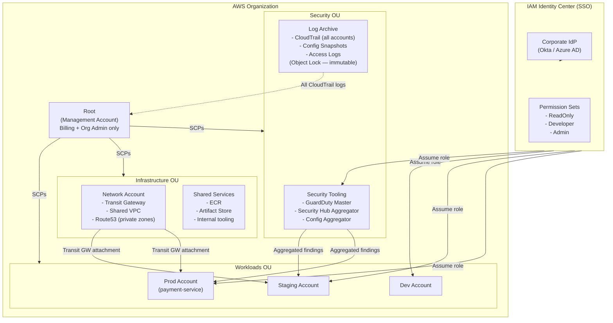

# AWS Multi-Account & Landing Zone Patterns

## Category
Cloud Native, Governance, AWS Organizations, Landing Zone, Control Tower

## Context

**Multi-account strategy** is the foundational AWS governance pattern for enterprises. Rather than running all workloads in a single AWS account, you use separate accounts as the primary isolation boundary — for security, compliance, billing, and blast radius.

**AWS account = security boundary**: IAM policies, SCPs, resource policies, and VPC networking all operate within or across account boundaries. A misconfiguration in one account cannot directly compromise another.

**AWS Organizations**: The service that groups and manages multiple AWS accounts. Provides:
- Consolidated billing (volume discounts, single invoice).
- Service Control Policies (SCPs) — hard limits applied at the OU or account level.
- Delegated administrator — centralise security tooling (GuardDuty, Security Hub, Config) in a dedicated account.

**Standard OU (Organizational Unit) structure**:
```
Root
├── Management (Root) Account — billing, Organizations admin only
├── Security OU
│   ├── Security Tooling Account — GuardDuty master, Security Hub, Config aggregator
│   └── Log Archive Account — immutable CloudTrail + Config logs
├── Infrastructure OU
│   ├── Network Account — Transit Gateway, DNS, shared VPCs
│   └── Shared Services Account — ECR, internal tooling, DNS
├── Workloads OU
│   ├── Production OU
│   │   ├── Prod Account A (e.g. payment-service)
│   │   └── Prod Account B (e.g. order-service)
│   └── Non-Production OU
│       ├── Staging Account A
│       └── Dev Account A
└── Sandbox OU
    └── Developer sandbox accounts (auto-expire, less SCPs)
```

**AWS Control Tower**: AWS's managed Landing Zone service. Automates OU structure, account vending (Account Factory), guardrails (preventive SCPs + detective Config rules), and SSO.

**Account vending**: Automated provisioning of new accounts with baseline config applied — IAM Identity Center SSO access, VPC structure, CloudTrail, mandatory tags, security tooling enrollment.

---

## Pros

- **Blast radius isolation**: A compromised or misconfigured account cannot affect others.
- **Granular cost visibility**: Per-account billing shows which team or product drives cost.
- **SCP guardrails**: Preventive controls applied org-wide — even account root cannot bypass.
- **Regulatory compliance**: Separate account per environment (prod vs dev) satisfies many audit requirements.
- **Service quota isolation**: Lambda concurrency, EC2 limits, etc. — each account has independent quotas.

---

## Cons

- **Operational overhead**: Many accounts = more IAM roles, more Terraform state files, more cross-account complexity.
- **Cross-account networking**: Requires Transit Gateway or VPC peering; adds latency and cost.
- **Tooling complexity**: Cross-account deployment pipelines, cross-account ECR access, cross-account Secrets Manager — all require explicit role trust and policy configuration.
- **Account limits**: Default 10 accounts per organisation (soft limit — can be raised to thousands).
- **Learning curve**: Engineers unfamiliar with cross-account patterns find initial setup challenging.

---

## Design Diagram



---

## Code Sample

### Terraform — AWS Organizations + SCPs

```hcl
# infrastructure/terraform/organization/main.tf

# ─── Organization ─────────────────────────────────────────────────────────────
resource "aws_organizations_organization" "main" {
  aws_service_access_principals = [
    "cloudtrail.amazonaws.com",
    "config.amazonaws.com",
    "guardduty.amazonaws.com",
    "securityhub.amazonaws.com",
    "sso.amazonaws.com",
    "account.amazonaws.com",
  ]

  feature_set = "ALL"   # Required for SCPs and OU policies
  enabled_policy_types = ["SERVICE_CONTROL_POLICY"]
}

# ─── OUs ──────────────────────────────────────────────────────────────────────
resource "aws_organizations_organizational_unit" "security" {
  name      = "Security"
  parent_id = aws_organizations_organization.main.roots[0].id
}

resource "aws_organizations_organizational_unit" "workloads" {
  name      = "Workloads"
  parent_id = aws_organizations_organization.main.roots[0].id
}

resource "aws_organizations_organizational_unit" "production" {
  name      = "Production"
  parent_id = aws_organizations_organizational_unit.workloads.id
}

resource "aws_organizations_organizational_unit" "sandbox" {
  name      = "Sandbox"
  parent_id = aws_organizations_organization.main.roots[0].id
}

# ─── SCPs ─────────────────────────────────────────────────────────────────────
# Baseline SCP — applied at root (all accounts)
resource "aws_organizations_policy" "baseline" {
  name        = "baseline-guardrails"
  description = "Baseline security guardrails for all accounts"
  type        = "SERVICE_CONTROL_POLICY"

  content = jsonencode({
    Version = "2012-10-17"
    Statement = [
      {
        Sid    = "DenyRootUsage"
        Effect = "Deny"
        Action = "*"
        Resource = "*"
        Condition = {
          StringLike = { "aws:PrincipalArn" = "arn:aws:iam::*:root" }
        }
      },
      {
        Sid    = "DenyRegionsOutsideEU"
        Effect = "Deny"
        Action = "*"
        Resource = "*"
        Condition = {
          StringNotEquals = {
            "aws:RequestedRegion" = ["eu-west-1", "eu-central-1", "eu-west-2"]
          }
        }
        # Exception: global services don't use regions
        NotAction = [
          "iam:*", "sts:*", "cloudfront:*",
          "route53:*", "waf:*", "support:*"
        ]
      },
      {
        Sid    = "ProtectSecurityServices"
        Effect = "Deny"
        Action = [
          "cloudtrail:StopLogging",
          "cloudtrail:DeleteTrail",
          "guardduty:DisassociateFromMasterAccount",
          "guardduty:DeleteDetector",
          "config:DeleteConfigurationRecorder",
          "config:StopConfigurationRecorder",
          "securityhub:DisableSecurityHub",
        ]
        Resource = "*"
      },
      {
        Sid    = "RequireIMDSv2"
        Effect = "Deny"
        Action = "ec2:RunInstances"
        Resource = "arn:aws:ec2:*:*:instance/*"
        Condition = {
          StringNotEquals = {
            "ec2:MetadataHttpTokens" = "required"
          }
        }
      }
    ]
  })
}

resource "aws_organizations_policy_attachment" "baseline_root" {
  policy_id = aws_organizations_policy.baseline.id
  target_id = aws_organizations_organization.main.roots[0].id
}

# Sandbox OU SCP — prevent expensive resources
resource "aws_organizations_policy" "sandbox" {
  name = "sandbox-controls"
  type = "SERVICE_CONTROL_POLICY"

  content = jsonencode({
    Version = "2012-10-17"
    Statement = [
      {
        Sid    = "DenyExpensiveResources"
        Effect = "Deny"
        Action = [
          "ec2:RunInstances",             # No large EC2 instances
        ]
        Resource = "arn:aws:ec2:*:*:instance/*"
        Condition = {
          StringNotLike = {
            "ec2:InstanceType" = ["t3.*", "t4g.*", "m5.large", "m6i.large"]
          }
        }
      }
    ]
  })
}

resource "aws_organizations_policy_attachment" "sandbox" {
  policy_id = aws_organizations_policy.sandbox.id
  target_id = aws_organizations_organizational_unit.sandbox.id
}
```

### Account Vending — Terraform Account Factory

```hcl
# infrastructure/terraform/account-factory/main.tf
# Creates new AWS account with baseline configuration

variable "account_name" { type = string }
variable "account_email" { type = string }
variable "ou_id" { type = string }
variable "environment" {
  type    = string
  default = "dev"
}

resource "aws_organizations_account" "new" {
  name      = var.account_name
  email     = var.account_email
  parent_id = var.ou_id

  # Delegate IAM admin to the org management account role
  role_name = "OrganizationAccountAccessRole"

  lifecycle {
    ignore_changes = [role_name]    # AWS sets this; prevent drift
  }
}

# Cross-account provider to deploy baseline resources
provider "aws" {
  alias = "new_account"
  assume_role {
    role_arn = "arn:aws:iam::${aws_organizations_account.new.id}:role/OrganizationAccountAccessRole"
  }
}

# Baseline: enable CloudTrail
resource "aws_cloudtrail" "baseline" {
  provider                      = aws.new_account
  name                          = "org-trail"
  s3_bucket_name                = "org-cloudtrail-logs-${var.log_archive_account_id}"
  include_global_service_events = true
  is_multi_region_trail         = true
  enable_log_file_validation    = true

  tags = { ManagedBy = "terraform", Environment = var.environment }
}

# Baseline: enable GuardDuty (member)
resource "aws_guardduty_detector" "baseline" {
  provider = aws.new_account
  enable   = true
}

resource "aws_guardduty_member" "new" {
  account_id  = aws_organizations_account.new.id
  detector_id = var.guardduty_master_detector_id
  email       = var.account_email
  invite      = true
}
```

### Cross-Account Role Assumption — CI/CD Deploy

```yaml
# .github/workflows/deploy-multi-account.yml
name: Deploy (Multi-Account)

on:
  push:
    branches: [main]

permissions:
  id-token: write
  contents: read

jobs:
  deploy-staging:
    name: Deploy → Staging
    runs-on: ubuntu-latest
    environment: staging
    steps:
      - uses: actions/checkout@v4
      - name: Assume Staging Deploy Role (OIDC)
        uses: aws-actions/configure-aws-credentials@v4
        with:
          role-to-assume: arn:aws:iam::111122223333:role/GitHubActionsDeployRole
          aws-region: eu-west-1

      - name: Deploy to staging account
        run: |
          cd infrastructure/terraform/environments/staging
          terraform init -backend-config="bucket=tfstate-staging-111122223333"
          terraform apply -auto-approve

  deploy-production:
    name: Deploy → Production
    needs: [deploy-staging]
    runs-on: ubuntu-latest
    environment: production   # Requires manual approval in GitHub

    steps:
      - uses: actions/checkout@v4
      - name: Assume Production Deploy Role (OIDC)
        uses: aws-actions/configure-aws-credentials@v4
        with:
          role-to-assume: arn:aws:iam::444455556666:role/GitHubActionsDeployRole
          aws-region: eu-west-1

      - name: Deploy to production account
        run: |
          cd infrastructure/terraform/environments/production
          terraform init -backend-config="bucket=tfstate-prod-444455556666"
          terraform apply -auto-approve
```
