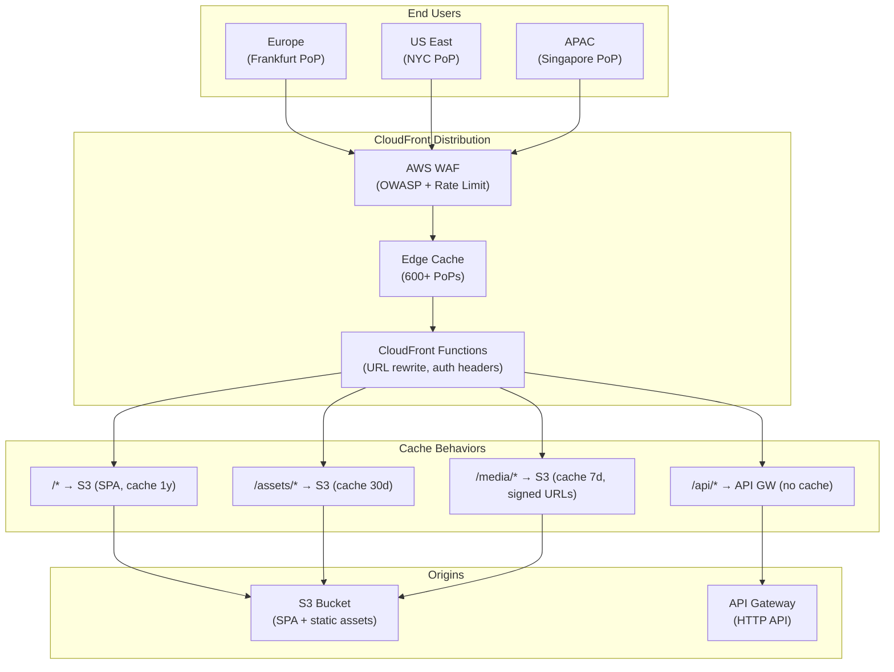

# AWS CloudFront & CDN Patterns

## Category
Cloud Native, Networking, AWS CloudFront, CDN, Edge Computing

## Context

**Amazon CloudFront** is AWS's global Content Delivery Network (CDN) with 600+ edge locations worldwide. It caches and delivers content from the edge closest to each user, dramatically reducing latency for static assets, APIs, and media.

**CloudFront distributions** have two origin types:
- **S3 Origin**: Static assets, SPAs, media files. Delivery at edge via cache.
- **Custom Origin**: ALB, API Gateway, or any HTTP endpoint. Caches API responses; can also proxy without caching.

**Key CloudFront concepts**:
| Concept | Description |
|---------|-------------|
| **Distribution** | A CloudFront endpoint (d123.cloudfront.net or custom domain) |
| **Origin** | The source — S3, ALB, API Gateway, custom HTTP |
| **Cache Behavior** | Path-pattern rules for caching, origin, TTL, headers |
| **OAC (Origin Access Control)** | Restrict S3 access to CloudFront only (replaces legacy OAI) |
| **Cache Policy** | Controls which headers/cookies/query params are part of cache key |
| **Origin Request Policy** | Controls which headers/cookies/params are forwarded to origin |
| **CloudFront Functions** | Lightweight JS executed at edge (< 1ms) — URL rewrites, A/B testing |
| **Lambda@Edge** | Full Node.js at edge (up to 5s) — authentication, response transformation |
| **Field-Level Encryption** | Encrypt specific fields (credit card number) at edge before reaching origin |
| **Signed URLs / Cookies** | Time-limited access to private content |

**Cache invalidation**:
- Never invalidate frequently — it costs $5/1,000 paths (first 1,000/month free).
- Use cache-busting via content hash in file names (`app.a3f9d1.js`).
- Use versioned paths for APIs (`/api/v2/orders`).

**CloudFront + WAF**:
- Associate AWS WAF at the CloudFront layer for global DDoS protection and OWASP rule enforcement.
- WAF rules execute at the edge before traffic reaches your origin.

---

## Pros

- **Global low latency**: Serves from nearest of 600+ edge locations.
- **Cost reduction**: Reduces origin bandwidth and load (cache hits = $0 origin calls).
- **DDoS resilience**: AWS Shield Standard included; absorbs volumetric attacks at edge.
- **HTTPS everywhere**: Free ACM certificates, automatic HTTP→HTTPS redirect.
- **Lambda@Edge**: Run code at edge — authentication, personalisation, A/B testing — without round-trip to origin.
- **Real-time logs**: Stream edge request logs to Kinesis Data Streams for real-time analysis.

---

## Cons

- **Cache invalidation complexity**: Cache-busting strategy required for correct asset versioning.
- **Lambda@Edge limits**: Max 5 s for origin request/response functions; 1 MB response size; no VPC access.
- **Price for dynamic content**: If every request misses cache, you pay both CloudFront price and origin egress.
- **Debugging edge behavior**: Harder to debug cache misses, header forwarding bugs, CloudFront Functions errors.
- **Regional limitation for Lambda@Edge**: Must deploy in us-east-1; replicated globally automatically.

---

## Design Diagram



---

## Code Sample

### Terraform — CloudFront SPA + API Distribution

```hcl
# infrastructure/terraform/cdn/cloudfront.tf

# ─── ACM Certificate (must be in us-east-1 for CloudFront) ──────────────────
provider "aws" {
  alias  = "us_east_1"
  region = "us-east-1"
}

resource "aws_acm_certificate" "cdn" {
  provider          = aws.us_east_1
  domain_name       = "myapp.example.com"
  validation_method = "DNS"

  subject_alternative_names = ["www.myapp.example.com"]

  lifecycle {
    create_before_destroy = true
  }
}

# ─── S3 Bucket for SPA ─────────────────────────────────────────────────────
resource "aws_s3_bucket" "spa" {
  bucket = "myapp-spa-${var.account_id}"
}

resource "aws_s3_bucket_public_access_block" "spa" {
  bucket                  = aws_s3_bucket.spa.id
  block_public_acls       = true
  block_public_policy     = true
  ignore_public_acls      = true
  restrict_public_buckets = true
}

# OAC — CloudFront can read S3; direct S3 access is blocked
resource "aws_cloudfront_origin_access_control" "spa" {
  name                              = "myapp-spa-oac"
  origin_access_control_origin_type = "s3"
  signing_behavior                  = "always"
  signing_protocol                  = "sigv4"
}

resource "aws_s3_bucket_policy" "spa" {
  bucket = aws_s3_bucket.spa.id
  policy = jsonencode({
    Version = "2012-10-17"
    Statement = [{
      Sid    = "AllowCloudFrontOAC"
      Effect = "Allow"
      Principal = {
        Service = "cloudfront.amazonaws.com"
      }
      Action   = "s3:GetObject"
      Resource = "${aws_s3_bucket.spa.arn}/*"
      Condition = {
        StringEquals = {
          "AWS:SourceArn" = aws_cloudfront_distribution.main.arn
        }
      }
    }]
  })
}

# ─── Cache Policies ──────────────────────────────────────────────────────────
# Immutable assets — cache for 1 year
resource "aws_cloudfront_cache_policy" "immutable" {
  name        = "immutable-assets"
  default_ttl = 31536000
  max_ttl     = 31536000
  min_ttl     = 0

  parameters_in_cache_key_and_forwarded_to_origin {
    cookies_config { cookie_behavior = "none" }
    headers_config { header_behavior = "none" }
    query_strings_config { query_string_behavior = "none" }
    enable_accept_encoding_brotli = true
    enable_accept_encoding_gzip   = true
  }
}

# API — no caching (always fetch from origin)
data "aws_cloudfront_cache_policy" "no_cache" {
  name = "Managed-CachingDisabled"
}

data "aws_cloudfront_origin_request_policy" "all_viewer" {
  name = "Managed-AllViewer"
}

# ─── CloudFront Distribution ─────────────────────────────────────────────────
resource "aws_cloudfront_distribution" "main" {
  enabled             = true
  is_ipv6_enabled     = true
  price_class         = "PriceClass_100"  # US + Europe only
  aliases             = ["myapp.example.com", "www.myapp.example.com"]
  http_version        = "http2and3"
  default_root_object = "index.html"

  # S3 origin for SPA
  origin {
    domain_name              = aws_s3_bucket.spa.bucket_regional_domain_name
    origin_id                = "spa-s3"
    origin_access_control_id = aws_cloudfront_origin_access_control.spa.id
  }

  # API Gateway origin
  origin {
    domain_name = replace(aws_apigatewayv2_api.main.api_endpoint, "https://", "")
    origin_id   = "api-gateway"

    custom_origin_config {
      http_port              = 80
      https_port             = 443
      origin_protocol_policy = "https-only"
      origin_ssl_protocols   = ["TLSv1.2"]
    }

    custom_header {
      name  = "x-api-key"
      value = var.api_gateway_key   # Hidden from client — added by CloudFront
    }
  }

  # Default behavior — SPA (HTML, JS, CSS)
  default_cache_behavior {
    target_origin_id       = "spa-s3"
    viewer_protocol_policy = "redirect-to-https"
    allowed_methods        = ["GET", "HEAD"]
    cached_methods         = ["GET", "HEAD"]
    compress               = true
    cache_policy_id        = aws_cloudfront_cache_policy.immutable.id

    function_association {
      event_type   = "viewer-request"
      function_arn = aws_cloudfront_function.spa_router.arn
    }
  }

  # API behavior — no caching
  ordered_cache_behavior {
    path_pattern           = "/api/*"
    target_origin_id       = "api-gateway"
    viewer_protocol_policy = "redirect-to-https"
    allowed_methods        = ["DELETE", "GET", "HEAD", "OPTIONS", "PATCH", "POST", "PUT"]
    cached_methods         = ["GET", "HEAD"]
    compress               = true
    cache_policy_id        = data.aws_cloudfront_cache_policy.no_cache.id
    origin_request_policy_id = data.aws_cloudfront_origin_request_policy.all_viewer.id
  }

  # Static assets (immutable, content-hashed filenames)
  ordered_cache_behavior {
    path_pattern           = "/assets/*"
    target_origin_id       = "spa-s3"
    viewer_protocol_policy = "redirect-to-https"
    allowed_methods        = ["GET", "HEAD"]
    cached_methods         = ["GET", "HEAD"]
    compress               = true
    cache_policy_id        = aws_cloudfront_cache_policy.immutable.id
  }

  viewer_certificate {
    acm_certificate_arn      = aws_acm_certificate.cdn.arn
    ssl_support_method       = "sni-only"
    minimum_protocol_version = "TLSv1.2_2021"
  }

  web_acl_id = aws_wafv2_web_acl.cdn.arn

  # SPA fallback — 404 → index.html (React/Vue routing)
  custom_error_response {
    error_code            = 403
    response_code         = 200
    response_page_path    = "/index.html"
    error_caching_min_ttl = 0
  }

  restrictions {
    geo_restriction {
      restriction_type = "none"
    }
  }

  logging_config {
    bucket          = aws_s3_bucket.cdn_logs.bucket_domain_name
    prefix          = "cloudfront/"
    include_cookies = false
  }
}

# ─── CloudFront Function — SPA Router ────────────────────────────────────────
resource "aws_cloudfront_function" "spa_router" {
  name    = "spa-router"
  runtime = "cloudfront-js-2.0"
  comment = "Rewrite clean URLs for SPA routing"
  publish = true

  code = <<-EOF
    async function handler(event) {
      const request = event.request;
      const uri = request.uri;

      // Forward file requests with extensions as-is
      if (/\.[a-zA-Z0-9]+$/.test(uri)) {
        return request;
      }

      // Rewrite all clean URLs to index.html for SPA client-side routing
      request.uri = '/index.html';
      return request;
    }
  EOF
}
```

### GitHub Actions — Deploy SPA to S3 + Invalidate CloudFront

```yaml
# .github/workflows/deploy-spa.yml
name: Deploy SPA

on:
  push:
    branches: [main]
    paths:
      - 'frontend/**'

permissions:
  id-token: write
  contents: read

jobs:
  deploy:
    runs-on: ubuntu-latest
    steps:
      - uses: actions/checkout@v4

      - uses: actions/setup-node@v4
        with:
          node-version: '20'
          cache: 'npm'
          cache-dependency-path: frontend/package-lock.json

      - name: Build SPA
        working-directory: frontend
        run: |
          npm ci
          npm run build          # Output to frontend/dist/

      - name: Configure AWS (OIDC)
        uses: aws-actions/configure-aws-credentials@v4
        with:
          role-to-assume: ${{ secrets.AWS_DEPLOY_ROLE_ARN }}
          aws-region: eu-west-1

      - name: Sync to S3
        run: |
          # Hash-named assets — cache forever
          aws s3 sync frontend/dist/assets/ \
            s3://${{ vars.SPA_BUCKET }}/assets/ \
            --cache-control "public, max-age=31536000, immutable" \
            --delete

          # HTML files — no cache (always fetch latest)
          aws s3 sync frontend/dist/ \
            s3://${{ vars.SPA_BUCKET }}/ \
            --exclude "assets/*" \
            --cache-control "no-cache, no-store, must-revalidate" \
            --delete

      - name: Invalidate CloudFront (HTML only)
        run: |
          aws cloudfront create-invalidation \
            --distribution-id ${{ vars.CLOUDFRONT_DISTRIBUTION_ID }} \
            --paths "/*.html" "/index.html"
```
