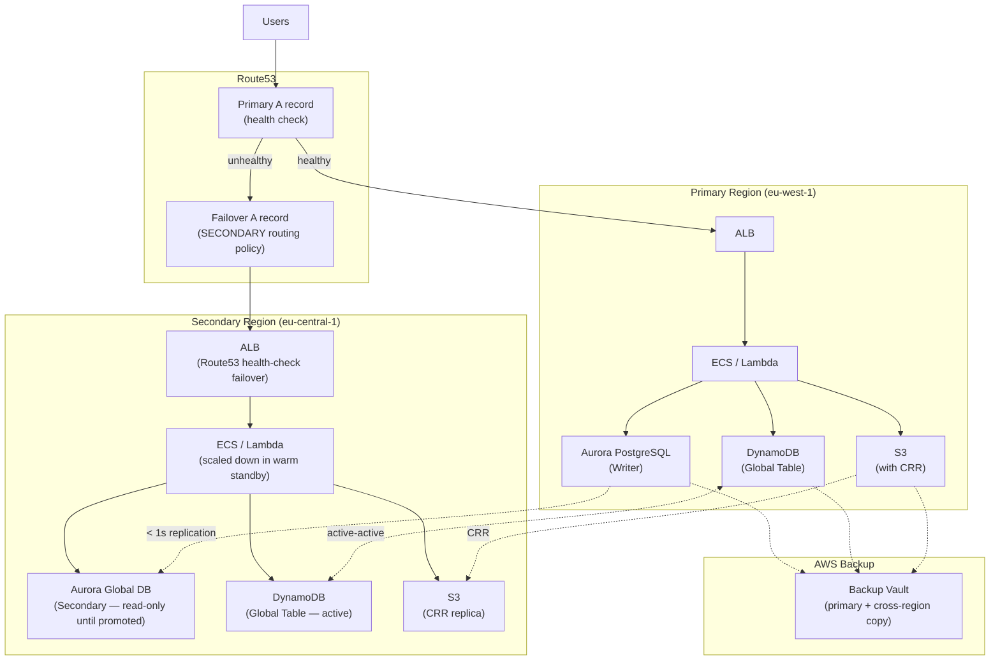

# AWS Disaster Recovery Patterns

## Category
Cloud Native, Resilience, Disaster Recovery, AWS Multi-Region

## Context

**Disaster Recovery (DR)** is the capability to recover from a catastrophic failure — an entire AWS region going down, mass data corruption, or a ransomware attack — within defined time objectives.

**Two key metrics**:
| Metric | Definition |
|--------|------------|
| **RTO** (Recovery Time Objective) | Maximum acceptable duration of downtime — how quickly must you recover? |
| **RPO** (Recovery Point Objective) | Maximum acceptable data loss — how old can your backup be? |

**Four DR strategies** (AWS Well-Architected):

| Strategy | RTO | RPO | Cost | Description |
|----------|-----|-----|------|-------------|
| **Backup & Restore** | Hours | Hours | Lowest | Back up to S3/Glacier; restore from scratch on failure |
| **Pilot Light** | 10–30 min | Minutes | Low | Minimal core components always running in secondary region |
| **Warm Standby** | 1–5 min | Seconds–minutes | Medium | Scaled-down version of production running in secondary region |
| **Multi-Site Active/Active** | Seconds | Near-zero | Highest | Full production in ≥ 2 regions; traffic split across regions |

**Choosing a strategy**:
```
RTO/RPO > 4 hours → Backup & Restore
RTO 30 min, RPO 15 min → Pilot Light
RTO 5 min, RPO 1 min → Warm Standby
RTO seconds, RPO ~0 → Active/Active
```

**Key AWS services for DR**:
| Service | DR role |
|---------|---------|
| **S3 Cross-Region Replication** | Async replication of objects to secondary region |
| **Aurora Global Database** | Cross-region Aurora cluster; < 1 s replication lag; < 1 min failover |
| **DynamoDB Global Tables** | Multi-region active-active with < 1 s replication |
| **Route53** | DNS-based failover; health checks route traffic to healthy region |
| **AWS Backup** | Centralised backup policy across EC2, RDS, DynamoDB, EFS, S3 |
| **CloudFormation / Terraform** | Recreate infrastructure from code in seconds |

---

## Pros

- **AWS infrastructure-as-code**: Recreating infrastructure in a new region is scripted, not manual.
- **Aurora Global**: Near-zero RPO with managed replication — < 1 s.
- **DynamoDB Global Tables**: Native active-active with no application changes.
- **Route53 health checks**: Automatic DNS failover without manual intervention.
- **AWS Backup**: Centralised, policy-driven backup with cross-region copy.

---

## Cons

- **Active/active cost**: Running full production in two regions doubles infrastructure cost.
- **Data synchronisation complexity**: Ensuring consistency across regions for writes is hard.
- **Aurora Global failover**: Managed promotion of secondary cluster takes 1–2 minutes.
- **Testing discipline**: DR plans that are never tested often fail at the critical moment.
- **Egress cost**: Cross-region data transfer is more expensive than within-region.

---

## Design Diagram



---

## Code Sample

### Terraform — Aurora Global Database + Route53 Failover

```hcl
# infrastructure/terraform/dr/aurora-global.tf

# ─── Aurora Global Cluster ────────────────────────────────────────────────────
resource "aws_rds_global_cluster" "main" {
  global_cluster_identifier = "myapp-global"
  engine                    = "aurora-postgresql"
  engine_version            = "16.2"
  database_name             = "myapp"
  storage_encrypted         = true
  deletion_protection       = true
}

# ─── Primary region cluster (eu-west-1) ──────────────────────────────────────
provider "aws" {
  alias  = "primary"
  region = "eu-west-1"
}

resource "aws_rds_cluster" "primary" {
  provider = aws.primary

  cluster_identifier        = "myapp-primary"
  engine                    = aws_rds_global_cluster.main.engine
  engine_version            = aws_rds_global_cluster.main.engine_version
  global_cluster_identifier = aws_rds_global_cluster.main.id
  master_username           = "myapp_admin"

  manage_master_user_password   = true
  db_subnet_group_name          = aws_db_subnet_group.primary.name
  vpc_security_group_ids        = [aws_security_group.aurora_primary.id]
  backup_retention_period       = 14
  storage_encrypted             = true
  deletion_protection           = true
  skip_final_snapshot           = false
  final_snapshot_identifier     = "myapp-primary-final"
  enabled_cloudwatch_logs_exports = ["postgresql"]
}

resource "aws_rds_cluster_instance" "primary_writer" {
  provider           = aws.primary
  cluster_identifier = aws_rds_cluster.primary.id
  instance_class     = "db.serverless"
  engine             = aws_rds_cluster.primary.engine
  engine_version     = aws_rds_cluster.primary.engine_version

  serverlessv2_scaling_configuration {
    min_capacity = 0.5
    max_capacity = 16
  }
}

# ─── Secondary region cluster (eu-central-1) ─────────────────────────────────
provider "aws" {
  alias  = "secondary"
  region = "eu-central-1"
}

resource "aws_rds_cluster" "secondary" {
  provider = aws.secondary

  cluster_identifier        = "myapp-secondary"
  engine                    = aws_rds_global_cluster.main.engine
  engine_version            = aws_rds_global_cluster.main.engine_version
  global_cluster_identifier = aws_rds_global_cluster.main.id

  db_subnet_group_name   = aws_db_subnet_group.secondary.name
  vpc_security_group_ids = [aws_security_group.aurora_secondary.id]
  storage_encrypted      = true
  deletion_protection    = true
  skip_final_snapshot    = false
  final_snapshot_identifier = "myapp-secondary-final"

  # Secondary cluster — read-only until promoted (managed failover)
  depends_on = [aws_rds_cluster_instance.primary_writer]
}

resource "aws_rds_cluster_instance" "secondary_reader" {
  provider           = aws.secondary
  cluster_identifier = aws_rds_cluster.secondary.id
  instance_class     = "db.serverless"
  engine             = aws_rds_cluster.secondary.engine
  engine_version     = aws_rds_cluster.secondary.engine_version

  serverlessv2_scaling_configuration {
    min_capacity = 0.5
    max_capacity = 8    # Lower max in secondary (warm standby)
  }
}

# ─── DynamoDB Global Tables ───────────────────────────────────────────────────
resource "aws_dynamodb_table" "global" {
  provider = aws.primary

  name             = "myapp"
  billing_mode     = "PAY_PER_REQUEST"
  hash_key         = "pk"
  range_key        = "sk"
  stream_enabled   = true
  stream_view_type = "NEW_AND_OLD_IMAGES"

  attribute { name = "pk" type = "S" }
  attribute { name = "sk" type = "S" }

  point_in_time_recovery { enabled = true }
  server_side_encryption { enabled = true }

  # Add secondary region as a replica
  replica {
    region_name = "eu-central-1"
  }
}

# ─── Route53 Failover Routing ─────────────────────────────────────────────────
resource "aws_route53_health_check" "primary" {
  fqdn              = aws_lb.primary.dns_name
  port              = 443
  type              = "HTTPS"
  resource_path     = "/health"
  failure_threshold = 3
  request_interval  = 10    # Fast health checks

  tags = { Name = "primary-health-check" }
}

resource "aws_route53_record" "primary" {
  zone_id = aws_route53_zone.main.zone_id
  name    = "api.myapp.example.com"
  type    = "A"

  failover_routing_policy {
    type = "PRIMARY"
  }

  set_identifier  = "primary"
  health_check_id = aws_route53_health_check.primary.id

  alias {
    name                   = aws_lb.primary.dns_name
    zone_id                = aws_lb.primary.zone_id
    evaluate_target_health = true
  }
}

resource "aws_route53_record" "secondary" {
  zone_id = aws_route53_zone.main.zone_id
  name    = "api.myapp.example.com"
  type    = "A"

  failover_routing_policy {
    type = "SECONDARY"
  }

  set_identifier = "secondary"
  # No health check on secondary — always failover target

  alias {
    name                   = aws_lb.secondary.dns_name
    zone_id                = aws_lb.secondary.zone_id
    evaluate_target_health = true
  }
}
```

### AWS Backup — Cross-Region Backup Policy

```hcl
# infrastructure/terraform/dr/aws-backup.tf

resource "aws_backup_vault" "primary" {
  name        = "myapp-primary-vault"
  kms_key_arn = aws_kms_key.backup.arn
}

resource "aws_backup_vault" "secondary" {
  provider    = aws.secondary
  name        = "myapp-dr-vault"
  kms_key_arn = aws_kms_key.backup_secondary.arn
}

resource "aws_backup_plan" "main" {
  name = "myapp-backup-plan"

  rule {
    rule_name         = "daily-backup"
    target_vault_name = aws_backup_vault.primary.name
    schedule          = "cron(0 1 * * ? *)"   # 01:00 UTC daily

    lifecycle {
      delete_after = 35    # Retain 35 days in primary
    }

    # Copy to secondary region for DR
    copy_action {
      destination_vault_arn = aws_backup_vault.secondary.arn
      lifecycle {
        delete_after = 90  # Retain 90 days in DR vault
      }
    }
  }

  rule {
    rule_name         = "monthly-archive"
    target_vault_name = aws_backup_vault.primary.name
    schedule          = "cron(0 2 1 * ? *)"   # 02:00 UTC on 1st of month

    lifecycle {
      cold_storage_after = 30     # Move to Glacier after 30 days
      delete_after       = 365    # Retain 1 year total
    }
  }
}

resource "aws_backup_selection" "main" {
  name         = "myapp-resources"
  plan_id      = aws_backup_plan.main.id
  iam_role_arn = aws_iam_role.aws_backup.arn

  resources = [
    aws_rds_cluster.primary.arn,
    "arn:aws:dynamodb:eu-west-1:${var.account_id}:table/myapp",
    aws_s3_bucket.uploads.arn,
    aws_efs_file_system.shared.arn,
  ]
}
```

### Runbook — Automated Failover Script

```typescript
// scripts/dr-failover.ts
// Run this during a DR event to promote secondary Aurora cluster

import { RDSClient, FailoverGlobalClusterCommand } from '@aws-sdk/client-rds';
import { Route53Client, ChangeResourceRecordSetsCommand } from '@aws-sdk/client-route-53';

async function executeFailover(): Promise<void> {
  console.log('🚨 Starting DR failover...');

  // 1. Promote Aurora secondary cluster
  const rds = new RDSClient({ region: 'eu-central-1' });
  await rds.send(new FailoverGlobalClusterCommand({
    GlobalClusterIdentifier: 'myapp-global',
    TargetDbClusterIdentifier: 'arn:aws:rds:eu-central-1:123456789012:cluster:myapp-secondary',
  }));
  console.log('✅ Aurora failover initiated — secondary being promoted (expect 1–2 min)');

  // 2. Update ECS service in secondary to full capacity
  const { ECSClient, UpdateServiceCommand } = await import('@aws-sdk/client-ecs');
  const ecs = new ECSClient({ region: 'eu-central-1' });
  await ecs.send(new UpdateServiceCommand({
    cluster: 'myapp-cluster-secondary',
    service:  'myapp-api',
    desiredCount: 4,     // Scale up from warm standby
  }));
  console.log('✅ ECS service scaled to full capacity in secondary region');

  console.log('ℹ️  Route53 health checks will automatically detect primary failure');
  console.log('ℹ️  DNS failover to secondary will complete within 30–60 seconds');
}

executeFailover().catch(err => {
  console.error('❌ Failover script failed:', err);
  process.exit(1);
});
```
