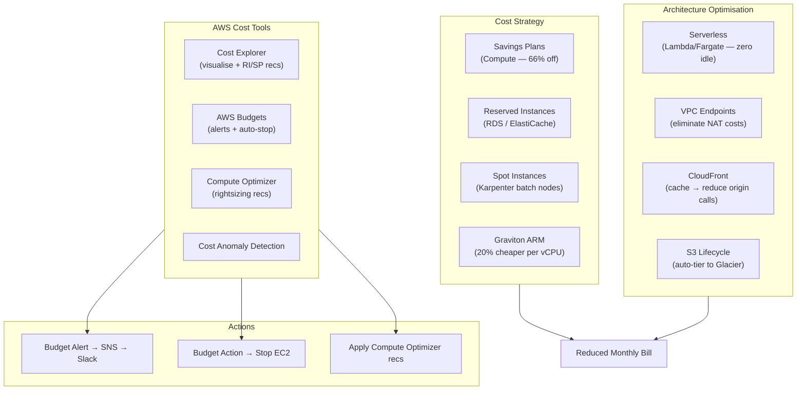

# AWS Cost Optimisation Patterns

## Category
Cloud Native, FinOps, Cost Optimisation, AWS Cost Management

## Context

**Cloud cost optimisation** (FinOps) is a continuous practice of reducing cloud spend while maintaining performance and reliability. AWS provides a rich set of pricing models, native tools, and architectural patterns to control costs.

**AWS pricing models**:
| Model | Discount | Commitment | Best for |
|-------|----------|------------|---------|
| **On-Demand** | 0% | None | Unpredictable workloads, short-term |
| **Savings Plans (Compute)** | Up to 66% | 1 or 3 year | General compute (Lambda, Fargate, EC2 family-flexible) |
| **Savings Plans (EC2 Instance)** | Up to 72% | 1 or 3 year | Stable EC2, specific family+region |
| **Reserved Instances** | Up to 72% | 1 or 3 year | RDS, ElastiCache, Redshift |
| **Spot Instances** | Up to 90% | None (interruptible) | Batch, stateless, fault-tolerant workloads |
| **Graviton (ARM)** | ~20% cheaper | None | Any workload that runs on ARM |

**Five pillars of cost optimisation** (Well-Architected):
1. **Right-sizing**: Match instance/service size to actual resource needs.
2. **Pricing model**: Use Savings Plans and Reserved Instances for steady-state.
3. **Architecture**: Serverless and managed services eliminate idle resource cost.
4. **Data transfer**: Minimise cross-AZ, cross-region, and internet egress costs.
5. **Lifecycle management**: Auto-expire objects, snapshots, and unused resources.

**Key cost levers by service**:
| Service | Cost lever |
|---------|-----------|
| EC2 | Graviton, Savings Plans, right-size, Spot for batch |
| Lambda | Right-size memory (more memory = faster = same cost or cheaper) |
| RDS/Aurora | Reserved Instances, Aurora Serverless v2 for variable load |
| EKS | Karpenter (Spot + right-sized nodes), cluster auto-scaling |
| S3 | Intelligent-Tiering, lifecycle rules, S3 Glacier for archives |
| NAT Gateway | VPC Endpoints for AWS service traffic; consolidate AZs in dev |
| CloudFront | Reduces origin bandwidth; cache hit rate is key metric |
| Data Transfer | Same-AZ traffic is free; cross-AZ is $0.01/GB; minimize it |

**AWS Cost Management tools**:
- **AWS Cost Explorer**: Visualise and analyse spend by service, region, tag.
- **AWS Budgets**: Set spend/usage thresholds and trigger alerts or actions.
- **AWS Cost Anomaly Detection**: ML-based anomaly alerts.
- **Compute Optimizer**: Recommends right-sized EC2, Lambda, ECS, Auto Scaling.
- **Trusted Advisor**: Identifies over-provisioned resources, idle instances, unused EIPs.
- **Cost Allocation Tags**: Tag resources by team/product for chargebacks.

---

## Pros

- **Spot savings up to 90%**: Critical for CI/CD runners, batch processing, training pipelines.
- **Savings Plans flexibility**: Compute SP covers EC2, Lambda, Fargate with region/family flexibility.
- **Graviton**: ARM instances cost ~20% less than equivalent x86 with equal or better performance.
- **Serverless eliminates idle cost**: Lambda/Fargate billed on use — zero cost at zero traffic.
- **Automated rightsizing**: Compute Optimizer continuously analyses and recommends changes.

---

## Cons

- **Spot interruptions**: 2-minute notice before termination — requires fault-tolerant architecture.
- **RI inflexibility**: EC2 RI tied to specific family, region, tenancy — hard to change.
- **Savings Plan analysis complexity**: Compute vs EC2 vs SageMaker SP — requires analysis to maximise discount.
- **Tagging discipline**: Cost allocation only works if all resources are consistently tagged from day one.
- **Cost spikes from NAT/egress**: Easy to generate hundreds of dollars in unexpected data transfer fees.

---

## Design Diagram



---

## Code Sample

### Terraform — AWS Budgets + Anomaly Detection

```hcl
# infrastructure/terraform/finops/budgets.tf

# ─── Monthly budget per environment ──────────────────────────────────────────
resource "aws_budgets_budget" "monthly" {
  for_each = {
    production  = { limit = "5000", warning = "70", critical = "90" }
    staging     = { limit = "500",  warning = "80", critical = "100" }
    development = { limit = "200",  warning = "80", critical = "100" }
  }

  name              = "myapp-${each.key}-monthly"
  budget_type       = "COST"
  time_unit         = "MONTHLY"
  limit_amount      = each.value.limit
  limit_unit        = "USD"

  cost_filter {
    name   = "TagKeyValue"
    values = ["user:Environment$${each.key}"]
  }

  # Warning at 70%
  notification {
    comparison_operator        = "GREATER_THAN"
    threshold                  = each.value.warning
    threshold_type             = "PERCENTAGE"
    notification_type          = "FORECASTED"
    subscriber_sns_topic_arns  = [aws_sns_topic.budget_alerts.arn]
  }

  # Critical at 90%
  notification {
    comparison_operator        = "GREATER_THAN"
    threshold                  = each.value.critical
    threshold_type             = "PERCENTAGE"
    notification_type          = "ACTUAL"
    subscriber_sns_topic_arns  = [aws_sns_topic.budget_alerts.arn]
  }
}

# ─── Budget Action — auto-stop EC2 instances when budget exceeded ────────────
resource "aws_budgets_budget_action" "stop_ec2" {
  budget_name = aws_budgets_budget.monthly["development"].name
  action_type = "APPLY_IAM_POLICY"

  approval_model  = "AUTOMATIC"
  execution_role_arn = aws_iam_role.budget_actions.arn

  action_threshold {
    action_threshold_type  = "PERCENTAGE"
    action_threshold_value = 100
  }

  definition {
    iam_action_definition {
      policy_arn = aws_iam_policy.deny_ec2_launch.arn
      roles      = ["arn:aws:iam::${var.account_id}:role/DeveloperRole"]
    }
  }

  notification {
    comparison_operator = "GREATER_THAN"
    notification_type   = "ACTUAL"
    threshold           = 100
    threshold_type      = "PERCENTAGE"
    subscriber_sns_topic_arns = [aws_sns_topic.budget_alerts.arn]
  }

  subscriber {
    address           = aws_sns_topic.budget_alerts.arn
    subscription_type = "SNS"
  }
}

# ─── Cost Anomaly Detection ───────────────────────────────────────────────────
resource "aws_ce_anomaly_monitor" "services" {
  name         = "myapp-service-anomaly-monitor"
  monitor_type = "DIMENSIONAL"

  monitor_dimension = "SERVICE"
}

resource "aws_ce_anomaly_subscription" "main" {
  name      = "myapp-anomaly-alerts"
  frequency = "IMMEDIATE"   # Alert as soon as anomaly detected

  monitor_arn_list = [aws_ce_anomaly_monitor.services.arn]

  subscriber {
    address = aws_sns_topic.budget_alerts.arn
    type    = "SNS"
  }

  threshold_expression {
    dimension {
      key           = "ANOMALY_TOTAL_IMPACT_PERCENTAGE"
      values        = ["50"]                           # Alert if > 50% more than expected
      match_options = ["GREATER_THAN_OR_EQUAL"]
    }
  }
}
```

### Karpenter — Cost-Optimised Node Provisioning

```yaml
# k8s/karpenter/nodepool-spot.yaml
# Use Spot instances for batch/worker workloads; On-Demand for critical services

apiVersion: karpenter.sh/v1beta1
kind: NodePool
metadata:
  name: spot-workers
spec:
  template:
    metadata:
      labels:
        node-type: spot-worker

    spec:
      nodeClassRef:
        apiVersion: karpenter.k8s.aws/v1beta1
        kind: EC2NodeClass
        name: default

      requirements:
        # Prefer Spot; fall back to On-Demand
        - key: karpenter.sh/capacity-type
          operator: In
          values: ["spot", "on-demand"]

        # Use Graviton (ARM) instances — ~20% cheaper per vCPU
        - key: kubernetes.io/arch
          operator: In
          values: ["arm64"]

        # Diversify instance types — reduces Spot interruption impact
        - key: karpenter.k8s.aws/instance-category
          operator: In
          values: ["c", "m", "r"]

        - key: karpenter.k8s.aws/instance-generation
          operator: Gt
          values: ["5"]

      # Spot interruption handling via Karpenter's built-in drain
      taints:
        - key: spot-worker
          effect: NoSchedule

  limits:
    cpu: 500

  disruption:
    consolidationPolicy: WhenUnderutilized
    consolidateAfter: 60s
```

### TypeScript — Cost Reporting Lambda

```typescript
// src/lambdas/cost-reporter.ts
// Runs nightly via EventBridge Scheduler; posts cost summary to Slack

import { CostExplorerClient, GetCostAndUsageCommand } from '@aws-sdk/client-cost-explorer';

const ce = new CostExplorerClient({ region: 'us-east-1' });  // Cost Explorer is global

interface ServiceCost {
  service: string;
  cost: number;
  currency: string;
}

export const handler = async (): Promise<void> => {
  const today = new Date();
  const startOfMonth = new Date(today.getFullYear(), today.getMonth(), 1);

  const result = await ce.send(new GetCostAndUsageCommand({
    TimePeriod: {
      Start: startOfMonth.toISOString().split('T')[0],
      End:   today.toISOString().split('T')[0],
    },
    Granularity: 'MONTHLY',
    Metrics: ['UnblendedCost'],
    GroupBy: [{ Type: 'DIMENSION', Key: 'SERVICE' }],
  }));

  const costs: ServiceCost[] = (result.ResultsByTime?.[0]?.Groups ?? [])
    .map(g => ({
      service: g.Keys?.[0] ?? 'Unknown',
      cost: parseFloat(g.Metrics?.['UnblendedCost']?.Amount ?? '0'),
      currency: g.Metrics?.['UnblendedCost']?.Unit ?? 'USD',
    }))
    .filter(c => c.cost > 1)  // Filter noise — only show services > $1
    .sort((a, b) => b.cost - a.cost);

  const total = costs.reduce((sum, c) => sum + c.cost, 0);

  // Format Slack message
  const topServices = costs.slice(0, 10)
    .map(c => `• ${c.service}: $${c.cost.toFixed(2)}`)
    .join('\n');

  const message = {
    text: `*AWS Cost Summary — ${startOfMonth.toLocaleDateString('en-GB', { month: 'long', year: 'numeric' })} MTD*`,
    blocks: [
      {
        type: 'section',
        text: {
          type: 'mrkdwn',
          text: `*Total MTD: $${total.toFixed(2)}*\n\n*Top 10 Services:*\n${topServices}`,
        },
      },
    ],
  };

  const slackWebhookUrl = process.env.SLACK_WEBHOOK_URL!;
  await fetch(slackWebhookUrl, {
    method: 'POST',
    headers: { 'Content-Type': 'application/json' },
    body: JSON.stringify(message),
  });

  console.log(`Cost report published. Total MTD: $${total.toFixed(2)}`);
};
```

### S3 Intelligent-Tiering + Lifecycle for Large Data

```hcl
# Intelligent-Tiering: automatically moves objects between access tiers
# Zero retrieval fee unlike Standard-IA — safe to use when access patterns are unknown

resource "aws_s3_bucket_intelligent_tiering_configuration" "main" {
  bucket = aws_s3_bucket.data_lake.id
  name   = "all-objects"

  # Move to Archive Access tier after 90 days of no access
  tiering {
    access_tier = "ARCHIVE_ACCESS"
    days        = 90
  }

  # Move to Deep Archive Access tier after 180 days
  tiering {
    access_tier = "DEEP_ARCHIVE_ACCESS"
    days        = 180
  }
}

# Tag-based cost allocation — required for accurate per-team chargeback
resource "aws_s3_bucket" "data_lake" {
  bucket = "myapp-data-lake-${var.account_id}"

  tags = {
    Team        = "platform"
    Environment = var.environment
    CostCenter  = "engineering"
    Product     = "analytics"
  }
}
```
