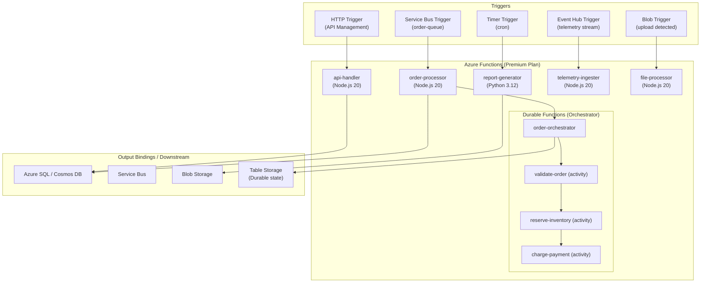

# Azure Functions — Serverless Patterns

## Category
Cloud Native, Serverless, Event-Driven, Azure Functions

## Context

**Azure Functions** is Microsoft's serverless compute service. Functions execute in response to triggers — HTTP, Timer, Service Bus, Event Hub, Blob storage, CosmosDB changes, and more. Like AWS Lambda, you pay only for execution time, and Azure manages all underlying infrastructure.

**Hosting plans**:
| Plan | Cold start | Scale | Max timeout | Best for |
|------|-----------|-------|-------------|---------|
| **Consumption** | Yes | Automatic (up to 200) | 10 min | Event-driven, variable load |
| **Flex Consumption** | Minimal | Fast, per-instance | 60 min | Predictable cold-start avoidance |
| **Premium** | No (pre-warmed) | Elastic | Unlimited | Production, VNet, no cold start |
| **Dedicated (App Service)** | No | Manual/Auto | Unlimited | Always-on, predictable cost |
| **Container Apps** | Minimal | KEDA-based | Unlimited | Custom container, KEDA triggers |

**Durable Functions**: The extension for long-running stateful workflows in Azure Functions. Replaces Step Functions — orchestrators call activities and wait for results without maintaining state in memory.

**Durable patterns**:
| Pattern | Description |
|---------|-------------|
| **Function Chaining** | Sequential: A → B → C |
| **Fan-out/Fan-in** | Parallel: A spawns B1, B2, B3; waits for all |
| **Async HTTP** | Client polls for long-running operation status |
| **Monitoring** | Periodic polling loop until condition met |
| **Human Interaction** | Wait for external event (approval, webhook) |
| **Aggregator (Stateful entity)** | Accumulate events over time |

**Triggers vs bindings**:
- **Trigger**: What starts the function (one per function).
- **Input binding**: Additional data read when function starts.
- **Output binding**: Where function sends data when done. Declarative — no SDK code needed.

---

## Pros

- **Zero infrastructure**: No VMs, no Docker hosts to manage.
- **Rich trigger ecosystem**: 20+ native triggers; custom KEDA triggers via Container Apps.
- **Durable Functions**: Built-in orchestration with automatic state persistence to Azure Storage.
- **Output bindings**: Write to Service Bus, Blob, CosmosDB declaratively with no SDK code.
- **Managed identity integration**: Functions can authenticate to Azure services without credentials.
- **VNet integration (Premium)**: Private access to Azure SQL, Service Bus, etc.

---

## Cons

- **Cold start on Consumption**: 1–10 s for .NET/Java; ~200 ms for Node.js/Python.
- **10-minute timeout on Consumption**: Long-running jobs require Durable Functions or a different plan.
- **Premium plan cost**: ~$200+/month per pre-warmed instance — significant overhead for low-traffic functions.
- **Durable Functions storage dependency**: Orchestration state stored in Azure Storage (Table/Blob/Queue) — can be a performance bottleneck at very high scale.
- **Local debugging complexity**: Requires Azure Functions Core Tools, Azurite (local emulator), and careful env var management.

---

## Design Diagram



---

## Code Sample

### HTTP-Triggered Function (TypeScript)

```typescript
// src/functions/create-order.ts
import { app, HttpRequest, HttpResponseInit, InvocationContext } from '@azure/functions';
import { ServiceBusClient } from '@azure/service-bus';
import { DefaultAzureCredential } from '@azure/identity';

// Clients initialised outside the function handler — reused across warm invocations
const credential = new DefaultAzureCredential();   // Uses Managed Identity automatically
const sbClient   = new ServiceBusClient(
  process.env.SERVICE_BUS_NAMESPACE!,
  credential,
);
const sender = sbClient.createSender('order-queue');

interface CreateOrderRequest {
  customerId: string;
  items: Array<{ productId: string; quantity: number }>;
  currency: string;
}

export async function createOrder(
  request: HttpRequest,
  context: InvocationContext,
): Promise<HttpResponseInit> {
  context.log('Create order request', { url: request.url, method: request.method });

  let body: CreateOrderRequest;
  try {
    body = await request.json() as CreateOrderRequest;
  } catch {
    return { status: 400, jsonBody: { error: 'Invalid JSON body' } };
  }

  if (!body.customerId || !body.items?.length) {
    return { status: 400, jsonBody: { error: 'customerId and items are required' } };
  }

  const orderId = crypto.randomUUID();

  // Send to Service Bus — output binding alternative (SDK gives more control)
  await sender.sendMessages({
    body: {
      orderId,
      customerId: body.customerId,
      items:      body.items,
      currency:   body.currency ?? 'EUR',
      timestamp:  new Date().toISOString(),
    },
    contentType:      'application/json',
    messageId:        orderId,         // Duplicate detection key
    sessionId:        body.customerId, // FIFO per customer (if session-enabled queue)
    applicationProperties: {
      eventType: 'ORDER_CREATED',
      customerId: body.customerId,
    },
  });

  context.log('Order queued', { orderId });

  return {
    status: 202,
    headers: { 'Location': `/api/orders/${orderId}` },
    jsonBody: { orderId, status: 'QUEUED' },
  };
}

// Register the function
app.http('create-order', {
  methods:   ['POST'],
  authLevel: 'anonymous',  // Auth handled by APIM upstream
  route:     'orders',
  handler:   createOrder,
});
```

### Durable Functions — Order Orchestrator

```typescript
// src/functions/order-orchestrator.ts
import * as df from 'durable-functions';
import { ActivityHandler, OrchestrationContext, OrchestrationHandler } from 'durable-functions';

// ─── Orchestrator ─────────────────────────────────────────────────────────────
const orderOrchestrator: OrchestrationHandler = function* (context: OrchestrationContext) {
  const order = context.df.getInput<{ orderId: string; customerId: string; items: unknown[] }>();

  context.df.setCustomStatus('VALIDATING');
  const validation = yield context.df.callActivity('validate-order', order);

  if (!validation.valid) {
    context.df.setCustomStatus('REJECTED');
    return { status: 'REJECTED', reason: validation.reason };
  }

  context.df.setCustomStatus('RESERVING_INVENTORY');
  const inventory = yield context.df.callActivity('reserve-inventory', order);

  context.df.setCustomStatus('CHARGING');
  try {
    const payment = yield context.df.callActivity('charge-payment', {
      orderId:    order.orderId,
      customerId: order.customerId,
      amount:     inventory.total,
    });

    context.df.setCustomStatus('FULFILLED');
    return { status: 'FULFILLED', paymentId: payment.id };
  } catch (err) {
    // Compensate — release inventory
    yield context.df.callActivity('release-inventory', { reservationId: inventory.reservationId });
    context.df.setCustomStatus('FAILED');
    return { status: 'FAILED', reason: (err as Error).message };
  }
};

df.app.orchestration('order-orchestrator', orderOrchestrator);

// ─── Activities ──────────────────────────────────────────────────────────────
const validateOrder: ActivityHandler = async (input: unknown): Promise<{ valid: boolean; reason?: string }> => {
  const order = input as { items: unknown[] };
  if (!order.items?.length) return { valid: false, reason: 'No items' };
  return { valid: true };
};

df.app.activity('validate-order', { handler: validateOrder });

// ─── Service Bus trigger → start orchestration ───────────────────────────────
import { app as funcApp, InvocationContext } from '@azure/functions';

funcApp.serviceBusTopic('order-orchestrator-trigger', {
  connection:    'SERVICE_BUS_CONNECTION',
  topicName:     'orders',
  subscriptionName: 'orchestrator',
  handler: async (message: unknown, context: InvocationContext) => {
    const client = df.getClient(context);
    const instanceId = await client.startNew('order-orchestrator', { input: message });
    context.log('Started orchestration', { instanceId });
  },
});
```

### host.json — Function App Configuration

```json
{
  "version": "2.0",
  "logging": {
    "applicationInsights": {
      "samplingSettings": {
        "isEnabled": true,
        "excludedTypes": "Request"
      }
    },
    "logLevel": {
      "default": "Information",
      "Host.Results": "Error",
      "Function": "Information"
    }
  },
  "functionTimeout": "00:10:00",
  "extensions": {
    "serviceBus": {
      "prefetchCount": 20,
      "messageHandlerOptions": {
        "autoComplete": false,
        "maxConcurrentCalls": 16,
        "maxAutoRenewDuration": "00:05:00"
      }
    },
    "durableTask": {
      "hubName": "OrderHub",
      "storageProvider": {
        "type": "azureStorage",
        "connectionStringName": "AzureWebJobsStorage"
      }
    }
  },
  "retry": {
    "strategy": "exponentialBackoff",
    "maxRetryCount": 3,
    "minimumInterval": "00:00:02",
    "maximumInterval": "00:00:30"
  }
}
```

### Bicep — Function App (Premium Plan + Managed Identity)

```bicep
// infrastructure/bicep/functions/function-app.bicep

param location string = resourceGroup().location
param env string
param appName string = 'myapp-${env}'

// Storage account for Functions runtime + Durable state
resource storageAccount 'Microsoft.Storage/storageAccounts@2023-01-01' = {
  name: replace('${appName}fnstore', '-', '')
  location: location
  kind: 'StorageV2'
  sku: { name: 'Standard_LRS' }
  properties: {
    minimumTlsVersion: 'TLS1_2'
    allowBlobPublicAccess: false
    supportsHttpsTrafficOnly: true
  }
}

// App Service Plan (Premium EP1 — no cold start, VNet integration)
resource plan 'Microsoft.Web/serverfarms@2023-01-01' = {
  name: '${appName}-plan'
  location: location
  kind: 'elastic'
  sku: {
    name: 'EP1'
    tier: 'ElasticPremium'
  }
  properties: {
    maximumElasticWorkerCount: 20
  }
}

// Application Insights
resource appInsights 'Microsoft.Insights/components@2020-02-02' = {
  name: '${appName}-insights'
  location: location
  kind: 'web'
  properties: {
    Application_Type: 'web'
    RetentionInDays: 90
  }
}

// Function App
resource functionApp 'Microsoft.Web/sites@2023-01-01' = {
  name: appName
  location: location
  kind: 'functionapp'

  identity: {
    type: 'SystemAssigned'   // Managed Identity — no credentials in config
  }

  properties: {
    serverFarmId: plan.id
    httpsOnly: true

    siteConfig: {
      ftpsState: 'Disabled'
      minTlsVersion: '1.2'
      http20Enabled: true
      nodeVersion: '~20'
      functionAppScaleLimit: 20

      appSettings: [
        { name: 'AzureWebJobsStorage__accountName',          value: storageAccount.name }
        { name: 'APPINSIGHTS_INSTRUMENTATIONKEY',            value: appInsights.properties.InstrumentationKey }
        { name: 'APPLICATIONINSIGHTS_CONNECTION_STRING',     value: appInsights.properties.ConnectionString }
        { name: 'FUNCTIONS_EXTENSION_VERSION',               value: '~4' }
        { name: 'FUNCTIONS_WORKER_RUNTIME',                  value: 'node' }
        { name: 'SERVICE_BUS_NAMESPACE',                     value: 'https://${serviceBusNamespace.name}.servicebus.windows.net' }
        // No secrets in app settings — Managed Identity grants access
      ]
    }
  }
}

// Grant Function App's Managed Identity access to Service Bus
resource sbDataSenderRole 'Microsoft.Authorization/roleAssignments@2022-04-01' = {
  name: guid(serviceBusNamespace.id, functionApp.id, 'Azure Service Bus Data Sender')
  scope: serviceBusNamespace
  properties: {
    roleDefinitionId: subscriptionResourceId('Microsoft.Authorization/roleDefinitions', '69a216fc-b8fb-44d8-bc22-1f3c2cd27a39')
    principalId: functionApp.identity.principalId
    principalType: 'ServicePrincipal'
  }
}

// Grant Function App's Managed Identity access to Storage (for Durable Functions)
resource storageBlobRole 'Microsoft.Authorization/roleAssignments@2022-04-01' = {
  name: guid(storageAccount.id, functionApp.id, 'Storage Blob Data Owner')
  scope: storageAccount
  properties: {
    roleDefinitionId: subscriptionResourceId('Microsoft.Authorization/roleDefinitions', 'b7e6dc6d-f1e8-4753-8033-0f276bb0955b')
    principalId: functionApp.identity.principalId
    principalType: 'ServicePrincipal'
  }
}
```
