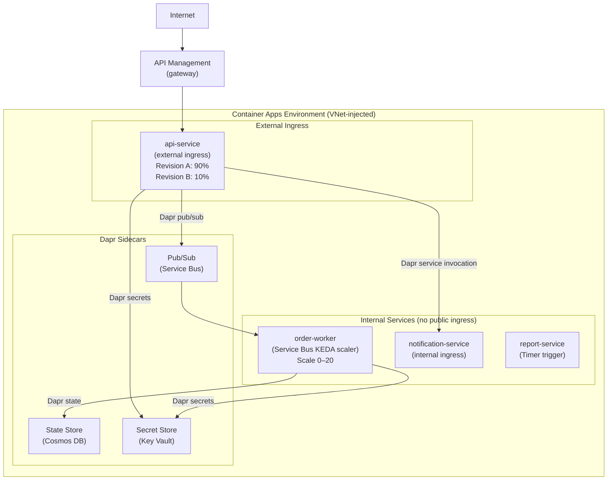

# Azure Container Apps

## Category
Cloud Native, Containers, Azure Container Apps, KEDA, Dapr

## Context

**Azure Container Apps (ACA)** is Azure's serverless container platform — a managed Kubernetes environment where you deploy containers without managing nodes, control planes, or Kubernetes YAML directly. It is purpose-built for microservices and event-driven workloads.

**ACA vs AKS vs App Service**:
| | Container Apps | AKS | App Service |
|-|----------------|-----|-------------|
| Kubernetes control plane | Managed, hidden | Managed, visible | None |
| Node management | None | Yes (node pools) | None |
| Custom K8s extensions | No | Yes | No |
| KEDA autoscaling | Built-in | Bring your own | No |
| Dapr | Built-in | Bring your own | No |
| Egress pricing | Per vCPU/sec | Per node | Per App Service Plan |
| Best for | Microservices, event-driven | Full K8s control | Traditional web apps |

**Core concepts**:
| Concept | Description |
|---------|-------------|
| **Environment** | Shared boundary for container apps (shared VNet, logging) |
| **Container App** | Deployment unit — wraps one or more containers |
| **Revision** | Immutable snapshot of a container app configuration |
| **Replica** | Running instance of a revision |
| **Ingress** | HTTP traffic routing — external (public) or internal (VNet only) |
| **KEDA** | Kubernetes-based Event Driven Autoscaling — scale on queue depth, CPU, HTTP, custom |
| **Dapr** | Distributed Application Runtime — service discovery, pub/sub, state, secrets sidecars |

**Scaling rules (KEDA)**:
- HTTP: scale on concurrent requests.
- Azure Service Bus: scale on queue message count.
- CPU/Memory: scale on resource utilisation.
- Custom: any KEDA scaler (Prometheus, Kafka, Redis, etc.).
- Scale to zero: when no traffic or queue is empty — billed only for active replicas.

---

## Pros

- **Scale to zero on idle**: Zero cost when no traffic — unlike AKS nodes.
- **Built-in Dapr**: Service invocation, pub/sub, state management, secrets without writing infrastructure code.
- **Built-in KEDA**: Auto-scale on Service Bus depth, HTTP concurrency, or custom metrics.
- **Revision-based deployments**: Blue/green and traffic splitting built in (no Ingress controller needed).
- **Managed Identity**: Native integration — no credentials in environment variables.
- **Simpler than AKS**: No kubectl, no Helm, no node group tuning for 80% of use cases.

---

## Cons

- **Limited Kubernetes access**: Cannot deploy CRDs, operators, DaemonSets, or custom admission webhooks.
- **No GPU support**: GPU workloads require AKS.
- **Revision immutability**: Any config change creates a new revision — can't patch-in-place.
- **Dapr coupling**: Dapr is optional but once adopted, creates dependency on its APIs.
- **Environment-level VNet**: All apps in an environment share the environment's VNet injection — changing this requires a new environment.

---

## Design Diagram



---

## Code Sample

### Bicep — Container Apps Environment + Apps

```bicep
// infrastructure/bicep/aca/container-apps.bicep

param location string = resourceGroup().location
param env string
param acrName string

// ─── Log Analytics Workspace ─────────────────────────────────────────────────
resource logWorkspace 'Microsoft.OperationalInsights/workspaces@2022-10-01' = {
  name: 'myapp-${env}-logs'
  location: location
  properties: {
    sku: { name: 'PerGB2018' }
    retentionInDays: 30
  }
}

// ─── Container Apps Environment ──────────────────────────────────────────────
resource acaEnv 'Microsoft.App/managedEnvironments@2024-03-01' = {
  name: 'myapp-${env}-env'
  location: location
  properties: {
    daprAIInstrumentationKey: appInsights.properties.InstrumentationKey

    appLogsConfiguration: {
      destination: 'log-analytics'
      logAnalyticsConfiguration: {
        customerId: logWorkspace.properties.customerId
        sharedKey:  logWorkspace.listKeys().primarySharedKey
      }
    }

    vnetConfiguration: {
      internal: false
      infrastructureSubnetId: infraSubnet.id
    }

    workloadProfiles: [
      {
        name: 'Consumption'
        workloadProfileType: 'Consumption'
      }
      {
        name: 'D4'
        workloadProfileType: 'D4'     // 4 vCPU / 16 GB — dedicated for intensive workloads
        minimumCount: 0
        maximumCount: 10
      }
    ]
  }
}

// ─── Dapr Components ─────────────────────────────────────────────────────────
resource daprPubSub 'Microsoft.App/managedEnvironments/daprComponents@2024-03-01' = {
  parent: acaEnv
  name: 'pubsub'
  properties: {
    componentType: 'pubsub.azure.servicebus.queues'
    version: 'v1'
    metadata: [
      { name: 'namespaceName', value: '${serviceBus.name}.servicebus.windows.net' }
      // No connection string — uses Managed Identity via scopes
    ]
    scopes: ['api-service', 'order-worker']
  }
}

resource daprStateStore 'Microsoft.App/managedEnvironments/daprComponents@2024-03-01' = {
  parent: acaEnv
  name: 'statestore'
  properties: {
    componentType: 'state.azure.cosmosdb'
    version: 'v1'
    metadata: [
      { name: 'url',          value: cosmosAccount.properties.documentEndpoint }
      { name: 'database',     value: 'myapp' }
      { name: 'collection',   value: 'state' }
      { name: 'actorStateStore', value: 'true' }
    ]
    scopes: ['api-service', 'order-worker']
  }
}

// ─── API Container App ────────────────────────────────────────────────────────
resource apiApp 'Microsoft.App/containerApps@2024-03-01' = {
  name: 'api-service'
  location: location

  identity: {
    type: 'SystemAssigned'
  }

  properties: {
    environmentId: acaEnv.id

    configuration: {
      ingress: {
        external: true
        targetPort: 3000
        transport: 'http2'
        corsPolicy: {
          allowedOrigins: ['https://myapp.example.com']
          allowedMethods: ['GET', 'POST', 'PUT', 'DELETE']
          allowedHeaders: ['Authorization', 'Content-Type']
          allowCredentials: true
        }
      }

      dapr: {
        enabled: true
        appId:   'api-service'
        appPort: 3000
        appProtocol: 'http'
        enableApiLogging: false
      }

      registries: [
        {
          server:   '${acrName}.azurecr.io'
          identity: 'system'           // Pull from ACR using Managed Identity
        }
      ]

      // Blue/Green: new revision gets 0% traffic until promoted
      activeRevisionsMode: 'Multiple'
    }

    template: {
      containers: [
        {
          name:  'api'
          image: '${acrName}.azurecr.io/myapp/api:latest'
          resources: {
            cpu:    json('0.5')
            memory: '1Gi'
          }
          env: [
            { name: 'NODE_ENV',              value: 'production' }
            { name: 'PORT',                  value: '3000' }
            { name: 'DAPR_HTTP_PORT',        value: '3500' }
            // Secrets fetched via Dapr secret store — no env var secrets needed
          ]
          probes: [
            {
              type: 'Liveness'
              httpGet: { path: '/health/live', port: 3000 }
              initialDelaySeconds: 5
              periodSeconds: 10
            }
            {
              type: 'Readiness'
              httpGet: { path: '/health/ready', port: 3000 }
              initialDelaySeconds: 5
              periodSeconds: 5
            }
          ]
        }
      ]

      scale: {
        minReplicas: 1
        maxReplicas: 20
        rules: [
          {
            name: 'http-scaler'
            http: { metadata: { concurrentRequests: '50' } }
          }
        ]
      }
    }
  }
}

// ─── Worker Container App (scales to zero on empty queue) ───────────────────
resource workerApp 'Microsoft.App/containerApps@2024-03-01' = {
  name: 'order-worker'
  location: location

  identity: { type: 'SystemAssigned' }

  properties: {
    environmentId: acaEnv.id

    configuration: {
      ingress: null   // No ingress — internal worker only

      dapr: {
        enabled:     true
        appId:       'order-worker'
        appPort:     3001
        appProtocol: 'http'
      }

      registries: [
        { server: '${acrName}.azurecr.io', identity: 'system' }
      ]
    }

    template: {
      containers: [
        {
          name:  'worker'
          image: '${acrName}.azurecr.io/myapp/order-worker:latest'
          resources: { cpu: json('1'), memory: '2Gi' }
          env: [
            { name: 'NODE_ENV', value: 'production' }
          ]
        }
      ]

      scale: {
        minReplicas: 0    // Scale to zero when queue is empty
        maxReplicas: 20
        rules: [
          {
            name: 'servicebus-scaler'
            custom: {
              type: 'azure-servicebus'
              metadata: {
                queueName:           'order-queue'
                messageCount:        '5'    // 1 replica per 5 messages
                namespace:           serviceBus.name
                activationMessageCount: '1'
              }
              auth: [
                {
                  secretRef: 'sb-connection'
                  triggerParameter: 'connection'
                }
              ]
            }
          }
        ]
      }
    }
  }
}
```

### TypeScript — Dapr Service Invocation + Pub/Sub

```typescript
// src/services/dapr-client.ts
// Using Dapr HTTP API — works in any ACA service with Dapr sidecar enabled

const DAPR_PORT = process.env.DAPR_HTTP_PORT ?? '3500';
const DAPR_BASE = `http://localhost:${DAPR_PORT}`;

// ─── Publish an event via Dapr pub/sub ───────────────────────────────────────
export async function publishEvent(
  pubsubName: string,
  topic: string,
  data: unknown,
): Promise<void> {
  const res = await fetch(`${DAPR_BASE}/v1.0/publish/${pubsubName}/${topic}`, {
    method: 'POST',
    headers: { 'Content-Type': 'application/json' },
    body: JSON.stringify(data),
  });

  if (!res.ok) {
    throw new Error(`Dapr publish failed: ${res.status} ${await res.text()}`);
  }
}

// ─── Invoke another service via Dapr service invocation ─────────────────────
export async function invokeService<T>(
  appId: string,
  method: string,
  httpMethod: 'GET' | 'POST' | 'PUT' | 'DELETE' = 'POST',
  data?: unknown,
): Promise<T> {
  const res = await fetch(
    `${DAPR_BASE}/v1.0/invoke/${appId}/method/${method}`,
    {
      method: httpMethod,
      headers: data ? { 'Content-Type': 'application/json' } : undefined,
      body: data ? JSON.stringify(data) : undefined,
    },
  );

  if (!res.ok) {
    throw new Error(`Service invocation ${appId}/${method} failed: ${res.status}`);
  }

  return res.json() as Promise<T>;
}

// ─── Read a secret from Dapr secret store (Key Vault) ────────────────────────
export async function getSecret(secretName: string): Promise<string> {
  const res = await fetch(
    `${DAPR_BASE}/v1.0/secrets/secretstore/${secretName}`,
  );

  if (!res.ok) {
    throw new Error(`Secret fetch failed: ${secretName}`);
  }

  const data = await res.json() as Record<string, string>;
  return data[secretName] ?? data['data'];
}

// ─── Usage in handler ─────────────────────────────────────────────────────────
import express from 'express';
const app = express();
app.use(express.json());

app.post('/orders', async (req, res) => {
  const order = req.body;

  // Publish order event — Dapr routes to Service Bus
  await publishEvent('pubsub', 'orders', {
    eventType: 'ORDER_CREATED',
    orderId:   crypto.randomUUID(),
    ...order,
    timestamp: new Date().toISOString(),
  });

  res.status(202).json({ status: 'QUEUED' });
});

// Dapr pub/sub subscriber endpoint
app.post('/dapr/subscribe', (req, res) => {
  res.json([
    { pubsubname: 'pubsub', topic: 'order-updates', route: '/events/order-updates' }
  ]);
});

app.post('/events/order-updates', async (req, res) => {
  const event = req.body;
  console.log('Received order update', event.data);
  // Process...
  res.sendStatus(200);   // ACK to Dapr
});

app.listen(3000);
```

### GitHub Actions — Build & Deploy to ACA

```yaml
# .github/workflows/deploy-aca.yml
name: Deploy to Container Apps

on:
  push:
    branches: [main]

permissions:
  id-token: write
  contents: read

jobs:
  deploy:
    runs-on: ubuntu-latest
    steps:
      - uses: actions/checkout@v4

      - name: Azure login (OIDC — no secrets)
        uses: azure/login@v2
        with:
          client-id:       ${{ vars.AZURE_CLIENT_ID }}
          tenant-id:       ${{ vars.AZURE_TENANT_ID }}
          subscription-id: ${{ vars.AZURE_SUBSCRIPTION_ID }}

      - name: Build and push to ACR
        run: |
          az acr build \
            --registry ${{ vars.ACR_NAME }} \
            --image myapp/api:${{ github.sha }} \
            --file Dockerfile \
            .

      - name: Deploy new revision to Container App
        run: |
          az containerapp update \
            --name api-service \
            --resource-group myapp-${{ vars.ENVIRONMENT }} \
            --image ${{ vars.ACR_NAME }}.azurecr.io/myapp/api:${{ github.sha }} \
            --revision-suffix ${{ github.sha }}

      - name: Split traffic (canary 10%)
        run: |
          PREVIOUS=$(az containerapp revision list \
            --name api-service \
            --resource-group myapp-${{ vars.ENVIRONMENT }} \
            --query "[?properties.active && properties.trafficWeight > 0].name | [0]" \
            --output tsv)

          az containerapp ingress traffic set \
            --name api-service \
            --resource-group myapp-${{ vars.ENVIRONMENT }} \
            --revision-weight \
              "${PREVIOUS}=90" \
              "api-service--${{ github.sha }}=10"
```
