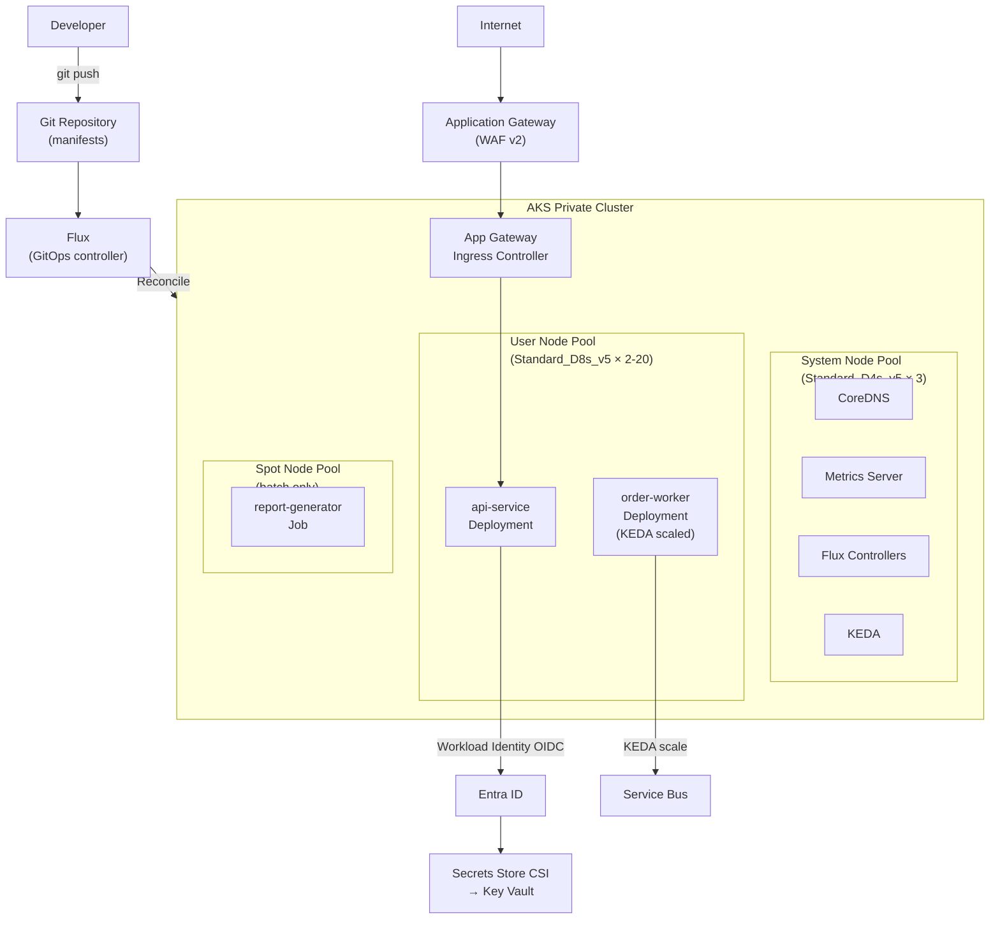

# AKS — Kubernetes on Azure

## Category
Cloud Native, Kubernetes, AKS, KEDA, Workload Identity, GitOps, Azure CNI

## Context

**Azure Kubernetes Service (AKS)** is Azure's managed Kubernetes offering. AKS manages the control plane (API server, etcd, scheduler) at no extra cost — you pay only for worker nodes. AKS is the right choice when you need full Kubernetes API access, custom operators, or cluster-level governance beyond what Container Apps provides.

**AKS Node Pool types**:
| Type | Description | Use Case |
|------|-------------|----------|
| **System** | Reserved for critical K8s pods (coredns, metrics-server) | Always-on, small (Standard_D4s_v5) |
| **User** | Application workloads | Mix of VM SKUs per workload class |
| **Spot** | Evictable, 60–90% discount | Batch, CI runners, stateless workers |

**AKS Networking options**:
| Option | Description |
|--------|-------------|
| **Kubenet** | Pods use NAT overlay; simpler but no direct pod IP routing |
| **Azure CNI** | Pods get VNet IPs — direct routing to Azure services and on-prem |
| **Azure CNI Overlay** | Pods get private overlay IPs; less VNet IP consumption than CNI |
| **Cilium** | High-performance eBPF networking + network policy |

**Key AKS integrations**:
| Feature | Description |
|---------|-------------|
| **Workload Identity** | Federated identity — pod gets OIDC token exchanged for Entra ID token; replaces pod Managed Identity (aad-pod-identity) |
| **KEDA add-on** | Scale Deployments or Jobs on queue depth, HTTP concurrency, Prometheus metrics |
| **Flux add-on** | GitOps — reconciles cluster state from Git repository |
| **Defender for Containers** | Runtime threat detection, image scanning |
| **AGIC** | Application Gateway Ingress Controller — WAF-enabled ingress |
| **Azure Monitor + Container Insights** | Metrics and logs without manual Prometheus setup |

---

## Pros

- **Full Kubernetes API**: Deploy operators, CRDs, DaemonSets, admission webhooks — anything the K8s ecosystem offers.
- **Workload Identity (IRSA equivalent)**: Pod-level identity mapped to Entra ID service principals — zero credential sprawl.
- **Node pool flexibility**: Mix CPU-optimised, memory-optimised, and Spot pools in one cluster.
- **Managed control plane**: Azure patches and upgrades the API server; you control the cadence.
- **Cluster Auto-scaler + KEDA**: VMs scale out when pods can't be scheduled; pods scale on custom metrics.
- **Private cluster option**: API server not exposed to internet; accessible only via VNet or VPN.

---

## Cons

- **Operational overhead**: Node OS upgrades, Kubernetes version upgrades, network policy management.
- **Cost**: Node VMs run 24/7 unless scaled to zero (unlike ACA Consumption workloads).
- **Kubernetes learning curve**: Deployment, Service, Ingress, NetworkPolicy, RBAC — significant YAML surface area.
- **Upgrade complexity**: AKS version n-2 support policy; skipping minor versions not supported.

---

## Design Diagram



---

## Code Sample

### AKS Cluster — Bicep

```bicep
// infrastructure/bicep/aks/cluster.bicep
param location string = resourceGroup().location
param env        string
param nodeResourceGroup string = 'myapp-${env}-nodes'

// ─── AKS Cluster ─────────────────────────────────────────────────────────────
resource aks 'Microsoft.ContainerService/managedClusters@2024-06-02-preview' = {
  name:     'myapp-${env}-aks'
  location: location

  identity: { type: 'SystemAssigned' }

  properties: {
    dnsPrefix:           'myapp-${env}'
    nodeResourceGroup:   nodeResourceGroup
    kubernetesVersion:   '1.30'

    // Private cluster — API server not public
    apiServerAccessProfile: {
      enablePrivateCluster:          true
      enablePrivateClusterPublicFQDN: false
    }

    networkProfile: {
      networkPlugin:     'azure'       // Azure CNI
      networkPluginMode: 'overlay'     // Overlay — less VNet IP consumption
      networkPolicy:     'cilium'
      serviceCidr:       '172.16.0.0/16'
      dnsServiceIP:      '172.16.0.10'
      loadBalancerSku:   'standard'
    }

    oidcIssuerProfile: { enabled: true }               // Required for Workload Identity
    securityProfile:   { workloadIdentity: { enabled: true } }

    addonProfiles: {
      omsagent: {
        enabled: true
        config: { logAnalyticsWorkspaceResourceID: logWorkspace.id }
      }
      azureKeyvaultSecretsProvider: {
        enabled: true
        config:  { enableSecretRotation: 'true', rotationPollInterval: '2m' }
      }
      ingressApplicationGateway: {
        enabled: true
        config:  { applicationGatewayId: appGateway.id }
      }
    }

    agentPoolProfiles: [
      // System pool — always 3 nodes for HA
      {
        name:              'system'
        mode:              'System'
        vmSize:            'Standard_D4s_v5'
        count:             3
        availabilityZones: ['1', '2', '3']
        osDiskSizeGB:      100
        osDiskType:        'Ephemeral'
        vnetSubnetID:      nodeSubnet.id
        nodeTaints:        ['CriticalAddonsOnly=true:NoSchedule']
      }
      // User pool — auto-scales
      {
        name:              'user'
        mode:              'User'
        vmSize:            'Standard_D8s_v5'
        count:             2
        minCount:          2
        maxCount:          20
        enableAutoScaling: true
        availabilityZones: ['1', '2', '3']
        osDiskType:        'Ephemeral'
        vnetSubnetID:      nodeSubnet.id
      }
      // Spot pool — for batch/CI
      {
        name:            'spot'
        mode:            'User'
        vmSize:          'Standard_D8s_v5'
        scaleSetPriority: 'Spot'
        scaleSetEvictionPolicy: 'Delete'
        spotMaxPrice:     -1    // Pay market price up to OD price
        count:            0
        minCount:         0
        maxCount:         10
        enableAutoScaling: true
        vnetSubnetID:     nodeSubnet.id
        nodeTaints:       ['kubernetes.azure.com/scalesetpriority=spot:NoSchedule']
        nodeLabels:       { 'workload-type': 'spot' }
      }
    ]
  }
}

// ─── KEDA Add-on ─────────────────────────────────────────────────────────────
resource kedaAddon 'Microsoft.ContainerService/managedClusters/maintenanceConfigurations@2024-06-02-preview' = {
  parent: aks
  name:   'aksManagedAutoUpgradeSchedule'
  properties: {
    maintenanceWindow: {
      schedule: { weekly: { intervalWeeks: 1, dayOfWeek: 'Sunday' } }
      startTime: '02:00'
      durationHours: 4
    }
  }
}
```

### Kubernetes — Workload Identity Setup

```yaml
# k8s/workload-identity/service-account.yaml
apiVersion: v1
kind: ServiceAccount
metadata:
  name: api-service-sa
  namespace: myapp
  annotations:
    azure.workload.identity/client-id: "<AZURE_CLIENT_ID>"
    azure.workload.identity/tenant-id: "<AZURE_TENANT_ID>"
---
# k8s/workload-identity/federated-credential.sh
# Run once with Azure CLI to link K8s SA to Entra ID App Registration
AKS_OIDC=$(az aks show \
  --name myapp-prod-aks \
  --resource-group myapp-prod \
  --query "oidcIssuerProfile.issuerUrl" \
  --output tsv)

az ad app federated-credential create \
  --id <APP_OBJECT_ID> \
  --parameters "{
    \"name\": \"api-service-k8s\",
    \"issuer\": \"${AKS_OIDC}\",
    \"subject\": \"system:serviceaccount:myapp:api-service-sa\",
    \"audiences\": [\"api://AzureADTokenExchange\"]
  }"
```

### Kubernetes — Deployment with Secrets Store CSI

```yaml
# k8s/apps/api-deployment.yaml
apiVersion: apps/v1
kind: Deployment
metadata:
  name: api-service
  namespace: myapp
spec:
  replicas: 2
  selector:
    matchLabels:
      app: api-service
  template:
    metadata:
      labels:
        app: api-service
        azure.workload.identity/use: "true"   # Enable Workload Identity on pod
    spec:
      serviceAccountName: api-service-sa

      containers:
        - name: api
          image: myappacr.azurecr.io/myapp/api:1.0.0
          ports:
            - containerPort: 3000
          resources:
            requests: { cpu: "250m", memory: "256Mi" }
            limits:   { cpu: "1",    memory: "512Mi" }
          env:
            - name: NODE_ENV
              value: production
            - name: PORT
              value: "3000"
            # Secrets mounted as files from Key Vault via CSI — no env var secrets
            - name: DB_PASSWORD
              valueFrom:
                secretKeyRef:
                  name: kv-secrets
                  key: db-password
          volumeMounts:
            - name: secrets-store
              mountPath: "/mnt/secrets"
              readOnly: true
          livenessProbe:
            httpGet: { path: /health/live, port: 3000 }
            initialDelaySeconds: 10
            periodSeconds: 15
          readinessProbe:
            httpGet: { path: /health/ready, port: 3000 }
            periodSeconds: 5
          securityContext:
            runAsNonRoot: true
            runAsUser: 1001
            allowPrivilegeEscalation: false
            readOnlyRootFilesystem: true
            capabilities: { drop: ["ALL"] }

      volumes:
        - name: secrets-store
          csi:
            driver: secrets-store.csi.k8s.io
            readOnly: true
            volumeAttributes:
              secretProviderClass: myapp-keyvault

      topologySpreadConstraints:
        - maxSkew: 1
          topologyKey: topology.kubernetes.io/zone
          whenUnsatisfiable: DoNotSchedule
          labelSelector:
            matchLabels: { app: api-service }
---
apiVersion: secrets-store.csi.x-k8s.io/v1
kind: SecretProviderClass
metadata:
  name: myapp-keyvault
  namespace: myapp
spec:
  provider: azure
  parameters:
    usePodIdentity: "false"
    clientID: "<AZURE_CLIENT_ID>"              # Workload Identity client ID
    keyvaultName: myapp-prod-kv
    tenantID: "<AZURE_TENANT_ID>"
    objects: |
      array:
        - |
          objectName: db-password
          objectType: secret
        - |
          objectName: service-bus-connection
          objectType: secret
  secretObjects:
    - secretName: kv-secrets
      type: Opaque
      data:
        - key: db-password
          objectName: db-password
        - key: service-bus-connection
          objectName: service-bus-connection
```

### KEDA ScaledObject — Service Bus Autoscaling

```yaml
# k8s/keda/order-worker-scaledobject.yaml
apiVersion: keda.sh/v1alpha1
kind: TriggerAuthentication
metadata:
  name: sb-trigger-auth
  namespace: myapp
spec:
  podIdentity:
    provider: azure-workload  # Use Workload Identity — no connection string
---
apiVersion: keda.sh/v1alpha1
kind: ScaledObject
metadata:
  name: order-worker-scaler
  namespace: myapp
spec:
  scaleTargetRef:
    name: order-worker
  minReplicaCount: 0    # Scale to zero when queue empty
  maxReplicaCount: 20
  cooldownPeriod: 60
  triggers:
    - type: azure-servicebus
      authenticationRef:
        name: sb-trigger-auth
      metadata:
        namespace: myapp-prod.servicebus.windows.net
        queueName: order-queue
        messageCount: "5"                   # Target: 5 messages per replica
        activationMessageCount: "1"         # Activate at 1 pending message
```

### Flux — GitOps Kustomization

```yaml
# clusters/prod/flux-system/kustomization.yaml
apiVersion: kustomize.toolkit.fluxcd.io/v1
kind: Kustomization
metadata:
  name: myapp-prod
  namespace: flux-system
spec:
  interval: 5m0s
  path: ./k8s/overlays/prod
  prune: true            # Delete resources removed from Git
  sourceRef:
    kind: GitRepository
    name: myapp-repo
  healthChecks:
    - apiVersion: apps/v1
      kind: Deployment
      name: api-service
      namespace: myapp
    - apiVersion: apps/v1
      kind: Deployment
      name: order-worker
      namespace: myapp
  postBuild:
    substituteFrom:
      - kind: ConfigMap
        name: cluster-vars
      - kind: Secret
        name: cluster-secrets
```
