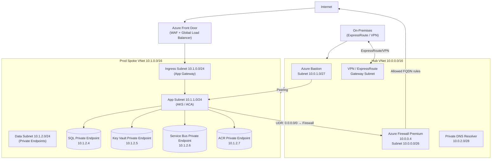

# Azure Virtual Network & Networking

## Category
Cloud Native, Networking, VNet, Hub-Spoke, Private Endpoints, NSG, Azure Firewall

## Context

**Azure Virtual Network (VNet)** is the fundamental networking building block — an isolated network in Azure where you control IP addressing, subnets, routing, and security boundaries. Enterprise networking on Azure follows the **hub-spoke** topology: a central hub VNet hosts shared services (Firewall, VPN/ExpressRoute gateways, DNS); spoke VNets host application workloads and peer to the hub.

**Core networking concepts**:
| Concept | Description |
|---------|-------------|
| **VNet** | Isolated network — one per environment / region is common |
| **Subnet** | IP subdivision within a VNet — apply NSGs and route tables at subnet level |
| **NSG (Network Security Group)** | Stateful L4 firewall rules — allow/deny by IP, port, service tag |
| **UDR (User-Defined Route)** | Override default routes — force traffic through Azure Firewall |
| **VNet Peering** | Private cross-VNet routing — no public internet, low latency |
| **Private Endpoint** | Maps an Azure PaaS service (Storage, SQL, Key Vault) to a private IP in your VNet |
| **Private DNS Zone** | Override public DNS for PaaS services when Private Endpoints are used |
| **Service Endpoint** | Allow subnet to reach PaaS services over backplane — no private IP, weaker isolation |
| **Azure Firewall** | Managed NGFW — FQDN filtering, TLS inspection, threat intelligence, IDPS |
| **Azure Bastion** | Browser-based SSH/RDP to VMs — no public IP on VMs required |
| **VPN Gateway** | Site-to-site VPN or P2S — IPsec/IKEv2 |
| **ExpressRoute** | Private dedicated circuit to Azure — not over internet |

**Hub-Spoke address plan example**:
| VNet | CIDR | Purpose |
|------|------|---------|
| Hub | 10.0.0.0/16 | Firewall, Bastion, VPN/ER Gateway |
| Spoke: Prod | 10.1.0.0/16 | Production workloads |
| Spoke: Staging | 10.2.0.0/16 | Staging workloads |
| Spoke: Shared Svcs | 10.3.0.0/16 | ACR, Key Vault, DNS |

---

## Pros

- **Defence in depth**: NSGs at subnet + NIC level, plus Azure Firewall for egress — multiple layers.
- **Private Endpoints eliminate public exposure**: PaaS services (Storage, SQL, Service Bus) get VNet private IPs — no public internet path needed.
- **Hub Firewall centralises egress**: All spoke outbound traffic routes through hub Firewall — single policy enforcement point, detailed logs.
- **DNS integration**: Private DNS Zones linked to spokes resolve PaaS FQDN to private IPs automatically.
- **Zero-trust segmentation**: Microsegment between tiers (web, app, data) using NSG rules with service tags.

---

## Cons

- **IP address planning**: Private Endpoints consume VNet IPs; Azure CNI subnet sizing must account for max node count × max pods per node.
- **Peering is non-transitive**: Hub-spoke requires UDR if spoke-to-spoke traffic must route through Firewall; transitive routing needs Azure Virtual WAN.
- **Firewall cost**: Azure Firewall Premium is expensive (~$2,500/month base); ensure it is truly shared across workloads.
- **DNS complexity**: Conditional forwarders, Private DNS Resolver, and Private DNS Zone links must be configured consistently or private endpoint resolution breaks.

---

## Design Diagram



---

## Code Sample

### Bicep — Hub-Spoke VNet with Private DNS

```bicep
// infrastructure/bicep/networking/hub-spoke.bicep
param location string = resourceGroup().location
param env string

// ─── Hub VNet ─────────────────────────────────────────────────────────────────
resource hubVnet 'Microsoft.Network/virtualNetworks@2024-01-01' = {
  name:     'hub-vnet'
  location: location
  properties: {
    addressSpace: { addressPrefixes: ['10.0.0.0/16'] }
    subnets: [
      {
        name: 'AzureFirewallSubnet'   // Must be this exact name
        properties: { addressPrefix: '10.0.0.0/26' }
      }
      {
        name: 'AzureBastionSubnet'    // Must be this exact name
        properties: { addressPrefix: '10.0.1.0/27' }
      }
      {
        name: 'GatewaySubnet'         // Must be this exact name for VPN/ER GW
        properties: { addressPrefix: '10.0.2.0/27' }
      }
      {
        name: 'dns-resolver'
        properties: {
          addressPrefix: '10.0.3.0/28'
          delegations: [
            {
              name: 'dns-resolver-delegation'
              properties: { serviceName: 'Microsoft.Network/dnsResolvers' }
            }
          ]
        }
      }
    ]
  }
}

// ─── Azure Firewall Premium ────────────────────────────────────────────────────
resource fwPolicy 'Microsoft.Network/firewallPolicies@2024-01-01' = {
  name:     'hub-fw-policy'
  location: location
  properties: {
    sku:              { tier: 'Premium' }
    threatIntelMode:  'Deny'
    intrusionDetection: {
      mode: 'Deny'
    }
    dnsSettings: {
      enableProxy: true                             // Firewall forwards DNS — helps FQDN rules
      servers:     ['168.63.129.16']               // Azure DNS
    }
  }
}

resource fwPolicyRuleCollection 'Microsoft.Network/firewallPolicies/ruleCollectionGroups@2024-01-01' = {
  parent: fwPolicy
  name:   'DefaultRuleCollectionGroup'
  properties: {
    priority: 200
    ruleCollections: [
      {
        ruleCollectionType: 'FirewallPolicyFilterRuleCollection'
        name:               'AllowEgressRules'
        priority:           100
        action:             { type: 'Allow' }
        rules: [
          // Allow workloads to reach Azure services over private endpoint (shouldn't need internet)
          // Allow egress to known external package registries
          {
            ruleType:             'ApplicationRule'
            name:                 'allow-npm-registry'
            protocols:            [{ protocolType: 'Https', port: 443 }]
            targetFqdns:          ['registry.npmjs.org', '*.npmjs.org']
            sourceAddresses:      ['10.1.0.0/16']
            terminateTLS:         false
          }
          {
            ruleType:        'NetworkRule'
            name:            'allow-azure-monitor'
            protocols:       ['TCP']
            destinationPorts: ['443']
            sourceAddresses:  ['10.1.0.0/16']
            destinationAddresses: ['AzureMonitor']  // Service Tag
          }
        ]
      }
      {
        ruleCollectionType: 'FirewallPolicyFilterRuleCollection'
        name:               'DenyAll'
        priority:           4000
        action:             { type: 'Deny' }
        rules: [
          {
            ruleType:             'ApplicationRule'
            name:                 'deny-all-http'
            protocols:            [{ protocolType: 'Http', port: 80 }, { protocolType: 'Https', port: 443 }]
            targetFqdns:          ['*']
            sourceAddresses:      ['10.0.0.0/8']
            terminateTLS:         false
          }
        ]
      }
    ]
  }
}

resource firewall 'Microsoft.Network/azureFirewalls@2024-01-01' = {
  name:     'hub-firewall'
  location: location
  zones:    ['1', '2', '3']
  properties: {
    sku:            { name: 'AZFW_VNet', tier: 'Premium' }
    firewallPolicy: { id: fwPolicy.id }
    ipConfigurations: [
      {
        name: 'fw-ipconfig'
        properties: {
          subnet:            { id: hubVnet.properties.subnets[0].id }
          publicIPAddress:   { id: fwPublicIP.id }
        }
      }
    ]
  }
}

// ─── Production Spoke VNet ────────────────────────────────────────────────────
resource prodVnet 'Microsoft.Network/virtualNetworks@2024-01-01' = {
  name:     'prod-spoke-vnet'
  location: location
  properties: {
    addressSpace: { addressPrefixes: ['10.1.0.0/16'] }
    subnets: [
      {
        name: 'ingress'
        properties: {
          addressPrefix:                     '10.1.0.0/24'
          networkSecurityGroup:             { id: ingressNsg.id }
          // App Gateway requires its own dedicated subnet
        }
      }
      {
        name: 'app'
        properties: {
          addressPrefix:         '10.1.1.0/24'
          networkSecurityGroup: { id: appNsg.id }
          routeTable:           { id: appRouteTable.id }   // Force traffic to Firewall
          // AKS Azure CNI delegate this subnet to the cluster
        }
      }
      {
        name: 'data'
        properties: {
          addressPrefix:                     '10.1.2.0/24'
          networkSecurityGroup:             { id: dataNsg.id }
          privateEndpointNetworkPolicies:   'Disabled'   // Required for Private Endpoints
        }
      }
    ]
  }
}

// ─── UDR — Force egress through Firewall ─────────────────────────────────────
resource appRouteTable 'Microsoft.Network/routeTables@2024-01-01' = {
  name:     'app-subnet-rt'
  location: location
  properties: {
    disableBgpRoutePropagation: true     // Don't expose gateway routes to spoke subnets
    routes: [
      {
        name: 'force-egress-to-firewall'
        properties: {
          addressPrefix:    '0.0.0.0/0'
          nextHopType:      'VirtualAppliance'
          nextHopIpAddress: firewall.properties.ipConfigurations[0].properties.privateIPAddress
        }
      }
    ]
  }
}

// ─── NSG — App Subnet ─────────────────────────────────────────────────────────
resource appNsg 'Microsoft.Network/networkSecurityGroups@2024-01-01' = {
  name:     'app-subnet-nsg'
  location: location
  properties: {
    securityRules: [
      {
        name: 'allow-ingress-from-gateway'
        properties: {
          priority:                 100
          direction:                'Inbound'
          access:                   'Allow'
          protocol:                 'Tcp'
          sourceAddressPrefix:      '10.1.0.0/24'   // Ingress subnet
          sourcePortRange:          '*'
          destinationAddressPrefix: '10.1.1.0/24'
          destinationPortRanges:    ['80', '443', '3000', '8080']
        }
      }
      {
        name: 'deny-internet-inbound'
        properties: {
          priority:                 4000
          direction:                'Inbound'
          access:                   'Deny'
          protocol:                 '*'
          sourceAddressPrefix:      'Internet'
          sourcePortRange:          '*'
          destinationAddressPrefix: '*'
          destinationPortRange:     '*'
        }
      }
    ]
  }
}

// ─── VNet Peering (Hub ↔ Prod Spoke) ─────────────────────────────────────────
resource hubToProdPeering 'Microsoft.Network/virtualNetworks/virtualNetworkPeerings@2024-01-01' = {
  parent: hubVnet
  name:   'hub-to-prod'
  properties: {
    remoteVirtualNetwork:        { id: prodVnet.id }
    allowVirtualNetworkAccess:   true
    allowForwardedTraffic:       true
    allowGatewayTransit:         true    // Hub shares its VPN/ER gateway with spoke
    useRemoteGateways:           false
  }
}

resource prodToHubPeering 'Microsoft.Network/virtualNetworks/virtualNetworkPeerings@2024-01-01' = {
  parent: prodVnet
  name:   'prod-to-hub'
  properties: {
    remoteVirtualNetwork:      { id: hubVnet.id }
    allowVirtualNetworkAccess: true
    allowForwardedTraffic:     true
    allowGatewayTransit:       false
    useRemoteGateways:         true     // Spoke uses hub's gateway
  }
}

// ─── Private Endpoint — Key Vault ─────────────────────────────────────────────
resource kvPrivateEndpoint 'Microsoft.Network/privateEndpoints@2024-01-01' = {
  name:     'kv-private-endpoint'
  location: location
  properties: {
    subnet: { id: prodVnet.properties.subnets[2].id }  // data subnet
    privateLinkServiceConnections: [
      {
        name: 'kv-connection'
        properties: {
          privateLinkServiceId: keyVault.id
          groupIds:             ['vault']
        }
      }
    ]
  }
}

// ─── Private DNS Zone — Key Vault Resolution ──────────────────────────────────
resource kvPrivateDnsZone 'Microsoft.Network/privateDnsZones@2020-06-01' = {
  name:     'privatelink.vaultcore.azure.net'
  location: 'global'
}

resource kvDnsZoneGroup 'Microsoft.Network/privateEndpoints/privateDnsZoneGroups@2024-01-01' = {
  parent: kvPrivateEndpoint
  name:   'kv-dns-zone-group'
  properties: {
    privateDnsZoneConfigs: [
      {
        name: 'kv-zone-config'
        properties: { privateDnsZoneId: kvPrivateDnsZone.id }
      }
    ]
  }
}

resource kvDnsZoneHubLink 'Microsoft.Network/privateDnsZones/virtualNetworkLinks@2020-06-01' = {
  parent: kvPrivateDnsZone
  name:   'hub-link'
  location: 'global'
  properties: {
    virtualNetwork:      { id: hubVnet.id }
    registrationEnabled: false       // Don't auto-register — only resolve
  }
}

resource kvDnsZoneProdLink 'Microsoft.Network/privateDnsZones/virtualNetworkLinks@2020-06-01' = {
  parent: kvPrivateDnsZone
  name:   'prod-link'
  location: 'global'
  properties: {
    virtualNetwork:      { id: prodVnet.id }
    registrationEnabled: false
  }
}
```

### Terraform Equivalent — Private Endpoint Pattern (reusable module)

```hcl
# modules/private-endpoint/main.tf
variable "name"              { type = string }
variable "resource_id"       { type = string }
variable "group_id"          { type = string }
variable "subnet_id"         { type = string }
variable "private_dns_zone_id" { type = string }
variable "location"          { type = string }
variable "resource_group"    { type = string }

resource "azurerm_private_endpoint" "this" {
  name                = "${var.name}-pe"
  location            = var.location
  resource_group_name = var.resource_group
  subnet_id           = var.subnet_id

  private_service_connection {
    name                           = "${var.name}-connection"
    private_connection_resource_id = var.resource_id
    subresource_names              = [var.group_id]
    is_manual_connection           = false
  }

  private_dns_zone_group {
    name                 = "dns-zone-group"
    private_dns_zone_ids = [var.private_dns_zone_id]
  }
}
```
