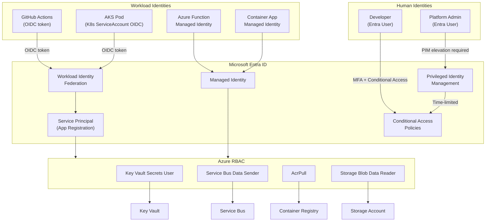

# Entra ID & Azure RBAC

## Category

Cloud Native, Security, Identity, Entra ID, Managed Identity, Workload Identity, RBAC, PIM

## Context

**Microsoft Entra ID** (formerly Azure Active Directory) is Azure's cloud identity platform — used for human identities (employees, B2B guests) and workload identities (service principals, Managed Identities). **Azure RBAC** provides fine-grained role-based access control over Azure resources.

**Identity types**:
| Type | Description | When to use |
|------|-------------|-------------|
| **User** | Human identity with password / MFA | Interactive login |
| **Group** | Collection of users — assign RBAC to group | Manage access at scale |
| **Service Principal** | Non-human identity with client ID + secret/cert | External apps, CI/CD without managed infra |
| **Managed Identity (System-Assigned)** | Tied to resource lifecycle — deleted with resource | Single-service identity |
| **Managed Identity (User-Assigned)** | Independent lifecycle — reusable across resources | Shared identity, independent rotation |
| **Workload Identity Federation** | K8s / GitHub OIDC token exchanged for Entra token | AKS, GitHub Actions — zero secrets |

**RBAC scope hierarchy**:

```
Management Group
  └── Subscription
        └── Resource Group
              └── Resource  (e.g., Key Vault, Storage Account)
```

**Key built-in roles** (use over custom roles where possible):
| Role | Scope | Description |
|------|-------|-------------|
| `Owner` | Any | Full access + assign roles — **avoid for workloads** |
| `Contributor` | Any | Full resource access, no role assignment |
| `Reader` | Any | Read-only |
| `User Access Administrator` | Any | Assign roles only — not resource access |
| `Key Vault Secrets User` | Key Vault | Read secrets/certs |
| `Key Vault Secrets Officer` | Key Vault | CRUD secrets — for admin automation |
| `Storage Blob Data Reader` | Storage | Read blobs |
| `Storage Blob Data Contributor` | Storage | Read/write blobs |
| `Service Bus Data Sender` | Service Bus | Send messages to queues/topics |
| `Service Bus Data Receiver` | Service Bus | Receive messages from queues/subscriptions |
| `AcrPull` | Container Registry | Pull images — for AKS / ACA |

**Conditional Access policies** ─ enforce context-aware access:

- Require MFA for admin roles.
- Block legacy authentication protocols (NTLM, basic auth).
- Require compliant / Entra-joined device.
- Block access from untrusted locations.
- Require Privileged Identity Management (PIM) for elevated roles.

---

## Pros

- **Managed Identity eliminates secrets**: Azure injects identity credentials automatically — no rotation, no leakage.
- **Workload Identity Federation for CI/CD**: GitHub Actions / AKS pods authenticate with OIDC tokens — zero long-lived secrets.
- **PIM (Privileged Identity Management)**: Just-in-time elevation of privileged roles with approval workflows and audit logs.
- **Conditional Access**: Risk-based access policies enforced at every sign-in.
- **Fine-grained data plane RBAC**: Key Vault, Storage, Service Bus support data plane roles — no more access policy workarounds.

---

## Cons

- **RBAC propagation latency**: Role assignments can take up to 5 minutes to propagate — plan for this in IaC pipelines.
- **Role assignment limits**: 2,000 role assignments per subscription — use groups to reduce count.
- **Workload Identity setup complexity**: Requires OIDC issuer, federated credential, and role assignment — more steps than static secrets.
- **Custom roles required for least privilege**: Built-in roles often too broad; custom roles add management overhead.
- **PIM requires Entra ID P2 licence**: Additional cost for just-in-time access.

---

## Design Diagram



---

## Code Sample

### Bicep — Role Assignments (Managed Identity)

```bicep
// infrastructure/bicep/identity/role-assignments.bicep

// Managed Identity for the application workload
resource workloadIdentity 'Microsoft.ManagedIdentity/userAssignedIdentities@2023-01-31' = {
  name:     'myapp-prod-identity'
  location: location
}

// ─── Key Vault — Secrets User ─────────────────────────────────────────────────
var kvSecretsUserRoleId = '4633458b-17de-408a-b874-0445c86b69e6'  // Key Vault Secrets User

resource kvSecretsUserAssignment 'Microsoft.Authorization/roleAssignments@2022-04-01' = {
  name:  guid(keyVault.id, workloadIdentity.id, kvSecretsUserRoleId)
  scope: keyVault
  properties: {
    roleDefinitionId: subscriptionResourceId('Microsoft.Authorization/roleDefinitions', kvSecretsUserRoleId)
    principalId:      workloadIdentity.properties.principalId
    principalType:    'ServicePrincipal'    // Must be ServicePrincipal for Managed Identity
    description:      'myapp workload reads secrets from Key Vault'
  }
}

// ─── Service Bus — Data Sender ────────────────────────────────────────────────
var sbDataSenderRoleId = '69a216fc-b8fb-44d8-bc22-1f3c2cd27a39'

resource sbSenderAssignment 'Microsoft.Authorization/roleAssignments@2022-04-01' = {
  name:  guid(serviceBus.id, workloadIdentity.id, sbDataSenderRoleId)
  scope: serviceBus
  properties: {
    roleDefinitionId: subscriptionResourceId('Microsoft.Authorization/roleDefinitions', sbDataSenderRoleId)
    principalId:      workloadIdentity.properties.principalId
    principalType:    'ServicePrincipal'
  }
}

// ─── Storage — Blob Data Contributor (for output files) ──────────────────────
var blobContributorRoleId = 'ba92f5b4-2d11-453d-a403-e96b0029c9fe'

resource blobContributorAssignment 'Microsoft.Authorization/roleAssignments@2022-04-01' = {
  name:  guid(storageAccount.id, workloadIdentity.id, blobContributorRoleId)
  scope: storageAccount
  properties: {
    roleDefinitionId: subscriptionResourceId('Microsoft.Authorization/roleDefinitions', blobContributorRoleId)
    principalId:      workloadIdentity.properties.principalId
    principalType:    'ServicePrincipal'
  }
}

// ─── ACR — AcrPull for AKS / ACA ─────────────────────────────────────────────
var acrPullRoleId = '7f951dda-4ed3-4680-a7ca-43fe172d538d'

resource acrPullAssignment 'Microsoft.Authorization/roleAssignments@2022-04-01' = {
  name:  guid(acr.id, workloadIdentity.id, acrPullRoleId)
  scope: acr
  properties: {
    roleDefinitionId: subscriptionResourceId('Microsoft.Authorization/roleDefinitions', acrPullRoleId)
    principalId:      workloadIdentity.properties.principalId
    principalType:    'ServicePrincipal'
  }
}

// ─── Custom Role — Least privilege for report reader ─────────────────────────
resource reportReaderRole 'Microsoft.Authorization/roleDefinitions@2022-04-01' = {
  name:  guid(subscription().id, 'report-reader')
  scope: subscription()
  properties: {
    roleName:    'Report Reader (Custom)'
    description: 'Can read report data from specific blob containers only'
    type:        'CustomRole'
    permissions: [
      {
        actions: []
        notActions: []
        dataActions: [
          'Microsoft.Storage/storageAccounts/blobServices/containers/blobs/read'
        ]
        notDataActions: []
      }
    ]
    assignableScopes: [
      '/subscriptions/${subscription().subscriptionId}/resourceGroups/myapp-prod'
    ]
  }
}
```

### GitHub Actions — Workload Identity Federation (zero secrets)

```yaml
# .github/workflows/deploy.yml — OIDC-based Azure authentication

name: Deploy

on:
  push:
    branches: [main]

permissions:
  id-token: write # Required for OIDC token request
  contents: read

jobs:
  deploy:
    runs-on: ubuntu-latest
    steps:
      - uses: actions/checkout@v4

      - name: Azure Login (OIDC — no client secret)
        uses: azure/login@v2
        with:
          client-id: ${{ vars.AZURE_CLIENT_ID }}
          tenant-id: ${{ vars.AZURE_TENANT_ID }}
          subscription-id: ${{ vars.AZURE_SUBSCRIPTION_ID }}
          # No client-secret parameter — uses OIDC token from GitHub

      - name: Deploy Bicep
        run: |
          az deployment group create \
            --resource-group myapp-prod \
            --template-file infrastructure/bicep/main.bicep \
            --parameters @infrastructure/bicep/params/prod.bicepparam
```

```bash
# One-time setup: create federated credential for GitHub Actions
APP_ID=$(az ad app create --display-name myapp-cicd --query appId -o tsv)
SP_OID=$(az ad sp create --id $APP_ID --query id -o tsv)

# Federated credential — main branch pushes
az ad app federated-credential create --id $APP_ID --parameters '{
  "name": "github-main",
  "issuer": "https://token.actions.githubusercontent.com",
  "subject": "repo:myorg/myapp:ref:refs/heads/main",
  "audiences": ["api://AzureADTokenExchange"]
}'

# Federated credential — pull requests (read-only previews)
az ad app federated-credential create --id $APP_ID --parameters '{
  "name": "github-prs",
  "issuer": "https://token.actions.githubusercontent.com",
  "subject": "repo:myorg/myapp:pull_request",
  "audiences": ["api://AzureADTokenExchange"]
}'

# Assign Contributor on the resource group (scoped — not subscription)
az role assignment create \
  --assignee-object-id $SP_OID \
  --assignee-principal-type ServicePrincipal \
  --role Contributor \
  --scope /subscriptions/$SUBSCRIPTION_ID/resourceGroups/myapp-prod
```

### TypeScript — DefaultAzureCredential (works for MI, Workload Identity, dev login)

```typescript
// src/lib/azure-clients.ts
// DefaultAzureCredential tries, in order:
//   1. Environment variables (AZURE_CLIENT_ID + AZURE_FEDERATED_TOKEN_FILE for Workload Identity)
//   2. Workload Identity (AKS / ACA with environment vars set by the platform)
//   3. Managed Identity endpoint (Azure VM / Function / Container App)
//   4. Azure CLI (local development: `az login`)
//   5. Azure PowerShell, Azure Developer CLI

import { DefaultAzureCredential } from "@azure/identity";
import { SecretClient } from "@azure/keyvault-secrets";
import { ServiceBusClient } from "@azure/service-bus";
import { BlobServiceClient } from "@azure/storage-blob";

const credential = new DefaultAzureCredential();

export const keyVaultClient = new SecretClient(
  `https://${process.env.KEY_VAULT_NAME}.vault.azure.net`,
  credential,
);

export const serviceBusClient = new ServiceBusClient(
  `${process.env.SERVICE_BUS_NAMESPACE}.servicebus.windows.net`,
  credential,
);

export const blobServiceClient = new BlobServiceClient(
  `https://${process.env.STORAGE_ACCOUNT}.blob.core.windows.net`,
  credential,
);

// Fetch a secret transparently — works locally (az login) and in cloud (MI)
export async function getSecret(name: string): Promise<string> {
  const secret = await keyVaultClient.getSecret(name);
  if (!secret.value) throw new Error(`Secret ${name} is empty`);
  return secret.value;
}
```

### Azure Policy — Enforce Managed Identity (deny resources without MI)

```json
{
  "mode": "All",
  "displayName": "Require Managed Identity on Function Apps",
  "description": "Denies creating Function Apps without a system or user-assigned Managed Identity",
  "policyRule": {
    "if": {
      "allOf": [
        {
          "field": "type",
          "equals": "Microsoft.Web/sites"
        },
        {
          "field": "kind",
          "contains": "functionapp"
        },
        {
          "allOf": [
            {
              "field": "identity.type",
              "notContains": "SystemAssigned"
            },
            {
              "field": "identity.type",
              "notContains": "UserAssigned"
            }
          ]
        }
      ]
    },
    "then": {
      "effect": "Deny"
    }
  }
}
```
