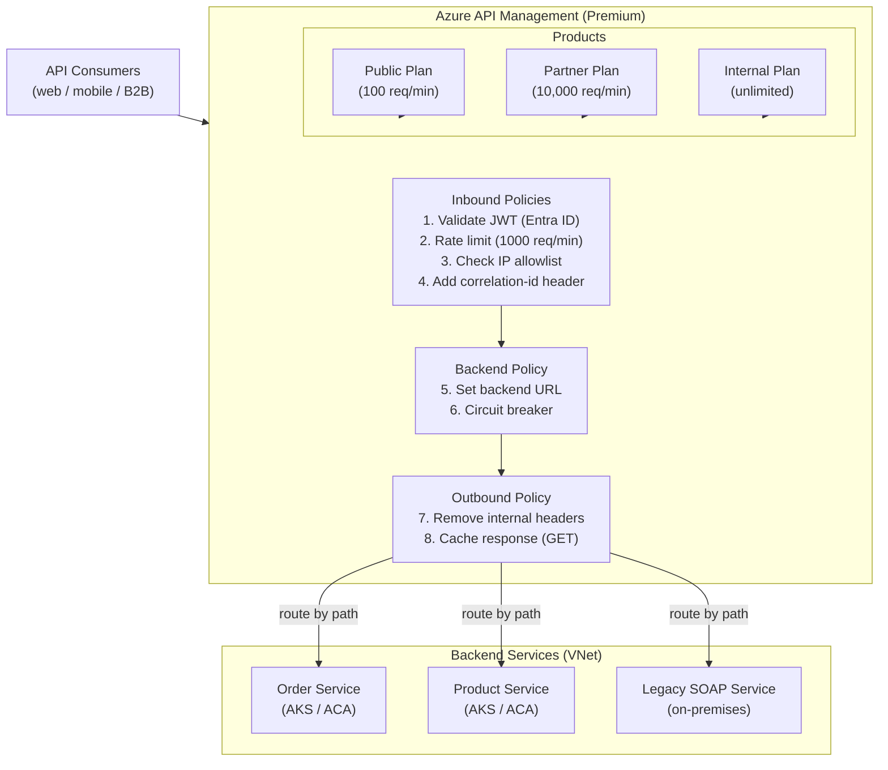

# Azure API Management (APIM)

## Category
Cloud Native, API Gateway, APIM, Rate Limiting, JWT, Policies, Developer Portal

## Context

**Azure API Management (APIM)** is a fully managed API gateway that sits in front of backend services — handling authentication, rate limiting, caching, transformation, and routing. It provides a centralised control plane for all APIs regardless of where backends run (Azure, on-premises, other clouds).

**APIM tiers**:
| Tier | Description | Scale | VNet |
|------|-------------|-------|------|
| **Developer** | Non-production, low cost | 1 unit | External / Internal |
| **Basic** | Light production | 2 units | None |
| **Standard** | Mid-scale production | 4 units | External |
| **Premium** | Enterprise — multi-region, Availability Zones | n units | External / Internal |
| **Consumption** | Serverless — pay per call | Infinite | None |
| **Basic v2 / Standard v2** | New tier — fast provision, VNet injection | 0-10 units | Internal / External |

**Core concepts**:
| Concept | Description |
|---------|-------------|
| **API** | Imported or created — REST, SOAP, GraphQL, WebSocket, gRPC |
| **Operation** | Individual HTTP method + path on an API |
| **Product** | Logical grouping of APIs — subscriptions and rate limits apply at product level |
| **Subscription** | API key tied to a product — used by consumers |
| **Policy** | XML pipeline applied at global, product, API, or operation scope — inbound → backend → outbound → on-error |
| **Named Value** | Key-value store for secrets and configuration referenced in policies (Key Vault-backed) |
| **Backend** | Backend URL + circuit breaker config |
| **Developer Portal** | Auto-generated documentation and API testing portal |

**Policy scopes** (evaluated in this order):
1. Global → 2. Product → 3. API → 4. Operation

---

## Pros

- **Centralised cross-cutting concerns**: Auth, rate limits, CORS, logging, caching — once in APIM, not per service.
- **Multiple authentication strategies**: JWT validation (Entra ID), subscription keys, mutual TLS, OAuth 2.0 all configurable via policy.
- **Developer portal**: Auto-generated interactive docs — reduces API consumer onboarding time.
- **Backend circuit breaker**: Built-in circuit breaker and retry logic — no code changes to backends needed.
- **Multi-region deployment (Premium)**: Route to nearest healthy backend with automatic failover.
- **GraphQL and WebSocket support**: Not just REST — passthrough or synthetic GraphQL resolvers.

---

## Cons

- **Cost**: Premium tier is expensive; Consumption tier lacks VNet support.
- **Policy language learning curve**: XML-based policy DSL is powerful but verbose.
- **Cold start on Consumption**: First call may have higher latency.
- **Limited transformations**: Complex payload transformations (e.g., XML ↔ JSON with XSLT) have complexity limits.
- **Deployment time**: Updating policies or APIs takes 20-45 seconds to propagate.

---

## Design Diagram



---

## Code Sample

### Bicep — APIM Instance + API + Policies

```bicep
// infrastructure/bicep/apim/apim.bicep
param location string = resourceGroup().location
param env string
param publisherEmail string
param publisherName string = 'My Company'

// ─── APIM Instance ────────────────────────────────────────────────────────────
resource apim 'Microsoft.ApiManagement/service@2023-09-01-preview' = {
  name:     'myapp-${env}-apim'
  location: location

  identity: { type: 'SystemAssigned' }   // For Key Vault access

  sku: {
    name:     env == 'prod' ? 'Premium' : 'Developer'
    capacity: env == 'prod' ? 2 : 1
  }

  properties: {
    publisherEmail: publisherEmail
    publisherName:  publisherName

    // Virtual Network injection (Premium tier)
    virtualNetworkType: 'External'
    virtualNetworkConfiguration: {
      subnetResourceId: apimSubnet.id
    }

    customProperties: {
      'Microsoft.WindowsAzure.ApiManagement.Gateway.Security.Protocols.Tls10': 'false'
      'Microsoft.WindowsAzure.ApiManagement.Gateway.Security.Protocols.Tls11': 'false'
      'Microsoft.WindowsAzure.ApiManagement.Gateway.Security.Backend.Protocols.Tls10': 'false'
      'Microsoft.WindowsAzure.ApiManagement.Gateway.Security.Backend.Protocols.Tls11': 'false'
    }
  }

  zones: env == 'prod' ? ['1', '2', '3'] : []
}

// ─── Named Value — secret from Key Vault ─────────────────────────────────────
resource namedValueJwtSecret 'Microsoft.ApiManagement/service/namedValues@2023-09-01-preview' = {
  parent: apim
  name:   'jwt-signing-key'
  properties: {
    displayName: 'jwt-signing-key'
    secret:      true
    keyVault: {
      secretIdentifier: 'https://${keyVaultName}.vault.azure.net/secrets/jwt-signing-key'
      identityClientId: null    // Use system-assigned MI
    }
  }
}

// ─── Backend — Order Service ──────────────────────────────────────────────────
resource orderBackend 'Microsoft.ApiManagement/service/backends@2023-09-01-preview' = {
  parent: apim
  name:   'order-service'
  properties: {
    url:         'https://order-service.internal'
    protocol:    'http'
    description: 'Order microservice on AKS'
    circuitBreaker: {
      rules: [
        {
          name:               'default'
          failureCondition: {
            count:         5
            interval:      'PT10S'
            statusCodeRanges: [{ min: 500, max: 599 }]
          }
          tripDuration:          'PT30S'
          acceptRetryAfter:      true
        }
      ]
    }
  }
}

// ─── API Definition ───────────────────────────────────────────────────────────
resource orderApi 'Microsoft.ApiManagement/service/apis@2023-09-01-preview' = {
  parent: apim
  name:   'order-api'
  properties: {
    displayName:          'Order API'
    description:          'Manage customer orders'
    path:                 'orders'
    protocols:            ['https']
    subscriptionRequired: false    // Auth via JWT, not subscription key
    serviceUrl:           'https://order-service.internal'

    // Import OpenAPI spec
    format: 'openapi+json-link'
    value:  'https://myapp-storage.blob.core.windows.net/specs/order-api.json'
  }
}

// ─── API-level Policy ─────────────────────────────────────────────────────────
resource orderApiPolicy 'Microsoft.ApiManagement/service/apis/policies@2023-09-01-preview' = {
  parent: orderApi
  name:   'policy'
  properties: {
    format: 'rawxml'
    value:  '''
<policies>
  <inbound>
    <base />

    <!-- 1. Validate JWT from Entra ID -->
    <validate-azure-ad-token
      tenant-id="{{azure-tenant-id}}"
      output-token-variable-name="jwt"
      failed-validation-httpcode="401"
      failed-validation-error-message="Unauthorized">
      <client-application-ids>
        <application-id>{{api-client-app-id}}</application-id>
      </client-application-ids>
      <required-claims>
        <claim name="roles" match="any">
          <value>orders.read</value>
          <value>orders.write</value>
        </claim>
      </required-claims>
    </validate-azure-ad-token>

    <!-- 2. Rate limit by user identity (from JWT sub claim) -->
    <rate-limit-by-key
      calls="100"
      renewal-period="60"
      counter-key="@(context.Variables.GetValueOrDefault<System.IdentityModel.Tokens.Jwt.JwtSecurityToken>("jwt")?.Subject ?? "anonymous")"
      increment-condition="@(context.Response.StatusCode < 500)" />

    <!-- 3. Add correlation ID for distributed tracing -->
    <set-header name="x-correlation-id" exists-action="skip">
      <value>@(Guid.NewGuid().ToString())</value>
    </set-header>

    <!-- 4. Forward caller identity to backend -->
    <set-header name="x-user-id" exists-action="override">
      <value>@(((System.IdentityModel.Tokens.Jwt.JwtSecurityToken)context.Variables["jwt"]).Subject)</value>
    </set-header>

    <!-- 5. Route to backend with circuit breaker -->
    <set-backend-service backend-id="order-service" />
  </inbound>

  <backend>
    <base />
    <retry condition="@(context.Response.StatusCode == 503)" count="3" interval="2" />
  </backend>

  <outbound>
    <base />

    <!-- 6. Cache GET responses for 30 seconds -->
    <cache-store duration="30" cache-response="@(context.Request.Method == "GET")" />

    <!-- 7. Remove internal headers -->
    <set-header name="x-powered-by" exists-action="delete" />
    <set-header name="server"        exists-action="delete" />

    <!-- 8. Add CORS headers (handled here, not per-service) -->
    <cors allow-credentialed-requests="true">
      <allowed-origins>
        <origin>https://myapp.example.com</origin>
      </allowed-origins>
      <allowed-methods>
        <method>GET</method>
        <method>POST</method>
        <method>PUT</method>
        <method>DELETE</method>
      </allowed-methods>
      <allowed-headers>
        <header>Authorization</header>
        <header>Content-Type</header>
        <header>x-correlation-id</header>
      </allowed-headers>
    </cors>
  </outbound>

  <on-error>
    <base />
    <!-- Return consistent error envelope -->
    <set-body>@{
      return new JObject(
        new JProperty("error", new JObject(
          new JProperty("code",    context.Response.StatusCode),
          new JProperty("message", context.LastError.Message),
          new JProperty("correlationId", context.Request.Headers.GetValueOrDefault("x-correlation-id", ""))
        ))
      ).ToString();
    }</set-body>
    <set-header name="Content-Type" exists-action="override">
      <value>application/json</value>
    </set-header>
  </on-error>
</policies>
    '''
  }
}

// ─── Product — Partner Plan ───────────────────────────────────────────────────
resource partnerProduct 'Microsoft.ApiManagement/service/products@2023-09-01-preview' = {
  parent: apim
  name:   'partner'
  properties: {
    displayName:          'Partner Plan'
    description:          'For trusted B2B partners'
    state:                'published'
    subscriptionRequired: true
    approvalRequired:     true       // Admin must approve
    subscriptionsLimit:   100
  }
}

resource partnerProductApi 'Microsoft.ApiManagement/service/products/apis@2023-09-01-preview' = {
  parent: partnerProduct
  name:   'order-api'
}
```

### TypeScript — APIM Subscriber SDK

```typescript
// src/clients/apim-client.ts
// Client-side: acquire Entra ID token and call APIM-protected API

import { PublicClientApplication } from '@azure/msal-node';

const msalClient = new PublicClientApplication({
  auth: {
    clientId:  process.env.CLIENT_ID!,
    authority: `https://login.microsoftonline.com/${process.env.TENANT_ID}`,
  },
});

async function getToken(): Promise<string> {
  const result = await msalClient.acquireTokenByClientCredential({
    scopes: [`api://${process.env.API_APP_ID}/.default`],
    clientSecret: process.env.CLIENT_SECRET!,
  });

  if (!result?.accessToken) throw new Error('Token acquisition failed');
  return result.accessToken;
}

export async function createOrder(order: {
  customerId: string;
  items: Array<{ productId: string; quantity: number }>;
}): Promise<{ orderId: string; status: string }> {
  const token = await getToken();

  const res = await fetch(`${process.env.APIM_BASE_URL}/orders`, {
    method: 'POST',
    headers: {
      Authorization:   `Bearer ${token}`,
      'Content-Type':  'application/json',
      'x-correlation-id': crypto.randomUUID(),
    },
    body: JSON.stringify(order),
  });

  if (!res.ok) {
    const error = await res.json();
    throw new Error(`Order creation failed: ${JSON.stringify(error)}`);
  }

  return res.json();
}
```
