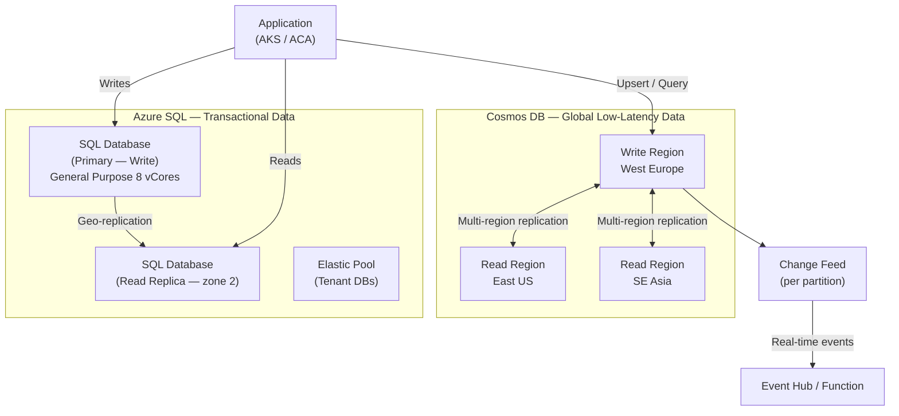

# Azure SQL & Cosmos DB

## Category
Cloud Native, Databases, Azure SQL, Cosmos DB, Elastic Pool, Partition Key, Change Feed

## Context

Azure offers two primary managed database families for cloud-native workloads:

**Azure SQL** — fully managed relational database, SQL Server-compatible, with built-in HA, AE, and backups. Cosmos DB — globally distributed, multi-model NoSQL database with guaranteed SLAs on latency, throughput, and availability.

### Azure SQL flavours

| Offering | Description | When to use |
|----------|-------------|-------------|
| **SQL Database (PaaS)** | Single database — serverless or provisioned vCores | Single app database, dev/test |
| **Elastic Pool** | Shared DTUs/vCores among multiple DBs — burst sharing | SaaS multi-tenant (one DB per tenant) |
| **SQL Managed Instance** | Full SQL Server engine (agent, CLR, linked servers) | Lift-and-shift from on-prem SQL Server |

### Cosmos DB API / Model choices

| API | Description | Key use case |
|-----|-------------|-------------|
| **NoSQL (Core)** | JSON documents, SQL-like query, native SDK | Default — new greenfield apps |
| **MongoDB** | Wire-compatible MongoDB API | Migrate from MongoDB |
| **Cassandra** | CQL-compatible | Wide-column, IoT, time-series |
| **Gremlin** | Graph traversal (TinkerPop) | Knowledge graphs, recommendations |
| **Table** | Azure Table-compatible | Migrate from Azure Table Storage |
| **PostgreSQL** | Citus-distributed PostgreSQL | Relational + hyperscale |

### Cosmos DB capacity modes

| Mode | Billing | Best for |
|------|---------|----------|
| **Provisioned throughput (RU/s)** | Per RU/s allocated | Predictable, high-traffic workloads |
| **Autoscale** | Scales 10%–100% of max RU/s automatically | Variable traffic |
| **Serverless** | Per request billed | Dev, infrequent, bursty workloads |

### Cosmos DB partition key design rules

- Choose a property with **high cardinality** (many distinct values).
- Choose a property that results in **even distribution** of reads and writes.
- Include it in **all query filters** to avoid cross-partition fan-out.
- For multi-tenant: `/tenantId` or `/tenantId_entityType` (synthetic compound key).
- For time-series: `/deviceId` (not `/date` — hot partition risk).

---

## Pros

**Azure SQL**:
- Full SQL Server compatibility — stored procedures, triggers, full-text search, geo-replication.
- Zone-redundant HA with automatic failover — no manual cluster management.
- Serverless tier auto-pauses on idle — cost-effective for dev.
- Always Encrypted supports column-level encryption with client-side key management.

**Cosmos DB**:
- 99.999% availability SLA (multi-region write).
- Single-digit millisecond latency at any scale — globally.
- Turnkey global distribution — add / remove regions via portal or API call.
- Change Feed — stream of ordered changes per partition — triggers real-time processing without polling.
- Five consistency models — tune between performance and consistency per operation.

---

## Cons

**Azure SQL**:
- No horizontal sharding by default — scale-up only for provisioned; Elastic Pool limited.
- Serverless has cold start latency (10-20s auto-resume).
- Cross-database queries require federation patterns or Elastic Query.

**Cosmos DB**:
- RU (Request Unit) model requires capacity planning — under-provisioning causes 429 throttling.
- Bad partition key choice causes hot partitions — very hard to change without migration.
- Transactions limited to single logical partition.
- Expensive for large analytical / scan workloads — use Synapse Link / mirroring for analytics.
- Learning curve: partition key, RU budgeting, consistency model selection.

---

## Design Diagram



---

## Code Sample

### Bicep — Azure SQL with Entra Auth + Private Endpoint

```bicep
// infrastructure/bicep/sql/azure-sql.bicep
param location string = resourceGroup().location
param env      string

resource sqlServer 'Microsoft.Sql/servers@2023-08-01-preview' = {
  name:     'myapp-${env}-sql'
  location: location

  identity: { type: 'SystemAssigned' }    // Used to read Key Vault for TDE key

  properties: {
    // Disable SQL password authentication — Entra ID only
    administrators: {
      administratorType:         'ActiveDirectory'
      azureADOnlyAuthentication: true     // Enforce — no SQL logins
      login:                     'myapp-dba-group@example.com'
      sid:                       '<ENTRA_GROUP_OBJECT_ID>'
      tenantId:                  subscription().tenantId
    }

    minimalTlsVersion:         '1.3'
    publicNetworkAccess:       'Disabled'  // Private Endpoint only
    restrictOutboundNetworkAccess: 'Enabled'
  }
}

resource sqlDatabase 'Microsoft.Sql/servers/databases@2023-08-01-preview' = {
  parent: sqlServer
  name:   'myapp'
  location: location
  sku: {
    name:     'GP_Gen5'
    tier:     'GeneralPurpose'
    family:   'Gen5'
    capacity: 4     // 4 vCores
  }
  properties: {
    zoneRedundant:       env == 'prod'
    readScale:           'Enabled'     // Route read-intent connections to replica
    backupStorageRedundancy: 'Zone'
    highAvailabilityReplicaCount: 1   // Zone-redundant replica
  }
}

// Auditing to Log Analytics
resource sqlAudit 'Microsoft.Sql/servers/auditingSettings@2023-08-01-preview' = {
  parent: sqlServer
  name:   'default'
  properties: {
    state:              'Enabled'
    isAzureMonitorTargetEnabled: true
    auditActionsAndGroups: [
      'SUCCESSFUL_DATABASE_AUTHENTICATION_GROUP'
      'FAILED_DATABASE_AUTHENTICATION_GROUP'
      'BATCH_COMPLETED_GROUP'
    ]
  }
}

// Vulnerability assessment
resource sqlVaThreat 'Microsoft.Sql/servers/advancedThreatProtectionSettings@2023-08-01-preview' = {
  parent: sqlServer
  name:   'Default'
  properties: { state: 'Enabled' }
}
```

### TypeScript — Azure SQL with Managed Identity (no password)

```typescript
// src/data/sql-client.ts
import sql from 'mssql';
import { DefaultAzureCredential } from '@azure/identity';

let pool: sql.ConnectionPool | null = null;

async function getAccessToken(): Promise<string> {
  const credential = new DefaultAzureCredential();
  const token = await credential.getToken('https://database.windows.net/');
  return token.token;
}

export async function getPool(): Promise<sql.ConnectionPool> {
  if (pool?.connected) return pool;

  const accessToken = await getAccessToken();

  pool = new sql.ConnectionPool({
    server: `${process.env.SQL_SERVER}.database.windows.net`,
    database: process.env.SQL_DATABASE,
    options: {
      encrypt: true,             // Always encrypt in transit
      trustServerCertificate: false,
    },
    authentication: {
      type: 'azure-active-directory-access-token',
      options: { token: accessToken },
    },
    pool: {
      max: 20,
      min: 2,
      idleTimeoutMillis: 30_000,
    },
  });

  await pool.connect();
  return pool;
}

export async function findOrderById(orderId: string): Promise<Order | null> {
  const db = await getPool();

  // Always parameterise — never string concatenation
  const result = await db
    .request()
    .input('orderId', sql.UniqueIdentifier, orderId)
    .query<Order>(
      `SELECT o.Id, o.CustomerId, o.Status, o.TotalAmount, o.CreatedAt
       FROM Orders o
       WHERE o.Id = @orderId`,
    );

  return result.recordset[0] ?? null;
}
```

### Bicep — Cosmos DB with Autoscale + Multi-Region

```bicep
// infrastructure/bicep/cosmos/cosmos-db.bicep
param location  string = resourceGroup().location
param env       string
param secondaryRegion string = 'eastus'

resource cosmosAccount 'Microsoft.DocumentDB/databaseAccounts@2024-02-15-preview' = {
  name:     'myapp-${env}-cosmos'
  location: location
  kind:     'GlobalDocumentDB'

  identity: { type: 'SystemAssigned' }

  properties: {
    consistencyPolicy: {
      // Session consistency: reads always see your own writes — best default
      defaultConsistencyLevel: 'Session'
    }

    locations: [
      {
        locationName:     location
        failoverPriority: 0     // Write region
        isZoneRedundant:  env == 'prod'
      }
      {
        locationName:     secondaryRegion
        failoverPriority: 1     // Read region (becomes write on failover)
        isZoneRedundant:  env == 'prod'
      }
    ]

    // Enable multi-region writes (active-active)
    enableMultipleWriteLocations: env == 'prod'

    databaseAccountOfferType:    'Standard'
    publicNetworkAccess:         'Disabled'    // Private Endpoint only
    enableAutomaticFailover:     true
    enableFreeTier:              false

    backupPolicy: {
      type: 'Continuous'    // Point-in-time restore up to 30 days
      continuousModeProperties: { tier: 'Continuous30Days' }
    }

    // Disable key-based authentication — use RBAC instead
    disableLocalAuth: true
  }
}

// Database
resource cosmosDb 'Microsoft.DocumentDB/databaseAccounts/sqlDatabases@2024-02-15-preview' = {
  parent: cosmosAccount
  name:   'myapp'
  properties: {
    resource: { id: 'myapp' }
  }
}

// Container — Orders (partition key: /customerId)
resource ordersContainer 'Microsoft.DocumentDB/databaseAccounts/sqlDatabases/containers@2024-02-15-preview' = {
  parent: cosmosDb
  name:   'orders'
  properties: {
    resource: {
      id: 'orders'
      partitionKey: {
        paths: ['/customerId']
        kind:  'Hash'
        version: 2    // Required for large partition key values
      }
      indexingPolicy: {
        automatic: true
        indexingMode: 'consistent'
        includedPaths: [{ path: '/*' }]
        excludedPaths: [
          { path: '/description/?'  }   // Don't index large free-text fields
          { path: '/_etag/?'         }
        ]
        compositeIndexes: [
          // Composite index for ORDER BY queries
          [
            { path: '/customerId', order: 'ascending'  }
            { path: '/createdAt',  order: 'descending' }
          ]
        ]
      }
      // Change Feed retention — 7 days
      changeFeedPolicy: { retentionDuration: 10080 }
      // TTL on documents — auto-delete stale data
      defaultTtl: -1   // -1 = use per-document ttl field if present
    }
    options: {
      autoscaleSettings: {
        maxThroughput: 10000    // Scales 1,000–10,000 RU/s automatically
      }
    }
  }
}

// ─── RBAC — Cosmos DB (data plane) ───────────────────────────────────────────
// Built-in role: Cosmos DB Built-in Data Contributor
resource cosmosRoleAssignment 'Microsoft.DocumentDB/databaseAccounts/sqlRoleAssignments@2024-02-15-preview' = {
  parent: cosmosAccount
  name:   guid(cosmosAccount.id, workloadIdentity.id, '00000000-0000-0000-0000-000000000002')
  properties: {
    roleDefinitionId: '${cosmosAccount.id}/sqlRoleDefinitions/00000000-0000-0000-0000-000000000002'
    principalId:      workloadIdentity.properties.principalId
    scope:            cosmosAccount.id
  }
}
```

### TypeScript — Cosmos DB Client with Change Feed

```typescript
// src/data/cosmos-client.ts
import {
  CosmosClient,
  PartitionKeyDefinitionVersion,
  ChangeFeedStartFrom,
  type FeedResponse,
} from '@azure/cosmos';
import { DefaultAzureCredential } from '@azure/identity';

// Use DefaultAzureCredential — works with Managed Identity, Workload Identity, az login
const client = new CosmosClient({
  endpoint:    process.env.COSMOS_ENDPOINT!,
  aadCredentials: new DefaultAzureCredential(),  // No key needed
});

const container = client
  .database('myapp')
  .container('orders');

// ─── Upsert an order ──────────────────────────────────────────────────────────
export interface Order {
  id:         string;
  customerId: string;    // Partition key
  status:     'pending' | 'confirmed' | 'shipped' | 'delivered';
  totalAmount: number;
  items:      Array<{ productId: string; quantity: number; price: number }>;
  createdAt:  string;
  updatedAt:  string;
}

export async function upsertOrder(order: Order): Promise<Order> {
  const { resource } = await container.items.upsert<Order>(order);
  return resource!;
}

// ─── Query orders for a customer (single partition) ───────────────────────────
export async function getOrdersForCustomer(
  customerId: string,
  limit = 20,
): Promise<Order[]> {
  const { resources } = await container.items
    .query<Order>({
      query: `SELECT * FROM c
              WHERE c.customerId = @customerId
              ORDER BY c.createdAt DESC
              OFFSET 0 LIMIT @limit`,
      parameters: [
        { name: '@customerId', value: customerId },
        { name: '@limit',      value: limit },
      ],
    }, {
      partitionKey: customerId,  // Target single partition — no fan-out
    })
    .fetchAll();

  return resources;
}

// ─── Change Feed Processor — real-time order events ──────────────────────────
export async function startChangeFeedProcessor(
  onChanges: (changes: Order[]) => Promise<void>,
): Promise<void> {
  const leaseContainer = client.database('myapp').container('leases');

  const processor = container
    .items
    .changeFeed(ChangeFeedStartFrom.Now())
    .getAsyncIterator();

  // In production use the ChangeFeedProcessor pattern with lease container:
  const cfProcessor = container.items
    .changeFeedIterator<Order>({ changeFeedStartFrom: ChangeFeedStartFrom.Now() });

  console.log('Change Feed Processor started');

  for await (const page of cfProcessor.getAsyncIterator()) {
    if (page.result.length > 0) {
      await onChanges(page.result);
    }
  }
}

// ─── Usage example ────────────────────────────────────────────────────────────
await startChangeFeedProcessor(async (orders) => {
  for (const order of orders) {
    console.log(`Order ${order.id} changed: status=${order.status}`);
    // Publish to Event Hub / Service Bus for downstream processing
  }
});
```
