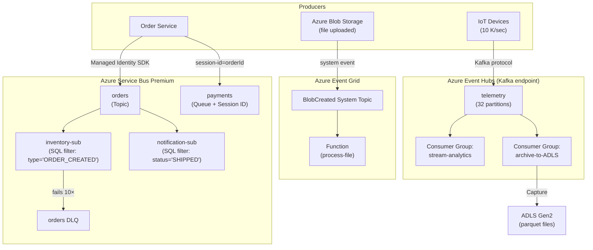

# Azure Service Bus, Event Grid & Event Hubs

## Category
Cloud Native, Messaging, Service Bus, Event Grid, Event Hubs, Pub/Sub, Event-Driven

## Context

Azure provides three distinct messaging services — each solves a different communication pattern:

| Service | Pattern | Guarantee | Ordering | Consumers | Throughput |
|---------|---------|-----------|---------|-----------|------------|
| **Service Bus** | Queue / Pub-Sub (Topics) | At-least-once | FIFO per session | Competing consumers | ~1 MB msg, 80 GB quota |
| **Event Grid** | Push notifications | At-least-once | No | Push to webhooks / Functions | Millions/sec, 1 MB event |
| **Event Hubs** | Log/stream ingestion | At-least-once | Per partition | Parallel consumer groups | 1 MB msg, petabytes/day |

### Service Bus — when to use

- **Queues**: Decouple producer from consumer; load-level bursts; competing consumers.
- **Topics + Subscriptions**: Fan-out messages; filter by content using SQL-like filters.
- **Sessions**: Guarantee ordered processing per entity (e.g., all events for order-123 processed in sequence).
- **Dead-letter queue (DLQ)**: Automatic capture of poison messages — inspect and re-queue.
- **Duplicate detection**: Idempotent message delivery window — de-dup by `message-id`.
- **Deferred messages**: Accept a message but defer processing; re-retrieve by sequence number.
- **Scheduled messages**: Enqueue now, deliver at a future time.

### Event Grid — when to use

- React to Azure resource events (Blob created, VM deallocated, Cosmos DB changed).
- Serverless eventing: one event, many handlers (Functions, Logic Apps, webhooks).
- CloudEvents 1.0-compatible schema.

### Event Hubs — when to use

- High-throughput telemetry, click-stream, log ingestion.
- Kafka-compatible endpoint — migrate Kafka producers/consumers with zero code change.
- Capture to ADLS Gen2 / Blob — landing zone for data engineering pipelines.
- Replay: consumers can re-read from any offset within the retention window (1–90 days).

---

## Pros

- **Service Bus sessions**: Strict FIFO per entity without a single-consumer bottleneck — scale horizontally while preserving order.
- **Event Hubs Kafka endpoint**: Existing Kafka applications connect without rewriting — just change the bootstrap server.
- **Event Grid push model**: No polling — Azure pushes events to subscribers within seconds.
- **DLQ + dead-letter inspection**: Built-in poison message handling — no custom DLQ infrastructure.
- **KEDA integration**: ACA and AKS workers scale directly on queue message count or Event Hubs consumer lag.
- **Managed Identity auth**: All three services support RBAC-based access — no connection strings in config.

---

## Cons

- **Service Bus**: Not designed for high-throughput streaming (use Event Hubs for >10 K msg/s).
- **Event Grid**: No ordering, no re-play — not suitable for stream processing; delivery retries up to 24 hours then events are dropped.
- **Event Hubs**: Pull model — consumers must manage offsets/checkpoints; not a queue (no per-message ack).
- **Service Bus Premium** required for VNet injection, 1 MB messages, and geo-disaster recovery.

---

## Design Diagram



---

## Code Sample

### Bicep — Service Bus Premium with Topics, Subscriptions & DLQ

```bicep
// infrastructure/bicep/messaging/service-bus.bicep
param location string = resourceGroup().location
param env string

resource serviceBus 'Microsoft.ServiceBus/namespaces@2023-01-01-preview' = {
  name:     'myapp-${env}-sb'
  location: location
  sku: {
    name: 'Premium'    // Required for VNet, geo-DR, 1 MB messages
    tier: 'Premium'
    capacity: 1        // Processing Units — scale up for higher throughput
  }

  identity: { type: 'SystemAssigned' }

  properties: {
    minimumTlsVersion:   '1.3'
    publicNetworkAccess: 'Disabled'   // Private Endpoint only
    disableLocalAuth:    true         // RBAC only — no SAS keys
    zoneRedundant:       env == 'prod'
  }
}

// ─── Topic — Orders ────────────────────────────────────────────────────────────
resource ordersTopic 'Microsoft.ServiceBus/namespaces/topics@2023-01-01-preview' = {
  parent: serviceBus
  name:   'orders'
  properties: {
    maxMessageSizeInKilobytes:     256
    defaultMessageTimeToLive:      'PT1H'    // Undelivered messages expire in 1 hour
    requiresDuplicateDetection:    true
    duplicateDetectionHistoryTimeWindow: 'PT5M'
    enablePartitioning:            false     // Premium: partitioning built into PE
    supportOrdering:               true
    enableBatchedOperations:       true
  }
}

// ─── Subscription — Inventory Service ────────────────────────────────────────
resource inventorySubscription 'Microsoft.ServiceBus/namespaces/topics/subscriptions@2023-01-01-preview' = {
  parent: ordersTopic
  name:   'inventory-service'
  properties: {
    lockDuration:                  'PT2M'    // 2 min to process before re-delivery
    maxDeliveryCount:              10        // → DLQ after 10 failed attempts
    deadLetteringOnMessageExpiration: true
    requiresSession:               false
    enableBatchedOperations:       true
  }
}

resource inventoryFilter 'Microsoft.ServiceBus/namespaces/topics/subscriptions/rules@2023-01-01-preview' = {
  parent: inventorySubscription
  name:   'order-created-filter'
  properties: {
    filterType: 'SqlFilter'
    sqlFilter: {
      sqlExpression: "eventType = 'ORDER_CREATED' OR eventType = 'ORDER_CANCELLED'"
    }
  }
}

// ─── Queue — Payments (with sessions for FIFO per order) ─────────────────────
resource paymentsQueue 'Microsoft.ServiceBus/namespaces/queues@2023-01-01-preview' = {
  parent: serviceBus
  name:   'payments'
  properties: {
    requiresSession:               true     // Session = FIFO per sessionId (orderId)
    lockDuration:                  'PT5M'
    maxDeliveryCount:              5
    defaultMessageTimeToLive:      'P1D'
    deadLetteringOnMessageExpiration: true
    requiresDuplicateDetection:    true
    duplicateDetectionHistoryTimeWindow: 'PT10M'
  }
}

// ─── Role Assignments ─────────────────────────────────────────────────────────
// Service Bus Data Sender — for publishers
var sbSenderRoleId = '69a216fc-b8fb-44d8-bc22-1f3c2cd27a39'

resource senderRoleAssignment 'Microsoft.Authorization/roleAssignments@2022-04-01' = {
  name:  guid(serviceBus.id, publisherIdentity.id, sbSenderRoleId)
  scope: serviceBus
  properties: {
    roleDefinitionId: subscriptionResourceId('Microsoft.Authorization/roleDefinitions', sbSenderRoleId)
    principalId:      publisherIdentity.properties.principalId
    principalType:    'ServicePrincipal'
  }
}

// Service Bus Data Receiver — for consumers
var sbReceiverRoleId = '4f6d3b9b-027b-4f4c-9142-0e5a2a2247e0'

resource receiverRoleAssignment 'Microsoft.Authorization/roleAssignments@2022-04-01' = {
  name:  guid(serviceBus.id, consumerIdentity.id, sbReceiverRoleId)
  scope: serviceBus
  properties: {
    roleDefinitionId: subscriptionResourceId('Microsoft.Authorization/roleDefinitions', sbReceiverRoleId)
    principalId:      consumerIdentity.properties.principalId
    principalType:    'ServicePrincipal'
  }
}
```

### TypeScript — Service Bus Publisher (topics, sessions, duplicate detection)

```typescript
// src/messaging/order-publisher.ts
import {
  ServiceBusClient,
  type ServiceBusMessage,
} from '@azure/service-bus';
import { DefaultAzureCredential } from '@azure/identity';

const sbClient = new ServiceBusClient(
  `${process.env.SERVICE_BUS_NAMESPACE}.servicebus.windows.net`,
  new DefaultAzureCredential(),   // Managed Identity / Workload Identity
);

const orderSender = sbClient.createSender('orders');

export interface OrderEvent {
  eventType: 'ORDER_CREATED' | 'ORDER_UPDATED' | 'ORDER_CANCELLED';
  orderId:   string;
  customerId: string;
  payload:   unknown;
}

export async function publishOrderEvent(event: OrderEvent): Promise<void> {
  const message: ServiceBusMessage = {
    body: event,

    // messageId for duplicate detection — idempotent publish
    messageId: `${event.eventType}:${event.orderId}`,

    // sessionId for FIFO ordering (if using sessions on this topic)
    sessionId: event.orderId,

    // Application properties used by subscription SQL filters
    applicationProperties: {
      eventType:  event.eventType,
      customerId: event.customerId,
    },

    contentType: 'application/json',
    timeToLive:  60_000,   // 1 minute
  };

  await orderSender.sendMessages(message);
}

// ─── Batch publish — more efficient for bulk operations ───────────────────────
export async function publishOrderEventsBatch(events: OrderEvent[]): Promise<void> {
  let batch = await orderSender.createMessageBatch();

  for (const event of events) {
    const added = batch.tryAddMessage({
      body:                  event,
      messageId:             `${event.eventType}:${event.orderId}`,
      applicationProperties: { eventType: event.eventType },
    });

    if (!added) {
      // Batch full — send current batch and start a new one
      await orderSender.sendMessages(batch);
      batch = await orderSender.createMessageBatch();
      batch.tryAddMessage({ body: event, messageId: `${event.eventType}:${event.orderId}` });
    }
  }

  if (batch.count > 0) {
    await orderSender.sendMessages(batch);
  }
}
```

### TypeScript — Service Bus Consumer (sessions, DLQ inspection)

```typescript
// src/messaging/order-consumer.ts
import {
  ServiceBusClient,
  ServiceBusSessionReceiver,
  type ProcessErrorArgs,
} from '@azure/service-bus';
import { DefaultAzureCredential } from '@azure/identity';

const sbClient = new ServiceBusClient(
  `${process.env.SERVICE_BUS_NAMESPACE}.servicebus.windows.net`,
  new DefaultAzureCredential(),
);

// ─── Session receiver — FIFO per orderId ─────────────────────────────────────
export async function startSessionConsumer(): Promise<void> {
  // acceptNextSession() blocks until a session is available
  // Each call processes one session; run in a loop with concurrency
  const sessionReceiver: ServiceBusSessionReceiver =
    await sbClient.acceptNextSession('payments', {
      maxAutoLockRenewalDurationInMs: 5 * 60 * 1000,  // 5 min max processing
    });

  console.log(`Processing session: ${sessionReceiver.sessionId}`);

  const messages = await sessionReceiver.receiveMessages(10, { maxWaitTimeInMs: 5000 });

  for (const message of messages) {
    try {
      await processPayment(message.body);
      await sessionReceiver.completeMessage(message);   // ACK — remove from queue
    } catch (err) {
      if (message.deliveryCount >= 5) {
        // Exceeded max delivery count — send to DLQ with reason
        await sessionReceiver.deadLetterMessage(message, {
          deadLetterReason: 'MaxDeliveryCountExceeded',
          deadLetterErrorDescription: String(err),
        });
      } else {
        // Return to queue for retry
        await sessionReceiver.abandonMessage(message);
      }
    }
  }

  await sessionReceiver.close();
}

// ─── DLQ consumer — inspect and re-queue or alert ────────────────────────────
export async function processDlq(): Promise<void> {
  const dlqReceiver = sbClient.createReceiver('payments/$deadletterqueue');

  const messages = await dlqReceiver.receiveMessages(10, { maxWaitTimeInMs: 1000 });

  for (const msg of messages) {
    console.error('DLQ message:', {
      messageId: msg.messageId,
      reason:    msg.deadLetterReason,
      description: msg.deadLetterErrorDescription,
      body:      msg.body,
    });

    // Alert — send to monitoring / alert team
    // Optionally re-queue after fix: await orderSender.sendMessages({ body: msg.body, ... })
    await dlqReceiver.completeMessage(msg);
  }

  await dlqReceiver.close();
}

async function processPayment(payload: unknown): Promise<void> {
  // Payment processing logic
  console.log('Processing payment:', payload);
}
```

### TypeScript — Event Hubs Producer + Consumer (Kafka SDK)

```typescript
// src/telemetry/event-hubs-producer.ts
// Using Kafka SDK — production of events to Event Hubs Kafka endpoint
import { Kafka, CompressionTypes } from 'kafkajs';

const kafka = new Kafka({
  clientId: 'telemetry-producer',
  brokers:  [`${process.env.EVENT_HUB_NAMESPACE}.servicebus.windows.net:9093`],
  ssl: true,
  sasl: {
    mechanism: 'oauthbearer',
    oauthBearerProvider: async () => {
      // Acquire token via Managed Identity
      const { DefaultAzureCredential } = await import('@azure/identity');
      const cred = new DefaultAzureCredential();
      const token = await cred.getToken('https://eventhubs.azure.net/');
      return {
        value: token.token,
        // Required by kafkajs OAuthBearer format
        extensions: { auth: token.token },
      };
    },
  },
});

const producer = kafka.producer({ compression: CompressionTypes.GZIP });
await producer.connect();

export async function publishTelemetry(events: TelemetryEvent[]): Promise<void> {
  await producer.send({
    topic: 'telemetry',
    messages: events.map((e) => ({
      key:   e.deviceId,          // Partition by deviceId — same device → same partition
      value: JSON.stringify(e),
    })),
  });
}
```
