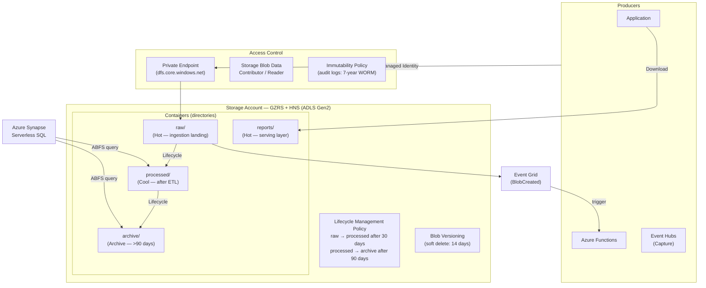

# Azure Blob Storage & Data Lake

## Category
Cloud Native, Storage, Blob Storage, ADLS Gen2, Lifecycle Management, SAS, Private Endpoint

## Context

**Azure Blob Storage** is Azure's massively scalable object storage service — identical to AWS S3 in purpose. **Azure Data Lake Storage Gen2 (ADLS Gen2)** layers hierarchical namespace (HNS) on top of Blob Storage, enabling directory semantics, POSIX-like ACLs, and Hadoop/Spark compatibility.

### Storage account types

| Type | Description |
|------|-------------|
| **Standard (GPv2)** | General purpose v2 — Blob, Queue, Table, Files; most workloads |
| **Premium Block Blob** | Low-latency for small block blobs (< 256 KB) — IoT, event streams |
| **Premium Page Blob** | Managed disks backing (not typically used directly) |

### Blob access tiers

| Tier | Access Frequency | Storage Cost | Access Cost | Min Retention |
|------|---------------|-------------|-------------|---------------|
| **Hot** | Frequent | Highest | Lowest | None |
| **Cool** | Infrequent (≥30 days) | Lower | Higher | 30 days |
| **Cold** | Rare (≥90 days) | Lower still | Higher | 90 days |
| **Archive** | Rarely accessed | Lowest | Highest + rehydration delay | 180 days |

Lifecycle Management rules automatically transition blobs between tiers or delete on age.

### Redundancy options

| Option | Description | Durability | Availability |
|--------|-------------|-----------|-------------|
| **LRS** | 3 copies in 1 datacenter | 11 nines | 99.9% |
| **ZRS** | 3 copies across 3 AZs in 1 region | 12 nines | 99.9% |
| **GRS** | LRS + async copy to secondary region | 16 nines | 99.9% (primary) |
| **GZRS** | ZRS + async copy to secondary region | 16 nines | 99.99% with RA-GZRS |

### ADLS Gen2 — additional capabilities

- **Hierarchical Namespace (HNS)**: True directory rename/delete — O(1) atomic operations, unlike Blob flat namespace.
- **POSIX ACLs**: File and directory-level ACLs using group/user/other — fine-grained access for analytics engines.
- **Spark / Hadoop ABFS**: `abfs://container@account.dfs.core.windows.net/path` — native analytics workload support.
- **Azure Synapse Analytics integration**: Directly query Parquet / Delta Lake files via serverless SQL.

---

## Pros

- **Virtually unlimited scale**: No pre-provisioned capacity — storage grows on demand; charged per GB used.
- **Lifecycle management**: Automatic tier transitions and deletion on age — no custom scripts needed.
- **Private Endpoints + disabled public access**: No public internet exposure — data never leaves your VNet.
- **Immutability policies**: WORM (Write Once Read Many) — regulatory compliance, audit log protection.
- **Versioning + soft delete**: Recover overwritten or deleted blobs within the retention window.
- **Event integration**: Blob events (Created, Deleted) publish to Event Grid — trigger processing pipelines without polling.

---

## Cons

- **No real directory semantics without HNS**: Without ADLS Gen2, bulk deletes and renames are slow (one blob at a time).
- **Archive rehydration latency**: 1–15 hours to move a blob from Archive before it is readable.
- **Egress costs**: Data transfer out of Azure region is billed — account for this in cross-region architectures.
- **Eventual consistency on list operations**: Large blob counts with concurrent writes can show stale list results briefly.

---

## Design Diagram



---

## Code Sample

### Bicep — Storage Account with ADLS Gen2, Lifecycle, Private Endpoint

```bicep
// infrastructure/bicep/storage/storage-account.bicep
param location string = resourceGroup().location
param env string

resource storageAccount 'Microsoft.Storage/storageAccounts@2023-05-01' = {
  name:     'myapp${env}dl'   // Globally unique, 3-24 chars, no hyphens
  location: location
  kind:     'StorageV2'

  identity: { type: 'SystemAssigned' }

  sku: { name: env == 'prod' ? 'Standard_GZRS' : 'Standard_LRS' }

  properties: {
    // Enable ADLS Gen2 hierarchical namespace
    isHnsEnabled: true

    accessTier: 'Hot'

    // Disable all public access
    publicNetworkAccess:             'Disabled'
    allowBlobPublicAccess:           false
    allowSharedKeyAccess:            false    // Force RBAC — no access keys
    minimumTlsVersion:               'TLS1_3'
    supportsHttpsTrafficOnly:        true

    networkAcls: {
      defaultAction: 'Deny'
      bypass:        'AzureServices'   // Allow trusted Azure services (backup, metrics)
      ipRules:       []
      virtualNetworkRules: []
    }

    encryption: {
      requireInfrastructureEncryption: true   // Double encryption
      keySource: 'Microsoft.Storage'
      services: {
        blob: { enabled: true, keyType: 'Account' }
        file: { enabled: true, keyType: 'Account' }
      }
    }
  }
}

// ─── Blob Service Settings ─────────────────────────────────────────────────────
resource blobService 'Microsoft.Storage/storageAccounts/blobServices@2023-05-01' = {
  parent: storageAccount
  name:   'default'
  properties: {
    deleteRetentionPolicy:         { enabled: true, days: 14 }    // Soft delete blobs
    containerDeleteRetentionPolicy: { enabled: true, days: 14 }   // Soft delete containers
    isVersioningEnabled:           true                            // Blob versioning
    changeFeed:                    { enabled: true, retentionInDays: 7 }
  }
}

// ─── Containers ────────────────────────────────────────────────────────────────
resource rawContainer 'Microsoft.Storage/storageAccounts/blobServices/containers@2023-05-01' = {
  parent: blobService
  name:   'raw'
  properties: {
    publicAccess:      'None'
    // Immutability for audit/compliance logs
    immutableStorageWithVersioning: { enabled: false }
  }
}

resource auditContainer 'Microsoft.Storage/storageAccounts/blobServices/containers@2023-05-01' = {
  parent: blobService
  name:   'audit-logs'
  properties: {
    publicAccess: 'None'
    immutableStorageWithVersioning: {
      enabled: true    // WORM — blobs cannot be deleted or modified
    }
  }
}

// ─── Lifecycle Management Policy ──────────────────────────────────────────────
resource lifecyclePolicy 'Microsoft.Storage/storageAccounts/managementPolicies@2023-05-01' = {
  parent: storageAccount
  name:   'default'
  properties: {
    policy: {
      rules: [
        {
          name:    'transition-raw-to-cool'
          enabled: true
          type:    'Lifecycle'
          definition: {
            filters: { blobTypes: ['blockBlob'], prefixMatch: ['raw/'] }
            actions: {
              baseBlob: {
                tierToCool:    { daysAfterModificationGreaterThan: 30 }
                tierToCold:    { daysAfterModificationGreaterThan: 90 }
                tierToArchive: { daysAfterModificationGreaterThan: 365 }
                delete:        { daysAfterModificationGreaterThan: 1825 }  // 5 years
              }
              snapshot: { delete: { daysAfterCreationGreaterThan: 90 } }
            }
          }
        }
        {
          name:    'delete-temp-files'
          enabled: true
          type:    'Lifecycle'
          definition: {
            filters: { blobTypes: ['blockBlob'], prefixMatch: ['temp/'] }
            actions: {
              baseBlob: { delete: { daysAfterModificationGreaterThan: 1 } }
            }
          }
        }
      ]
    }
  }
}

// ─── Private Endpoint — DFS endpoint (for ADLS Gen2 / HNS) ──────────────────
resource adlsPrivateEndpoint 'Microsoft.Network/privateEndpoints@2024-01-01' = {
  name:     'adls-dfs-pe'
  location: location
  properties: {
    subnet: { id: dataSubnet.id }
    privateLinkServiceConnections: [
      {
        name: 'adls-dfs-connection'
        properties: {
          privateLinkServiceId: storageAccount.id
          groupIds:             ['dfs']   // Use 'blob' for non-HNS, 'dfs' for ADLS Gen2
        }
      }
    ]
  }
}

// ─── RBAC ─────────────────────────────────────────────────────────────────────
var storageContributorRoleId = 'ba92f5b4-2d11-453d-a403-e96b0029c9fe'

resource workloadBlobAccess 'Microsoft.Authorization/roleAssignments@2022-04-01' = {
  name:  guid(storageAccount.id, workloadIdentity.id, storageContributorRoleId)
  scope: storageAccount
  properties: {
    roleDefinitionId: subscriptionResourceId('Microsoft.Authorization/roleDefinitions', storageContributorRoleId)
    principalId:      workloadIdentity.properties.principalId
    principalType:    'ServicePrincipal'
  }
}
```

### TypeScript — Blob Storage (upload, download, SAS, streaming)

```typescript
// src/storage/blob-client.ts
import {
  BlobServiceClient,
  ContainerClient,
  BlockBlobClient,
  StorageSharedKeyCredential,
  generateBlobSASQueryParameters,
  BlobSASPermissions,
} from '@azure/storage-blob';
import { DefaultAzureCredential } from '@azure/identity';
import { Readable } from 'stream';

// DefaultAzureCredential — no connection strings or account keys
const blobServiceClient = new BlobServiceClient(
  `https://${process.env.STORAGE_ACCOUNT}.blob.core.windows.net`,
  new DefaultAzureCredential(),
);

// ─── Upload a file ─────────────────────────────────────────────────────────────
export async function uploadBlob(
  containerName: string,
  blobPath:      string,
  data:          Buffer | Readable,
  contentType:   string,
  metadata?:     Record<string, string>,
): Promise<string> {
  const containerClient = blobServiceClient.getContainerClient(containerName);
  const blockBlobClient = containerClient.getBlockBlobClient(blobPath);

  const uploadOpts = {
    blobHTTPHeaders: { blobContentType: contentType },
    metadata,
    tier: 'Hot' as const,
  };

  if (Buffer.isBuffer(data)) {
    await blockBlobClient.upload(data, data.length, uploadOpts);
  } else {
    await blockBlobClient.uploadStream(data, undefined, undefined, uploadOpts);
  }

  return blockBlobClient.url.split('?')[0];  // Return URL without SAS
}

// ─── Download with streaming ───────────────────────────────────────────────────
export async function downloadBlobStream(
  containerName: string,
  blobPath:      string,
): Promise<Readable> {
  const blobClient = blobServiceClient
    .getContainerClient(containerName)
    .getBlobClient(blobPath);

  const downloadResponse = await blobClient.download();

  if (!downloadResponse.readableStreamBody) {
    throw new Error(`Blob not found: ${blobPath}`);
  }

  return downloadResponse.readableStreamBody as unknown as Readable;
}

// ─── Generate user-delegation SAS (preferred — no account key exposed) ────────
export async function generateUserDelegationSas(
  containerName:  string,
  blobPath:       string,
  expiresInMins:  number = 60,
  permissions:    BlobSASPermissions = BlobSASPermissions.parse('r'),  // Read-only
): Promise<string> {
  const startsOn  = new Date();
  const expiresOn = new Date(startsOn.getTime() + expiresInMins * 60_000);

  // User delegation key — tied to Entra ID principal, not account key
  const userDelegationKey = await blobServiceClient.getUserDelegationKey(
    startsOn,
    expiresOn,
  );

  const sasParams = generateBlobSASQueryParameters(
    {
      containerName,
      blobName:    blobPath,
      permissions,
      startsOn,
      expiresOn,
      // Optionally restrict by IP: ipRange: { start: '203.0.113.0', end: '203.0.113.255' }
    },
    userDelegationKey,
    process.env.STORAGE_ACCOUNT!,
  );

  return `https://${process.env.STORAGE_ACCOUNT}.blob.core.windows.net/${containerName}/${blobPath}?${sasParams}`;
}

// ─── List blobs with virtual directory prefix ─────────────────────────────────
export async function listBlobsByPrefix(
  containerName: string,
  prefix:        string,
): Promise<Array<{ name: string; size: number; lastModified: Date; tier: string }>> {
  const containerClient = blobServiceClient.getContainerClient(containerName);
  const blobs: ReturnType<typeof listBlobsByPrefix> extends Promise<infer T> ? T : never = [];

  for await (const blob of containerClient.listBlobsFlat({ prefix })) {
    blobs.push({
      name:         blob.name,
      size:         blob.properties.contentLength ?? 0,
      lastModified: blob.properties.lastModified!,
      tier:         blob.properties.accessTier ?? 'Hot',
    });
  }

  return blobs;
}

// ─── Copy + change tier (e.g., archive old reports) ──────────────────────────
export async function setBlobTier(
  containerName: string,
  blobPath:      string,
  tier:          'Hot' | 'Cool' | 'Cold' | 'Archive',
): Promise<void> {
  await blobServiceClient
    .getContainerClient(containerName)
    .getBlobClient(blobPath)
    .setAccessTier(tier);
}
```

### Event Grid — React to Blob Created Events

```typescript
// src/functions/blob-trigger.ts
// Azure Function triggered when new file uploaded to 'raw/' container

import { app, type EventGridEvent } from '@azure/functions';
import { downloadBlobStream, uploadBlob } from '../storage/blob-client.js';

interface BlobCreatedEventData {
  api:           string;
  clientRequestId: string;
  requestId:     string;
  eTag:          string;
  contentType:   string;
  contentLength: number;
  blobType:      string;
  url:           string;
  storageDiagnostics: unknown;
}

app.eventGrid('process-raw-file', {
  handler: async (event: EventGridEvent<BlobCreatedEventData>, context) => {
    const blobUrl = event.data.url;
    // Extract container and path from URL
    const pathMatch = blobUrl.match(/\/([^/]+)\/(.+)$/);
    if (!pathMatch) return;

    const [, containerName, blobPath] = pathMatch;
    if (!blobPath.startsWith('raw/')) return;   // Only process raw uploads

    context.log(`Processing blob: ${blobPath}`);

    const stream = await downloadBlobStream(containerName, blobPath);

    // Perform ETL / validation
    const processedData = await transformData(stream);

    // Write to processed/ container
    const processedPath = blobPath.replace('raw/', 'processed/');
    await uploadBlob(containerName, processedPath, processedData, 'application/json', {
      processedAt: new Date().toISOString(),
      source:      blobPath,
    });

    context.log(`Processed → ${processedPath}`);
  },
});

async function transformData(stream: NodeJS.ReadableStream): Promise<Buffer> {
  const chunks: Buffer[] = [];
  for await (const chunk of stream) chunks.push(Buffer.from(chunk));
  const raw = JSON.parse(Buffer.concat(chunks).toString('utf-8'));
  // Apply transformations...
  return Buffer.from(JSON.stringify(raw));
}
```
