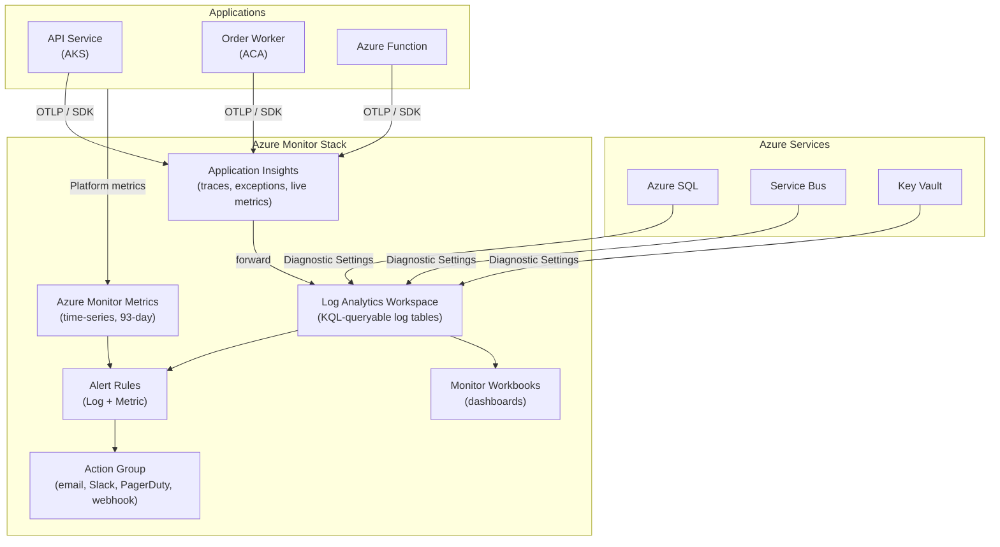

# Azure Monitor, Application Insights & Log Analytics

## Category
Cloud Native, Observability, Azure Monitor, Application Insights, Log Analytics, KQL, Alerts

## Context

Azure's observability stack is built around three tightly integrated services:

| Service | Purpose | Data type |
|---------|---------|-----------|
| **Azure Monitor** | Platform umbrella — collects, routes, and alerts on all telemetry | Metrics, Logs, Traces |
| **Log Analytics Workspace** | Central log store — all diagnostic logs and custom logs land here | Structured logs (JSON) |
| **Application Insights** | APM (Application Performance Monitoring) — distributed traces, live metrics, exceptions, availability tests | Traces, Metrics, Exceptions |

### Telemetry pillars

| Pillar | Azure tool | Description |
|--------|-----------|-------------|
| **Logs** | Log Analytics | Structured events stored in KQL-queryable tables |
| **Metrics** | Azure Monitor Metrics | Time-series numeric values — low cost, 93-day retention default |
| **Traces** | Application Insights | Distributed request tracing (W3C TraceContext) |
| **Exceptions** | Application Insights | Automatic exception capture with stack trace |
| **Availability** | Application Insights Availability Tests | Synthetic monitoring from 5 worldwide test locations |
| **Live Metrics** | Application Insights | Sub-second streaming of request rate, failures, CPU |

### Log Analytics tables (built-in)

| Table | Contents |
|-------|---------|
| `AppRequests` | HTTP requests handled by the app |
| `AppDependencies` | Outgoing calls (HTTP, SQL, Service Bus, etc.) |
| `AppExceptions` | Unhandled exceptions + stack traces |
| `AppTraces` | Application log messages (ILogger / console.log) |
| `AppMetrics` | Custom metrics published via SDK |
| `ContainerLogV2` | Container stdout/stderr (AKS / ACA) |
| `KubeEvents` | Kubernetes events |
| `AzureDiagnostics` | Platform diagnostic logs (SQL, Service Bus, etc.) |

### Alert types

| Type | Trigger | When to use |
|------|---------|-------------|
| **Metric Alert** | Metric crosses threshold | CPU > 80%, request latency > 2s |
| **Log Alert** | KQL query returns rows | 5xx error rate > 5%, exception surge |
| **Activity Log Alert** | Azure resource operation | VM stopped, permission change |
| **Smart Detection** | AI anomaly detection (App Insights) | Auto-detect anomalies, no threshold needed |

---

## Pros

- **Single workspace**: All services (AKS, Functions, SQL, Service Bus) ship logs to one Log Analytics Workspace — correlate across systems with KQL joins.
- **W3C Trace Context propagation**: Distributed traces across microservices (and into Azure backends like Service Bus) linked by `traceparent` header.
- **SDK auto-instrumentation**: `@azure/monitor-opentelemetry` instruments HTTP, SQL, Redis, Service Bus automatically — minimal code changes.
- **Workbooks**: Interactive dashboards with KQL + visualisations — shareable, parameterised.
- **Alerting + Action Groups**: Alert → email, SMS, webhook, PagerDuty, Azure DevOps work item.

---

## Cons

- **Log Analytics cost** scales with ingestion volume — high-traffic apps need sampling or basic log tiers.
- **KQL learning curve**: Powerful but non-standard — team needs to learn Kusto Query Language.
- **Application Insights sampling**: Essential to control cost but can hide rare errors.
- **Metric alert evaluation period**: Minimum 1 minute granularity — not real-time for 5 xx spikes.
- **Data export latency**: Logs typically appear in workspace 2–5 minutes after event.

---

## Design Diagram



---

## Code Sample

### Bicep — Log Analytics + Application Insights

```bicep
// infrastructure/bicep/observability/monitoring.bicep
param location string = resourceGroup().location
param env string

// ─── Log Analytics Workspace ──────────────────────────────────────────────────
resource logWorkspace 'Microsoft.OperationalInsights/workspaces@2023-09-01' = {
  name:     'myapp-${env}-logs'
  location: location
  properties: {
    sku:            { name: 'PerGB2018' }
    retentionInDays: env == 'prod' ? 90 : 30

    features: {
      // Immutable workspace — logs cannot be deleted or altered
      immediatePurgeDataOn30Days: false
      enableLogAccessUsingOnlyResourcePermissions: true
    }

    workspaceCapping: {
      // Cap daily ingestion to avoid surprise bills
      dailyQuotaGb: env == 'prod' ? 50 : 5
    }
  }
}

// ─── Application Insights ─────────────────────────────────────────────────────
resource appInsights 'Microsoft.Insights/components@2020-02-02' = {
  name:     'myapp-${env}-ai'
  location: location
  kind:     'web'
  properties: {
    Application_Type:             'web'
    WorkspaceResourceId:          logWorkspace.id     // Workspace-based — unified store
    IngestionMode:                'LogAnalytics'      // Required for workspace-based
    SamplingPercentage:           env == 'prod' ? 10 : 100   // 10% sampling in prod
    RetentionInDays:              env == 'prod' ? 90 : 30
    DisableIpMasking:             false               // Mask last octet of client IP
    publicNetworkAccessForIngestion: 'Enabled'        // Required — ingestion is public
    publicNetworkAccessForQuery:     'Enabled'
  }
}

// ─── Diagnostic Settings — SQL Server ────────────────────────────────────────
resource sqlDiagnostics 'Microsoft.Insights/diagnosticSettings@2021-05-01-preview' = {
  name:  'sql-to-log-analytics'
  scope: sqlServer
  properties: {
    workspaceId: logWorkspace.id
    logs: [
      { category: 'SQLInsights',          enabled: true }
      { category: 'AutomaticTuning',      enabled: true }
      { category: 'QueryStoreRuntimeStatistics', enabled: true }
      { category: 'Errors',               enabled: true }
      { category: 'DatabaseWaitStatistics', enabled: true }
    ]
    metrics: [
      { category: 'Basic',     enabled: true, retentionPolicy: { enabled: true, days: 30 } }
    ]
  }
}

// ─── Alert — High error rate (5xx) ───────────────────────────────────────────
resource errorRateAlert 'Microsoft.Insights/scheduledQueryRules@2023-03-15-preview' = {
  name:     'high-error-rate'
  location: location
  properties: {
    displayName: '5xx Error Rate > 5%'
    description: 'Alert when server error rate exceeds 5% over 5 minutes'
    severity:    2   // 0=Critical, 1=Error, 2=Warning, 3=Informational
    enabled:     true
    evaluationFrequency: 'PT5M'
    windowSize:          'PT5M'
    scopes:              [appInsights.id]
    criteria: {
      allOf: [
        {
          query: '''
            AppRequests
            | where TimeGenerated > ago(5m)
            | summarize
                total   = count(),
                errors  = countif(ResultCode startswith "5")
              by bin(TimeGenerated, 1m)
            | where total > 10
            | extend errorRate = toreal(errors) / toreal(total) * 100
            | where errorRate > 5
          '''
          timeAggregation:   'Count'
          operator:          'GreaterThan'
          threshold:         0
          failingPeriods: {
            numberOfEvaluationPeriods: 1
            minFailingPeriodsToAlert:  1
          }
        }
      ]
    }
    actions: {
      actionGroups: [actionGroup.id]
      customProperties: {
        runbook: 'https://wiki.example.com/runbooks/high-error-rate'
      }
    }
  }
}

// ─── Action Group ─────────────────────────────────────────────────────────────
resource actionGroup 'Microsoft.Insights/actionGroups@2023-09-01-preview' = {
  name:     'myapp-${env}-alerts'
  location: 'global'
  properties: {
    groupShortName: 'myapp-ops'
    enabled:        true
    emailReceivers: [
      { name: 'on-call', emailAddress: 'oncall@example.com', useCommonAlertSchema: true }
    ]
    webhookReceivers: [
      {
        name:                  'pagerduty'
        serviceUri:            'https://events.pagerduty.com/integration/YOUR_KEY/enqueue'
        useCommonAlertSchema:  true
        useAadAuth:            false
      }
    ]
  }
}
```

### TypeScript — OpenTelemetry SDK with Azure Monitor

```typescript
// src/instrumentation.ts — load before all other imports
// Node.js: add `-r ./instrumentation.js` to startup command

import { useAzureMonitor, type AzureMonitorOpenTelemetryOptions } from '@azure/monitor-opentelemetry';
import { metrics, trace, context } from '@opentelemetry/api';

const options: AzureMonitorOpenTelemetryOptions = {
  azureMonitorExporterOptions: {
    connectionString: process.env.APPLICATIONINSIGHTS_CONNECTION_STRING,
    // Uses Managed Identity / DefaultAzureCredential if connectionString omitted
  },

  samplingRatio: process.env.NODE_ENV === 'production' ? 0.1 : 1.0,

  instrumentationOptions: {
    // Auto-instrument common libraries — zero code changes
    http:           { enabled: true },
    azureSdk:       { enabled: true },  // Service Bus, Storage, Key Vault, etc.
    postgreSql:     { enabled: true },  // If using pg driver
    // redis:       { enabled: true },
  },
};

useAzureMonitor(options);

// ─── Custom metrics ───────────────────────────────────────────────────────────
const meter = metrics.getMeter('myapp');

export const orderCounter = meter.createCounter('orders.created', {
  description: 'Total number of orders created',
  unit:        'orders',
});

export const processingHistogram = meter.createHistogram('order.processing.duration', {
  description: 'Time to process an order end-to-end',
  unit:        'ms',
});

// ─── Custom trace spans ───────────────────────────────────────────────────────
const tracer = trace.getTracer('myapp');

export async function processOrderWithTracing(
  orderId: string,
  fn: () => Promise<void>,
): Promise<void> {
  const span = tracer.startSpan('process-order', {
    attributes: { 'order.id': orderId },
  });

  const ctx = trace.setSpan(context.active(), span);

  try {
    await context.with(ctx, fn);
    span.setStatus({ code: 0 /* OK */ });
  } catch (err) {
    span.recordException(err as Error);
    span.setStatus({ code: 2 /* ERROR */, message: String(err) });
    throw err;
  } finally {
    orderCounter.add(1, { 'order.status': 'processed' });
    span.end();
  }
}
```

### KQL — Useful Log Analytics Queries

```kql
// ─── P95 response time per endpoint (last hour) ───────────────────────────────
AppRequests
| where TimeGenerated > ago(1h)
| where Success == true
| summarize
    requestCount  = count(),
    p50           = percentile(DurationMs, 50),
    p95           = percentile(DurationMs, 95),
    p99           = percentile(DurationMs, 99)
  by Name
| order by p95 desc

// ─── Exceptions by type — top 10 ─────────────────────────────────────────────
AppExceptions
| where TimeGenerated > ago(24h)
| summarize count() by ExceptionType, OuterMessage
| order by count_ desc
| take 10

// ─── Slow SQL queries — dependency tracking ───────────────────────────────────
AppDependencies
| where TimeGenerated > ago(1h)
| where Type == "SQL"
| where DurationMs > 1000   // Slower than 1s
| project TimeGenerated, Name, Target, DurationMs, Data
| order by DurationMs desc

// ─── Failed Service Bus message processing correlated with exceptions ─────────
let failedRequests = AppRequests
  | where TimeGenerated > ago(1h)
  | where ResultCode startswith "5"
  | project OperationId, Name, DurationMs, ResultCode;

AppExceptions
| where TimeGenerated > ago(1h)
| join kind=inner failedRequests on OperationId
| project TimeGenerated, RequestName = Name, ExceptionType, OuterMessage, DurationMs

// ─── Alert query — memory pressure on AKS nodes ──────────────────────────────
KubeNodeInventory
| where TimeGenerated > ago(5m)
| extend memoryUsagePct = toint(parse_json(tostring(parse_json(LabelsAgentPool))["allocatable_memory_bytes"]))
| summarize avgMemoryPct = avg(memoryUsagePct) by Computer
| where avgMemoryPct > 80
```
