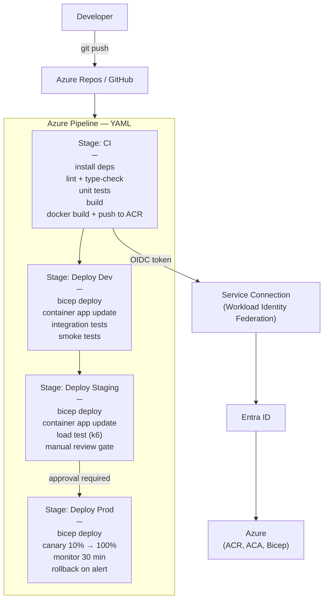

# Azure DevOps & Pipelines

## Category
Cloud Native, DevOps, Azure Pipelines, CI/CD, OIDC, Environments, GitOps, GitHub Actions

## Context

**Azure DevOps** is Microsoft's all-in-one DevOps platform — Boards (work items), Repos (Git), Pipelines (CI/CD), Artifacts (package feed), and Test Plans. **Azure Pipelines** supports YAML-first pipeline definitions with reusable templates, environments with approval gates, and OIDC-based authentication to Azure (no stored secrets).

**Pipeline anatomy**:
| Concept | Description |
|---------|-------------|
| **Stage** | Logical phase — Build, Test, Deploy Dev, Deploy Prod |
| **Job** | Runs on an agent; jobs in the same stage can run in parallel |
| **Step** | Individual command or task within a job |
| **Template** | Reusable YAML fragment — parameterised stages, jobs, or steps |
| **Environment** | Named deployment target (dev, staging, prod) with approval gates and deployment history |
| **Service Connection** | Authenticated link to Azure subscription using Workload Identity Federation (OIDC) — no stored secrets |
| **Variable Group** | Named set of variables — link to Key Vault for secret variables |
| **Artifact** | Published build output (container image, package, IaC files) |

**Deployment strategies supported**:
- `runOnce`: Simple deploy — one round of pre/deploy/post steps.
- `rolling`: Replace old instances incrementally.
- `canary`: Deploy to a small percentage, validate, then full rollout.

**Service Connection — Workload Identity Federation**:
- Azure DevOps requests an OIDC token from its own identity provider.
- The token is exchanged for an Azure Entra ID access token via a federated credential.
- No client secret stored in Azure DevOps — rotation-free, credential-free.

---

## Pros

- **OIDC service connections**: Zero stored secrets for Azure authentication — no rotation, no leakage.
- **YAML pipelines in repo**: Pipeline definition version-controlled alongside application code.
- **Environment approvals**: Require human approval or automated check (Service NOW, REST endpoint, custom) before production deployment.
- **Reusable templates**: Extract common build/deploy steps into shared templates — DRY across teams.
- **Parallel jobs**: Matrix strategies for multi-platform builds; parallel integration tests.
- **Key Vault variable groups**: Reference Key Vault secrets as pipeline variables — no secrets in YAML files.

---

## Cons

- **Agent provisioning**: Microsoft-hosted agents have throughput limits; self-hosted agents add maintenance overhead.
- **YAML verbosity**: Complex multi-stage pipelines become lengthy — discipline required to keep templates manageable.
- **Limited free minutes**: Microsoft-hosted agents have limited free parallel jobs / minutes in public projects.
- **No built-in drift detection**: IaC drift (manual changes in Azure) not detected without additional tooling (Terraform plan in pipeline or Azure Policy).

---

## Design Diagram



---

## Code Sample

### Azure Pipeline — Multi-Stage YAML

```yaml
# azure-pipelines.yml — Root pipeline file

trigger:
  branches:
    include:
      - main
      - 'release/**'

pr:
  branches:
    include:
      - main

variables:
  - group: myapp-global          # Variable group linked to Key Vault
  - name: containerRegistry
    value: myappacr.azurecr.io
  - name: imageRepository
    value: myapp/api

pool:
  vmImage: ubuntu-latest

stages:
  # ─── CI Stage ────────────────────────────────────────────────────────────────
  - stage: CI
    displayName: Build & Test
    jobs:
      - job: Build
        displayName: Lint, Test, Build
        steps:
          - task: NodeTool@0
            inputs:
              versionSpec: '20.x'

          - script: npm ci
            displayName: Install dependencies

          - script: npm run lint
            displayName: Lint

          - script: npm run type-check
            displayName: Type check

          - script: npm run test:unit -- --ci --reporters=jest-junit
            displayName: Unit tests
            env:
              CI: true

          - task: PublishTestResults@2
            condition: always()
            inputs:
              testResultsFormat: JUnit
              testResultsFiles: '**/junit.xml'

          - task: PublishCodeCoverageResults@2
            inputs:
              summaryFileLocation: coverage/cobertura-coverage.xml

          - task: Docker@2
            displayName: Build and Push to ACR
            inputs:
              command:          buildAndPush
              repository:       $(imageRepository)
              dockerfile:       Dockerfile
              containerRegistry: myapp-acr-connection   # Service connection name
              tags: |
                $(Build.BuildId)
                $(Build.SourceBranchName)-latest

          # Publish Bicep templates as pipeline artifact
          - task: PublishPipelineArtifact@1
            inputs:
              targetPath: infrastructure/
              artifact:   bicep-templates

  # ─── Deploy Dev ───────────────────────────────────────────────────────────────
  - stage: DeployDev
    displayName: Deploy → Dev
    dependsOn: CI
    condition: and(succeeded(), ne(variables['Build.Reason'], 'PullRequest'))
    variables:
      - name: environment
        value: dev
    jobs:
      - deployment: DeployDev
        displayName: Deploy to Dev
        environment: myapp-dev    # Azure DevOps Environment — tracks deployments
        strategy:
          runOnce:
            deploy:
              steps:
                - template: templates/deploy-steps.yml
                  parameters:
                    environment:   dev
                    imageTag:      $(Build.BuildId)
                    serviceConn:   myapp-azure-dev    # OIDC service connection

  # ─── Deploy Staging ───────────────────────────────────────────────────────────
  - stage: DeployStaging
    displayName: Deploy → Staging
    dependsOn: DeployDev
    variables:
      - name: environment
        value: staging
    jobs:
      - deployment: DeployStaging
        displayName: Deploy to Staging
        environment: myapp-staging
        strategy:
          runOnce:
            deploy:
              steps:
                - template: templates/deploy-steps.yml
                  parameters:
                    environment: staging
                    imageTag:    $(Build.BuildId)
                    serviceConn: myapp-azure-staging

                - script: |
                    docker run --rm grafana/k6 run \
                      -e BASE_URL=$(STAGING_URL) \
                      load-tests/smoke.js
                  displayName: Smoke load test

  # ─── Deploy Production ────────────────────────────────────────────────────────
  - stage: DeployProd
    displayName: Deploy → Production
    dependsOn: DeployStaging
    jobs:
      - deployment: DeployProd
        displayName: Deploy to Production
        environment: myapp-prod     # Environment has approval gate configured in UI
        strategy:
          canary:
            increments: [10, 100]
            preDeploy:
              steps:
                - script: echo "Starting canary deployment"
            deploy:
              steps:
                - template: templates/deploy-steps.yml
                  parameters:
                    environment: prod
                    imageTag:    $(Build.BuildId)
                    serviceConn: myapp-azure-prod
            postRouteTraffic:
              steps:
                - script: |
                    # Check error rate in Application Insights for 5 minutes
                    python3 scripts/check-error-rate.py \
                      --connection-string "$(APPINSIGHTS_CONNECTION_STRING)" \
                      --threshold 5 \
                      --window-minutes 5
                  displayName: Monitor error rate
            on:
              failure:
                steps:
                  - script: |
                      az containerapp ingress traffic set \
                        --name api-service \
                        --resource-group myapp-prod \
                        --revision-weight previous=100 current=0
                    displayName: Rollback traffic
```

### Reusable Deploy Template

```yaml
# templates/deploy-steps.yml

parameters:
  - name: environment
    type: string
  - name: imageTag
    type: string
  - name: serviceConn
    type: string

steps:
  - task: DownloadPipelineArtifact@2
    inputs:
      artifact: bicep-templates
      path: $(Pipeline.Workspace)/infrastructure

  - task: AzureCLI@2
    displayName: Deploy Bicep
    inputs:
      azureSubscription: ${{ parameters.serviceConn }}    # OIDC connection
      scriptType: bash
      scriptLocation: inlineScript
      inlineScript: |
        az deployment group create \
          --resource-group myapp-${{ parameters.environment }} \
          --template-file $(Pipeline.Workspace)/infrastructure/bicep/main.bicep \
          --parameters \
            env=${{ parameters.environment }} \
            imageTag=${{ parameters.imageTag }} \
          --mode Incremental

  - task: AzureCLI@2
    displayName: Update Container App
    inputs:
      azureSubscription: ${{ parameters.serviceConn }}
      scriptType: bash
      scriptLocation: inlineScript
      inlineScript: |
        az containerapp update \
          --name api-service \
          --resource-group myapp-${{ parameters.environment }} \
          --image $(containerRegistry)/$(imageRepository):${{ parameters.imageTag }} \
          --revision-suffix ${{ parameters.imageTag }}

  - task: AzureCLI@2
    displayName: Run Integration Tests
    inputs:
      azureSubscription: ${{ parameters.serviceConn }}
      scriptType: bash
      scriptLocation: inlineScript
      inlineScript: |
        API_URL=$(az containerapp show \
          --name api-service \
          --resource-group myapp-${{ parameters.environment }} \
          --query "properties.configuration.ingress.fqdn" \
          --output tsv)
        BASE_URL="https://${API_URL}" npm run test:integration
```

### GitHub Actions — Azure Deployment (alternative to Azure DevOps)

```yaml
# .github/workflows/deploy.yml

name: Deploy

on:
  push:
    branches: [main]
  workflow_dispatch:
    inputs:
      environment:
        description: Target environment
        required: true
        default: dev
        type: choice
        options: [dev, staging, prod]

permissions:
  id-token: write   # Required for OIDC
  contents: read

jobs:
  build:
    runs-on: ubuntu-latest
    outputs:
      image-tag: ${{ steps.meta.outputs.version }}
    steps:
      - uses: actions/checkout@v4

      - name: Docker metadata
        id: meta
        uses: docker/metadata-action@v5
        with:
          images: myappacr.azurecr.io/myapp/api
          tags: |
            type=sha,prefix=,suffix=,format=short

      - name: Azure Login
        uses: azure/login@v2
        with:
          client-id:       ${{ vars.AZURE_CLIENT_ID }}
          tenant-id:       ${{ vars.AZURE_TENANT_ID }}
          subscription-id: ${{ vars.AZURE_SUBSCRIPTION_ID }}

      - name: Build and push to ACR
        run: |
          az acr build \
            --registry myappacr \
            --image myapp/api:${{ steps.meta.outputs.version }} \
            .

  deploy:
    runs-on: ubuntu-latest
    needs: build
    environment: ${{ inputs.environment || 'dev' }}   # GitHub Environment with required reviewers
    steps:
      - uses: actions/checkout@v4

      - name: Azure Login
        uses: azure/login@v2
        with:
          client-id:       ${{ vars.AZURE_CLIENT_ID }}
          tenant-id:       ${{ vars.AZURE_TENANT_ID }}
          subscription-id: ${{ vars.AZURE_SUBSCRIPTION_ID }}

      - name: Deploy Bicep
        uses: azure/arm-deploy@v2
        with:
          resourceGroupName: myapp-${{ inputs.environment || 'dev' }}
          template: infrastructure/bicep/main.bicep
          parameters: >
            env=${{ inputs.environment || 'dev' }}
            imageTag=${{ needs.build.outputs.image-tag }}
          deploymentMode: Incremental

      - name: Update Container App
        run: |
          az containerapp update \
            --name api-service \
            --resource-group myapp-${{ inputs.environment || 'dev' }} \
            --image myappacr.azurecr.io/myapp/api:${{ needs.build.outputs.image-tag }}
```
