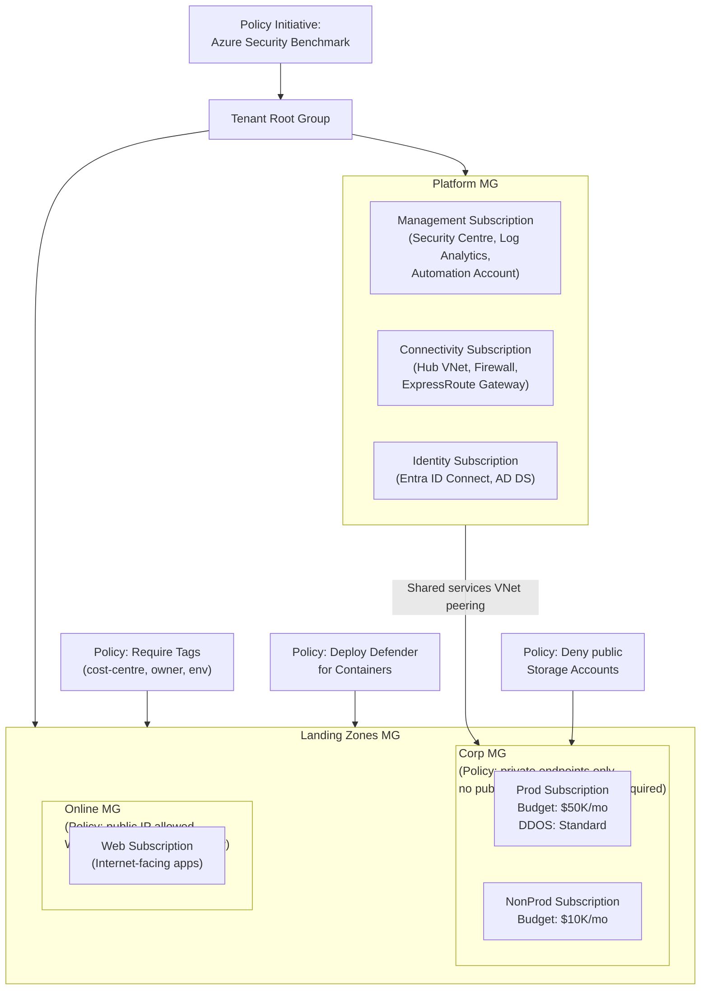

# Azure Landing Zone & Management Groups

## Category
Cloud Native, Governance, Landing Zone, Management Groups, Azure Policy, Subscriptions

## Context

**Azure Landing Zone** is a pre-configured, governed subscription structure that enforces organisational standards across all workloads. It implements the governance scaffold before any workload is deployed. The reference architecture (from Microsoft's Cloud Adoption Framework) uses a hierarchy of Management Groups to apply Policy and RBAC at scale.

**Management Group hierarchy** (reference):
```
Tenant Root Group
└── mycompany (Top-level MG)
    ├── Platform
    │   ├── Management        ← Log Analytics, Automation, Security Centre
    │   ├── Connectivity      ← Hub VNet, Firewall, ExpressRoute, VPN
    │   └── Identity          ← Entra ID Connect, AD DS
    └── Landing Zones
        ├── Corp (connected)  ← Spokes peered to hub, private-only workloads
        └── Online            ← Internet-facing workloads
            ├── prod          ← Production subscription
            └── nonprod       ← Dev/Staging subscription
```

**Azure Policy** is the primary enforcement mechanism:
| Effect | Description |
|--------|-------------|
| `Deny` | Block resource creation if non-compliant |
| `Audit` | Allow creation but flag as non-compliant in compliance report |
| `Modify` | Automatically add/change resource properties (e.g., add required tags) |
| `DeployIfNotExists` | Trigger deployment of compliant resource if missing (e.g., deploy Log Analytics agent) |
| `Append` | Append properties to a resource — e.g., force a tag |
| `AuditIfNotExists` | Audit if a related resource doesn't exist |

**Policy Initiatives** group multiple Policy Definitions — Microsoft provides built-in initiatives for:
- **Azure Security Benchmark** (300+ controls)
- **NIST SP 800-53**, **ISO 27001**, **PCI DSS**
- **CIS Microsoft Azure Foundations Benchmark**

**Subscription vending**: Automated provisioning of new subscriptions with baseline policies, networking, and RBAC applied from day zero — no manual steps.

---

## Pros

- **Centralised governance**: Policies applied at Management Group level cascade to all subscriptions and resource groups below.
- **Blast radius isolation**: One subscription per environment/team — a misconfiguration or cost overrun in one subscription doesn't affect others.
- **Inherited RBAC**: Assign groups at Management Group level — no per-subscription role assignment sprawl.
- **Compliance reporting**: Azure Policy compliance dashboard — know which subscriptions, resource groups, or resources are drifting.
- **DeployIfNotExists automatical remediation**: Enforce standards by deploying missing configurations automatically (e.g., diagnostic settings, Defender plans).

---

## Cons

- **Setup complexity**: Initial Landing Zone setup requires significant Bicep/Terraform IaC investment.
- **Policy propagation delay**: Policy assignments take up to 30 minutes to evaluate existing resources.
- **Restrict-too-much risk**: Overly aggressive Deny policies block legitimate work — start with Audit, then move to Deny.
- **Management Group limit**: 6 levels deep (excluding Root); plan hierarchy carefully.
- **Subscription limits**: Some Azure services have per-subscription quotas — may require quota increase requests.

---

## Design Diagram



---

## Code Sample

### Bicep — Management Group + Policy Initiative Assignment

```bicep
// infrastructure/bicep/landing-zone/management-groups.bicep
// Deploy at tenant scope: az deployment tenant create ...

targetScope = 'tenant'

param tenantId string = tenant().tenantId
param topLevelMgName string = 'mycompany'
param topLevelMgDisplayName string = 'My Company'

// ─── Top-Level Management Group ───────────────────────────────────────────────
resource topLevelMg 'Microsoft.Management/managementGroups@2023-04-01' = {
  name: topLevelMgName
  properties: {
    displayName: topLevelMgDisplayName
    details: {
      parent: {
        id: tenantResourceId('Microsoft.Management/managementGroups', tenantId)
      }
    }
  }
}

// ─── Platform MG ──────────────────────────────────────────────────────────────
resource platformMg 'Microsoft.Management/managementGroups@2023-04-01' = {
  name: '${topLevelMgName}-platform'
  properties: {
    displayName: 'Platform'
    details: { parent: { id: topLevelMg.id } }
  }
  dependsOn: [topLevelMg]
}

// ─── Landing Zones MG ─────────────────────────────────────────────────────────
resource landingZonesMg 'Microsoft.Management/managementGroups@2023-04-01' = {
  name: '${topLevelMgName}-landing-zones'
  properties: {
    displayName: 'Landing Zones'
    details: { parent: { id: topLevelMg.id } }
  }
  dependsOn: [topLevelMg]
}

// ─── Corp MG (under Landing Zones) ───────────────────────────────────────────
resource corpMg 'Microsoft.Management/managementGroups@2023-04-01' = {
  name: '${topLevelMgName}-corp'
  properties: {
    displayName: 'Corp'
    details: { parent: { id: landingZonesMg.id } }
  }
  dependsOn: [landingZonesMg]
}
```

### Bicep — Azure Policy — Require Tags + Deny Public Storage

```bicep
// infrastructure/bicep/policy/policies.bicep
targetScope = 'managementGroup'

// ─── Policy: Require Required Tags ────────────────────────────────────────────
resource requireTagsPolicy 'Microsoft.Authorization/policyDefinitions@2023-04-01' = {
  name: 'require-mandatory-tags'
  properties: {
    displayName: 'Require mandatory resource tags'
    description: 'Requires cost-centre, owner, and environment tags on all resources'
    policyType:  'Custom'
    mode:        'All'

    parameters: {
      requiredTags: {
        type: 'Array'
        defaultValue: ['cost-centre', 'owner', 'environment']
      }
    }

    policyRule: {
      if: {
        allOf: [
          { field: 'type', notEquals: 'Microsoft.Resources/subscriptions/resourceGroups' }
          {
            count: {
              value: '[parameters(\'requiredTags\')]'
              name:  'tag'
              where: {
                field:        '[concat(\'tags[\', current(\'tag\'), \']\')]'
                exists:       false
              }
            }
            greater: 0
          }
        ]
      }
      then: { effect: 'Modify' }   // 'Deny' once tags are baseline-established
    }
  }
}

// ─── Policy: Deny Public Storage Accounts ─────────────────────────────────────
resource denyPublicStoragePolicy 'Microsoft.Authorization/policyDefinitions@2023-04-01' = {
  name: 'deny-public-storage'
  properties: {
    displayName: 'Deny public network access on Storage Accounts'
    policyType:  'Custom'
    mode:        'All'
    policyRule: {
      if: {
        allOf: [
          { field: 'type',  equals: 'Microsoft.Storage/storageAccounts' }
          { field: 'Microsoft.Storage/storageAccounts/publicNetworkAccess', notEquals: 'Disabled' }
        ]
      }
      then: { effect: 'Deny' }
    }
  }
}

// ─── Policy: DeployIfNotExists — Diagnostic Settings on all Key Vaults ────────
resource kvDiagnosticsPolicy 'Microsoft.Authorization/policyDefinitions@2023-04-01' = {
  name: 'deploy-kv-diagnostics'
  properties: {
    displayName: 'Deploy diagnostic settings for Key Vault to Log Analytics'
    policyType:  'Custom'
    mode:        'All'
    policyRule: {
      if: {
        field: 'type'
        equals: 'Microsoft.KeyVault/vaults'
      }
      then: {
        effect: 'DeployIfNotExists'
        details: {
          type:              'Microsoft.Insights/diagnosticSettings'
          roleDefinitionIds: ['/providers/Microsoft.Authorization/roleDefinitions/749f88d5-cbae-40b8-bcfc-e573ddc772fa']
          existenceCondition: {
            allOf: [
              { field: 'Microsoft.Insights/diagnosticSettings/logs.enabled', equals: 'true' }
            ]
          }
          deployment: {
            properties: {
              mode:     'incremental'
              template: {
                '$schema':   'https://schema.management.azure.com/schemas/2019-04-01/deploymentTemplate.json#'
                contentVersion: '1.0.0.0'
                parameters: {
                  resourceName: { type: 'string' }
                  workspaceId:  { type: 'string' }
                }
                resources: [
                  {
                    type:       'Microsoft.KeyVault/vaults/providers/diagnosticSettings'
                    apiVersion: '2021-05-01-preview'
                    name:       '[concat(parameters(\'resourceName\'), \'/Microsoft.Insights/default\')]'
                    properties: {
                      workspaceId: '[parameters(\'workspaceId\')]'
                      logs: [
                        { category: 'AuditEvent', enabled: true }
                        { category: 'AzurePolicyEvaluationDetails', enabled: true }
                      ]
                    }
                  }
                ]
              }
            }
          }
        }
      }
    }
  }
}

// ─── Policy Initiative ─────────────────────────────────────────────────────────
resource baselineInitiative 'Microsoft.Authorization/policySetDefinitions@2023-04-01' = {
  name: 'mycompany-baseline'
  properties: {
    displayName: 'My Company Baseline Security & Governance'
    policyType:  'Custom'
    policyDefinitions: [
      { policyDefinitionId: requireTagsPolicy.id      }
      { policyDefinitionId: denyPublicStoragePolicy.id }
      { policyDefinitionId: kvDiagnosticsPolicy.id    }
      // Include built-in initiative
      {
        policyDefinitionId: '/providers/Microsoft.Authorization/policySetDefinitions/1f3afdf9-d0c9-4c3d-847f-89da613e70a8'
        // Azure Security Benchmark built-in initiative
      }
    ]
  }
}

// ─── Assign Initiative to Landing Zones MG ────────────────────────────────────
resource baselineAssignment 'Microsoft.Authorization/policyAssignments@2023-04-01' = {
  name:  'baseline-assignment'
  scope: managementGroup()
  identity: {
    type: 'SystemAssigned'   // Required for DeployIfNotExists remediation
  }
  properties: {
    displayName:        'My Company Baseline'
    policyDefinitionId: baselineInitiative.id
    enforcementMode:    'Default'    // Enforce Deny effects; use DoNotEnforce for audit-only
    parameters: {}
    nonComplianceMessages: [
      { message: 'This resource does not comply with My Company baseline policy. See https://wiki.example.com/policies' }
    ]
  }
}
```

### Bash — Subscription Vending Automation

```bash
#!/bin/bash
# scripts/vend-subscription.sh
# Create and configure a new landing zone subscription

set -euo pipefail

SUBSCRIPTION_NAME="$1"
ENVIRONMENT="$2"       # prod | staging | dev
MANAGEMENT_GROUP="mycompany-corp"
BILLING_ACCOUNT_ID="<BILLING_ACCOUNT_ID>"
BILLING_PROFILE_ID="<BILLING_PROFILE_ID>"
INVOICE_SECTION_ID="<INVOICE_SECTION_ID>"
HUB_VNET_ID="<HUB_VNET_RESOURCE_ID>"

echo "Creating subscription: ${SUBSCRIPTION_NAME} in ${ENVIRONMENT}"

# 1. Create subscription under EA / MCA billing
SUBSCRIPTION_ID=$(az billing enrollment-account subscription create \
  --billing-account-name "${BILLING_ACCOUNT_ID}" \
  --billing-profile-name "${BILLING_PROFILE_ID}" \
  --invoice-section-name "${INVOICE_SECTION_ID}" \
  --display-name "${SUBSCRIPTION_NAME}" \
  --workload "Production" \
  --query "subscriptionId" \
  --output tsv)

echo "Subscription created: ${SUBSCRIPTION_ID}"

# 2. Move to Management Group
az account management-group subscription add \
  --name "${MANAGEMENT_GROUP}" \
  --subscription "${SUBSCRIPTION_ID}"

# 3. Tag the subscription
az tag create \
  --resource-id "/subscriptions/${SUBSCRIPTION_ID}" \
  --tags \
    environment="${ENVIRONMENT}" \
    owner="platform-team@example.com" \
    cost-centre="PLATFORM-001"

# 4. Deploy baseline Bicep (networking, monitoring, Defender)
az deployment sub create \
  --location westeurope \
  --subscription "${SUBSCRIPTION_ID}" \
  --template-file infrastructure/bicep/landing-zone/baseline.bicep \
  --parameters \
    environment="${ENVIRONMENT}" \
    hubVnetId="${HUB_VNET_ID}" \
    logAnalyticsWorkspaceId="<CENTRAL_LOG_ANALYTICS_ID>"

# 5. Set budget alert
az consumption budget create \
  --budget-name "${SUBSCRIPTION_NAME}-budget" \
  --subscription "${SUBSCRIPTION_ID}" \
  --amount 10000 \
  --time-grain Monthly \
  --time-period-start "$(date +%Y-%m-01)" \
  --time-period-end "2099-12-31" \
  --notification-enabled true \
  --notification-operator GreaterThan \
  --notification-threshold 80 \
  --contact-emails "finance@example.com" "cto@example.com"

echo "Subscription ${SUBSCRIPTION_ID} provisioned successfully"
```
