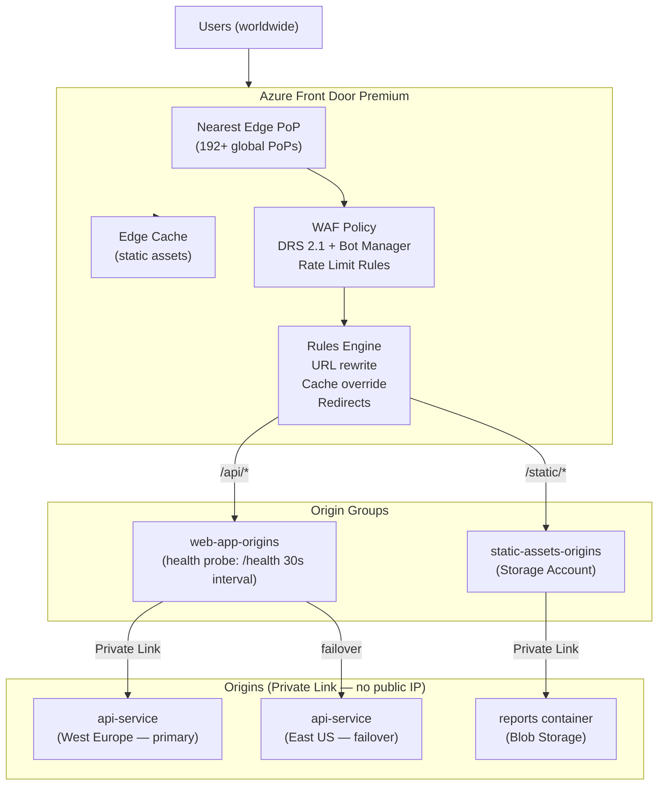

# Azure Front Door & CDN

## Category
Cloud Native, Networking, Front Door, CDN, WAF, Global Load Balancing, TLS, Caching

## Context

**Azure Front Door** (Standard/Premium) is Microsoft's global anycast edge platform — it combines CDN (content caching), global HTTP load balancing, WAF (Web Application Firewall), TLS offloading, and health probe-based routing in a single service. Front Door is the Azure equivalent of AWS CloudFront + ALB + WAF, combined into one product.

**Front Door tiers**:
| Feature | Standard | Premium |
|---------|----------|---------|
| CDN caching | Yes | Yes |
| Global load balancing | Yes | Yes |
| WAF managed rules (OWASP) | Custom rules only | Microsoft DRS 2.1 + Bot Manager |
| Private Link origins | No | Yes |
| Security reports | No | Yes |
| Price | Lower | Higher |

**Key concepts**:
| Concept | Description |
|---------|-------------|
| **Endpoint** | Public FQDN (e.g., `myapp.azurefd.net`) — entry point for traffic |
| **Origin** | Backend — Container App, App Service, Blob Storage, custom HTTPS |
| **Origin Group** | Pool of origins with health probes + load balancing settings |
| **Route** | Map URL path patterns from endpoint to origin group |
| **Rule Set** | Ordered set of conditions + actions (modify headers, redirect, rewrite URL) |
| **WAF Policy** | Prevention or Detection mode; OWASP + custom rules |
| **Private Link (Premium)** | Connect to origin via Private Link — no public IP on origin |

**Global anycast routing** — Front Door operates from 192+ PoPs worldwide. Requests are answered at the nearest PoP; cache hits serve locally; cache misses are forwarded to origin over Microsoft's private WAN (not public internet).

**WAF managed rule sets**:
- **Microsoft Default Rule Set (DRS) 2.1**: OWASP Core Rule Set equivalent — protects against SQLi, XSS, LFI, RFI, command injection.
- **Bot Manager**: Classifies bots (good bots, verified bots, bad bots) and allows rate-limit or block rules.
- **Rate limiting**: Per-IP or per-client rate limit rules to prevent DDoS at layer 7.

---

## Pros

- **Single control plane**: CDN + WAF + load balancing — no need to manage separate CloudFront, WAF, and ALB equivalents.
- **Private Link to origin (Premium)**: Origin never needs a public IP — traffic from Front Door to backend stays on Microsoft's private network.
- **Instant cache purge**: Purge content globally by URL path in seconds via API or portal.
- **Health probes + automatic failover**: Route to secondary region if primary origin becomes unhealthy — minimal manual intervention.
- **Managed TLS**: Front Door provisions and renews TLS certificates for custom domains with zero effort.
- **URL rewrite + redirect rules**: Transform requests at the edge — no application code changes needed.

---

## Cons

- **Private Link origins require Premium tier**: Additional cost for the most secure origin connectivity model.
- **WAF false positives**: Managed OWASP rules can block legitimate API traffic — tune in Detection mode first.
- **Caching limited to HTTP GET responses**: POST, PUT, DELETE are always forwarded to origin. Not suitable for fully dynamic APIs.
- **End-to-end encryption**: TLS terminates at the Front Door edge; a new TLS connection is made to origin — ensure origin certificate is valid.
- **Cache-Control headers must be correct**: If your application does not set appropriate `Cache-Control` headers, content may be cached unintentionally or not cached at all.

---

## Design Diagram



---

## Code Sample

### Bicep — Front Door Premium with WAF + Private Link Origin

```bicep
// infrastructure/bicep/frontdoor/front-door.bicep
param location string = 'global'   // Front Door is a global resource
param env string
param customDomain string = 'myapp.example.com'

// ─── WAF Policy ───────────────────────────────────────────────────────────────
resource wafPolicy 'Microsoft.Network/frontDoorWebApplicationFirewallPolicies@2024-02-01' = {
  name:     'myapp${env}waf'
  location: 'global'
  sku: { name: 'Premium_AzureFrontDoor' }

  properties: {
    policySettings: {
      mode:           'Prevention'   // Block threats; use 'Detection' to test first
      enabledState:   'Enabled'
      requestBodyCheck: 'Enabled'

      // Custom error page for blocked requests
      customBlockResponseStatusCode: 403
      customBlockResponseBody: base64('''
        {"error":{"code":403,"message":"Request blocked by WAF"}}
      ''')
    }

    managedRules: {
      managedRuleSets: [
        {
          ruleSetType:    'Microsoft_DefaultRuleSet'
          ruleSetVersion: '2.1'
          ruleSetAction:  'Block'
          exclusions: []
        }
        {
          ruleSetType:    'Microsoft_BotManagerRuleSet'
          ruleSetVersion: '1.0'
        }
      ]
    }

    customRules: {
      rules: [
        // Rate limit: 1000 requests per minute per IP
        {
          name:               'RateLimitPerIP'
          priority:           1
          ruleType:           'RateLimitRule'
          rateLimitDurationInMinutes: 1
          rateLimitThreshold: 1000
          enabledState:       'Enabled'
          action:             'Block'
          matchConditions: [
            {
              matchVariable:   'RemoteAddr'
              operator:        'IPMatch'
              matchValue:      ['0.0.0.0/0']    // All IPs
              negateCondition: false
            }
          ]
        }
        // Block requests from specific countries
        {
          name:         'GeoBlock'
          priority:     2
          ruleType:     'MatchRule'
          enabledState: 'Enabled'
          action:       'Block'
          matchConditions: [
            {
              matchVariable:   'RemoteAddr'
              operator:        'GeoMatch'
              matchValue:      ['CN', 'RU', 'KP']   // Example — adjust to requirements
              negateCondition: false
            }
          ]
        }
      ]
    }
  }
}

// ─── Front Door Profile ───────────────────────────────────────────────────────
resource frontDoor 'Microsoft.Cdn/profiles@2024-02-01' = {
  name:     'myapp-${env}-afd'
  location: 'global'
  sku: { name: 'Premium_AzureFrontDoor' }
}

// ─── Endpoint ─────────────────────────────────────────────────────────────────
resource endpoint 'Microsoft.Cdn/profiles/afdEndpoints@2024-02-01' = {
  parent: frontDoor
  name:   'myapp-${env}'
  location: 'global'
  properties: {
    enabledState: 'Enabled'
  }
}

// ─── Origin Group — ACA backend ──────────────────────────────────────────────
resource apiOriginGroup 'Microsoft.Cdn/profiles/originGroups@2024-02-01' = {
  parent: frontDoor
  name:   'api-origin-group'
  properties: {
    loadBalancingSettings: {
      sampleSize:                4
      successfulSamplesRequired: 3
      additionalLatencyInMilliseconds: 50
    }
    healthProbeSettings: {
      probePath:            '/health/live'
      probeRequestType:     'GET'
      probeProtocol:        'Https'
      probeIntervalInSeconds: 30
    }
    sessionAffinityState: 'Disabled'
  }
}

// ─── Origin — ACA (Private Link — Premium) ───────────────────────────────────
resource acaOrigin 'Microsoft.Cdn/profiles/originGroups/origins@2024-02-01' = {
  parent: apiOriginGroup
  name:   'aca-west-europe'
  properties: {
    hostName:           'api-service.internal.azurecontainerapps.io'
    httpPort:           80
    httpsPort:          443
    originHostHeader:   'api-service.internal.azurecontainerapps.io'
    priority:           1
    weight:             1000
    enabledState:       'Enabled'

    // Private Link — Front Door connects to ACA via Private Link
    // No public IP required on ACA after approval
    sharedPrivateLinkResource: {
      privateLink:       { id: acaApp.id }
      groupId:           'managedEnvironments'
      privateLinkLocation: 'westeurope'
      requestMessage:    'Front Door Private Link connection'
    }
  }
}

// ─── Route ────────────────────────────────────────────────────────────────────
resource apiRoute 'Microsoft.Cdn/profiles/afdEndpoints/routes@2024-02-01' = {
  parent: endpoint
  name:   'api-route'
  properties: {
    originGroup:          { id: apiOriginGroup.id }
    supportedProtocols:   ['Https']
    patternsToMatch:      ['/api/*', '/health/*']
    forwardingProtocol:   'HttpsOnly'
    linkToDefaultDomain:  'Enabled'
    httpsRedirect:        'Enabled'

    cacheConfiguration: {
      // API responses — short cache (30s) with query string variation
      queryStringCachingBehavior: 'IgnoreSpecifiedQueryStrings'
      queryParameters:            'timestamp,debug'     // Don't vary cache by these
      compressionSettings: {
        isCompressionEnabled: true
        contentTypesToCompress: ['application/json', 'text/plain']
      }
      cacheDuration: 'PT30S'
    }

    ruleSets: [{ id: apiRuleSet.id }]
  }
}

// ─── Rule Set — Security headers + CORS ──────────────────────────────────────
resource apiRuleSet 'Microsoft.Cdn/profiles/ruleSets@2024-02-01' =  {
  parent: frontDoor
  name:   'api-rules'
}

resource securityHeadersRule 'Microsoft.Cdn/profiles/ruleSets/rules@2024-02-01' = {
  parent: apiRuleSet
  name:   'security-headers'
  properties: {
    order: 1
    conditions: []    // Apply to all requests
    actions: [
      {
        name: 'ModifyResponseHeader'
        parameters: {
          typeName:    'DeliveryRuleHeaderActionParameters'
          headerAction: 'Overwrite'
          headerName:  'Strict-Transport-Security'
          value:       'max-age=31536000; includeSubDomains; preload'
        }
      }
      {
        name: 'ModifyResponseHeader'
        parameters: {
          typeName:    'DeliveryRuleHeaderActionParameters'
          headerAction: 'Overwrite'
          headerName:  'X-Content-Type-Options'
          value:       'nosniff'
        }
      }
      {
        name: 'ModifyResponseHeader'
        parameters: {
          typeName:    'DeliveryRuleHeaderActionParameters'
          headerAction: 'Overwrite'
          headerName:  'X-Frame-Options'
          value:       'DENY'
        }
      }
      {
        name: 'ModifyResponseHeader'
        parameters: {
          typeName:    'DeliveryRuleHeaderActionParameters'
          headerAction: 'Overwrite'
          headerName:  'Content-Security-Policy'
          value:       "default-src 'self'; script-src 'self'; style-src 'self' 'unsafe-inline'"
        }
      }
    ]
  }
}

// ─── Custom Domain + Managed TLS ─────────────────────────────────────────────
resource customDomainResource 'Microsoft.Cdn/profiles/customDomains@2024-02-01' = {
  parent: frontDoor
  name:   replace(customDomain, '.', '-')
  properties: {
    hostName: customDomain
    tlsSettings: {
      certificateType:   'ManagedCertificate'   // Front Door provisions and renews
      minimumTlsVersion: 'TLS12'
    }
  }
}

// Associate WAF policy with security policy on endpoint
resource securityPolicy 'Microsoft.Cdn/profiles/securityPolicies@2024-02-01' = {
  parent: frontDoor
  name:   'waf-policy'
  properties: {
    parameters: {
      type: 'WebApplicationFirewall'
      wafPolicy: { id: wafPolicy.id }
      associations: [
        {
          domains: [
            { id: endpoint.id }
            { id: customDomainResource.id }
          ]
          patternsToMatch: ['/*']
        }
      ]
    }
  }
}
```

### TypeScript — Cache Purge via Azure SDK

```typescript
// src/admin/cache-purge.ts
// Purge Front Door cache for updated content

import { CdnManagementClient } from '@azure/arm-cdn';
import { DefaultAzureCredential } from '@azure/identity';

const cdnClient = new CdnManagementClient(
  new DefaultAzureCredential(),
  process.env.AZURE_SUBSCRIPTION_ID!,
);

/**
 * Purge Front Door cache for given URL paths.
 * Useful after CMS content updates or API schema changes.
 */
export async function purgeCache(
  resourceGroup:    string,
  profileName:      string,
  endpointName:     string,
  contentPaths:     string[], // e.g. ['/api/products/*', '/static/v2/*']
): Promise<void> {
  console.log(`Purging cache for ${contentPaths.join(', ')}`);

  await cdnClient.afdEndpoints.beginPurgeContentAndWait(
    resourceGroup,
    profileName,
    endpointName,
    { contentPaths },
  );

  console.log('Cache purge completed');
}

// ─── Usage — called after content update ─────────────────────────────────────
await purgeCache(
  'myapp-prod',
  'myapp-prod-afd',
  'myapp-prod',
  ['/api/products/*', '/api/categories/*'],
);
```
