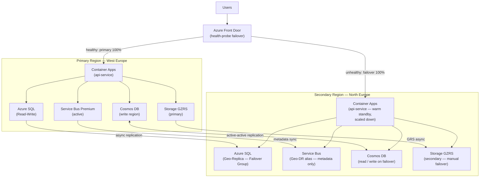

# Azure Disaster Recovery & Business Continuity

## Category
Cloud Native, Resilience, Disaster Recovery, Azure Site Recovery, Geo-Redundancy, RTO, RPO

## Context

**Business continuity** on Azure spans two overlapping concerns:

- **High Availability (HA)**: Survive hardware failures, AZ outages — built into individual services via Zone-Redundant SKUs, Availability Sets, and replicas. No manual failover required.
- **Disaster Recovery (DR)**: Survive full region failures — requires explicit multi-region architecture, data replication, and tested failover procedures.

**Key metrics**:
| Metric | Definition |
|--------|-----------|
| **RTO** (Recovery Time Objective) | Maximum acceptable time for service to be restored after a disaster |
| **RPO** (Recovery Point Objective) | Maximum acceptable data loss measured in time |
| **MTTR** (Mean Time To Recovery) | Average time to restore service after an incident |

### DR tiers for cloud workloads

| Tier | RTO | RPO | Architecture | Cost |
|------|-----|-----|-------------|------|
| **Cold standby** | Hours | Hours (backup-based) | Restore IaC + data from backup in secondary region | Lowest |
| **Warm standby** | Minutes | Near-zero | Replicated data + scaled-down compute in secondary region; scale up on failover | Medium |
| **Hot standby (Active-Active)** | Seconds | Zero | Full active deployment in ≥2 regions; traffic manager routes normally | Highest |

### Azure DR tooling summary

| Tool | Use Case |
|------|---------|
| **Azure Site Recovery (ASR)** | Replicate Azure VMs and on-prem workloads to secondary region; orchestrate failover |
| **Cosmos DB multi-region writes** | Active-active globally — zero data loss, sub-10ms latency worldwide |
| **Azure SQL Geo-Replication** | Asynchronous replica in secondary region; failover in minutes |
| **Azure SQL Failover Groups** | Abstraction over geo-replication — connection string doesn't change on failover |
| **Service Bus Premium Geo-DR** | Metadata (queues/topics) replicated; failover aliases; no message replication |
| **Storage Account GRS/GZRS** | Async replication to paired region; manual/auto failover |
| **Azure Traffic Manager** | DNS-based global load balancing with health probe-driven failover |
| **Azure Front Door** | Anycast routing with health probe failover across origins — preferred over Traffic Manager for HTTP |

---

## Pros

- **Cosmos DB multi-region write**: Turnaround failover — no data loss, no app code change, automatic DNS update.
- **SQL Failover Groups**: Single connection string for primary and secondary — app doesn't know about geo-replication.
- **ASR continuous replication**: VM-level near-sync replication — RPO as low as 15–30 seconds for VM workloads.
- **Front Door health probes**: Sub-30-second failover detection for container apps — traffic redirects automatically.
- **IaC enables cold restore quickly**: With Bicep/Terraform, destroy and re-create full environment from scratch in secondary region is feasible (Cold DR at low cost).

---

## Cons

- **Cost of active-active**: Running full stack in two regions doubles compute and data costs.
- **Service Bus message replication**: Geo-DR for Service Bus replicates configuration only — messages in queues at time of disaster are lost unless you implement active replication via Azure Functions.
- **RTO bounded by DNS TTL**: Traffic Manager failover is DNS-based — clients with cached DNS may still hit the failed region until TTL expires (60s by default; some clients ignore it).
- **DR testing neglect**: Without regular drills, runbooks become stale and RTO targets are missed in real events.

---

## Design Diagram



---

## Code Sample

### Bicep — SQL Failover Group + Geo-Replication

```bicep
// infrastructure/bicep/dr/sql-failover-group.bicep
param primaryLocation   string = 'westeurope'
param secondaryLocation string = 'northeurope'
param env string

// ─── Primary SQL Server ────────────────────────────────────────────────────────
resource primarySqlServer 'Microsoft.Sql/servers@2023-08-01-preview' = {
  name:     'myapp-${env}-sql-primary'
  location: primaryLocation
  identity: { type: 'SystemAssigned' }
  properties: {
    administrators: {
      administratorType:         'ActiveDirectory'
      azureADOnlyAuthentication: true
      login:                     'myapp-dba-group@example.com'
      sid:                       '<ENTRA_GROUP_OBJECT_ID>'
      tenantId:                  subscription().tenantId
    }
    minimalTlsVersion:   '1.3'
    publicNetworkAccess: 'Disabled'
  }
}

// ─── Secondary SQL Server (same config, different region) ─────────────────────
resource secondarySqlServer 'Microsoft.Sql/servers@2023-08-01-preview' = {
  name:     'myapp-${env}-sql-secondary'
  location: secondaryLocation
  identity: { type: 'SystemAssigned' }
  properties: {
    administrators: {
      administratorType:         'ActiveDirectory'
      azureADOnlyAuthentication: true
      login:                     'myapp-dba-group@example.com'
      sid:                       '<ENTRA_GROUP_OBJECT_ID>'
      tenantId:                  subscription().tenantId
    }
    minimalTlsVersion:   '1.3'
    publicNetworkAccess: 'Disabled'
  }
}

// ─── Primary Database ─────────────────────────────────────────────────────────
resource primaryDb 'Microsoft.Sql/servers/databases@2023-08-01-preview' = {
  parent: primarySqlServer
  name:   'myapp'
  location: primaryLocation
  sku: { name: 'GP_Gen5', tier: 'GeneralPurpose', family: 'Gen5', capacity: 4 }
  properties: {
    zoneRedundant:           true
    readScale:               'Disabled'   // Handled by failover group
    backupStorageRedundancy: 'Zone'
  }
}

// ─── Failover Group — single DNS name that follows the primary ─────────────────
resource failoverGroup 'Microsoft.Sql/servers/failoverGroups@2023-08-01-preview' = {
  parent: primarySqlServer
  name:   'myapp-${env}-fog'
  properties: {
    partner servers: [
      {
        id: secondarySqlServer.id
      }
    ]
    databases: [primaryDb.id]

    readWriteEndpoint: {
      failoverPolicy:                         'Automatic'
      failoverWithDataLossGracePeriodMinutes: 60   // 60 min before forced failover risks RPO
    }

    readOnlyEndpoint: {
      failoverPolicy: 'Disabled'   // Route read-only traffic manually if needed
    }
  }
}

// Application uses failover group endpoint — never the server FQDN directly
// Primary: myapp-prod-fog.database.windows.net (read-write)
// Secondary: myapp-prod-fog.secondary.database.windows.net (read-only)
```

### TypeScript — Multi-Region Cosmos DB Connection

```typescript
// src/data/cosmos-dr-client.ts
// Cosmos DB SDK automatically routes writes to the write region
// and reads to the nearest readable region — DR is transparent

import { CosmosClient } from '@azure/cosmos';
import { DefaultAzureCredential } from '@azure/identity';

// SDK handles multi-region routing automatically
// Preferred locations: SDK tries in order, falls back on failure
const client = new CosmosClient({
  endpoint:       process.env.COSMOS_ENDPOINT!,   // Account endpoint (not region-specific)
  aadCredentials: new DefaultAzureCredential(),
  connectionPolicy: {
    preferredLocations: ['West Europe', 'North Europe'],   // Read affinity
    enableEndpointDiscovery: true,    // Discover regions from account
    useMultipleWriteLocations: true,  // Use nearest write region
    retryOptions: {
      maxRetryAttemptCount: 9,
      fixedRetryIntervalInMilliseconds: 0,
      maxWaitTimeInSeconds: 30,
    },
  },
});

// Writes go to the current write region (auto-fails to secondary during region outage)
// Reads go to preferredLocations[0] → [1] → account default
export const ordersContainer = client.database('myapp').container('orders');
```

### Azure CLI — DR Runbook (documented failover procedure)

```bash
#!/bin/bash
# runbooks/regional-failover.sh
# Execute during a West Europe region outage

set -euo pipefail

PRIMARY_REGION="westeurope"
SECONDARY_REGION="northeurope"
ENV="prod"
RG_PRIMARY="myapp-${ENV}"
RG_SECONDARY="myapp-${ENV}-dr"

echo "=== REGIONAL FAILOVER INITIATED ==="
echo "Primary: ${PRIMARY_REGION} → Secondary: ${SECONDARY_REGION}"
date

# ─── Step 1: Verify outage (don't fail over on transient issues) ──────────────
echo "1. Checking primary region health..."
HEALTH=$(az containerapp show \
  --name api-service \
  --resource-group "${RG_PRIMARY}" \
  --query "properties.runningStatus" \
  --output tsv 2>/dev/null || echo "UNAVAILABLE")

if [[ "${HEALTH}" == "Running" ]]; then
  echo "Primary appears healthy (${HEALTH}). Aborting failover."
  exit 1
fi

# ─── Step 2: Scale up Container Apps in secondary region ─────────────────────
echo "2. Scaling up secondary Container Apps..."
az containerapp update \
  --name api-service \
  --resource-group "${RG_SECONDARY}" \
  --min-replicas 2 \
  --max-replicas 20

# ─── Step 3: Failover SQL to secondary ───────────────────────────────────────
echo "3. Failing over SQL Failover Group..."
az sql failover-group set-primary \
  --name "myapp-${ENV}-fog" \
  --resource-group "${RG_SECONDARY}" \
  --server "myapp-${ENV}-sql-secondary"

echo "SQL failover initiated. Waiting 2 minutes for propagation..."
sleep 120

# ─── Step 4: Service Bus — switch to geo-DR alias ────────────────────────────
echo "4. Activating Service Bus Geo-DR alias..."
az servicebus georecovery-alias fail-over \
  --alias "myapp-${ENV}-sbdr" \
  --namespace-name "myapp-${ENV}-sb-secondary" \
  --resource-group "${RG_SECONDARY}"

# ─── Step 5: Storage — initiate failover for GZRS ────────────────────────────
echo "5. Failing over Storage Account (data loss possible for recent writes)..."
az storage account failover \
  --name "myapp${ENV}dl" \
  --resource-group "${RG_SECONDARY}" \
  --no-wait

# ─── Step 6: Front Door will auto-detect and route to secondary via health probe
echo "6. Front Door health probes will auto-redirect within 30 seconds."
echo "   Monitor: https://portal.azure.com/#blade/Microsoft_Azure_FrontDoor"

# ─── Step 7: Update status page / notify on-call ─────────────────────────────
echo "7. Notify on-call team..."
curl -s -X POST "${SLACK_WEBHOOK_URL}" \
  -H 'Content-type: application/json' \
  --data "{\"text\":\"🚨 FAILOVER INITIATED: ${PRIMARY_REGION} -> ${SECONDARY_REGION} for ${ENV}. ETA: 5 min.\"}"

echo "=== FAILOVER COMPLETE ==="
echo "Verify at: https://${ENV}.myapp.example.com/health"
```

### Bicep — Geo-Redundant Service Bus (Geo-DR)

```bicep
// infrastructure/bicep/dr/service-bus-geodr.bicep
param primaryLocation   string = 'westeurope'
param secondaryLocation string = 'northeurope'
param env string

resource primaryServiceBus 'Microsoft.ServiceBus/namespaces@2023-01-01-preview' = {
  name:     'myapp-${env}-sb'
  location: primaryLocation
  sku: { name: 'Premium', tier: 'Premium', capacity: 1 }
  properties: {
    zoneRedundant:       true
    disableLocalAuth:    true
    publicNetworkAccess: 'Disabled'
  }
}

resource secondaryServiceBus 'Microsoft.ServiceBus/namespaces@2023-01-01-preview' = {
  name:     'myapp-${env}-sb-secondary'
  location: secondaryLocation
  sku: { name: 'Premium', tier: 'Premium', capacity: 1 }
  properties: {
    zoneRedundant:       env == 'prod'
    disableLocalAuth:    true
    publicNetworkAccess: 'Disabled'
  }
}

// Geo-DR alias — configure via REST API or CLI after both namespaces exist
// az servicebus georecovery-alias create
//   --alias myapp-prod-sbdr
//   --namespace-name myapp-prod-sb
//   --resource-group myapp-prod
//   --partner-namespace /subscriptions/.../myapp-prod-sb-secondary
//
// Application always connects to alias endpoint:
//   myapp-prod-sbdr.servicebus.windows.net
// After failover: alias points to secondary automatically
```
