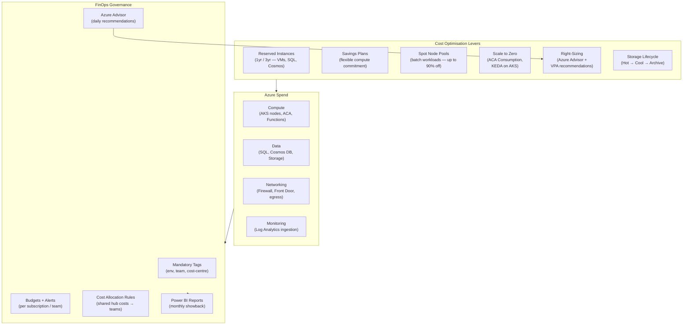

# Azure Cost Management & Optimisation

## Category
Cloud Native, FinOps, Cost Management, Reservations, Savings Plans, Spot VMs, Azure Advisor

## Context

Azure cost optimisation follows the **FinOps framework** — a practice of cross-functional cloud financial management. The goal is not to minimise spend, but to maximise the value of every dollar spent.

**Azure Cost Management + Billing** is the native tooling:
| Feature | Description |
|---------|-------------|
| **Cost Analysis** | Break down spend by subscription, resource group, resource, tag, service, or time period |
| **Budgets** | Set spending limits with alert notifications at configurable thresholds |
| **Alerts** | Anomaly alerts (AI-detected spend spikes) + budget threshold alerts |
| **Cost Allocation** | Distribute shared costs (hub networking, monitoring) across teams using tags |
| **Exports** | Schedule CSV / Parquet exports to Storage Account → Power BI / Synapse |

**Commitment-based discounts**:
| Discount type | How | Discount |
|--------------|-----|----------|
| **Reserved Instances (RI)** | 1-year or 3-year commitment to a specific VM family + region | Up to 72% vs Pay-as-you-go |
| **Azure Savings Plans** | Hourly commitment to any compute usage (flexible across VM, AKS, ACA) | Up to 65% |
| **Dev/Test subscriptions** | Licensed developer subscriptions — no Windows VM licensing cost | ~40% on Windows workloads |
| **Hybrid Benefit** | Bring your own Windows Server / SQL Server licence | Up to 40% on AKS nodes, VMs, SQL |

**Spot VMs / Spot Node Pools**: Up to 90% discount on unused Azure capacity — with eviction risk. Best for:
- Batch processing, CI/CD agents, data transformation, rendering.
- Not suitable for: production stateful workloads, databases, or latency-sensitive APIs.

**Right-sizing guidance**:
- Azure Advisor: automatic recommendations for underutilised VMs, App Service Plans, databases.
- AKS: VPA (Vertical Pod Autoscaler) recommends CPU/memory requests and limits based on observed usage.
- Scale-to-zero: Container Apps Consumption and AKS with KEDA (scale to 0) eliminate idle compute cost.

**Tag governance** — required for meaningful cost allocation:
| Tag | Value examples |
|-----|---------------|
| `environment` | prod / staging / dev |
| `team` | platform / checkout / search |
| `cost-centre` | CC-1234 |
| `owner` | team-email@example.com |
| `application` | myapp |

---

## Pros

- **Azure Advisor integration**: Free, continuously updated right-sizing and security recommendations.
- **Tag-based showback / chargeback**: Charge teams for their actual consumption using exported cost data + Power BI.
- **Savings Plans flexibility**: Commit to compute spend (not VM SKU) — applies automatically to the cheapest eligible usage, including AKS and ACA.
- **Spot Node Pools via AKS KEDA**: Schedule batch workloads on Spot nodes; KEDA scales them up only when a queue has messages — deep savings.
- **Hierarchical budgets**: Set budgets at Management Group, subscription, or resource group level — alert finance teams and workload owners independently.

---

## Cons

- **RI buying complexity**: Choosing the right VM family, region, and scope requires usage analysis — wrong commitment wastes money.
- **Spot eviction risk**: Azure may evict spot VMs with 30-second warning — only suitable for fault-tolerant workloads.
- **Tag enforcement latency**: Policy-enforced tags only apply to new resources; retroactively tagging existing resources requires migration effort.
- **Cost data latency**: Cost Management data is typically 8–24 hours behind real-time usage — not suitable for real-time alerting.
- **Dev/Test requires Visual Studio subscription**: Each user of a Dev/Test subscription must have an active Visual Studio subscription.

---

## Design Diagram



---

## Code Sample

### Bicep — Budget with Alerts + Cost Anomaly Alert

```bicep
// infrastructure/bicep/cost/budgets.bicep
targetScope = 'subscription'

param subscriptionName string
param monthlyBudget    int    = 10000
param alertEmail       string
param financeEmail     string = 'finance@example.com'

// ─── Subscription-level monthly budget ────────────────────────────────────────
resource monthlyBudgetResource 'Microsoft.Consumption/budgets@2023-11-01' = {
  name: '${subscriptionName}-monthly'
  properties: {
    category:   'Cost'
    amount:     monthlyBudget
    timeGrain:  'Monthly'
    timePeriod: {
      startDate: '2024-01-01'    // Must be start of a month
      endDate:   '2099-12-31'
    }

    notifications: {
      // Alert at 80% of budget
      eightyPercent: {
        enabled:       true
        operator:      'GreaterThan'
        threshold:     80
        contactEmails: [alertEmail, financeEmail]
        thresholdType: 'Actual'
      }
      // Alert at 100% of budget
      hundredPercent: {
        enabled:       true
        operator:      'GreaterThan'
        threshold:     100
        contactEmails: [alertEmail, financeEmail]
        thresholdType: 'Actual'
      }
      // Alert at 80% of forecasted spend (early warning)
      forecastedNinety: {
        enabled:       true
        operator:      'GreaterThan'
        threshold:     90
        contactEmails: [alertEmail]
        thresholdType: 'Forecasted'
      }
    }

    filter: {
      // Exclude dev subscriptions from main budget
      not: {
        tags: {
          name:     'environment'
          operator: 'In'
          values:   ['dev', 'sandbox']
        }
      }
    }
  }
}

// ─── Cost anomaly alert ────────────────────────────────────────────────────────
// Note: Anomaly alerts are configured in Azure Cost Management portal
// or via REST API — not yet available in Bicep directly.
// Equivalent CLI:
// az costmanagement alert create ...
```

### Azure CLI — Right-Sizing Advisor Recommendations Report

```bash
#!/bin/bash
# scripts/cost-advisor-report.sh
# Export Azure Advisor cost recommendations to CSV

SUBSCRIPTION_ID="$1"

echo "Fetching Azure Advisor cost recommendations..."

az advisor recommendation list \
  --subscription "${SUBSCRIPTION_ID}" \
  --category Cost \
  --query "[].{
    ResourceName:resourceMetadata.resourceId,
    Impact:impact,
    Category:category,
    Problem:shortDescription.problem,
    Solution:shortDescription.solution,
    AnnualSavings:extendedProperties.savingsAmount,
    Currency:extendedProperties.savingsCurrency
  }" \
  --output table

echo ""
echo "Top 10 savings opportunities:"
az advisor recommendation list \
  --subscription "${SUBSCRIPTION_ID}" \
  --category Cost \
  --query "sort_by([?extendedProperties.savingsAmount != null], &extendedProperties.savingsAmount) | reverse(@) | [:10].{
    Resource: resourceMetadata.resourceId,
    AnnualSavings: extendedProperties.savingsAmount,
    Solution: shortDescription.solution
  }" \
  --output table
```

### Bicep — Reserved Instance + Savings Plan Automation

```bicep
// infrastructure/bicep/cost/reservations.bicep
// NOTE: Reservations are purchased at enrolled account or billing scope
// This example shows how to declare a reservation via Bicep

targetScope = 'subscription'

// ─── 1-Year Savings Plan for compute ─────────────────────────────────────────
// Savings Plans are purchased via Azure portal or REST API
// Include below as documentation reference:
//
// az billing savings-plan create \
//   --billing-account-name <EA_ID> \
//   --billing-profile-name <PROFILE_ID> \
//   --display-name "myapp-compute-savings-plan" \
//   --duration P1Y \
//   --commitment-amount 500 \
//   --commitment-currency USD \
//   --applied-scope-type Shared
//
// ─── Reserved Instances for AKS nodes ────────────────────────────────────────
// az reservations reservation-order purchase \
//   --sku Standard_D8s_v5 \
//   --location westeurope \
//   --quantity 5 \
//   --term P1Y \
//   --billing-plan Monthly \
//   --applied-scope-type Shared \
//   --display-name "aks-user-nodes-reservation"
```

### TypeScript — Cost Export + Automated Showback Report

```typescript
// src/finops/cost-report.ts
// Fetch cost data and generate team-level showback report

import { CostManagementClient } from '@azure/arm-costmanagement';
import { DefaultAzureCredential } from '@azure/identity';

const costClient = new CostManagementClient(new DefaultAzureCredential());

interface TeamCost {
  team:        string;
  totalCost:   number;
  currency:    string;
  breakdown:   Array<{ service: string; cost: number }>;
}

export async function generateMonthlyShowback(
  subscriptionId: string,
  year:           number,
  month:          number,
): Promise<TeamCost[]> {
  const startDate = `${year}-${String(month).padStart(2, '0')}-01`;
  const endDate   = new Date(year, month, 0).toISOString().split('T')[0];

  const scope  = `/subscriptions/${subscriptionId}`;

  const result = await costClient.query.usage(scope, {
    type: 'Usage',
    timeframe: 'Custom',
    timePeriod: { from: new Date(startDate), to: new Date(endDate) },
    dataset: {
      granularity: 'Monthly',
      aggregation: {
        totalCost: { name: 'PreTaxCost', function: 'Sum' },
      },
      grouping: [
        { type: 'TagKey', name: 'team' },      // Group by 'team' tag
        { type: 'Dimension', name: 'ServiceName' },
      ],
      filter: {
        not: {
          tags: {
            name:     'environment',
            operator: 'In',
            values:   ['dev'],
          },
        },
      },
    },
  });

  // Transform raw cost data into team showback
  const teamMap = new Map<string, TeamCost>();

  for (const row of result.rows ?? []) {
    const [cost, , team, service] = row as [number, string, string, string];
    const teamName = team || 'untagged';

    if (!teamMap.has(teamName)) {
      teamMap.set(teamName, { team: teamName, totalCost: 0, currency: 'USD', breakdown: [] });
    }

    const entry = teamMap.get(teamName)!;
    entry.totalCost += cost;
    entry.breakdown.push({ service, cost });
  }

  return Array.from(teamMap.values())
    .sort((a, b) => b.totalCost - a.totalCost);
}

// ─── Tag compliance check — find untagged resources ───────────────────────────
export async function findUntaggedResources(
  subscriptionId: string,
): Promise<void> {
  const { ResourceManagementClient } = await import('@azure/arm-resources');
  const rmClient = new ResourceManagementClient(
    new DefaultAzureCredential(),
    subscriptionId,
  );

  const requiredTags = ['team', 'environment', 'cost-centre'];

  for await (const resource of rmClient.resources.list()) {
    const missingTags = requiredTags.filter((tag) => !resource.tags?.[tag]);

    if (missingTags.length > 0) {
      console.warn(`Untagged resource: ${resource.id}`, { missingTags });
    }
  }
}
```

### Azure Policy — Enforce Cost-Allocation Tags via Modify Effect

```json
{
  "mode": "Indexed",
  "displayName": "Inherit 'environment' tag from resource group",
  "description": "Adds or overwrites the 'environment' tag on resources with the value from the parent resource group",
  "policyRule": {
    "if": {
      "anyOf": [
        {
          "field": "tags['environment']",
          "exists": "false"
        },
        {
          "value": "[resourceGroup().tags['environment']]",
          "notEquals": "[field('tags[''environment'']')]"
        }
      ]
    },
    "then": {
      "effect": "Modify",
      "details": {
        "roleDefinitionIds": [
          "/providers/Microsoft.Authorization/roleDefinitions/b24988ac-6180-42a0-ab88-20f7382dd24c"
        ],
        "operations": [
          {
            "operation": "addOrReplace",
            "field": "tags['environment']",
            "value": "[resourceGroup().tags['environment']]"
          }
        ]
      }
    }
  }
}
```
