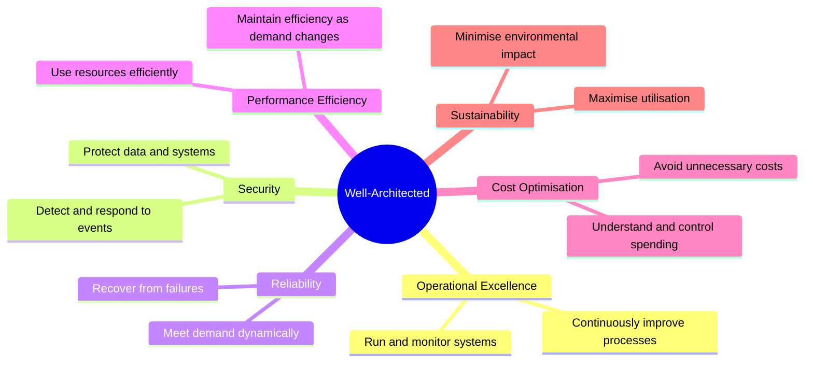
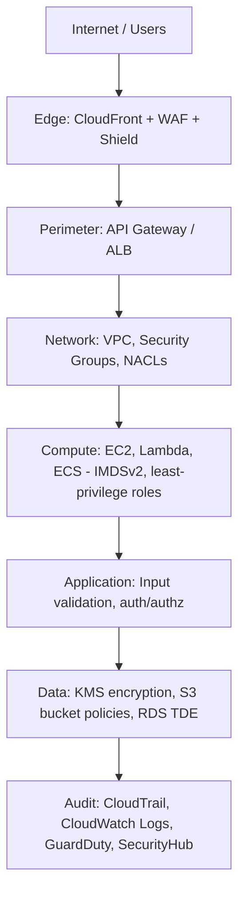
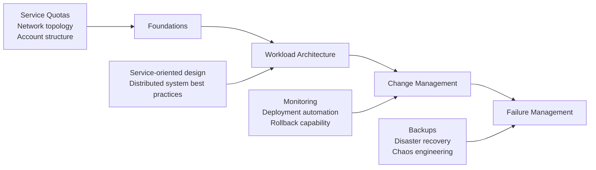
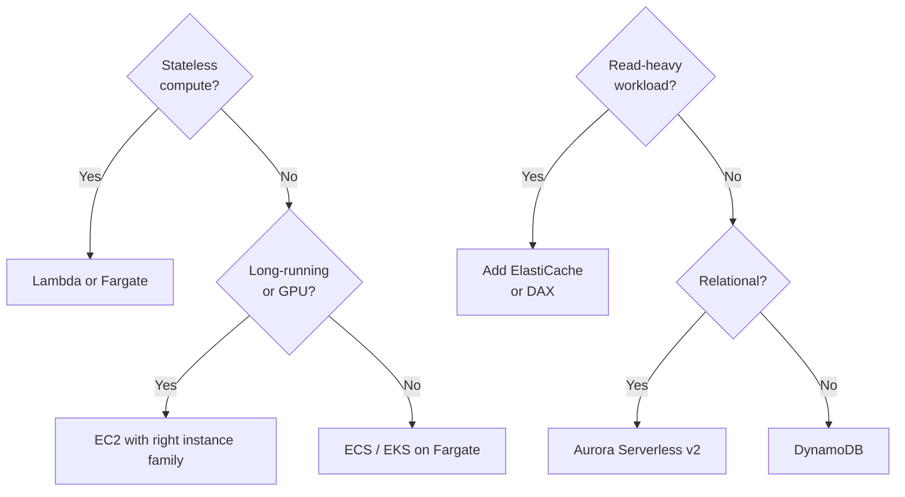
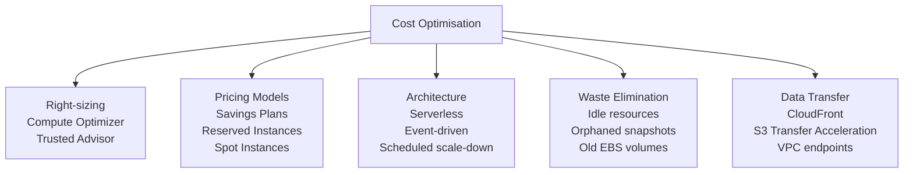
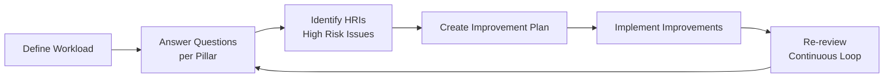
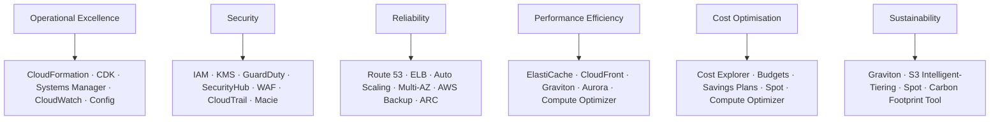

# AWS Well-Architected Framework

## Category
Cloud Architecture, Best Practices, AWS, Architecture Review

---

## What Is It?

The **AWS Well-Architected Framework** is a set of best practices and guiding principles for designing and operating reliable, secure, efficient, cost-effective, and sustainable workloads in the cloud.

It was developed from reviewing thousands of real-world architectures across AWS customers. It gives teams a consistent lens to **evaluate architectures** and identify risks before they become production issues.

The framework is structured around **6 pillars** and reviewed using **questions** that help you understand trade-offs and identify improvements.

---

## The 6 Pillars at a Glance

---

## Pillar 1 — Operational Excellence

> *Run, monitor, and improve workloads to deliver business value.*

### Design Principles
- **Perform operations as code** — use IaC (CloudFormation, CDK, Terraform) for everything.
- **Make frequent, small, reversible changes** — deploy small increments; roll back easily.
- **Refine operations frequently** — game days, runbooks, post-mortems.
- **Anticipate failure** — pre-mortem analysis; simulate component failures.
- **Learn from all operational failures** — blameless retrospectives.

### Key Areas

| Area | What to Ask |
|------|------------|
| **Organisation** | Do teams have clear ownership and documented runbooks? |
| **Prepare** | Is the workload deployed with automated pipelines? Are dashboards in place pre-launch? |
| **Operate** | Are alerts actionable? Is on-call load sustainable? |
| **Evolve** | Are lessons from incidents captured and acted on? |

### AWS Services
- **AWS CloudFormation / CDK** — infrastructure as code
- **AWS Systems Manager** — runbooks, patch management, parameter store
- **AWS Config** — continuous compliance and change tracking
- **CloudWatch / X-Ray** — metrics, logs, distributed tracing
- **AWS Incident Manager** — automated incident response plans

---

## Pillar 2 — Security

> *Protect information, systems, and assets while delivering business value.*

### Design Principles
- **Implement a strong identity foundation** — principle of least privilege; centralise identity (IAM Identity Center).
- **Enable traceability** — log everything; integrate logs with SIEM.
- **Apply security at all layers** — edge (WAF/Shield), network (SGs/NACLs), compute, data.
- **Automate security best practices** — use SCPs, AWS Config rules, GuardDuty.
- **Protect data in transit and at rest** — TLS everywhere; KMS for encryption.
- **Keep people away from data** — automate operations; avoid direct production access.
- **Prepare for security events** — have an incident response plan; run security game days.

### Security Layers

### Key Areas

| Area | What to Ask |
|------|------------|
| **Identity & Access** | Is MFA enforced? Are IAM roles scoped to minimum permissions? |
| **Detection** | Is GuardDuty enabled? Are CloudTrail logs centralised? |
| **Infrastructure Protection** | Are VPCs segmented? Are security groups restrictive? |
| **Data Protection** | Is all data encrypted at rest and in transit? Are S3 buckets private by default? |
| **Incident Response** | Is there a tested IR playbook? Can forensics be run without production access? |

### AWS Services
- **IAM / IAM Identity Center** — identity and access management
- **AWS KMS** — key management for encryption
- **AWS GuardDuty** — threat detection using ML
- **AWS Security Hub** — aggregated security findings
- **AWS Shield / WAF** — DDoS protection and web application firewall
- **AWS CloudTrail** — API audit logging
- **Amazon Macie** — sensitive data discovery in S3

---

## Pillar 3 — Reliability

> *Ensure a workload performs its intended function correctly and consistently.*

### Design Principles
- **Automatically recover from failure** — use health checks, auto scaling, multi-AZ.
- **Test recovery procedures** — run chaos experiments; don't wait for real failures.
- **Scale horizontally** — replace large resources with many smaller ones.
- **Stop guessing capacity** — use auto scaling driven by demand.
- **Manage change through automation** — prevent configuration drift.

### Reliability Hierarchy

### Availability Targets

| SLA | Downtime/Year | Downtime/Month |
|-----|--------------|----------------|
| 99% | ~3.65 days | ~7.2 hours |
| 99.9% | ~8.7 hours | ~43 minutes |
| 99.95% | ~4.4 hours | ~21 minutes |
| 99.99% | ~52 minutes | ~4.4 minutes |
| 99.999% | ~5.2 minutes | ~26 seconds |

### Key Areas

| Area | What to Ask |
|------|------------|
| **Foundations** | Are service quotas monitored? Is the network topology resilient? |
| **Workload Architecture** | Are components loosely coupled? Is circuit breaking in place? |
| **Change Management** | Is there auto scaling? Are deployments monitored for anomalies? |
| **Failure Management** | Are backups tested? Is the RTO/RPO defined and validated? |

### AWS Services
- **Elastic Load Balancing** — distribute traffic across healthy targets
- **Auto Scaling** — scale EC2, ECS, DynamoDB, Aurora automatically
- **Route 53** — health-check-based DNS failover
- **AWS Backup** — centralised backup policy across services
- **Multi-AZ / Multi-Region** — geographic redundancy

---

## Pillar 4 — Performance Efficiency

> *Use computing resources efficiently and maintain efficiency as demand changes.*

### Design Principles
- **Democratise advanced technologies** — use managed services (Aurora, OpenSearch, SageMaker) instead of building from scratch.
- **Go global in minutes** — deploy to multiple regions using CloudFormation StackSets or CDK Pipelines.
- **Use serverless architectures** — eliminate server management overhead.
- **Experiment more often** — test different instance types and configurations easily.
- **Consider mechanical sympathy** — match workload to the best technology (OLTP vs OLAP, cache vs DB).

### Technology Selection

### Key Areas

| Area | What to Ask |
|------|------------|
| **Selection** | Is the compute, storage, and database type matched to the workload pattern? |
| **Review** | Is performance benchmarked? Are newer AWS instance types evaluated periodically? |
| **Monitoring** | Are latency and throughput metrics tracked? Are CloudWatch alarms set for degradation? |
| **Trade-offs** | Is caching used appropriately? Is CDN used for static assets? |

### AWS Services
- **EC2 Graviton** — ARM-based instances with better price/performance
- **ElastiCache (Redis / Memcached)** — in-memory caching
- **CloudFront** — CDN to reduce latency for global users
- **Amazon Aurora** — high-performance managed relational DB
- **AWS Compute Optimizer** — recommendations for right-sizing

---

## Pillar 5 — Cost Optimisation

> *Avoid unnecessary costs and understand where money is being spent.*

### Design Principles
- **Implement cloud financial management** — treat cost as an engineering concern (FinOps culture).
- **Adopt a consumption model** — pay only for what you use; stop resources when idle.
- **Measure overall efficiency** — track cost per business outcome (e.g., cost per transaction).
- **Stop spending money on undifferentiated heavy lifting** — use managed services.
- **Analyse and attribute expenditure** — use tags and cost allocation to drive accountability.

### Cost Optimisation Levers

### Pricing Model Cheat Sheet

| Type | Best For | Savings vs On-Demand |
|------|---------|---------------------|
| **On-Demand** | Unpredictable, short-lived workloads | Baseline |
| **Savings Plans (Compute)** | Steady-state workloads, flexible instance type | Up to 66% |
| **Reserved Instances** | Steady-state, fixed instance type/region | Up to 72% |
| **Spot Instances** | Fault-tolerant, flexible batch jobs | Up to 90% |
| **Graviton instances** | General purpose, containers, microservices | ~20% better price/perf |

### Key Areas

| Area | What to Ask |
|------|------------|
| **Practice Cloud Financial Management** | Is there a FinOps function? Are costs reviewed in sprint reviews? |
| **Expenditure & Usage Awareness** | Are resources tagged? Is AWS Cost Explorer used? Are budgets set with alerts? |
| **Cost-Effective Resources** | Are Savings Plans or RIs purchased for stable workloads? |
| **Manage Demand & Supply** | Does auto scaling match supply to demand? Are dev envs shut down overnight? |
| **Optimise Over Time** | Is Compute Optimizer reviewed quarterly? |

### AWS Services
- **AWS Cost Explorer** — visualise and forecast spend
- **AWS Budgets** — alert when costs exceed thresholds
- **AWS Compute Optimizer** — right-sizing recommendations
- **Savings Plans / Reserved Instances** — commitment-based discounts
- **AWS Cost Anomaly Detection** — ML-based spend anomaly alerts

---

## Pillar 6 — Sustainability

> *Minimise the environmental impact of running cloud workloads.*

### Design Principles
- **Understand your impact** — measure power consumption and carbon footprint.
- **Establish sustainability goals** — set targets aligned with business objectives.
- **Maximise utilisation** — right-size to a high average utilisation; avoid idle resources.
- **Adopt efficient hardware and software** — use Graviton; use managed services; avoid the least efficient runtimes.
- **Use managed services** — AWS manages efficiency of shared infrastructure at scale.
- **Reduce downstream impact** — optimise what is delivered to end users (compress assets, avoid unnecessary API calls).

### Key Areas

| Area | What to Ask |
|------|------------|
| **Region selection** | Are renewable-energy regions preferred when latency allows? |
| **Alignment to demand** | Are resources scaled to zero when idle? Is unnecessary data processing avoided? |
| **Software & architecture** | Are efficient languages and algorithms chosen? Is data lifecycle managed (archival/deletion)? |
| **Data** | Is data compressed and deduplicated? Is S3 Intelligent-Tiering used? |

### AWS Services
- **AWS Graviton** — more efficient ARM processors
- **S3 Intelligent-Tiering / Glacier** — move rarely-accessed data to lower-power tiers
- **AWS Customer Carbon Footprint Tool** — track carbon emissions
- **Spot + Auto Scaling** — maximise utilisation, avoid idle capacity

---

## The Well-Architected Review Process

A **Well-Architected Review (WAR)** is a structured conversation with an AWS Solutions Architect or internal team using the AWS Well-Architected Tool.

### Steps
1. **Define the workload scope** — name, description, environment, regions, account IDs.
2. **Answer the pillar questions** — ~60 questions across all 6 pillars.
3. **Review risk report** — AWS classifies findings as *High Risk* (HRI) or *Medium Risk* (MRI).
4. **Build an improvement plan** — prioritise HRIs; assign owners and target dates.
5. **Implement and re-review** — the WAR is not a one-time event; run it at major milestones (pre-launch, post-incident, quarterly).

### AWS Well-Architected Tool
- Free service in the AWS Console under **AWS Well-Architected Tool**.
- Supports **custom lenses** to add organisation-specific best practices.
- Integrates with **AWS Trusted Advisor** for automated checks.
- Produces a **milestone snapshot** so you can track improvement over time.

---

## Well-Architected Lenses

Lenses extend the framework for specific domains:

| Lens | Focus |
|------|-------|
| **Serverless Lens** | Lambda, API Gateway, Step Functions, DynamoDB |
| **SaaS Lens** | Multi-tenancy, tenant isolation, onboarding pipelines |
| **Machine Learning Lens** | ML lifecycles, SageMaker, data pipelines |
| **IoT Lens** | Device connectivity, ingestion at scale, edge processing |
| **Data Analytics Lens** | Data lakes, streaming, BI workloads |
| **Financial Services Lens** | Compliance, auditability, resilience for FSI |
| **Custom Lenses** | Organisation-specific best practices via JSON definition |

---

## General Design Principles (Across All Pillars)

| Principle | Description |
|-----------|-------------|
| **Stop guessing capacity** | Scale automatically; test at production scale |
| **Test systems at production scale** | Use load testing; spin up replica environments on demand |
| **Automate to make experimentation easier** | IaC + CI/CD pipelines lower the cost of change |
| **Allow for evolutionary architectures** | Design for change; avoid big-bang migrations |
| **Drive architectures using data** | Instrument everything; make data-driven decisions |
| **Improve through game days** | Simulate failures and unusual events in production-like environments |

---

## Common Anti-Patterns

| Anti-Pattern | Pillar Violated | Correct Approach |
|-------------|----------------|-----------------|
| Single-AZ deployment | Reliability | Multi-AZ with auto-failover |
| Hardcoded secrets in code | Security | AWS Secrets Manager or Parameter Store |
| One AWS account for everything | Security, OpEx | Multi-account with AWS Organizations + SCPs |
| Over-provisioned EC2 instances | Cost, Sustainability | Right-size with Compute Optimizer; consider Graviton |
| Manual deployments | Operational Excellence | CI/CD pipeline with automated rollback |
| No observability in production | Operational Excellence | CloudWatch + X-Ray + structured logging |
| Blocking synchronous calls everywhere | Performance, Reliability | Event-driven with SQS/SNS/EventBridge |
| Storing large blobs in databases | Performance, Cost | Use S3; store only references in DB |

---

## Quick Reference — Pillar → Primary AWS Services

---

## Study Checklist

- [ ] Name and describe all 6 pillars from memory
- [ ] For each pillar, state 3+ design principles
- [ ] Explain the difference between HRI and MRI in a WAR
- [ ] Describe the Well-Architected Review process end-to-end
- [ ] Identify which pillar is violated for 5 common anti-patterns
- [ ] Explain what a Well-Architected Lens is and give 3 examples
- [ ] Map core AWS services to each pillar
- [ ] Explain trade-offs between Savings Plans, Reserved Instances, and Spot

---

## References

- [AWS Well-Architected Framework](https://docs.aws.amazon.com/wellarchitected/latest/framework/welcome.html)
- [AWS Well-Architected Tool](https://aws.amazon.com/well-architected-tool/)
- [AWS Well-Architected Labs](https://wellarchitectedlabs.com/)
- [AWS Whitepapers — Well-Architected](https://aws.amazon.com/architecture/well-architected/)
