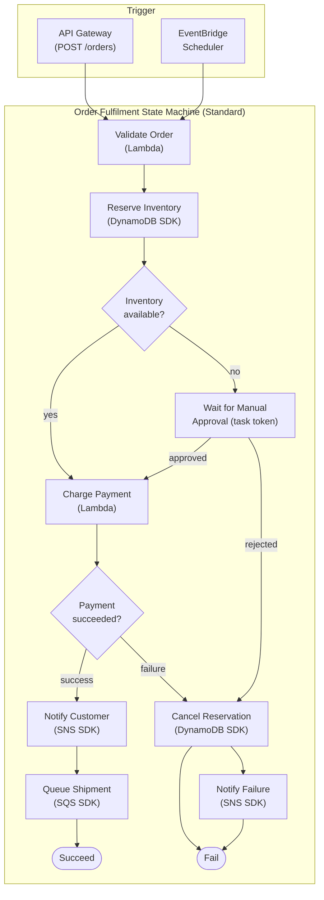

# AWS Step Functions — Workflow Orchestration

## Category
Cloud Native, Orchestration, Serverless, AWS Step Functions, State Machines

## Context

AWS Step Functions orchestrates multi-step workflows using state machines defined in Amazon States Language (ASL). It replaces fragile, in-process workflow logic with a visual, auditable, and durable execution engine.

**Workflow types**:
| Type | Execution model | Duration limit | Pricing | Best for |
|------|----------------|---------------|---------|----------|
| **Standard** | At-least-once; durable | 1 year | Per state transition (~$0.025/1K) | Long-running, auditable, human-approval workflows |
| **Express (async)** | At-least-once | 5 minutes | Per duration + requests | High-volume, short events (IoT, streaming) |
| **Express (sync)** | At-most-once | 5 minutes | Per duration + requests | Request-response API patterns |

**State types**:
| State | Purpose |
|-------|---------|
| `Task` | Invoke Lambda, SDK service call, HTTP endpoint, ECS task |
| `Choice` | Branch on condition (if/else) |
| `Parallel` | Run branches concurrently, wait for all |
| `Map` | Iterate over array items (inline or distributed) |
| `Wait` | Pause for seconds or until a timestamp |
| `Pass` | Transform/forward input without side effects |
| `Succeed` / `Fail` | Terminal states |

**Optimised integrations (no Lambda wrapper needed)**:
Step Functions can call 200+ AWS SDK APIs directly via optimised integrations:
- DynamoDB: `PutItem`, `GetItem`, `UpdateItem`, `Query`
- SQS: `SendMessage`
- SNS: `Publish`
- ECS: `RunTask`
- EventBridge: `PutEvents`
- Bedrock: `InvokeModel`
- S3: `GetObject`, `PutObject`

**Wait-for-callback pattern** (task token):
Long-running async operations (human approval, external API webhook) use a task token. Step Functions pauses until `SendTaskSuccess` or `SendTaskFailure` is called with the token.

**Distributed Map** (up to 10,000 concurrent):
Process large S3 manifests or DynamoDB scan results in parallel at massive scale. Each item processed as an independent child execution.

**Error handling**:
```
Task states support:
  Retry: exponential backoff (Interval, MaxAttempts, BackoffRate, JitterStrategy)
  Catch: route to fallback state on specific error types (States.TaskFailed, Lambda.AWSLambdaException, etc.)
```

---

## Pros

- **Durable executions**: State is persisted — crashes, Lambda timeouts, and re-deploys don't lose progress.
- **Visual debugging**: Execution history shows exact state reached, input/output at every step.
- **No polling logic**: Wait states remove the need for SQS polling or retry loops in application code.
- **Parallel by default**: Parallel and Map states are built-in — no threading logic needed.
- **Audit trail**: Full event history stored for Standard workflows — queryable for compliance.
- **Human-in-the-loop**: Task token pattern supports approval workflows with arbitrary wait times.

---

## Cons

- **Standard cost at scale**: Standard workflows price per state transition — high-frequency workflows are expensive. Use Express for >10,000 executions/day.
- **5-minute Express limit**: Cannot replace Standard for workflows requiring durable pause.
- **ASL verbosity**: Large workflows require significant JSON/YAML — mitigated by CDK or Workflow Studio.
- **Cold starts propagate**: Lambda cold starts add latency to the first Task in a workflow.
- **Limited branching expressiveness**: Complex switch-case logic requires chained Choice states.
- **No native loop counter**: Iteration patterns require recursive execution or Map state workarounds.

---

## Design Diagram



---

## Code Sample

### State machine (AWS CDK — TypeScript)

```typescript
import * as sfn from 'aws-cdk-lib/aws-stepfunctions';
import * as tasks from 'aws-cdk-lib/aws-stepfunctions-tasks';
import * as lambda from 'aws-cdk-lib/aws-lambda';
import { Duration } from 'aws-cdk-lib';

// --- Lambda functions (assumed pre-defined) ---
declare const validateFn: lambda.IFunction;
declare const chargeFn: lambda.IFunction;
declare const notifyFn: lambda.IFunction;

// --- States ---
const validate = new tasks.LambdaInvoke(this, 'ValidateOrder', {
  lambdaFunction: validateFn,
  outputPath: '$.Payload',
  retryOnServiceExceptions: true,
});

const reserveInventory = new tasks.DynamoPutItem(this, 'ReserveInventory', {
  table: inventoryTable,
  item: {
    pk: tasks.DynamoAttributeValue.fromString(sfn.JsonPath.stringAt('$.orderId')),
    status: tasks.DynamoAttributeValue.fromString('RESERVED'),
  },
  resultPath: sfn.JsonPath.DISCARD,
});

const chargePayment = new tasks.LambdaInvoke(this, 'ChargePayment', {
  lambdaFunction: chargeFn,
  outputPath: '$.Payload',
}).addRetry({
  maxAttempts: 3,
  interval: Duration.seconds(2),
  backoffRate: 2,
  jitterStrategy: sfn.JitterType.FULL,
  errors: ['Lambda.ServiceException', 'Lambda.AWSLambdaException'],
}).addCatch(cancelReservation, {
  errors: ['PaymentFailedError'],
  resultPath: '$.error',
});

const notifyCustomer = new tasks.SnsPublish(this, 'NotifyCustomer', {
  topic: orderTopic,
  message: sfn.TaskInput.fromJsonPathAt('$.notification'),
  resultPath: sfn.JsonPath.DISCARD,
});

// --- Choice state ---
const inventoryCheck = new sfn.Choice(this, 'InventoryAvailable?')
  .when(sfn.Condition.booleanEquals('$.inventoryReserved', true), chargePayment)
  .otherwise(waitForApproval);

// --- Human-approval wait ---
const waitForApproval = new sfn.Task(this, 'WaitForApproval', {
  task: new tasks.SqsSendMessage({
    queue: approvalQueue,
    messageBody: sfn.TaskInput.fromObject({
      taskToken: sfn.JsonPath.taskToken,
      input: sfn.JsonPath.entirePayload,
    }),
    integrationPattern: sfn.ServiceIntegrationPattern.WAIT_FOR_TASK_TOKEN,
  }),
  timeout: Duration.days(3),
}).addCatch(cancelReservation, { errors: ['States.Timeout'] });

// --- Chain ---
const definition = validate
  .next(reserveInventory)
  .next(inventoryCheck);

// After inventoryCheck → chargePayment → notifyCustomer
chargePayment.next(notifyCustomer).next(new sfn.Succeed(this, 'Fulfilled'));

const stateMachine = new sfn.StateMachine(this, 'OrderFulfilment', {
  definition,
  stateMachineType: sfn.StateMachineType.STANDARD,
  tracing: sfn.TracingConfiguration.ENABLED,
  logs: {
    destination: new logs.LogGroup(this, 'SFNLogs', {
      retention: logs.RetentionDays.ONE_MONTH,
    }),
    level: sfn.LogLevel.ERROR,
    includeExecutionData: false, // avoid logging sensitive payload
  },
});
```

### Distributed Map — process S3 manifest in parallel

```typescript
const processItems = new tasks.LambdaInvoke(this, 'ProcessItem', {
  lambdaFunction: processItemFn,
  outputPath: '$.Payload',
});

const distributedMap = new sfn.DistributedMap(this, 'ProcessManifest', {
  maxConcurrency: 1000, // 0 = unlimited
  itemReader: new sfn.S3JsonItemReader({
    bucket: manifestBucket,
    key: sfn.JsonPath.stringAt('$.manifestKey'),
  }),
  resultWriter: new sfn.ResultWriter({
    bucket: resultsBucket,
    prefix: 'results/',
  }),
  toleratedFailurePercentage: 5, // allow up to 5% item failures
});
distributedMap.itemProcessor(processItems);
```

### Sending task token callback (e.g. from approval service)

```typescript
import { SFNClient, SendTaskSuccessCommand, SendTaskFailureCommand } from '@aws-sdk/client-sfn';

const sfnClient = new SFNClient({});

// Approve
await sfnClient.send(new SendTaskSuccessCommand({
  taskToken: event.taskToken,
  output: JSON.stringify({ approved: true, approvedBy: event.userId }),
}));

// Reject
await sfnClient.send(new SendTaskFailureCommand({
  taskToken: event.taskToken,
  error: 'ApprovalRejected',
  cause: `Rejected by ${event.userId}`,
}));
```

### Terraform: state machine with X-Ray tracing

```hcl
resource "aws_sfn_state_machine" "order_fulfilment" {
  name       = "order-fulfilment"
  role_arn   = aws_iam_role.sfn_role.arn
  type       = "STANDARD"

  definition = jsonencode({
    Comment = "Order fulfilment workflow"
    StartAt = "ValidateOrder"
    States  = {
      ValidateOrder = {
        Type     = "Task"
        Resource = "arn:aws:states:::lambda:invoke"
        Parameters = {
          FunctionName = var.validate_fn_arn
          "Payload.$"  = "$$"
        }
        OutputPath = "$.Payload"
        Retry = [{
          ErrorEquals = ["Lambda.ServiceException", "Lambda.AWSLambdaException"]
          IntervalSeconds = 2
          MaxAttempts     = 3
          BackoffRate     = 2
          JitterStrategy  = "FULL"
        }]
        Next = "ChargePayment"
      }
      # ... additional states
    }
  })

  tracing_configuration {
    enabled = true
  }

  logging_configuration {
    log_destination        = "${aws_cloudwatch_log_group.sfn.arn}:*"
    include_execution_data = false
    level                  = "ERROR"
  }

  tags = {
    Environment = var.environment
    Team        = var.team
  }
}

resource "aws_iam_role_policy" "sfn_policy" {
  name = "sfn-permissions"
  role = aws_iam_role.sfn_role.id

  policy = jsonencode({
    Version = "2012-10-17"
    Statement = [
      {
        Effect = "Allow"
        Action = ["lambda:InvokeFunction"]
        Resource = [var.validate_fn_arn, var.charge_fn_arn, var.notify_fn_arn]
      },
      {
        Effect = "Allow"
        Action = ["dynamodb:PutItem", "dynamodb:UpdateItem", "dynamodb:DeleteItem"]
        Resource = var.inventory_table_arn
      },
      {
        Effect = "Allow"
        Action = ["sns:Publish"]
        Resource = var.order_topic_arn
      },
      {
        Effect   = "Allow"
        Action   = ["xray:PutTraceSegments", "xray:PutTelemetryRecords"]
        Resource = "*"
      },
      {
        Effect   = "Allow"
        Action   = ["logs:CreateLogDelivery", "logs:PutLogEvents", "logs:DescribeLogGroups"]
        Resource = "*"
      }
    ]
  })
}
```

---

## Key Patterns

### Saga pattern (compensating transactions)

Use a Parallel or sequential chain of Task states with a Catch on each service call that routes to compensating Tasks:

```
ReserveInventory →─ success ──→ ChargePayment →─ success ──→ Notify
        │                               │
        └── Catch(any) ──→ (nothing)    └── Catch(failure) ──→ ReleaseInventory → Notify
```

Each compensation is an SDK integration or Lambda that undoes the preceding step. Step Functions guarantees the chain won't lose state mid-saga.

### Fan-out with Parallel

```json
{
  "Type": "Parallel",
  "Branches": [
    { "StartAt": "SendEmail", "States": { "SendEmail": { "Type": "Task", ... } } },
    { "StartAt": "UpdateCRM",  "States": { "UpdateCRM":  { "Type": "Task", ... } } },
    { "StartAt": "LogAudit",   "States": { "LogAudit":   { "Type": "Task", ... } } }
  ],
  "Next": "AllDone"
}
```

### Cost guard: use Express for high-frequency event processing

| Scenario | Recommended type | Reason |
|----------|-----------------|--------|
| Order fulfilment (< 1000/day) | Standard | Auditability, long waits |
| Payment webhook processing | Express (async) | High volume, seconds-long, no 1-year audit needed |
| Synchronous API orchestration | Express (sync) | Request-response, < 5 min |
| IoT sensor aggregation | Express (async) | Very high volume |

### Idempotency

Standard workflows: use `name` parameter on `StartExecution` with a deterministic ID (e.g. `order-{orderId}-v1`). Duplicate starts with the same name return the existing execution rather than creating a new one.

---

## Well-Architected Alignment

| Pillar | How Step Functions helps |
|--------|------------------------|
| **Reliability** | Durable state survives Lambda crashes, timeouts, deployments |
| **Operational Excellence** | Visual execution history replaces log scraping for debugging |
| **Security** | IAM roles per state machine; no credentials embedded in workflows |
| **Cost Optimisation** | Express for high-volume; SDK integrations eliminate Lambda wrapper Lambdas |
| **Performance** | Parallel state runs branches concurrently without threading code |

---

## Related Patterns

- [`01-serverless-lambda.md`](01-serverless-lambda.md) — Lambda as Task worker
- [`09-sqs-sns-eventbridge.md`](09-sqs-sns-eventbridge.md) — EventBridge can trigger and receive from Step Functions
- [`08-dynamodb.md`](08-dynamodb.md) — DynamoDB SDK integrations for workflow state storage
- [`14-disaster-recovery.md`](14-disaster-recovery.md) — Distributed Map for bulk data processing during migrations
