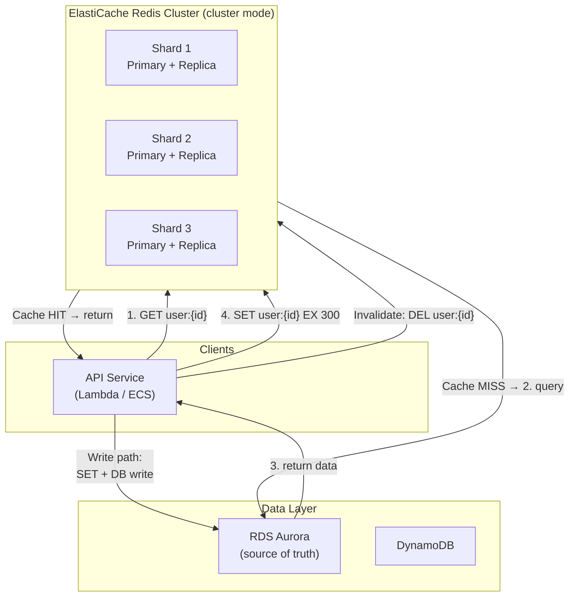

# AWS ElastiCache — In-Memory Caching

## Category
Cloud Native, Caching, Performance, AWS ElastiCache, Redis, Memcached

## Context

Amazon ElastiCache provides fully managed in-memory caching via two engines:

| Engine | Data structures | Persistence | Replication | Clustering | Use when |
|--------|----------------|-------------|-------------|-----------|---------|
| **Redis 7 (Valkey-compatible)** | Strings, hashes, lists, sets, sorted sets, streams, JSON, HyperLogLog | Optional (AOF + RDB snapshots) | Primary + up to 5 replicas | Cluster mode (sharding) | Sessions, leaderboards, pub/sub, rate limiting, distributed locks |
| **Memcached** | Strings only | None | None | Horizontal sharding (client-side) | Simple object caching, maximum throughput, stateless |

**When to choose ElastiCache over other AWS caching options**:
```
Sub-millisecond response for hot data?   → ElastiCache Redis
DynamoDB table with read-heavy workload? → DAX (DynamoDB-specific)
Lambda/API response caching?             → API Gateway response caching or CloudFront
RDS query caching?                       → ElastiCache Redis (query result caching)
Session storage at scale?                → ElastiCache Redis
Leaderboard / sorted ranking?            → Redis Sorted Sets (ZADD/ZRANGE)
Distributed lock (mutex)?                → Redis SETNX / Redlock algorithm
Rate limiting?                           → Redis + Lua atomic increment
```

**Redis Cluster mode**:
- **Disabled** (single shard): up to 1 primary + 5 read replicas. Max ~250 GB per shard. Simpler client config.
- **Enabled** (sharded): up to 500 nodes across up to 250 shards. Data automatically distributed by hash slot (0–16383).

**Eviction policies** — set based on use case:

| Policy | Behaviour | Use for |
|--------|-----------|---------|
| `noeviction` | Return error when full | Critical data, never evict |
| `allkeys-lru` | Evict least recently used from all keys | General cache |
| `volatile-lru` | Evict LRU keys with TTL set | Mix of durable + ephemeral |
| `allkeys-lfu` | Evict least frequently used | Frequency-biased access patterns |
| `volatile-ttl` | Evict keys with shortest TTL | Time-windowed data |
| `allkeys-random` | Random eviction | Uniform access patterns |

**Caching patterns**:
| Pattern | Description | Stale risk | Write overhead |
|---------|-------------|-----------|----------------|
| **Cache-aside (lazy loading)** | Read from cache; on miss, read DB, populate cache, return | Yes (Miss = stale gap) | Low |
| **Write-through** | Write to DB and cache simultaneously | No | Medium |
| **Write-behind (write-back)** | Write to cache first, flush to DB async | Yes (flush failure) | Low |
| **Read-through** | Cache handles DB read on miss (requires cache-layer library) | No | Medium |
| **Refresh-ahead** | Pre-populate cache before TTL expires (background job) | Very low | Background |

**Choosing TTL**:
- Too short → high cache miss rate → DB overload
- Too long → stale data served
- Pattern: Set TTL = expected data change interval × 2. Add random jitter (±10–20%) to avoid thundering herd at mass expiry.

---

## Pros

- **Sub-millisecond latency**: P99 < 1ms for read/write operations.
- **Reduces DB load**: 80–90% read reduction typical for hot data.
- **Rich Redis data structures**: Sorted sets, pub/sub, streams, atomic Lua scripts.
- **In-Transit and at-rest encryption**: TLS and key-based encryption with no code change.
- **Automatic failover**: Read replica promoted to primary within 60 seconds on node failure.
- **Cluster scaling**: Add/remove shards online without downtime (cluster mode).
- **Global Datastore** (Redis cross-region): Active-passive replication across regions for DR.

---

## Cons

- **Memory-bound**: All data must fit in RAM — expensive at large scale. Estimate carefully.
- **No ACID transactions across shards**: Redis transactions (`MULTI/EXEC`) are single-node only.
- **Cold start problem**: Cache warm-up needed after deployment or failover.
- **Cache invalidation complexity**: Stale data bugs are subtle and hard to reproduce.
- **Within-VPC only**: ElastiCache is not publicly accessible — application must be in same VPC.
- **Replication lag**: Replica reads may be milliseconds behind primary (eventual consistency).
- **Cluster mode key limitations**: All keys in a multi-key command must be in the same hash slot — requires hash tags `{user}.session`, `{user}.cart`.

---

## Design Diagram



---

## Code Sample

### TypeScript — cache-aside with Redis (ioredis)

```typescript
import Redis from 'ioredis';
import { z } from 'zod';

const UserSchema = z.object({
  id: z.string(),
  email: z.string().email(),
  name: z.string(),
  tier: z.enum(['free', 'pro', 'enterprise']),
});
type User = z.infer<typeof UserSchema>;

const redis = new Redis({
  host: process.env.REDIS_HOST!,  // ElastiCache primary endpoint
  port: 6379,
  tls: process.env.NODE_ENV === 'production' ? {} : undefined,
  connectTimeout: 5000,
  maxRetriesPerRequest: 2,
  enableReadyCheck: true,
  // For Cluster mode: use new Redis.Cluster([{ host, port }])
});

const CACHE_TTL_SECONDS = 300; // 5 minutes
const JITTER_SECONDS = 30;     // ±30s to avoid thundering herd

function ttlWithJitter(): number {
  return CACHE_TTL_SECONDS + Math.floor(Math.random() * JITTER_SECONDS * 2) - JITTER_SECONDS;
}

async function getUser(id: string, db: DatabaseClient): Promise<User | null> {
  const cacheKey = `user:${id}`;

  // 1. Try cache
  const cached = await redis.get(cacheKey);
  if (cached) {
    return UserSchema.parse(JSON.parse(cached)); // validate even cached data
  }

  // 2. Cache miss — query DB
  const row = await db.query('SELECT * FROM users WHERE id = $1', [id]);
  if (!row) return null;

  const user = UserSchema.parse(row);

  // 3. Populate cache with jitter
  await redis.set(cacheKey, JSON.stringify(user), 'EX', ttlWithJitter());

  return user;
}

async function updateUser(id: string, patch: Partial<User>, db: DatabaseClient): Promise<User> {
  const updated = await db.query('UPDATE users SET ... WHERE id = $1 RETURNING *', [id]);
  const user = UserSchema.parse(updated);

  // Invalidate cache immediately after write
  await redis.del(`user:${id}`);

  return user;
}
```

### Redis rate limiter — fixed window (atomic Lua)

```typescript
async function checkRateLimit(
  ip: string,
  limitPerMinute: number,
): Promise<{ allowed: boolean; remaining: number }> {
  const key = `ratelimit:${ip}:${Math.floor(Date.now() / 60_000)}`;

  // Atomic increment + set expiry (Lua ensures atomicity)
  const luaScript = `
    local count = redis.call('INCR', KEYS[1])
    if count == 1 then
      redis.call('EXPIRE', KEYS[1], 60)
    end
    return count
  `;

  const count = await redis.eval(luaScript, 1, key) as number;
  const allowed = count <= limitPerMinute;

  return { allowed, remaining: Math.max(0, limitPerMinute - count) };
}
```

### Redis distributed lock (Redlock simplified)

```typescript
const LOCK_TTL_MS = 10_000; // 10s maximum lock hold

async function acquireLock(resource: string, token: string): Promise<boolean> {
  // SET NX PX — only set if not exists, with millisecond TTL
  const result = await redis.set(`lock:${resource}`, token, 'NX', 'PX', LOCK_TTL_MS);
  return result === 'OK';
}

async function releaseLock(resource: string, token: string): Promise<void> {
  // Atomic check-and-delete (Lua) — only release if we own the lock
  const luaScript = `
    if redis.call('GET', KEYS[1]) == ARGV[1] then
      return redis.call('DEL', KEYS[1])
    else
      return 0
    end
  `;
  await redis.eval(luaScript, 1, `lock:${resource}`, token);
}
```

### Terraform — ElastiCache Redis with encryption and automatic failover

```hcl
resource "aws_elasticache_subnet_group" "this" {
  name       = "${var.name}-cache-subnet"
  subnet_ids = var.private_subnet_ids
}

resource "aws_security_group" "cache" {
  name   = "${var.name}-cache-sg"
  vpc_id = var.vpc_id

  ingress {
    from_port       = 6379
    to_port         = 6379
    protocol        = "tcp"
    security_groups = [var.app_security_group_id] # only app tier
  }

  egress {
    from_port   = 0
    to_port     = 0
    protocol    = "-1"
    cidr_blocks = ["0.0.0.0/0"]
  }
}

resource "aws_elasticache_replication_group" "this" {
  replication_group_id = var.name
  description          = "Redis cache for ${var.name}"

  node_type            = var.node_type           # e.g. "cache.r7g.large" (Graviton)
  num_cache_clusters   = 2                       # 1 primary + 1 replica
  automatic_failover_enabled = true
  multi_az_enabled     = true

  engine               = "redis"
  engine_version       = "7.1"
  port                 = 6379

  subnet_group_name    = aws_elasticache_subnet_group.this.name
  security_group_ids   = [aws_security_group.cache.id]

  # Encryption
  at_rest_encryption_enabled = true
  transit_encryption_enabled = true
  auth_token                 = var.redis_auth_token  # store in Secrets Manager

  # Backups
  snapshot_retention_limit = 7
  snapshot_window          = "03:00-05:00"
  maintenance_window       = "sun:05:00-sun:07:00"

  # Parameters
  parameter_group_name = aws_elasticache_parameter_group.this.name

  apply_immediately    = false
  auto_minor_version_upgrade = true

  tags = {
    Environment = var.environment
    Team        = var.team
  }
}

resource "aws_elasticache_parameter_group" "this" {
  name   = "${var.name}-params"
  family = "redis7"

  parameter {
    name  = "maxmemory-policy"
    value = "allkeys-lru"
  }

  parameter {
    name  = "activerehashing"
    value = "yes"
  }

  parameter {
    name  = "lazyfree-lazy-eviction"
    value = "yes" # async eviction reduces latency spikes
  }
}

output "primary_endpoint_address" {
  value = aws_elasticache_replication_group.this.primary_endpoint_address
}

output "reader_endpoint_address" {
  value = aws_elasticache_replication_group.this.reader_endpoint_address
}
```

---

## Key Patterns

### Cache warm-up after deployment

Avoid thundering herd on cold start (especially after failover):

```typescript
async function warmCache(db: DatabaseClient): Promise<void> {
  const hotUsers = await db.query('SELECT * FROM users ORDER BY last_seen DESC LIMIT 10000');
  const pipeline = redis.pipeline();
  for (const user of hotUsers) {
    pipeline.set(`user:${user.id}`, JSON.stringify(user), 'EX', ttlWithJitter());
  }
  await pipeline.exec();
}
```

### Session storage (stateless services)

```typescript
const SESSION_TTL = 3600; // 1 hour

async function createSession(userId: string, data: SessionData): Promise<string> {
  const sessionId = crypto.randomUUID();
  await redis.set(`session:${sessionId}`, JSON.stringify(data), 'EX', SESSION_TTL);
  return sessionId;
}

async function refreshSession(sessionId: string): Promise<void> {
  await redis.expire(`session:${sessionId}`, SESSION_TTL); // slide the window
}
```

### Sorted set leaderboard

```typescript
// Add/update user score
await redis.zadd('leaderboard:global', score, userId);

// Top 10
const top10 = await redis.zrevrange('leaderboard:global', 0, 9, 'WITHSCORES');

// User rank (0-based)
const rank = await redis.zrevrank('leaderboard:global', userId);
```

---

## Sizing Guide

| Node type | vCPU | RAM | Connections | Monthly cost (us-east-1) |
|-----------|------|-----|-------------|--------------------------|
| `cache.t4g.micro` | 2 | 0.5 GB | 65,000 | ~$12 |
| `cache.t4g.medium` | 2 | 3.09 GB | 65,000 | ~$50 |
| `cache.r7g.large` | 2 | 13.07 GB | 65,000 | ~$130 |
| `cache.r7g.xlarge` | 4 | 26.32 GB | 65,000 | ~$260 |
| `cache.r7g.2xlarge` | 8 | 52.82 GB | 65,000 | ~$520 |

- Use `r7g` (Graviton3, memory-optimised) for production workloads.
- Use `t4g` for dev/test — burstable CPU, sufficient for low-traffic.
- Primary + 1 replica minimum for HA. Multi-AZ enabled.

---

## Well-Architected Alignment

| Pillar | How ElastiCache helps |
|--------|-----------------------|
| **Performance** | Sub-ms latency; offloads 80–90% of DB reads |
| **Reliability** | Automatic failover < 60s; Multi-AZ replication |
| **Security** | VPC-isolated; TLS in-transit; auth token; KMS at-rest |
| **Cost Optimisation** | Reduces RDS/Aurora RCU consumption and instance size needs |
| **Operational Excellence** | CloudWatch metrics (CurrConnections, CacheHits, Evictions, CPUUtilization) |

**Key CloudWatch alarms to set**:
- `Evictions > 0` sustained → cache full, increase node size or reduce TTL
- `CurrConnections > 80%` of max → connection pool leak or insufficient pool sizing
- `CacheHitRate < 80%` → TTL too short or access patterns changed

---

## Related Patterns

- [`07-rds-aurora.md`](07-rds-aurora.md) — RDS Proxy and Aurora as source of truth behind the cache
- [`08-dynamodb.md`](08-dynamodb.md) — DynamoDB DAX for DynamoDB-specific in-memory acceleration
- [`01-serverless-lambda.md`](01-serverless-lambda.md) — Lambda + ElastiCache: use persistent connection via connection holder pattern
- [`15-cost-optimisation.md`](15-cost-optimisation.md) — Caching as the highest-ROI cost reduction for read-heavy workloads
