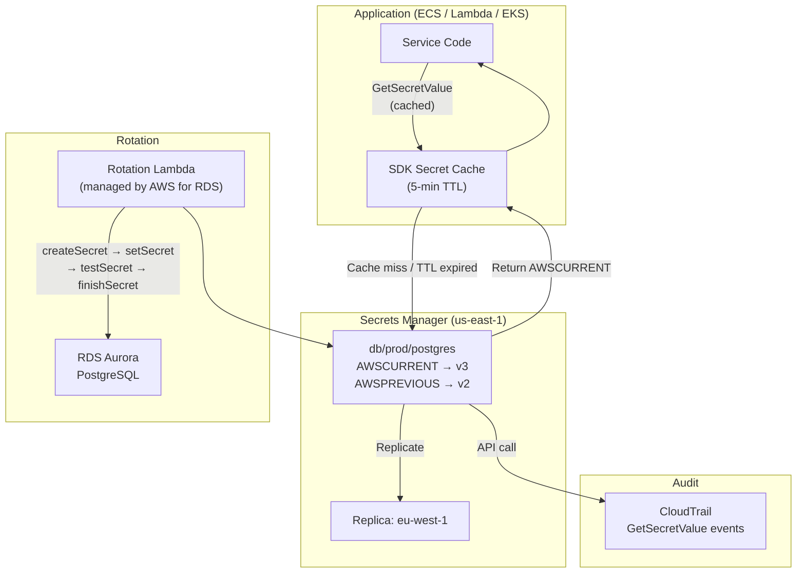

# AWS Secrets Manager — Secret Storage & Rotation

## Category
Cloud Native, Security, Secrets Management, AWS Secrets Manager, Credential Rotation

## Context

AWS Secrets Manager provides centralised, auditable secret storage with automatic rotation. It replaces hardcoded credentials, SSM Parameter Store strings, and environment variable injection with a governed, API-driven approach.

**Secrets Manager vs SSM Parameter Store**:
| Dimension | Secrets Manager | SSM Parameter Store (SecureString) |
|-----------|----------------|-----------------------------------|
| **Cost** | $0.40/secret/month + $0.05/10K API calls | Free (standard); $0.05/advanced parameter/month |
| **Automatic rotation** | Yes (native + custom Lambda) | No |
| **Cross-account access** | Resource policy | Not supported on SecureString |
| **Cross-region replication** | Yes (built-in) | No |
| **Versioning** | Yes (AWSCURRENT / AWSPENDING / AWSPREVIOUS) | Yes |
| **Audit via CloudTrail** | Yes | Yes |
| **Binary secrets** | Yes | No |
| **Use when** | DB passwords, API keys, OAuth tokens — anything that rotates | App config, non-rotating secrets, feature flags |

**Secret versioning labels**:
| Label | Meaning |
|-------|---------|
| `AWSCURRENT` | Active version in use |
| `AWSPENDING` | Newly created during rotation, not yet promoted |
| `AWSPREVIOUS` | Previous version retained for rollback window |

**Rotation process** (for database credentials):
1. Secrets Manager invokes rotation Lambda with `createSecret` step → Lambda creates new credential in DB.
2. `setSecret` step → Lambda applies new credential to the DB.
3. `testSecret` step → Lambda verifies new credential works.
4. `finishSecret` step → Secrets Manager promotes `AWSPENDING` to `AWSCURRENT`, demotes old to `AWSPREVIOUS`.

**Built-in rotation support** (no Lambda authoring needed):
- Amazon RDS (MySQL, PostgreSQL, Oracle, SQL Server, MariaDB)
- Amazon Aurora
- Amazon Redshift
- Amazon DocumentDB
- Amazon ElastiCache (Redis AUTH tokens)

**Cross-region replication**: Replica secrets are read-only copies maintained in sync. Applications in secondary regions read from the regional replica — no cross-region API call needed for DR or latency-optimised access.

---

## Pros

- **Zero-credential applications**: IAM role permissions replace hardcoded secrets entirely.
- **Automatic rotation**: Credentials cycle without application restarts or redeployments.
- **Audit trail**: Every `GetSecretValue` call recorded in CloudTrail with caller identity and IP.
- **Cross-account access**: Resource-based policies allow controlled sharing without IAM role assumption.
- **Fine-grained access**: IAM conditions on `secretsmanager:ResourceTag/Team` for attribute-based access.
- **Versioning**: Rollback is instant — re-label `AWSPREVIOUS` to `AWSCURRENT` via API.
- **RDS native integration**: Aurora and RDS can create/update the Secrets Manager secret automatically on cluster creation.

---

## Cons

- **Per-secret cost**: At scale (1,000+ secrets), cost is non-trivial — audit and consolidate.
- **API call latency**: `GetSecretValue` adds ~5–10 ms. Mitigate with SDK-level caching.
- **Rotation Lambda cold start**: First rotation invocation after dormancy has Lambda cold start delay.
- **Circular dependency in IaC**: Secrets Manager ARN must exist before RDS, but RDS password goes into Secrets Manager — use `aws_rds_cluster` `manage_master_user_password = true` in Terraform to break the cycle.
- **Cross-region replication eventual consistency**: Brief window where replica may be slightly behind primary during rotation.
- **No direct K8s integration**: Must use External Secrets Operator or Secrets Store CSI driver to mount secrets into pods.

---

## Design Diagram



---

## Code Sample

### TypeScript — SDK caching client (recommended pattern)

```typescript
import {
  SecretsManagerClient,
  GetSecretValueCommand,
} from '@aws-sdk/client-secrets-manager';
import { z } from 'zod';

const client = new SecretsManagerClient({ region: process.env.AWS_REGION });

// In-process cache (avoids per-request API cost + latency)
const cache = new Map<string, { value: unknown; expiresAt: number }>();
const CACHE_TTL_MS = 5 * 60 * 1000; // 5 minutes

const DbSecretSchema = z.object({
  username: z.string(),
  password: z.string(),
  host: z.string(),
  port: z.coerce.number(),
  dbname: z.string(),
});
type DbSecret = z.infer<typeof DbSecretSchema>;

async function getSecret<T>(
  secretId: string,
  schema: z.ZodSchema<T>,
  force = false,
): Promise<T> {
  const cached = cache.get(secretId);
  if (!force && cached && cached.expiresAt > Date.now()) {
    return schema.parse(cached.value);
  }

  const response = await client.send(
    new GetSecretValueCommand({ SecretId: secretId }),
  );

  const raw = response.SecretString
    ? JSON.parse(response.SecretString)
    : JSON.parse(Buffer.from(response.SecretBinary!).toString());

  const validated = schema.parse(raw);
  cache.set(secretId, { value: raw, expiresAt: Date.now() + CACHE_TTL_MS });

  return validated;
}

// Usage
const dbSecret = await getSecret('db/prod/postgres', DbSecretSchema);
const pool = createPool({
  host: dbSecret.host,
  port: dbSecret.port,
  user: dbSecret.username,
  password: dbSecret.password,
  database: dbSecret.dbname,
});
```

### Custom rotation Lambda (for non-RDS services)

```typescript
import {
  SecretsManagerClient,
  GetSecretValueCommand,
  PutSecretValueCommand,
  UpdateSecretVersionStageCommand,
} from '@aws-sdk/client-secrets-manager';

const smClient = new SecretsManagerClient({});

export const handler = async (event: {
  SecretId: string;
  ClientRequestToken: string;
  Step: 'createSecret' | 'setSecret' | 'testSecret' | 'finishSecret';
}): Promise<void> => {
  const { SecretId, ClientRequestToken, Step } = event;

  switch (Step) {
    case 'createSecret': {
      // Check if AWSPENDING already exists (idempotency)
      try {
        await smClient.send(new GetSecretValueCommand({
          SecretId,
          VersionStage: 'AWSPENDING',
          VersionId: ClientRequestToken,
        }));
        return; // already created, skip
      } catch { /* not found — proceed */ }

      const newApiKey = await generateNewApiKey(); // call your API
      await smClient.send(new PutSecretValueCommand({
        SecretId,
        ClientRequestToken,
        SecretString: JSON.stringify({ api_key: newApiKey }),
        VersionStages: ['AWSPENDING'],
      }));
      break;
    }

    case 'setSecret': {
      // Apply the AWSPENDING secret to external service
      const pending = await smClient.send(new GetSecretValueCommand({
        SecretId,
        VersionStage: 'AWSPENDING',
        VersionId: ClientRequestToken,
      }));
      const { api_key } = JSON.parse(pending.SecretString!);
      await activateApiKey(api_key); // call your API to activate
      break;
    }

    case 'testSecret': {
      // Verify the AWSPENDING credential works
      const pending = await smClient.send(new GetSecretValueCommand({
        SecretId,
        VersionStage: 'AWSPENDING',
        VersionId: ClientRequestToken,
      }));
      const { api_key } = JSON.parse(pending.SecretString!);
      const valid = await verifyApiKey(api_key);
      if (!valid) throw new Error('New API key verification failed');
      break;
    }

    case 'finishSecret': {
      // Promote AWSPENDING to AWSCURRENT
      const current = await smClient.send(new GetSecretValueCommand({
        SecretId,
        VersionStage: 'AWSCURRENT',
      }));
      if (current.VersionId === ClientRequestToken) return; // already promoted

      await smClient.send(new UpdateSecretVersionStageCommand({
        SecretId,
        VersionStage: 'AWSCURRENT',
        MoveToVersionId: ClientRequestToken,
        RemoveFromVersionId: current.VersionId,
      }));
      break;
    }
  }
};
```

### Terraform — secret with automatic RDS rotation

```hcl
resource "aws_secretsmanager_secret" "db" {
  name        = "db/${var.environment}/postgres"
  description = "PostgreSQL master credentials for ${var.environment}"

  # Cross-region replication for DR
  replica {
    region = var.dr_region
  }

  # Prevent accidental deletion in production
  recovery_window_in_days = var.environment == "production" ? 30 : 0

  tags = {
    Environment = var.environment
    Team        = var.team
  }
}

resource "aws_secretsmanager_secret_version" "db_initial" {
  secret_id = aws_secretsmanager_secret.db.id
  secret_string = jsonencode({
    username = "masteruser"
    password = random_password.db.result
    host     = aws_rds_cluster.this.endpoint
    port     = 5432
    dbname   = var.db_name
  })

  lifecycle {
    # Rotation will update this — don't fight it with Terraform
    ignore_changes = [secret_string]
  }
}

resource "aws_secretsmanager_secret_rotation" "db" {
  secret_id           = aws_secretsmanager_secret.db.id
  rotation_lambda_arn = data.aws_lambda_function.rds_rotation.arn # AWS-managed rotation

  rotation_rules {
    automatically_after_days = 30
    # Or use schedule expression for precise timing (avoids maintenance windows)
    # schedule_expression = "cron(0 2 1 * ? *)" # 02:00 on 1st of each month
  }
}

# Cross-account access policy (allow another account to read this secret)
resource "aws_secretsmanager_secret_policy" "db" {
  secret_arn = aws_secretsmanager_secret.db.arn

  policy = jsonencode({
    Version = "2012-10-17"
    Statement = [
      {
        Sid    = "AllowCrossAccountRead"
        Effect = "Allow"
        Principal = {
          AWS = "arn:aws:iam::${var.consumer_account_id}:root"
        }
        Action   = ["secretsmanager:GetSecretValue", "secretsmanager:DescribeSecret"]
        Resource = "*"
        Condition = {
          StringEquals = {
            "aws:PrincipalTag/Team" = var.team
          }
        }
      }
    ]
  })
}
```

### EKS — mounting secrets with External Secrets Operator

```yaml
# ExternalSecret: sync Secrets Manager → Kubernetes Secret
apiVersion: external-secrets.io/v1beta1
kind: ExternalSecret
metadata:
  name: db-credentials
  namespace: payments
spec:
  refreshInterval: 5m          # re-read Secrets Manager every 5 minutes
  secretStoreRef:
    name: aws-secretsmanager
    kind: ClusterSecretStore
  target:
    name: db-credentials       # K8s Secret name
    creationPolicy: Owner
  data:
    - secretKey: POSTGRES_HOST
      remoteRef:
        key: db/prod/postgres
        property: host
    - secretKey: POSTGRES_PASSWORD
      remoteRef:
        key: db/prod/postgres
        property: password
    - secretKey: POSTGRES_USER
      remoteRef:
        key: db/prod/postgres
        property: username
```

---

## Security Best Practices

| Practice | Why |
|----------|-----|
| Never read secrets at deploy time — read at runtime | Prevents secrets appearing in build logs, CI artefacts, AMIs |
| Use `secretsmanager:ResourceTag` conditions in IAM | Each team can only access their own secrets |
| Enable `DeleteSecret` deny in SCPs for production | Prevents accidental OR malicious deletion of critical secrets |
| Set `recovery_window_in_days = 30` for production secrets | 30-day recovery window for human error |
| Enable CloudTrail + CloudWatch alarm on `GetSecretValue` from unusual sources | Detect exfiltration attempts |
| Never log secret values — always log secret IDs/ARNs | `secret_id` is not sensitive; `secret_string` is |
| Rotate on a schedule shorter than breach detection window | If breach window is ~30 days, rotate every 7–14 days |

---

## Well-Architected Alignment

| Pillar | How Secrets Manager helps |
|--------|--------------------------|
| **Security** | Credentials never in code, config files, or environment variables; full audit trail |
| **Reliability** | Rotation doesn't require redeployment; SDK caching survives transient API failures |
| **Operational Excellence** | Centralised visibility of all secrets, their rotation status, and last accessed time |
| **Cost Optimisation** | Consolidate secrets (JSON blob) to reduce per-secret monthly cost; use SSM for non-rotating config |

---

## Related Patterns

- [`05-iam-least-privilege.md`](05-iam-least-privilege.md) — IAM conditions for secrets access control
- [`07-rds-aurora.md`](07-rds-aurora.md) — RDS Proxy uses Secrets Manager; Aurora master secret auto-management
- [`02-ecs-fargate.md`](02-ecs-fargate.md) — ECS task definitions pull secrets from Secrets Manager at task start
- [`03-eks-kubernetes.md`](03-eks-kubernetes.md) — External Secrets Operator / Secrets Store CSI driver for pod injection
- [`12-multi-account-landing-zone.md`](12-multi-account-landing-zone.md) — Cross-account secret sharing patterns
