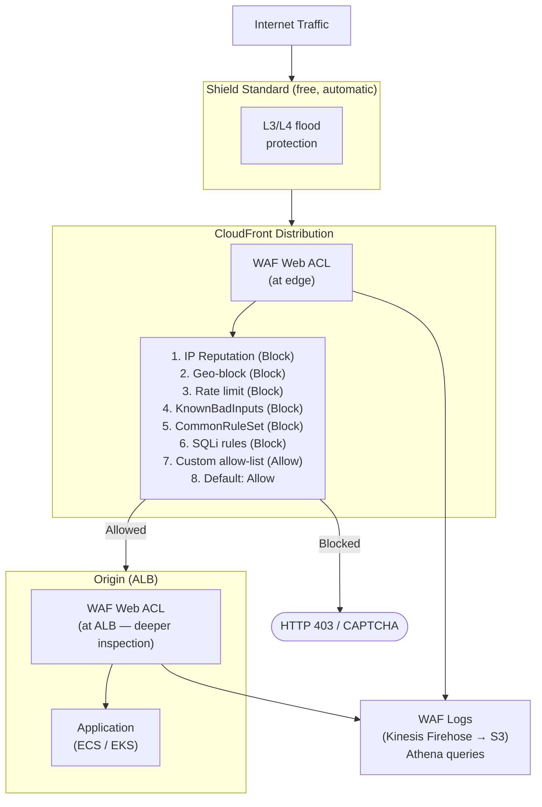

# AWS WAF & Shield — Web Application Firewall & DDoS Protection

## Category
Cloud Native, Security, WAF, DDoS Protection, AWS WAF, AWS Shield

## Context

AWS provides two complementary DDoS and application-layer protection services:

| Service | Layer | Protects against | Scope |
|---------|-------|-----------------|-------|
| **AWS WAF** | L7 (HTTP/S) | SQL injection, XSS, bad bots, rate abuse, custom rules | CloudFront, API Gateway, ALB, AppSync, Cognito |
| **AWS Shield Standard** | L3/L4 | SYN/UDP floods, volume attacks | All AWS resources (free, automatic) |
| **AWS Shield Advanced** | L3/L4/L7 | Large-scale DDoS, application layer DDoS, financial protection | CloudFront, ALB, NLB, EIP, Route53 (~$3K/month) |

**WAF key concepts**:
| Concept | Description |
|---------|-------------|
| **Web ACL** | Container for rules; attached to one or more resources |
| **Rule** | One match condition + action (Allow, Block, Count, CAPTCHA, Challenge) |
| **Rule group** | Reusable bundle of rules |
| **Managed Rule Groups** | AWS or Marketplace-maintained rule sets, auto-updated |
| **Rate-based rule** | Block/count IPs exceeding a request rate threshold |
| **Regex Pattern Set** | Reusable regex for URI, headers, body matching |
| **IP Set** | Allowlist or blocklist of CIDR ranges |

**AWS Managed Rule Groups** (most commonly used):
| Rule Group | What it blocks |
|------------|---------------|
| `AWSManagedRulesCommonRuleSet` | XSS, LFI, RFI, SSRF, bad inputs |
| `AWSManagedRulesKnownBadInputsRuleSet` | Log4Shell, Spring4Shell, Java deserialization exploits |
| `AWSManagedRulesSQLiRuleSet` | SQL injection patterns |
| `AWSManagedRulesAmazonIpReputationList` | Known malicious IPs, bots, scrapers |
| `AWSManagedRulesAnonymousIpList` | Tor exit nodes, VPNs, proxies |
| `AWSManagedRulesBotControlRuleSet` | Scraper and bot detection (additional fee) |

**Rule evaluation order**: Rules are evaluated in priority order (lower number = higher priority). First matching rule's action applies. If no rule matches, Web ACL default action applies (Allow or Block).

**WAF Capacity Units (WCU)**: Each rule consumes WCUs. Web ACL limit is 5,000 WCU. Managed rule groups each consume a fixed WCU.

**Logging**: WAF logs to CloudWatch Logs, S3, or Kinesis Firehose. Log every request or sampled (1/100). Full request body logging requires explicit enablement (max 8 KB for request body inspection).

**Shield Advanced** — additional features over Standard:
- 24/7 DDoS Response Team (DRT) access
- Financial protection: AWS credits cost increases caused by DDoS (EC2, CloudFront, ELB)
- Advanced DDoS metrics in CloudWatch
- Route 53 and Global Accelerator protection
- AWS WAF included at no extra charge when used with Shield Advanced

---

## Pros

- **Managed rule groups auto-update**: AWS patches for new CVEs (Log4Shell, etc.) within hours.
- **Count mode for safe testing**: Add rules in Count mode → monitor logs → switch to Block once confident.
- **Granular scope-down statements**: Inspect only the URI path, specific headers, or body — reduces WCU usage.
- **Rate limiting per IP**: Block IPs that exceed N requests per 5-minute window automatically.
- **CloudFront global enforcement**: WAF at CloudFront blocks traffic at the edge before it reaches your origin.
- **Custom rules**: IP reputation feeds, geographic restrictions, custom request fingerprinting.

---

## Cons

- **False positives**: Managed rules may block legitimate traffic — start in Count mode, tune before Block.
- **Body inspection limit**: Only first 8 KB of request body inspected (or 64 KB with extra cost). Large payloads need application-layer validation.
- **WCU limits**: Complex rules or many managed rule groups can hit 5,000 WCU ceiling.
- **Log volume cost**: Full WAF logging at high traffic sites generates significant Kinesis/S3 cost.
- **Geographic blocking bypass**: VPN/Tor users route around geo-restrictions (use AnonymousIpList).
- **Shield Advanced cost**: $3,000/month minimum commitment — only justified for high-value production.
- **Not a replacement for input validation**: WAF is a defence-in-depth layer; application-layer validation still required.

---

## Design Diagram



---

## Code Sample

### Terraform — WAF Web ACL with managed rules + rate limiting

```hcl
resource "aws_wafv2_web_acl" "main" {
  name        = "${var.name}-web-acl"
  scope       = "CLOUDFRONT"  # or "REGIONAL" for ALB/API Gateway
  description = "WAF Web ACL for ${var.name}"

  default_action {
    allow {}
  }

  # Priority 10 — Block known malicious IPs
  rule {
    name     = "AWSManagedRulesAmazonIpReputationList"
    priority = 10

    override_action {
      none {}  # honour the managed rule group's own actions
    }

    statement {
      managed_rule_group_statement {
        vendor_name = "AWS"
        name        = "AWSManagedRulesAmazonIpReputationList"
      }
    }

    visibility_config {
      cloudwatch_metrics_enabled = true
      metric_name                = "AWSManagedRulesAmazonIpReputationList"
      sampled_requests_enabled   = true
    }
  }

  # Priority 20 — Block Tor exits, VPNs, proxies
  rule {
    name     = "AWSManagedRulesAnonymousIpList"
    priority = 20

    override_action {
      none {}
    }

    statement {
      managed_rule_group_statement {
        vendor_name = "AWS"
        name        = "AWSManagedRulesAnonymousIpList"
        # Exclude rules that may cause false positives for legitimate VPN users
        rule_action_override {
          name = "HostingProviderIPList"
          action_to_use { count {} }  # Count only, not Block
        }
      }
    }

    visibility_config {
      cloudwatch_metrics_enabled = true
      metric_name                = "AnonymousIpList"
      sampled_requests_enabled   = true
    }
  }

  # Priority 30 — Rate limiting (per IP)
  rule {
    name     = "RateLimitPerIP"
    priority = 30

    action {
      block {}
    }

    statement {
      rate_based_statement {
        limit              = 2000  # requests per 5-minute window per IP
        aggregate_key_type = "IP"

        scope_down_statement {
          # Apply rate limit only to API paths
          byte_match_statement {
            search_string         = "/api/"
            field_to_match { uri_path {} }
            text_transformation {
              priority = 0
              type     = "LOWERCASE"
            }
            positional_constraint = "STARTS_WITH"
          }
        }
      }
    }

    visibility_config {
      cloudwatch_metrics_enabled = true
      metric_name                = "RateLimitPerIP"
      sampled_requests_enabled   = true
    }
  }

  # Priority 40 — Known bad inputs (Log4Shell, Spring4Shell, etc.)
  rule {
    name     = "AWSManagedRulesKnownBadInputsRuleSet"
    priority = 40

    override_action {
      none {}
    }

    statement {
      managed_rule_group_statement {
        vendor_name = "AWS"
        name        = "AWSManagedRulesKnownBadInputsRuleSet"
      }
    }

    visibility_config {
      cloudwatch_metrics_enabled = true
      metric_name                = "KnownBadInputsRuleSet"
      sampled_requests_enabled   = true
    }
  }

  # Priority 50 — Core Rule Set (XSS, LFI, SSRF, etc.)
  rule {
    name     = "AWSManagedRulesCommonRuleSet"
    priority = 50

    override_action {
      none {}
    }

    statement {
      managed_rule_group_statement {
        vendor_name = "AWS"
        name        = "AWSManagedRulesCommonRuleSet"

        # Tune out noisy rules in Count mode first
        rule_action_override {
          name = "SizeRestrictions_BODY"
          action_to_use { count {} }  # Large request bodies (e.g. file uploads)
        }
      }
    }

    visibility_config {
      cloudwatch_metrics_enabled = true
      metric_name                = "CommonRuleSet"
      sampled_requests_enabled   = true
    }
  }

  # Priority 60 — SQL injection
  rule {
    name     = "AWSManagedRulesSQLiRuleSet"
    priority = 60

    override_action {
      none {}
    }

    statement {
      managed_rule_group_statement {
        vendor_name = "AWS"
        name        = "AWSManagedRulesSQLiRuleSet"
      }
    }

    visibility_config {
      cloudwatch_metrics_enabled = true
      metric_name                = "SQLiRuleSet"
      sampled_requests_enabled   = true
    }
  }

  # Priority 70 — Geographic restriction
  rule {
    name     = "GeoBlockHighRiskCountries"
    priority = 70

    action {
      block {}
    }

    statement {
      geo_match_statement {
        country_codes = var.blocked_country_codes  # e.g. ["KP", "IR"]
      }
    }

    visibility_config {
      cloudwatch_metrics_enabled = true
      metric_name                = "GeoBlock"
      sampled_requests_enabled   = true
    }
  }

  visibility_config {
    cloudwatch_metrics_enabled = true
    metric_name                = "${var.name}-web-acl"
    sampled_requests_enabled   = true
  }

  tags = {
    Environment = var.environment
    Team        = var.team
  }
}

# Attach to CloudFront (done in CloudFront resource via web_acl_id)
# Attach to ALB
resource "aws_wafv2_web_acl_association" "alb" {
  count        = var.scope == "REGIONAL" ? 1 : 0
  resource_arn = var.alb_arn
  web_acl_arn  = aws_wafv2_web_acl.main.arn
}

# WAF logging to S3
resource "aws_wafv2_web_acl_logging_configuration" "this" {
  log_destination_configs = [aws_kinesis_firehose_delivery_stream.waf.arn]
  resource_arn            = aws_wafv2_web_acl.main.arn

  # Redact sensitive headers from logs
  redacted_fields {
    single_header { name = "authorization" }
  }
  redacted_fields {
    single_header { name = "cookie" }
  }
}
```

### IP Set for allowlist (e.g. office IPs, partner CIDRs)

```hcl
resource "aws_wafv2_ip_set" "allowlist" {
  name               = "${var.name}-allowlist"
  scope              = "CLOUDFRONT"
  ip_address_version = "IPV4"
  addresses          = var.trusted_cidrs

  tags = {
    Environment = var.environment
    Team        = var.team
  }
}

# Use in Web ACL rule — must be highest priority to bypass all other rules
resource "aws_wafv2_web_acl" "main" {
  # ... (other config as above)

  rule {
    name     = "AllowListBypass"
    priority = 1  # Must be first

    action {
      allow {}
    }

    statement {
      ip_set_reference_statement {
        arn = aws_wafv2_ip_set.allowlist.arn
      }
    }

    visibility_config {
      cloudwatch_metrics_enabled = true
      metric_name                = "AllowListBypass"
      sampled_requests_enabled   = false
    }
  }
}
```

### Athena query — analyse blocked requests from WAF logs

```sql
-- Top blocked IPs in last 24 hours
SELECT
  httprequest.clientip AS ip,
  COUNT(*) AS blocked_count,
  ARRAY_AGG(DISTINCT terminatingruleid) AS rules_triggered
FROM waf_logs
WHERE
  action = 'BLOCK'
  AND from_unixtime(timestamp / 1000) > NOW() - INTERVAL '24' HOUR
GROUP BY httprequest.clientip
ORDER BY blocked_count DESC
LIMIT 50;

-- False positive analysis — Count mode events by rule
SELECT
  terminatingruleid,
  httprequest.uri,
  COUNT(*) AS count
FROM waf_logs
WHERE action = 'COUNT'
GROUP BY terminatingruleid, httprequest.uri
ORDER BY count DESC;
```

---

## Operational Runbook

### Deploying new rules safely

1. **Add rule in Count mode** (`override_action { count {} }`) — no traffic blocked.
2. **Monitor for 1–7 days**: Check CloudWatch `CountedRequests` metric and WAF logs via Athena.
3. **Identify false positives**: Query logs for `action = 'COUNT'` with legitimate URIs/IPs.
4. **Tune**: Use `rule_action_override` to exclude specific rules or add scope-down statements.
5. **Switch to Block**: Change `count {}` to `none {}` in `override_action` (Terraform apply).
6. **Monitor 403 error rate**: Set CloudWatch alarm on `4xx` spike at CloudFront/ALB.

### Emergency IP block (incident response)

```bash
# Get current IP set
aws wafv2 get-ip-set \
  --name "manual-blocklist" \
  --scope CLOUDFRONT \
  --id <ip-set-id> \
  --query '{LockToken: LockToken, Addresses: IPSet.Addresses}'

# Add attacking IP
aws wafv2 update-ip-set \
  --name "manual-blocklist" \
  --scope CLOUDFRONT \
  --id <ip-set-id> \
  --lock-token <lock-token> \
  --addresses "10.0.0.1/32" "203.0.113.45/32"
```

### CloudWatch alarms to set

```hcl
# Spike in blocked requests (potential attack or false positive rollout issue)
resource "aws_cloudwatch_metric_alarm" "waf_blocked_spike" {
  alarm_name          = "${var.name}-waf-blocked-spike"
  comparison_operator = "GreaterThanThreshold"
  evaluation_periods  = 2
  metric_name         = "BlockedRequests"
  namespace           = "AWS/WAFV2"
  period              = 300
  statistic           = "Sum"
  threshold           = var.blocked_requests_alarm_threshold  # e.g. 1000
  alarm_actions       = [var.sns_alert_topic_arn]

  dimensions = {
    WebACL = aws_wafv2_web_acl.main.name
    Region = var.region
    Rule   = "ALL"
  }
}
```

---

## Well-Architected Alignment

| Pillar | How WAF/Shield helps |
|--------|---------------------|
| **Security** | OWASP Top 10 mitigated at the edge; no application code changes needed |
| **Reliability** | DDoS absorption at edge prevents origin overload; Shield Advanced provides volume attack protection |
| **Operational Excellence** | Count mode rollout + log analysis enables safe, evidence-based rule deployment |
| **Cost Optimisation** | Block bot traffic at edge = reduced compute costs at origin; Shield Advanced only for genuinely high-risk public endpoints |

---

## Related Patterns

- [`06-api-gateway.md`](06-api-gateway.md) — WAF attached to REST API Gateway; HTTP API doesn't support WAF directly
- [`13-cloudfront-cdn.md`](13-cloudfront-cdn.md) — WAF applied at CloudFront edge (global coverage, lowest latency block)
- [`04-vpc-networking.md`](04-vpc-networking.md) — WAF on ALB as second line of defence after CloudFront
- [`05-iam-least-privilege.md`](05-iam-least-privilege.md) — WAF is defence-in-depth; IAM controls plane access
- [`11-observability-cloudwatch.md`](11-observability-cloudwatch.md) — WAF metrics and alarms in CloudWatch
