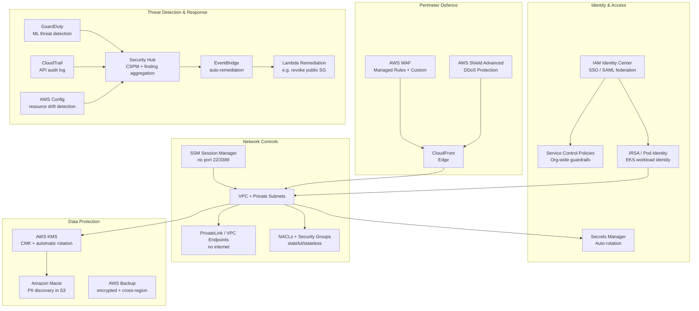

# AWS Security Best Practices

## Category

Cloud Native, Security, AWS, Well-Architected

## Context

AWS security follows a **Shared Responsibility Model**: AWS secures the cloud infrastructure; you secure everything **in** the cloud — OS configuration, IAM policies, data encryption, application code, and network controls.

The AWS [Security Pillar](https://docs.aws.amazon.com/wellarchitected/latest/security-pillar/welcome.html) organises controls into seven areas:

| Area | Scope |
|------|-------|
| **Identity & Access Management** | Who can call what API on which resource |
| **Detection** | CloudTrail, GuardDuty, Security Hub, Config |
| **Infrastructure Protection** | VPC, Security Groups, WAF, Shield |
| **Data Protection** | Encryption at rest + in transit, Macie, tokenisation |
| **Incident Response** | Automated remediation, forensic accounts, runbooks |
| **Application Security** | Supply chain, SAST/DAST, runtime protection |
| **Compliance** | AWS Config rules, Audit Manager, Control Tower |

### Security Priority Matrix

| Risk | Default State | Recommended Control |
|------|--------------|---------------------|
| Credential leakage | IAM users with long-term keys | IAM Identity Center + SSO |
| Over-permissive roles | `*` in policies | Least privilege + SCPs |
| Public S3 buckets | Account-level block if enabled | S3 Block Public Access (account-level) |
| Unencrypted data | Service-default | AWS KMS CMK with key rotation |
| No threat detection | Off by default | Enable GuardDuty in all regions |
| Port 22/3389 open | Manual SG rules | SSM Session Manager (no inbound ports) |
| No drift detection | Off by default | AWS Config + Security Hub |

---

## Pros

- **Managed services reduce undifferentiated heavy lifting**: GuardDuty, Macie, Inspector, Security Hub are ML-driven and require minimal config.
- **Deep service integration**: KMS, IAM, CloudTrail, and VPC work together — enabling encryption, auditing, and network controls with a few API calls.
- **SCPs provide hard organisational guardrails**: Prevent even root users in member accounts from disabling controls.
- **Audit-ready by default**: CloudTrail records every API call; Config records every resource-state change.

## Cons

- **Complexity at scale**: Hundreds of services each with their own security surface; easy to miss a misconfiguration.
- **IAM policy sprawl**: Organisations often accumulate hundreds of policies and roles that are never reviewed.
- **Cross-region coverage**: GuardDuty, Config, and Security Hub must be enabled per-region and per-account.
- **Alert fatigue**: GuardDuty and Security Hub can produce thousands of findings — requires triage and automation.

---

## Design Diagram



---

## Code Sample

### 1. IAM — Least Privilege Role with Conditions

```json
{
  "Version": "2012-10-17",
  "Statement": [
    {
      "Sid": "AllowPaymentsBucketReadWrite",
      "Effect": "Allow",
      "Action": [
        "s3:GetObject",
        "s3:PutObject",
        "s3:DeleteObject"
      ],
      "Resource": "arn:aws:s3:::payments-prod-data/*",
      "Condition": {
        "StringEquals": {
          "s3:prefix": ["receipts/", "statements/"],
          "aws:RequestedRegion": "eu-west-1"
        },
        "Bool": {
          "aws:SecureTransport": "true"
        }
      }
    },
    {
      "Sid": "DenyUnencryptedUploads",
      "Effect": "Deny",
      "Action": "s3:PutObject",
      "Resource": "arn:aws:s3:::payments-prod-data/*",
      "Condition": {
        "Null": {
          "s3:x-amz-server-side-encryption": "true"
        }
      }
    }
  ]
}
```

```typescript
// TypeScript — create least-privilege ECS task role via CDK
import * as iam from 'aws-cdk-lib/aws-iam';
import * as kms from 'aws-cdk-lib/aws-kms';

const taskRole = new iam.Role(this, 'PaymentServiceTaskRole', {
  assumedBy: new iam.ServicePrincipal('ecs-tasks.amazonaws.com'),
  description: 'Least-privilege role for payment service ECS tasks',
  // Permission boundary — hard cap on maximum permissions
  permissionsBoundary: iam.ManagedPolicy.fromManagedPolicyArn(
    this, 'Boundary', `arn:aws:iam::${this.account}:policy/PaymentServiceBoundary`
  ),
});

// Narrow S3 access
taskRole.addToPolicy(new iam.PolicyStatement({
  effect: iam.Effect.ALLOW,
  actions: ['s3:GetObject', 's3:PutObject'],
  resources: [`arn:aws:s3:::payments-prod-data/receipts/*`],
  conditions: {
    Bool: { 'aws:SecureTransport': 'true' },
  },
}));

// Secrets Manager — only the specific secret
taskRole.addToPolicy(new iam.PolicyStatement({
  effect: iam.Effect.ALLOW,
  actions: ['secretsmanager:GetSecretValue'],
  resources: [`arn:aws:secretsmanager:eu-west-1:${this.account}:secret:payments/db-creds-*`],
}));

// KMS — decrypt only
taskRole.addToPolicy(new iam.PolicyStatement({
  effect: iam.Effect.ALLOW,
  actions: ['kms:Decrypt', 'kms:GenerateDataKey'],
  resources: [paymentKmsKey.keyArn],
}));
```

---

### 2. Service Control Policy (SCP) — Organisation-Wide Guardrails

```json
{
  "Version": "2012-10-17",
  "Statement": [
    {
      "Sid": "DenyLeavingOrganisation",
      "Effect": "Deny",
      "Action": "organizations:LeaveOrganization",
      "Resource": "*"
    },
    {
      "Sid": "DenyDisablingGuardDuty",
      "Effect": "Deny",
      "Action": [
        "guardduty:DeleteDetector",
        "guardduty:DisassociateFromMasterAccount",
        "guardduty:StopMonitoringMembers"
      ],
      "Resource": "*"
    },
    {
      "Sid": "DenyDisablingCloudTrail",
      "Effect": "Deny",
      "Action": [
        "cloudtrail:StopLogging",
        "cloudtrail:DeleteTrail",
        "cloudtrail:UpdateTrail"
      ],
      "Resource": "*"
    },
    {
      "Sid": "DenyPublicS3ACLs",
      "Effect": "Deny",
      "Action": [
        "s3:PutBucketAcl",
        "s3:PutObjectAcl"
      ],
      "Resource": "*",
      "Condition": {
        "StringEquals": {
          "s3:x-amz-acl": ["public-read", "public-read-write", "authenticated-read"]
        }
      }
    },
    {
      "Sid": "EnforceIMDSv2",
      "Effect": "Deny",
      "Action": "ec2:RunInstances",
      "Resource": "arn:aws:ec2:*:*:instance/*",
      "Condition": {
        "StringNotEquals": {
          "ec2:MetadataHttpTokens": "required"
        }
      }
    },
    {
      "Sid": "AllowedRegionsOnly",
      "Effect": "Deny",
      "NotAction": [
        "iam:*",
        "organizations:*",
        "route53:*",
        "cloudfront:*",
        "sts:*",
        "support:*"
      ],
      "Resource": "*",
      "Condition": {
        "StringNotEquals": {
          "aws:RequestedRegion": ["eu-west-1", "eu-west-2", "eu-central-1"]
        }
      }
    }
  ]
}
```

---

### 3. VPC — Private Subnet Architecture with PrivateLink

```typescript
import * as ec2 from 'aws-cdk-lib/aws-ec2';

// Restricted VPC — no internet gateway for private workloads
const vpc = new ec2.Vpc(this, 'PaymentsVpc', {
  maxAzs: 3,
  natGateways: 1,  // one NAT for egress-only (e.g. outbound API calls)
  subnetConfiguration: [
    {
      name: 'Public',
      subnetType: ec2.SubnetType.PUBLIC,
      cidrMask: 24,
    },
    {
      name: 'Private',
      subnetType: ec2.SubnetType.PRIVATE_WITH_EGRESS,
      cidrMask: 24,
    },
    {
      name: 'Isolated',
      subnetType: ec2.SubnetType.PRIVATE_ISOLATED,   // no internet at all
      cidrMask: 24,
    },
  ],
});

// VPC Endpoints — reach AWS services without traversing the internet
vpc.addGatewayEndpoint('S3Endpoint', {
  service: ec2.GatewayVpcEndpointAwsService.S3,
  subnets: [{ subnetType: ec2.SubnetType.PRIVATE_WITH_EGRESS }],
});

vpc.addInterfaceEndpoint('SecretsManagerEndpoint', {
  service: ec2.InterfaceVpcEndpointAwsService.SECRETS_MANAGER,
  subnets: { subnetType: ec2.SubnetType.PRIVATE_ISOLATED },
  privateDnsEnabled: true,
});

vpc.addInterfaceEndpoint('KmsEndpoint', {
  service: ec2.InterfaceVpcEndpointAwsService.KMS,
  subnets: { subnetType: ec2.SubnetType.PRIVATE_ISOLATED },
});

// Security group — deny all by default, allow only required traffic
const appSg = new ec2.SecurityGroup(this, 'AppSecurityGroup', {
  vpc,
  description: 'Payment service — inbound HTTPS from ALB only',
  allowAllOutbound: false,   // explicit egress rules
});

appSg.addIngressRule(albSg, ec2.Port.tcp(8443), 'HTTPS from ALB');
appSg.addEgressRule(dbSg,  ec2.Port.tcp(5432), 'PostgreSQL to RDS');
appSg.addEgressRule(
  ec2.Peer.prefixList('pl-6fa54006'),   // S3 managed prefix list
  ec2.Port.tcp(443),
  'HTTPS to S3 via gateway endpoint'
);
```

---

### 4. KMS Customer Managed Key + S3 Encryption

```typescript
import * as kms from 'aws-cdk-lib/aws-kms';
import * as s3 from 'aws-cdk-lib/aws-s3';

// CMK with automatic annual rotation
const paymentKey = new kms.Key(this, 'PaymentDataKey', {
  alias: 'payments/data-encryption',
  description: 'CMK for payment data at rest encryption',
  enableKeyRotation: true,          // automatic annual rotation
  rotationPeriod: Duration.days(365),
  pendingWindow: Duration.days(7),  // 7-day waiting period before deletion
  keyPolicy: new iam.PolicyDocument({
    statements: [
      // Root account full control (required)
      new iam.PolicyStatement({
        principals: [new iam.AccountRootPrincipal()],
        actions: ['kms:*'],
        resources: ['*'],
      }),
      // Payment service can encrypt/decrypt
      new iam.PolicyStatement({
        principals: [taskRole],
        actions: ['kms:GenerateDataKey', 'kms:Decrypt'],
        resources: ['*'],
      }),
      // Security team can manage but NOT use for data operations
      new iam.PolicyStatement({
        principals: [new iam.ArnPrincipal(`arn:aws:iam::${this.account}:role/SecurityAdminRole`)],
        actions: ['kms:DescribeKey', 'kms:GetKeyPolicy', 'kms:ScheduleKeyDeletion'],
        resources: ['*'],
      }),
    ],
  }),
});

// S3 bucket — enforced SSE-KMS, public access blocked, versioning enabled
const paymentsBucket = new s3.Bucket(this, 'PaymentsBucket', {
  encryption: s3.BucketEncryption.KMS,
  encryptionKey: paymentKey,
  enforceSSL: true,                     // deny HTTP (non-TLS) requests
  blockPublicAccess: s3.BlockPublicAccess.BLOCK_ALL,
  versioning: true,
  objectLockEnabled: true,              // WORM for compliance
  objectLockDefaultRetention: {
    mode: s3.ObjectLockMode.COMPLIANCE,
    duration: s3.ObjectLockRetention.days(2555),  // 7 years
  },
  lifecycleRules: [{
    id: 'ArchiveOldVersions',
    noncurrentVersionTransitions: [{
      storageClass: s3.StorageClass.GLACIER,
      transitionAfter: Duration.days(90),
    }],
    noncurrentVersionExpiration: Duration.days(2555),
  }],
});
```

---

### 5. GuardDuty + Security Hub — Enable and Auto-Remediate

```typescript
import * as guardduty from 'aws-cdk-lib/aws-guardduty';
import * as securityhub from 'aws-cdk-lib/aws-securityhub';
import * as events from 'aws-cdk-lib/aws-events';
import * as targets from 'aws-cdk-lib/aws-events-targets';

// Enable GuardDuty (Terraform equivalent below)
new guardduty.CfnDetector(this, 'GuardDutyDetector', {
  enable: true,
  findingPublishingFrequency: 'FIFTEEN_MINUTES',
  features: [
    { name: 'S3_DATA_EVENTS', status: 'ENABLED' },
    { name: 'EKS_AUDIT_LOGS', status: 'ENABLED' },
    { name: 'LAMBDA_NETWORK_LOGS', status: 'ENABLED' },
    { name: 'RDS_LOGIN_EVENTS', status: 'ENABLED' },
    { name: 'RUNTIME_MONITORING', status: 'ENABLED' },
  ],
});

// EventBridge rule — auto-remediate HIGH severity GuardDuty findings
const remediationFn = new lambda.Function(this, 'GuardDutyRemediation', {
  runtime: lambda.Runtime.NODEJS_22_X,
  handler: 'index.handler',
  code: lambda.Code.fromAsset('lambda/guardduty-remediation'),
  environment: { SLACK_WEBHOOK_URL: slackWebhookSecret.secretArn },
});

new events.Rule(this, 'HighSeverityGuardDutyRule', {
  eventPattern: {
    source: ['aws.guardduty'],
    detailType: ['GuardDuty Finding'],
    detail: {
      severity: [{ numeric: ['>=', 7] }],   // HIGH and CRITICAL
    },
  },
  targets: [new targets.LambdaFunction(remediationFn)],
});
```

```typescript
// Lambda remediation handler — revoke compromised IAM credentials + notify
// lambda/guardduty-remediation/index.ts
import { IAMClient, UpdateAccessKeyCommand } from '@aws-sdk/client-iam';
import { EC2Client, RevokeSecurityGroupIngressCommand } from '@aws-sdk/client-ec2';

const iam = new IAMClient({});

export async function handler(event: GuardDutyFinding) {
  const { type, severity, detail } = event.detail;

  if (type.startsWith('UnauthorizedAccess:IAMUser')) {
    // Disable the compromised access key immediately
    const accessKeyId = detail.resource.accessKeyDetails.accessKeyId;
    const userName    = detail.resource.accessKeyDetails.userName;

    await iam.send(new UpdateAccessKeyCommand({
      AccessKeyId: accessKeyId,
      UserName: userName,
      Status: 'Inactive',
    }));

    console.log(`Disabled access key ${accessKeyId} for user ${userName} (severity ${severity})`);
  }

  // Notify security team via SNS / Slack
  await notifySecurityTeam({ type, severity, detail });
}
```

---

### 6. Secrets Manager — Automatic Rotation

```typescript
import * as sm from 'aws-cdk-lib/aws-secretsmanager';
import * as rds from 'aws-cdk-lib/aws-rds';

// Attach rotation directly to RDS cluster secret
const dbSecret = new sm.Secret(this, 'DbCredentials', {
  secretName: 'payments/rds/postgres-admin',
  generateSecretString: {
    secretStringTemplate: JSON.stringify({ username: 'postgres' }),
    generateStringKey: 'password',
    excludePunctuation: true,
    passwordLength: 32,
  },
  encryptionKey: paymentKey,   // CMK
});

// Managed rotation using Secrets Manager built-in rotation Lambda
dbSecret.addRotationSchedule('RotationSchedule', {
  automaticallyAfter: Duration.days(30),
  hostedRotation: sm.HostedRotation.postgreSqlSingleUser({
    functionName: 'SecretsManagerPostgresRotation',
    vpc,
    vpcSubnets: { subnetType: ec2.SubnetType.PRIVATE_ISOLATED },
    securityGroups: [rotationFnSg],
  }),
});
```

---

### 7. AWS WAF — OWASP Managed Rules + Rate Limiting

```typescript
import * as wafv2 from 'aws-cdk-lib/aws-wafv2';

const webAcl = new wafv2.CfnWebACL(this, 'PaymentsWaf', {
  name: 'payments-waf',
  scope: 'CLOUDFRONT',   // or 'REGIONAL' for ALB/API GW
  defaultAction: { allow: {} },
  visibilityConfig: {
    cloudWatchMetricsEnabled: true,
    metricName: 'PaymentsWafMetric',
    sampledRequestsEnabled: true,
  },
  rules: [
    // AWS Managed Rules — OWASP Top 10
    {
      name: 'AWSManagedRulesCommonRuleSet',
      priority: 10,
      overrideAction: { none: {} },
      visibilityConfig: {
        cloudWatchMetricsEnabled: true,
        metricName: 'CommonRuleSet',
        sampledRequestsEnabled: false,
      },
      statement: {
        managedRuleGroupStatement: {
          name: 'AWSManagedRulesCommonRuleSet',
          vendorName: 'AWS',
        },
      },
    },
    // Known bad inputs (Log4Shell, SSRF, etc.)
    {
      name: 'AWSManagedRulesKnownBadInputsRuleSet',
      priority: 20,
      overrideAction: { none: {} },
      visibilityConfig: { cloudWatchMetricsEnabled: true, metricName: 'KnownBadInputs', sampledRequestsEnabled: false },
      statement: {
        managedRuleGroupStatement: { name: 'AWSManagedRulesKnownBadInputsRuleSet', vendorName: 'AWS' },
      },
    },
    // Rate limiting — 1000 requests per 5 min per IP
    {
      name: 'RateLimitPerIp',
      priority: 5,
      action: { block: {} },
      visibilityConfig: { cloudWatchMetricsEnabled: true, metricName: 'RateLimit', sampledRequestsEnabled: true },
      statement: {
        rateBasedStatement: {
          limit: 1000,
          aggregateKeyType: 'IP',
        },
      },
    },
    // Geo-block — deny unexpected countries
    {
      name: 'GeoBlockUnexpectedCountries',
      priority: 1,
      action: { block: {} },
      visibilityConfig: { cloudWatchMetricsEnabled: true, metricName: 'GeoBlock', sampledRequestsEnabled: false },
      statement: {
        notStatement: {
          statement: {
            geoMatchStatement: {
              countryCodes: ['GB', 'IE', 'DE', 'NL', 'FR', 'BE', 'ES', 'IT'],
            },
          },
        },
      },
    },
  ],
});
```

---

### 8. CloudTrail — Immutable Audit Log

```typescript
import * as cloudtrail from 'aws-cdk-lib/aws-cloudtrail';

const trail = new cloudtrail.Trail(this, 'OrgTrail', {
  trailName: 'org-audit-trail',
  isMultiRegionTrail: true,              // catch all regions
  includeGlobalServiceEvents: true,      // IAM, STS, CloudFront
  enableFileValidation: true,            // SHA-256 digest — detect tampering
  encryptionKey: paymentKey,
  sendToCloudWatchLogs: true,
  cloudWatchLogsRetention: RetentionDays.TWO_YEARS,
  bucket: trailBucket,   // Object Lock COMPLIANCE mode bucket
});

// Log S3 data events for sensitive buckets
trail.addS3EventSelector([{
  bucket: paymentsBucket,
  objectPrefix: 'receipts/',
}], {
  readWriteType: cloudtrail.ReadWriteType.ALL,
  includeManagementEvents: false,
});

// Alert on root account login
new cloudwatch.Alarm(this, 'RootLoginAlarm', {
  metric: new cloudwatch.Metric({
    namespace: 'CloudTrailMetrics',
    metricName: 'RootAccountUsage',
  }),
  threshold: 1,
  evaluationPeriods: 1,
  treatMissingData: cloudwatch.TreatMissingData.NOT_BREACHING,
  alarmDescription: 'Root account sign-in detected — investigate immediately',
});
```

---

### 9. SSM Session Manager — Eliminate SSH/RDP

```bash
# No inbound port 22 or 3389 required — SSM manages the session securely.

# Start a session to an EC2 instance (no bastion host needed)
aws ssm start-session \
  --target i-0abc123def456789 \
  --region eu-west-1

# Port-forwarding to RDS or internal service (no public exposure)
aws ssm start-session \
  --target i-0abc123def456789 \
  --document-name AWS-StartPortForwardingSessionToRemoteHost \
  --parameters host="payments-db.cluster-xyz.eu-west-1.rds.amazonaws.com",portNumber="5432",localPortNumber="5432"

# Run a command on a fleet of instances via SSM Run Command
aws ssm send-command \
  --document-name "AWS-RunShellScript" \
  --targets "Key=tag:Environment,Values=production" \
  --parameters 'commands=["sudo yum update -y --security"]' \
  --region eu-west-1
```

```typescript
// SSM Session Manager — enforce via IAM (deny direct SSH)
taskRole.addToPolicy(new iam.PolicyStatement({
  effect: iam.Effect.ALLOW,
  actions: [
    'ssm:StartSession',
    'ssm:TerminateSession',
    'ssm:ResumeSession',
    'ssmmessages:CreateControlChannel',
    'ssmmessages:CreateDataChannel',
    'ssmmessages:OpenControlChannel',
    'ssmmessages:OpenDataChannel',
  ],
  resources: ['*'],
  conditions: {
    StringLike: { 'ssm:resourceTag/Environment': 'production' },
  },
}));

// Session logging to S3 + CloudWatch for audit
new ssm.CfnDocument(this, 'SessionManagerPreferences', {
  name: 'SSM-SessionManagerRunShell',
  documentType: 'Session',
  content: {
    schemaVersion: '1.0',
    description: 'Document to hold regional settings for Session Manager',
    sessionType: 'Standard_Stream',
    inputs: {
      s3BucketName: sessionLogsBucket.bucketName,
      s3EncryptionEnabled: true,
      cloudWatchLogGroupName: '/aws/ssm/sessions',
      cloudWatchEncryptionEnabled: true,
      kmsKeyId: paymentKey.keyArn,
    },
  },
});
```

---

### 10. Amazon Inspector + ECR Image Scanning

```typescript
// Enable Amazon Inspector V2 — continuously scan EC2, Lambda, and ECR
// (Done via AWS Inspector console or via AWS Organizations / Stack Sets)
// Terraform equivalent:
```

```hcl
# terraform/inspector.tf
resource "aws_inspector2_enabler" "all" {
  account_ids    = [data.aws_caller_identity.current.account_id]
  resource_types = ["ECR", "EC2", "LAMBDA", "LAMBDA_CODE"]
}

# ECR — scan on push, fail pipeline on CRITICAL findings
resource "aws_ecr_repository" "payment_service" {
  name                 = "payment-service"
  image_tag_mutability = "IMMUTABLE"    # prevent tag overwrite

  image_scanning_configuration {
    scan_on_push = true
  }

  encryption_configuration {
    encryption_type = "KMS"
    kms_key         = aws_kms_key.payment.arn
  }
}

# ECR lifecycle — remove untagged and old images (reduce attack surface)
resource "aws_ecr_lifecycle_policy" "payment_service" {
  repository = aws_ecr_repository.payment_service.name

  policy = jsonencode({
    rules = [
      {
        rulePriority = 1
        description  = "Remove untagged images after 1 day"
        selection = {
          tagStatus   = "untagged"
          countType   = "sinceImagePushed"
          countUnit   = "days"
          countNumber = 1
        }
        action = { type = "expire" }
      },
      {
        rulePriority = 2
        description  = "Keep only last 10 tagged releases"
        selection = {
          tagStatus     = "tagged"
          tagPrefixList = ["v"]
          countType     = "imageCountMoreThan"
          countNumber   = 10
        }
        action = { type = "expire" }
      }
    ]
  })
}
```

---

## Security Checklist

### Identity & Access
- [ ] IAM Identity Center (SSO) enabled — no long-lived IAM user credentials
- [ ] MFA enforced for all human access
- [ ] Root account MFA enabled, access keys deleted
- [ ] Permission boundaries set on developer-created roles
- [ ] SCPs deny GuardDuty/CloudTrail disable, region lockdown, IMDSv2 enforcement
- [ ] IRSA / EKS Pod Identity used for workload identity (no EC2 instance profile overreach)

### Data Protection
- [ ] S3 Block Public Access enabled at account level
- [ ] All buckets use SSE-KMS with CMK
- [ ] KMS key rotation enabled
- [ ] RDS/Aurora encrypted at rest; in-transit SSL enforced
- [ ] Secrets Manager used — no credentials in environment variables or code
- [ ] Macie enabled for PII discovery in S3

### Network
- [ ] No inbound port 22/3389 in production security groups
- [ ] SSM Session Manager used for instance access
- [ ] VPC endpoints for S3, Secrets Manager, KMS, ECR, SSM
- [ ] WAF attached to CloudFront / ALB / API Gateway
- [ ] Shield Advanced enabled (if DDoS risk is material)

### Detection & Monitoring
- [ ] GuardDuty enabled in all active regions and all accounts (delegated admin via Org)
- [ ] Security Hub enabled and aggregating findings
- [ ] CloudTrail multi-region trail with file validation and S3 Object Lock
- [ ] AWS Config rules covering CIS AWS Foundations Benchmark
- [ ] EventBridge rules auto-remediate HIGH/CRITICAL GuardDuty findings
- [ ] Root login alarm in CloudWatch

### Containers & Code
- [ ] ECR image scanning on push (Inspector V2)
- [ ] `IMMUTABLE` image tags in ECR
- [ ] No `latest` tag in production deployments
- [ ] Container runs as non-root user (`USER 10001`)
- [ ] Read-only root filesystem in ECS/EKS task definitions

---

## References

- [AWS Security Pillar — Well-Architected](https://docs.aws.amazon.com/wellarchitected/latest/security-pillar/welcome.html)
- [CIS AWS Foundations Benchmark v3.0](https://www.cisecurity.org/benchmark/amazon_web_services)
- [AWS Security Best Practices](https://aws.amazon.com/architecture/security-identity-compliance/)
- [GuardDuty Finding Types](https://docs.aws.amazon.com/guardduty/latest/ug/guardduty_finding-types-active.html)
- [AWS Security Hub Standards](https://docs.aws.amazon.com/securityhub/latest/userguide/standards-reference.html)
- [IAM Policy Evaluation Logic](https://docs.aws.amazon.com/IAM/latest/UserGuide/reference_policies_evaluation-logic.html)
- [AWS re:Inforce — Security Talks](https://reinforce.awsevents.com/)
