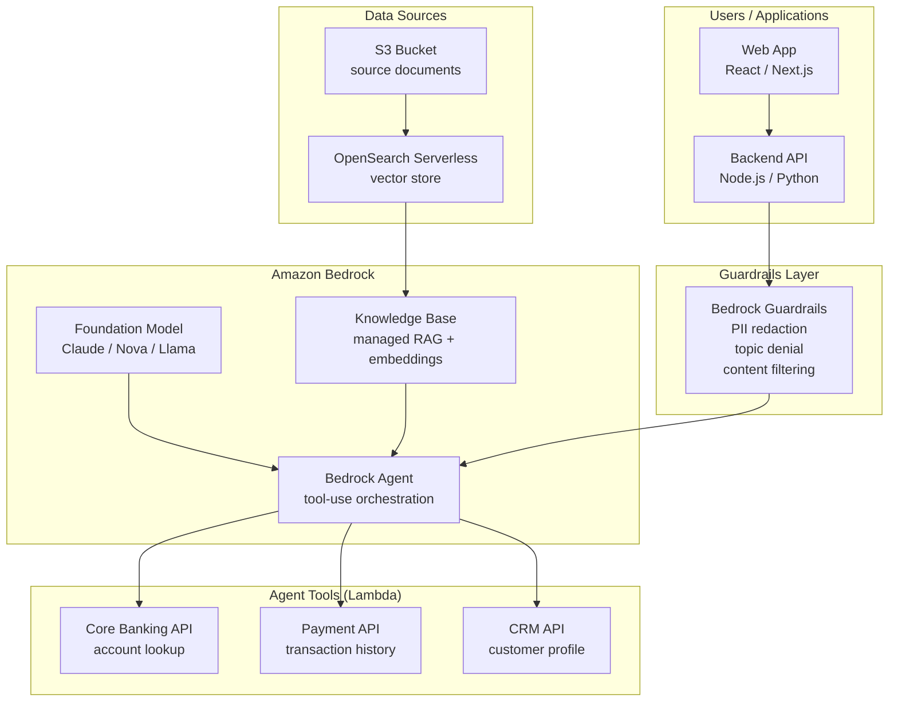

# Amazon Bedrock & Generative AI

## Category

AWS, Generative AI, LLM, RAG, Agents, Guardrails, Bedrock

## Context

**Amazon Bedrock** is the AWS fully managed service for building generative AI applications. It provides API access to foundation models (FMs) from Anthropic (Claude), Amazon (Nova, Titan), Meta (Llama), Mistral, Cohere, and others — without managing ML infrastructure. Bedrock also provides managed building blocks for production AI: Knowledge Bases (managed RAG), Agents (tool-use orchestration), Guardrails (content safety), and Model Evaluation.

### Model Selection Guide

| Model Family | Best For | Context Window | Strengths |
|-------------|---------|---------------|-----------|
| **Claude 3.5 Sonnet** | General reasoning, coding, analysis | 200k tokens | Best quality/cost; strong at instruction following |
| **Claude 3 Haiku** | High-volume, latency-sensitive classification | 200k tokens | Fastest Claude; lowest cost |
| **Amazon Nova Pro** | AWS-native enterprise tasks | 300k tokens | Multimodal; deep AWS integration |
| **Amazon Nova Micro** | Text-only, ultra-low latency | 128k tokens | Cheapest model on Bedrock |
| **Llama 3.3 70B** | Open weights; data sovereignty | 128k tokens | Customisable; can self-host on EC2 |
| **Mistral Large** | European regulatory preference | 32k tokens | GDPR-friendly; strong at structured output |
| **Cohere Command R+** | RAG-optimised retrieval + synthesis | 128k tokens | Built-in RAG citations |

### Bedrock Architecture Patterns

| Pattern | When to Use |
|---------|------------|
| **Simple Inference** | Single-turn summarisation, classification, translation |
| **Streaming Inference** | Chat UI, real-time response generation |
| **Bedrock Knowledge Bases** | Managed RAG — upload docs, Bedrock handles chunking + embedding + retrieval |
| **Bedrock Agents** | Multi-step tool-use — call Lambda functions, query APIs, use Knowledge Bases |
| **Bedrock Guardrails** | Content filtering, PII redaction, topic denial for any model |
| **Batch Inference** | Offline processing of large document sets at ~50% cost reduction |
| **Fine-tuning / Continued Pre-training** | Domain-specific vocabulary, tone, or knowledge baking |

---

## Pros

- **No ML infrastructure**: No GPUs, no model serving, no scaling — Bedrock handles all of it.
- **Managed RAG (Knowledge Bases)**: Handles chunking, embedding, OpenSearch Serverless provisioning, and retrieval without custom code.
- **Guardrails apply across all models**: One policy definition enforces content safety regardless of which FM is called.
- **Native AWS IAM integration**: Fine-grained access control — IAM policies control which models, which roles can invoke.
- **Cross-region inference profiles**: Automatically route to the best available region for capacity — reduces throttling.

## Cons

- **Model lock-in within AWS**: Unlike using model APIs directly, Bedrock availability depends on AWS region + quota.
- **Bedrock Agents latency**: Agentic loops add latency (500ms–2s per tool call) — not suitable for hard real-time.
- **Knowledge Base chunking is opaque**: AWS manages chunking strategy — complex documents may need custom preprocessing pipelines with S3 + Lambda before ingestion.
- **Cost at scale**: Input/output token costs accumulate quickly at high volume — Provisioned Throughput needed for predictable latency + cost under sustained load.

---

## Design Diagram



---

## Code Sample

### 1. Basic Inference with AWS SDK v3

```typescript
import {
  BedrockRuntimeClient,
  InvokeModelCommand,
  InvokeModelWithResponseStreamCommand,
} from '@aws-sdk/client-bedrock-runtime';

const client = new BedrockRuntimeClient({ region: 'eu-west-1' });

// Simple (non-streaming) inference
async function invokeModel(prompt: string): Promise<string> {
  const body = JSON.stringify({
    anthropic_version: 'bedrock-2023-05-31',
    max_tokens:        1024,
    messages: [{ role: 'user', content: prompt }],
  });

  const command = new InvokeModelCommand({
    modelId:     'anthropic.claude-3-5-sonnet-20241022-v2:0',
    contentType: 'application/json',
    accept:      'application/json',
    body,
  });

  const response = await client.send(command);
  const decoded  = JSON.parse(new TextDecoder().decode(response.body));
  return decoded.content[0].text;
}

// Streaming inference — yield tokens as they arrive (for chat UI)
async function* invokeModelStream(prompt: string): AsyncGenerator<string> {
  const body = JSON.stringify({
    anthropic_version: 'bedrock-2023-05-31',
    max_tokens:        1024,
    messages: [{ role: 'user', content: prompt }],
  });

  const command = new InvokeModelWithResponseStreamCommand({
    modelId:     'anthropic.claude-3-5-sonnet-20241022-v2:0',
    contentType: 'application/json',
    accept:      'application/json',
    body,
  });

  const response = await client.send(command);

  for await (const event of response.body!) {
    if (event.chunk?.bytes) {
      const chunk = JSON.parse(new TextDecoder().decode(event.chunk.bytes));
      if (chunk.type === 'content_block_delta' && chunk.delta?.text) {
        yield chunk.delta.text;
      }
    }
  }
}
```

### 2. Cross-Region Inference Profile (Capacity Resilience)

```typescript
// Use an inference profile to automatically route across regions for capacity
// Inference profiles are created in the Bedrock console or via API

const command = new InvokeModelCommand({
  // Cross-region inference profile ARN (not a plain model ID)
  modelId: 'arn:aws:bedrock:us-east-1::foundation-model/anthropic.claude-3-5-sonnet-20241022-v2:0',
  // Alternatively, use a system-defined cross-region profile:
  // modelId: 'us.anthropic.claude-3-5-sonnet-20241022-v2:0',  // routes US regions
  // modelId: 'eu.anthropic.claude-3-5-sonnet-20241022-v2:0',  // routes EU regions
  contentType: 'application/json',
  accept:      'application/json',
  body: JSON.stringify({
    anthropic_version: 'bedrock-2023-05-31',
    max_tokens: 1024,
    messages: [{ role: 'user', content: 'Summarise this document: ...' }],
  }),
});
```

### 3. Bedrock Knowledge Base — RAG Query

```typescript
import {
  BedrockAgentRuntimeClient,
  RetrieveAndGenerateCommand,
  RetrieveCommand,
} from '@aws-sdk/client-bedrock-agent-runtime';

const agentRuntimeClient = new BedrockAgentRuntimeClient({ region: 'eu-west-1' });

// Retrieve-and-Generate: send query → retrieves relevant docs → generates answer
async function ragQuery(query: string, sessionId: string): Promise<string> {
  const command = new RetrieveAndGenerateCommand({
    input:     { text: query },
    sessionId,   // maintain conversation context across turns
    retrieveAndGenerateConfiguration: {
      type: 'KNOWLEDGE_BASE',
      knowledgeBaseConfiguration: {
        knowledgeBaseId: process.env.KNOWLEDGE_BASE_ID!,
        modelArn: 'arn:aws:bedrock:eu-west-1::foundation-model/anthropic.claude-3-5-sonnet-20241022-v2:0',
        retrievalConfiguration: {
          vectorSearchConfiguration: {
            numberOfResults: 5,                    // retrieve top-5 chunks
            overrideSearchType: 'HYBRID',           // keyword + semantic search
          },
        },
        generationConfiguration: {
          promptTemplate: {
            textPromptTemplate:
              'You are a banking assistant. Answer only using the provided context.\n\n$search_results$\n\nQuestion: $query$',
          },
          inferenceConfig: {
            textInferenceConfig: { maxTokens: 1024, temperature: 0 },
          },
        },
      },
    },
  });

  const response = await agentRuntimeClient.send(command);
  return response.output?.text ?? '';
}

// Retrieve-only: get source chunks without generating (useful for custom prompts)
async function retrieveChunks(query: string) {
  const command = new RetrieveCommand({
    knowledgeBaseId: process.env.KNOWLEDGE_BASE_ID!,
    retrievalQuery:  { text: query },
    retrievalConfiguration: {
      vectorSearchConfiguration: { numberOfResults: 5 },
    },
  });

  const response = await agentRuntimeClient.send(command);
  return response.retrievalResults?.map(r => ({
    content:  r.content?.text,
    source:   r.location?.s3Location?.uri,
    score:    r.score,
  }));
}
```

### 4. Bedrock Agent — Invoke with Tool Use

```typescript
import {
  BedrockAgentRuntimeClient,
  InvokeAgentCommand,
} from '@aws-sdk/client-bedrock-agent-runtime';

const agentClient = new BedrockAgentRuntimeClient({ region: 'eu-west-1' });

// Invoke a Bedrock Agent — the agent orchestrates tool calls automatically
// Tools (Lambda functions) are configured in the Bedrock Agent console / IaC
async function* invokeAgent(
  userMessage: string,
  sessionId: string
): AsyncGenerator<string> {
  const command = new InvokeAgentCommand({
    agentId:        process.env.BEDROCK_AGENT_ID!,
    agentAliasId:   process.env.BEDROCK_AGENT_ALIAS_ID!,
    sessionId,
    inputText:      userMessage,
  });

  const response = await agentClient.send(command);

  for await (const event of response.completion!) {
    if (event.chunk?.bytes) {
      yield new TextDecoder().decode(event.chunk.bytes);
    }
  }
}
```

### 5. Bedrock Guardrails — Apply to Any Model Invocation

```typescript
import {
  BedrockRuntimeClient,
  InvokeModelCommand,
} from '@aws-sdk/client-bedrock-runtime';

// Guardrail is pre-configured in Bedrock console with:
// - Hate speech, violence content filters (HIGH threshold)
// - PII entities to redact (EMAIL, CREDIT_DEBIT_NUMBER, SSN)
// - Denied topics: competitor mentions, investment advice

async function invokeWithGuardrails(userInput: string): Promise<string> {
  const body = JSON.stringify({
    anthropic_version: 'bedrock-2023-05-31',
    max_tokens: 1024,
    messages: [{ role: 'user', content: userInput }],
  });

  const command = new InvokeModelCommand({
    modelId:     'anthropic.claude-3-5-sonnet-20241022-v2:0',
    contentType: 'application/json',
    accept:      'application/json',
    body,
    // Apply guardrail to both input and output
    guardrailIdentifier: process.env.GUARDRAIL_ID!,
    guardrailVersion:    'DRAFT',   // or a published version number
  });

  const response = await client.send(command);
  const decoded  = JSON.parse(new TextDecoder().decode(response.body));

  // Check if guardrail intervened
  if (decoded.stop_reason === 'guardrail_intervened') {
    const assessment = decoded.amazon_bedrock_guardrail_assessment;
    console.warn('Guardrail intervened:', JSON.stringify(assessment));
    return "I'm sorry, I can't help with that request.";
  }

  return decoded.content[0].text;
}
```

### 6. Knowledge Base — Document Ingestion Pipeline (CDK)

```typescript
// cdk/lib/bedrock-rag-stack.ts
import * as cdk from 'aws-cdk-lib';
import * as s3 from 'aws-cdk-lib/aws-s3';
import * as bedrock from 'aws-cdk-lib/aws-bedrock';
import * as oss from 'aws-cdk-lib/aws-opensearchserverless';
import { Construct } from 'constructs';

export class BedrockRagStack extends cdk.Stack {
  constructor(scope: Construct, id: string, props?: cdk.StackProps) {
    super(scope, id, props);

    // S3 bucket for source documents
    const documentsBucket = new s3.Bucket(this, 'DocumentsBucket', {
      encryption:            s3.BucketEncryption.S3_MANAGED,
      blockPublicAccess:     s3.BlockPublicAccess.BLOCK_ALL,
      versioned:             true,
      lifecycleRules: [{
        transitions: [{ storageClass: s3.StorageClass.INTELLIGENT_TIERING, transitionAfter: cdk.Duration.days(30) }],
      }],
    });

    // OpenSearch Serverless vector collection
    const vectorCollection = new oss.CfnCollection(this, 'VectorCollection', {
      name: 'knowledge-base-vectors',
      type: 'VECTORSEARCH',
    });

    // Bedrock Knowledge Base (managed RAG)
    const knowledgeBase = new bedrock.CfnKnowledgeBase(this, 'KnowledgeBase', {
      name:        'payments-knowledge-base',
      description: 'Payment product documentation and FAQs',
      roleArn:     bedrockKbRole.roleArn,
      knowledgeBaseConfiguration: {
        type: 'VECTOR',
        vectorKnowledgeBaseConfiguration: {
          embeddingModelArn: 'arn:aws:bedrock:eu-west-1::foundation-model/amazon.titan-embed-text-v2:0',
          embeddingModelConfiguration: {
            bedrockEmbeddingModelConfiguration: { dimensions: 1024 },
          },
        },
      },
      storageConfiguration: {
        type: 'OPENSEARCH_SERVERLESS',
        opensearchServerlessConfiguration: {
          collectionArn:    vectorCollection.attrArn,
          vectorIndexName:  'bedrock-knowledge-base-index',
          fieldMapping: {
            vectorField:   'embedding',
            textField:     'content',
            metadataField: 'metadata',
          },
        },
      },
    });

    // Data source — S3 with chunking configuration
    new bedrock.CfnDataSource(this, 'DocumentsDataSource', {
      knowledgeBaseId: knowledgeBase.attrKnowledgeBaseId,
      name:            'documents-s3-source',
      dataSourceConfiguration: {
        type: 'S3',
        s3Configuration: {
          bucketArn:              documentsBucket.bucketArn,
          inclusionPrefixes:      ['policies/', 'faqs/', 'product-docs/'],
        },
      },
      vectorIngestionConfiguration: {
        chunkingConfiguration: {
          chunkingStrategy: 'HIERARCHICAL',   // parent + child chunks for better retrieval
          hierarchicalChunkingConfiguration: {
            levelConfigurations: [
              { maxTokens: 1500 },   // parent chunk
              { maxTokens: 300 },    // child chunk
            ],
            overlapTokens: 60,
          },
        },
      },
    });
  }
}
```

### 7. IAM — Least-Privilege Policy for Bedrock

```json
{
  "Version": "2012-10-17",
  "Statement": [
    {
      "Sid":    "AllowSpecificModelInference",
      "Effect": "Allow",
      "Action": [
        "bedrock:InvokeModel",
        "bedrock:InvokeModelWithResponseStream"
      ],
      "Resource": [
        "arn:aws:bedrock:eu-west-1::foundation-model/anthropic.claude-3-5-sonnet-20241022-v2:0",
        "arn:aws:bedrock:eu-west-1::foundation-model/anthropic.claude-3-haiku-20240307-v1:0"
      ]
    },
    {
      "Sid":    "AllowKnowledgeBaseQuery",
      "Effect": "Allow",
      "Action": [
        "bedrock:Retrieve",
        "bedrock:RetrieveAndGenerate"
      ],
      "Resource": "arn:aws:bedrock:eu-west-1:123456789012:knowledge-base/KBID12345"
    },
    {
      "Sid":    "AllowGuardrail",
      "Effect": "Allow",
      "Action": "bedrock:ApplyGuardrail",
      "Resource": "arn:aws:bedrock:eu-west-1:123456789012:guardrail/GRID12345"
    },
    {
      "Sid":    "DenyModelAccess",
      "Effect": "Deny",
      "Action": [
        "bedrock:CreateModelCustomizationJob",
        "bedrock:DeleteFoundationModel",
        "bedrock:PutModelInvocationLoggingConfiguration"
      ],
      "Resource": "*"
    }
  ]
}
```

---

## Security Checklist

- [ ] IAM policy scoped to specific model ARNs — not `bedrock:*` or `*` resources
- [ ] Bedrock Guardrails configured with content filtering, PII redaction, and denied topics
- [ ] Model invocation logging enabled (CloudWatch) — required for regulated workloads
- [ ] Knowledge Base S3 bucket encrypted (SSE-KMS) and not publicly accessible
- [ ] Bedrock Agent Lambda tool functions have least-privilege IAM roles
- [ ] Cross-region inference profile used for production (throttling resilience)
- [ ] Prompt injection detection applied before sending user input to model (see [security/16-ai-llm-security.md](../../security/16-ai-llm-security.md))
- [ ] Token budget / rate limit per user enforced before invoking Bedrock API

---

## References

- [Amazon Bedrock — Developer Guide](https://docs.aws.amazon.com/bedrock/latest/userguide/)
- [Bedrock Knowledge Bases — RAG](https://docs.aws.amazon.com/bedrock/latest/userguide/knowledge-base.html)
- [Bedrock Agents](https://docs.aws.amazon.com/bedrock/latest/userguide/agents.html)
- [Bedrock Guardrails](https://docs.aws.amazon.com/bedrock/latest/userguide/guardrails.html)
- [AWS CDK — Bedrock Constructs (alpha)](https://docs.aws.amazon.com/cdk/api/v2/docs/aws-cdk-lib.aws_bedrock-readme.html)
- [Bedrock Pricing](https://aws.amazon.com/bedrock/pricing/)
- [OWASP LLM Top 10 defensive patterns → security/16-ai-llm-security.md](../../security/16-ai-llm-security.md)
