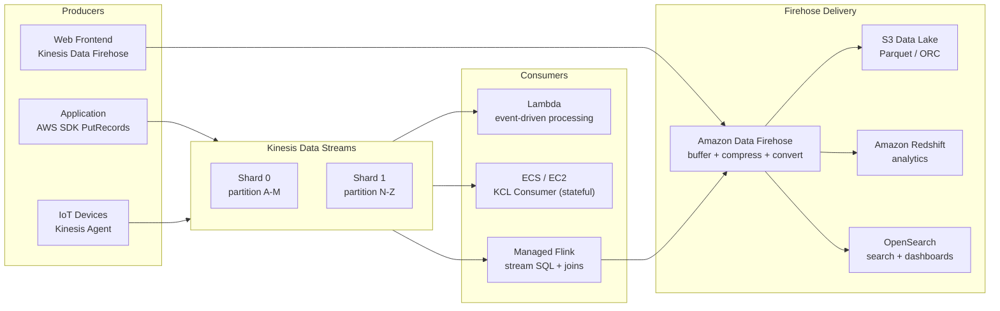

# Kinesis Data Streams & Firehose

## Category

AWS, Streaming, Kinesis, Firehose, Managed Flink, Real-Time Data

## Context

**Amazon Kinesis** is the AWS family of managed streaming data services. It is the AWS equivalent of Apache Kafka for real-time data ingestion and processing, but fully managed with no infrastructure to operate.

| Service | Role | Azure Equivalent | Kafka Equivalent |
|---------|------|-----------------|-----------------|
| **Kinesis Data Streams** | Real-time ordered event log; custom consumers | Event Hubs | Kafka topics |
| **Amazon Data Firehose** | Managed delivery of streams to S3, Redshift, OpenSearch | Event Hubs Capture | Kafka Connect |
| **Managed Service for Apache Flink** | Stateful stream processing; SQL on streams | Stream Analytics | Kafka Streams / Flink |
| **Kinesis Video Streams** | Video/audio streaming | — | — |

### When Kinesis vs SQS vs EventBridge

| Requirement | Use |
|-------------|-----|
| Ordered, replayable event log (< 7 days) | **Kinesis Data Streams** |
| Point-to-point work queue with DLQ | **SQS** |
| Event fanout with content-based routing | **EventBridge** |
| Deliver stream → S3 / Redshift / OpenSearch (no code) | **Firehose** |
| Stateful stream processing (joins, aggregations, CEP) | **Managed Service for Apache Flink** |
| > 7 days retention or Apache Kafka ecosystem tools | **MSK (Managed Kafka)** |

### Kinesis Data Streams — Key Concepts

| Concept | Description |
|---------|------------|
| **Shard** | Unit of throughput — 1 MB/s write, 2 MB/s read; scale by adding shards |
| **Partition key** | Determines which shard receives a record; use high-cardinality keys to avoid hot shards |
| **Sequence number** | Unique per shard per record — used to replay from a position |
| **Retention** | 24h default; up to 365 days (extended retention) |
| **Enhanced fan-out** | Dedicated 2 MB/s read throughput per consumer (eliminates read throttling) |
| **On-Demand capacity** | Auto-scales shards; charges per GB — no shard management needed |

---

## Pros

- **Fully managed**: No ZooKeeper, no broker fleet, no rebalancing — AWS handles all of it.
- **Ordered within a shard**: Records with the same partition key arrive in order — suitable for event sourcing.
- **Replayable**: Consumers can re-read from the beginning of the retention window (unlike SQS which deletes after consume).
- **Lambda + Kinesis natively integrated**: Lambda polls shards automatically with configurable batch size and parallelisation.
- **Firehose zero-code delivery**: Deliver streams to S3/Redshift/OpenSearch with built-in buffering, compression, and format conversion (Parquet/ORC).

## Cons

- **Shard management (provisioned mode)**: Under-shard = throttling; over-shard = wasted cost. On-Demand mode mitigates this.
- **Hot shards**: Poorly chosen partition keys cause uneven load; a single shard is rate-limited to 1 MB/s.
- **Not Kafka-compatible**: Cannot use Kafka client libraries — use KCL (Kinesis Client Library) or AWS SDK. If Kafka ecosystem tools are required, use MSK.
- **Maximum record size**: 1 MB per record — large events must be chunked or stored in S3 with a reference in the stream.

---

## Design Diagram



---

## Code Sample

### 1. Producer — PutRecords (Batched Write)

```typescript
import {
  KinesisClient,
  PutRecordsCommand,
  PutRecordsRequestEntry,
} from '@aws-sdk/client-kinesis';

const kinesis = new KinesisClient({ region: 'eu-west-1' });

interface PaymentEvent {
  eventId:       string;
  accountId:     string;
  amount:        number;
  currency:      string;
  status:        string;
  occurredAt:    string;
}

// PutRecords sends up to 500 records per call (or 5 MB total)
async function publishPaymentEvents(events: PaymentEvent[]): Promise<void> {
  const records: PutRecordsRequestEntry[] = events.map(event => ({
    // Partition key = accountId — all events for the same account land on the same shard (ordered)
    PartitionKey: event.accountId,
    Data:         Buffer.from(JSON.stringify(event)),
  }));

  // PutRecords is batched — always check FailedRecordCount in response
  const response = await kinesis.send(new PutRecordsCommand({
    StreamName: process.env.KINESIS_STREAM_NAME!,
    Records:    records,
  }));

  if ((response.FailedRecordCount ?? 0) > 0) {
    const failed = response.Records!
      .map((r, i) => r.ErrorCode ? { index: i, error: r.ErrorCode, msg: r.ErrorMessage } : null)
      .filter(Boolean);
    console.error('Failed Kinesis records:', failed);
    // Retry failed records (implement exponential backoff)
    throw new Error(`${response.FailedRecordCount} records failed to publish`);
  }
}
```

### 2. Consumer — Lambda Event Source Mapping

```typescript
import type { KinesisStreamEvent, KinesisStreamRecord } from 'aws-lambda';

// Lambda is automatically triggered by Kinesis — configure via EventSourceMapping
// (managed by CDK / Terraform — not in application code)

interface PaymentEvent {
  eventId:    string;
  accountId:  string;
  amount:     number;
  currency:   string;
  status:     string;
  occurredAt: string;
}

export async function handler(event: KinesisStreamEvent): Promise<void> {
  const records: PaymentEvent[] = event.Records.map(parseRecord).filter(Boolean) as PaymentEvent[];

  // Process records — here: update read model for CQRS
  await Promise.allSettled(records.map(processPaymentEvent));
}

function parseRecord(record: KinesisStreamRecord): PaymentEvent | null {
  try {
    const decoded = Buffer.from(record.kinesis.data, 'base64').toString('utf-8');
    return JSON.parse(decoded);
  } catch (err) {
    console.error('Failed to parse Kinesis record', record.kinesis.sequenceNumber, err);
    return null;   // skip malformed records — do not fail the batch
  }
}

async function processPaymentEvent(event: PaymentEvent): Promise<void> {
  // Idempotent processing — check if event already processed
  const exists = await db.processedEvents.findOne({ eventId: event.eventId });
  if (exists) return;   // already processed (replay scenario)

  await db.paymentReadModel.upsert({
    accountId:  event.accountId,
    lastStatus: event.status,
    updatedAt:  event.occurredAt,
  });

  await db.processedEvents.insert({ eventId: event.eventId, processedAt: new Date() });
}
```

### 3. Lambda Event Source Mapping — CDK Configuration

```typescript
// cdk/lib/kinesis-consumer-stack.ts
import * as cdk from 'aws-cdk-lib';
import * as kinesis from 'aws-cdk-lib/aws-kinesis';
import * as lambda from 'aws-cdk-lib/aws-lambda';
import * as lambdaEventSources from 'aws-cdk-lib/aws-lambda-event-sources';
import * as sqs from 'aws-cdk-lib/aws-sqs';
import { Construct } from 'constructs';

export class KinesisConsumerStack extends cdk.Stack {
  constructor(scope: Construct, id: string, props?: cdk.StackProps) {
    super(scope, id, props);

    const stream = kinesis.Stream.fromStreamArn(this, 'PaymentStream',
      'arn:aws:kinesis:eu-west-1:123456789012:stream/payment-events'
    );

    // DLQ for failed records after all retry attempts
    const dlq = new sqs.Queue(this, 'KinesisDLQ', {
      queueName:       'payment-kinesis-dlq',
      retentionPeriod: cdk.Duration.days(14),
      encryption:      sqs.QueueEncryption.SQS_MANAGED,
    });

    const consumerFn = new lambda.Function(this, 'PaymentConsumer', {
      runtime:      lambda.Runtime.NODEJS_22_X,
      handler:      'handler.handler',
      code:         lambda.Code.fromAsset('dist/payment-consumer'),
      timeout:      cdk.Duration.minutes(5),
      reservedConcurrentExecutions: 10,   // limit parallelism — prevent DB overload
    });

    consumerFn.addEventSource(new lambdaEventSources.KinesisEventSource(stream, {
      startingPosition:         lambda.StartingPosition.TRIM_HORIZON,   // replay from oldest
      batchSize:                100,         // process up to 100 records per invocation
      bisectBatchOnError:       true,        // on error, split batch to find failing record
      parallelizationFactor:    2,           // 2 concurrent Lambda invocations per shard
      retryAttempts:            3,
      maxBatchingWindow:        cdk.Duration.seconds(5),   // wait up to 5s to fill batch
      onFailure:                new lambdaEventSources.SqsDlq(dlq),
      filters: [{                            // only process COMPLETED payments (server-side filter)
        pattern: JSON.stringify({ data: { status: ['COMPLETED'] } }),
      }],
    }));
  }
}
```

### 4. Amazon Data Firehose — Deliver to S3 as Parquet

```typescript
// cdk/lib/firehose-stack.ts
import * as cdk from 'aws-cdk-lib';
import * as firehose from 'aws-cdk-lib/aws-kinesisfirehose';
import * as destinations from '@aws-cdk-lib/aws-kinesisfirehose-destinations-alpha';
import * as s3 from 'aws-cdk-lib/aws-s3';
import * as glue from 'aws-cdk-lib/aws-glue';
import { Construct } from 'constructs';

export class FirehoseStack extends cdk.Stack {
  constructor(scope: Construct, id: string, props?: cdk.StackProps) {
    super(scope, id, props);

    const dataLakeBucket = new s3.Bucket(this, 'DataLake', {
      encryption:        s3.BucketEncryption.S3_MANAGED,
      blockPublicAccess: s3.BlockPublicAccess.BLOCK_ALL,
      versioned:         false,
      lifecycleRules: [
        { transitions: [{ storageClass: s3.StorageClass.INTELLIGENT_TIERING, transitionAfter: cdk.Duration.days(30) }] },
        { expiration: cdk.Duration.days(365) },
      ],
    });

    // Firehose delivery stream — JSON to S3 (partitioned by year/month/day/hour)
    new firehose.DeliveryStream(this, 'PaymentFirehose', {
      streamName: 'payment-events-firehose',
      destinations: [
        new destinations.S3Bucket(dataLakeBucket, {
          compression:   destinations.Compression.SNAPPY,
          dataOutputPrefix:    'payments/year=!{timestamp:yyyy}/month=!{timestamp:MM}/day=!{timestamp:dd}/hour=!{timestamp:HH}/',
          errorOutputPrefix:   'payments-errors/!{firehose:error-output-type}/year=!{timestamp:yyyy}/',
          bufferingInterval:   cdk.Duration.seconds(60),   // flush every 60s
          bufferingSize:       cdk.Size.mebibytes(64),     // or when 64 MB accumulated
        }),
      ],
    });
  }
}
```

### 5. Managed Service for Apache Flink — Streaming SQL

```sql
-- Apache Flink SQL running on Managed Service for Apache Flink (formerly Kinesis Data Analytics)
-- Real-time aggregation: count and sum payments per account per minute

-- Define Kinesis source table
CREATE TABLE payment_events (
  event_id    STRING,
  account_id  STRING,
  amount      DECIMAL(18, 2),
  currency    STRING,
  status      STRING,
  occurred_at TIMESTAMP(3),
  WATERMARK FOR occurred_at AS occurred_at - INTERVAL '5' SECOND
)
WITH (
  'connector'                           = 'kinesis',
  'stream'                              = 'payment-events',
  'aws.region'                          = 'eu-west-1',
  'format'                              = 'json',
  'json.timestamp-format.standard'      = 'ISO-8601',
  'scan.stream.initpos'                 = 'LATEST'
);

-- Define Kinesis sink table (aggregated events)
CREATE TABLE payment_aggregates (
  account_id       STRING,
  window_start     TIMESTAMP(3),
  window_end       TIMESTAMP(3),
  transaction_count BIGINT,
  total_amount     DECIMAL(18, 2),
  currency         STRING,
  PRIMARY KEY (account_id, window_start) NOT ENFORCED
)
WITH (
  'connector'  = 'kinesis',
  'stream'     = 'payment-aggregates',
  'aws.region' = 'eu-west-1',
  'format'     = 'json'
);

-- Tumbling window aggregation: 1-minute windows per account
INSERT INTO payment_aggregates
SELECT
  account_id,
  TUMBLE_START(occurred_at, INTERVAL '1' MINUTE) AS window_start,
  TUMBLE_END(occurred_at,   INTERVAL '1' MINUTE) AS window_end,
  COUNT(*)                                         AS transaction_count,
  SUM(amount)                                      AS total_amount,
  currency
FROM payment_events
WHERE status = 'COMPLETED'
GROUP BY
  account_id,
  currency,
  TUMBLE(occurred_at, INTERVAL '1' MINUTE);
```

### 6. Shard Scaling — On-Demand vs Provisioned

```typescript
import {
  KinesisClient,
  UpdateStreamModeCommand,
  UpdateShardCountCommand,
  StreamMode,
} from '@aws-sdk/client-kinesis';

const kinesis = new KinesisClient({ region: 'eu-west-1' });

// Switch to On-Demand mode (auto-scaling, no shard management)
// Best for: unpredictable or spiky traffic; new streams
async function switchToOnDemand(streamName: string): Promise<void> {
  await kinesis.send(new UpdateStreamModeCommand({
    StreamARN:    `arn:aws:kinesis:eu-west-1:123456789012:stream/${streamName}`,
    StreamModeDetails: { StreamMode: StreamMode.ON_DEMAND },
  }));
}

// Scale provisioned shards — use when On-Demand cost exceeds provisioned cost
// at sustained high throughput (typically > 1 GB/s sustained)
async function rescaleShards(streamName: string, targetShardCount: number): Promise<void> {
  await kinesis.send(new UpdateShardCountCommand({
    StreamName:         streamName,
    TargetShardCount:   targetShardCount,
    ScalingType:        'UNIFORM_SCALING',
  }));
  // Shard splits/merges take a few minutes to complete
  // Cannot scale more than double (split) or half (merge) per operation
}
```

---

## Security Checklist

- [ ] Kinesis stream encrypted with KMS (`StreamEncryption` + CMK) for streams containing PII/PCI data
- [ ] IAM policy scoped to specific stream ARN — not `kinesis:*` on all resources
- [ ] Lambda consumer role has `kinesis:GetRecords`, `kinesis:GetShardIterator`, `kinesis:DescribeStream` only
- [ ] Producer role has `kinesis:PutRecords` only — no `GetRecords`
- [ ] Firehose S3 destination has server-side encryption (SSE-KMS)
- [ ] Dead-letter queue (SQS) configured on Lambda event source mapping for failed records
- [ ] Enhanced fan-out enabled for each consumer with > 2 MB/s read throughput requirement
- [ ] VPC endpoint for Kinesis (`com.amazonaws.region.kinesis-streams`) — no public internet for producers/consumers inside VPC

---

## References

- [Amazon Kinesis Data Streams — Developer Guide](https://docs.aws.amazon.com/streams/latest/dev/introduction.html)
- [Amazon Data Firehose](https://docs.aws.amazon.com/firehose/latest/dev/what-is-this-service.html)
- [Managed Service for Apache Flink](https://docs.aws.amazon.com/managed-flink/latest/java/what-is.html)
- [Kinesis Client Library (KCL 2.x)](https://docs.aws.amazon.com/streams/latest/dev/shared-throughput-kcl-consumers.html)
- [AWS CDK — Kinesis Constructs](https://docs.aws.amazon.com/cdk/api/v2/docs/aws-cdk-lib.aws_kinesis-readme.html)
- [Kinesis vs SQS vs MSK — Decision Guide](https://docs.aws.amazon.com/decision-guides/latest/kinesis-or-sqs-or-msk/kinesis-or-sqs-or-msk.html)
