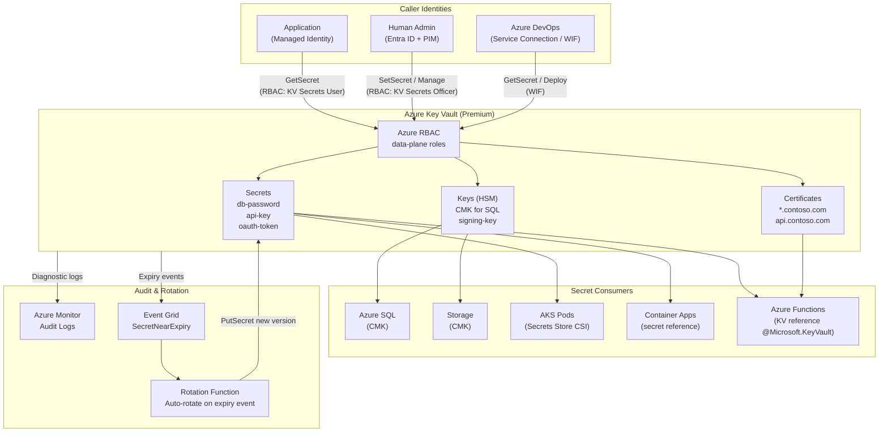

# Azure Key Vault — Secrets, Keys & Certificates

## Category
Cloud Native, Security, Secrets Management, Key Vault, HSM, Certificate Automation

## Context

Azure Key Vault is the central credential and cryptographic material store across all Azure services. It provides three distinct object types:

| Object type | Examples | Automatic rotation | Versioned |
|-------------|---------|-------------------|-----------|
| **Secrets** | DB passwords, API keys, connection strings, OAuth tokens | Yes (via rotation policy) | Yes |
| **Keys** | RSA/EC keys for encryption (CMK), signing, wrapping | Yes (via rotation policy) | Yes |
| **Certificates** | TLS/SSL certificates (public + private key pair) | Yes (via DigiCert, Let's Encrypt issuers) | Yes |

**Two tiers**:
| Tier | Storage | FIPS | Use when |
|------|---------|------|---------|
| **Standard (Software)** | Software-protected | FIPS 140-2 Level 1 | Applications, general secrets |
| **Premium (HSM-backed)** | Hardware Security Module | FIPS 140-2 Level 2 | Regulatory mandates, CMK for data encryption |

**Two access models**:
| Model | What it controls | Recommended |
|-------|----------------|-------------|
| **Access Policies** (legacy) | Vault-wide permissions per identity | ❌ Avoid new deployments |
| **Azure RBAC** (recommended) | Fine-grained per secret/key/certificate via roles | ✅ Use this |

**Key Vault RBAC data-plane roles**:
| Role | What it allows |
|------|---------------|
| `Key Vault Secrets Officer` | Get, set, list, delete secrets |
| `Key Vault Secrets User` | Get, list secrets only (read-only) |
| `Key Vault Crypto Officer` | Manage keys (create, import, delete) |
| `Key Vault Crypto User` | Use keys for encrypt/decrypt/sign/verify |
| `Key Vault Certificate Officer` | Manage certificates |
| `Key Vault Administrator` | Full data-plane access (all object types) |

**Secret versioning and rotation lifecycle**:
```
Create → CURRENT version active
         ↓ (rotation triggered: manual, policy, or Event Grid)
New version created → application reads new version within TTL
         ↓
Old version DISABLED (configurable) → eventually DELETED
```

**Event Grid integration**: Key Vault emits events on `SecretNearExpiry` (30 days before), `SecretExpired`, `CertificateNearExpiry`, `KeyNearExpiry` — wire to Functions or Logic Apps for automated rotation.

**Soft delete and purge protection**:
- **Soft delete** (always on): Deleted objects retained 7–90 days, recoverable.
- **Purge protection**: Prevents permanent deletion until retention window expires. **Required for CMK scenarios.**

**Customer-Managed Keys (CMK)**: Services like Azure SQL, Storage, Cosmos DB, AKS etcd, Disk Encryption can use a Key Vault key as the data encryption key. The service wraps its data encryption key (DEK) with your key encryption key (KEK) — you retain control of the master.

---

## Pros

- **Zero-credential applications**: Managed Identity authentication replaces all hardcoded secrets.
- **Centralised audit**: Every `GetSecret`, `GetKey` call logged to Azure Monitor / Log Analytics with caller identity.
- **Automatic certificate lifecycle**: Issue, renew, deploy TLS certificates without manual steps.
- **Soft delete + purge protection**: Accidental or malicious deletion is recoverable.
- **CMK sovereignty**: You can revoke the KEK, immediately making all encrypted data inaccessible — cryptographic erasure.
- **Private Endpoint**: Key Vault accessible only within VNet — no public internet exposure needed.
- **Secrets versioning**: Rollback is instant — previous version always visible.

---

## Cons

- **Per-vault SLA boundary**: Each vault has 5,000 operations/10 seconds per vault limit. High-frequency apps need SDK-level caching or multiple vaults.
- **Regional service**: A vault is in one region. Cross-region availability requires Geo-Redundant Vault (premium) or replication via Event Grid + Function.
- **Latency on every GetSecret call**: ~5–10 ms. Must cache secrets in-process to avoid per-request overhead.
- **CMK adds key management burden**: Accidentally deleting the KEK renders data permanently inaccessible — requires careful lifecycle governance.
- **Access Policy model doesn't support deny**: Legacy access policies are all-or-nothing per vault. RBAC supports deny assignments.
- **Certificate auto-rotation requires app process restart** (in some scenarios): Applications reading the certificate file on startup must reload without downtime.

---

## Design Diagram



---

## Code Sample

### Bicep — Key Vault with RBAC, Private Endpoint, diagnostic settings

```bicep
param name string
param location string = resourceGroup().location
param appManagedIdentityPrincipalId string
param adminObjectId string
param logAnalyticsWorkspaceId string
param privateEndpointSubnetId string
param privateDnsZoneId string

resource keyVault 'Microsoft.KeyVault/vaults@2023-07-01' = {
  name: name
  location: location
  properties: {
    sku: {
      family: 'A'
      name: 'premium'  // HSM-backed keys; use 'standard' for software-only
    }
    tenantId: subscription().tenantId
    enableRbacAuthorization: true   // Azure RBAC for data plane (not access policies)
    enableSoftDelete: true
    softDeleteRetentionInDays: 90
    enablePurgeProtection: true     // Required for CMK scenarios
    publicNetworkAccess: 'Disabled' // Private access only
    networkAcls: {
      defaultAction: 'Deny'
      bypass: 'AzureServices'       // Allow trusted Azure services (Backup, etc.)
    }
  }
  tags: {
    environment: 'production'
    team: 'platform'
  }
}

// Application Managed Identity — read secrets only
resource secretsUserRole 'Microsoft.Authorization/roleAssignments@2022-04-01' = {
  name: guid(keyVault.id, appManagedIdentityPrincipalId, 'Key Vault Secrets User')
  scope: keyVault
  properties: {
    roleDefinitionId: subscriptionResourceId(
      'Microsoft.Authorization/roleDefinitions',
      '4633458b-17de-408a-b874-0445c86b69e6'  // Key Vault Secrets User
    )
    principalId: appManagedIdentityPrincipalId
    principalType: 'ServicePrincipal'
  }
}

// Human admin — manage secrets (JIT via PIM in practice)
resource secretsOfficerRole 'Microsoft.Authorization/roleAssignments@2022-04-01' = {
  name: guid(keyVault.id, adminObjectId, 'Key Vault Secrets Officer')
  scope: keyVault
  properties: {
    roleDefinitionId: subscriptionResourceId(
      'Microsoft.Authorization/roleDefinitions',
      'b86a8fe4-44ce-4948-aee5-eccb2c155cd7'  // Key Vault Secrets Officer
    )
    principalId: adminObjectId
    principalType: 'User'
  }
}

// Diagnostic settings — audit every access to Log Analytics
resource diagnostics 'Microsoft.Insights/diagnosticSettings@2021-05-01-preview' = {
  name: 'kv-diagnostics'
  scope: keyVault
  properties: {
    workspaceId: logAnalyticsWorkspaceId
    logs: [
      { category: 'AuditEvent';      enabled: true;  retentionPolicy: { enabled: false; days: 0 } }
      { category: 'AzurePolicyEvaluationDetails'; enabled: false; retentionPolicy: { enabled: false; days: 0 } }
    ]
    metrics: [
      { category: 'AllMetrics'; enabled: true; retentionPolicy: { enabled: false; days: 0 } }
    ]
  }
}

// Private Endpoint
resource privateEndpoint 'Microsoft.Network/privateEndpoints@2023-06-01' = {
  name: '${name}-pe'
  location: location
  properties: {
    subnet: { id: privateEndpointSubnetId }
    privateLinkServiceConnections: [
      {
        name: '${name}-plsc'
        properties: {
          privateLinkServiceId: keyVault.id
          groupIds: ['vault']
        }
      }
    ]
  }
}

// DNS Zone Group — auto-register Private Endpoint into Private DNS Zone
resource dnsGroup 'Microsoft.Network/privateEndpoints/privateDnsZoneGroups@2023-06-01' = {
  parent: privateEndpoint
  name: 'default'
  properties: {
    privateDnsZoneConfigs: [
      {
        name: 'privatelink-vaultcore-azure-net'
        properties: {
          privateDnsZoneId: privateDnsZoneId  // privatelink.vaultcore.azure.net
        }
      }
    ]
  }
}

output keyVaultUri string = keyVault.properties.vaultUri
output keyVaultId string = keyVault.id
```

### TypeScript — SDK caching client with Managed Identity

```typescript
import { DefaultAzureCredential } from '@azure/identity';
import { SecretClient } from '@azure/keyvault-secrets';
import { z } from 'zod';

const credential = new DefaultAzureCredential();
const client = new SecretClient(process.env.KEY_VAULT_URI!, credential);

// In-process cache — avoids per-request API call (5-10ms + throttle risk)
const cache = new Map<string, { value: string; expiresAt: number }>();
const CACHE_TTL_MS = 5 * 60 * 1000; // 5 minutes — shorter than rotation interval

async function getSecret(name: string, force = false): Promise<string> {
  const cached = cache.get(name);
  if (!force && cached && cached.expiresAt > Date.now()) {
    return cached.value;
  }

  // Get CURRENT version — never hardcode version IDs (breaks rotation)
  const secret = await client.getSecret(name);
  if (!secret.value) throw new Error(`Secret '${name}' has no value`);

  cache.set(name, { value: secret.value, expiresAt: Date.now() + CACHE_TTL_MS });
  return secret.value;
}

// Typed helper for structured secrets (JSON blobs)
const DbSecretSchema = z.object({
  host: z.string(),
  port: z.coerce.number(),
  database: z.string(),
  username: z.string(),
  password: z.string(),
});

async function getDbSecret(name: string) {
  const raw = await getSecret(name);
  return DbSecretSchema.parse(JSON.parse(raw));
}

export { getSecret, getDbSecret };
```

### Azure Functions — Key Vault reference in app settings (no SDK needed)

```bicep
// Function App setting — Key Vault reference syntax
// The runtime resolves the secret transparently; the app receives the plain value
resource functionApp 'Microsoft.Web/sites@2023-01-01' = {
  // ...
  properties: {
    siteConfig: {
      appSettings: [
        {
          name: 'DATABASE_PASSWORD'
          // @Microsoft.KeyVault(SecretUri=...) — resolved at runtime
          value: '@Microsoft.KeyVault(VaultName=${keyVaultName};SecretName=db-password)'
          // Or pin to a version:
          // value: '@Microsoft.KeyVault(SecretUri=https://${kvName}.vault.azure.net/secrets/db-password/abc123)'
        }
        {
          name: 'STRIPE_API_KEY'
          value: '@Microsoft.KeyVault(VaultName=${keyVaultName};SecretName=stripe-api-key)'
        }
      ]
    }
  }
}
// The Function App's Managed Identity must have Key Vault Secrets User role
```

### Automatic rotation — Event Grid → Function trigger pattern

```typescript
import { app, InvocationContext } from '@azure/functions';
import { SecretClient } from '@azure/keyvault-secrets';
import { DefaultAzureCredential } from '@azure/identity';

interface KeyVaultSecretNearExpiryEvent {
  id: string;
  data: {
    VaultName: string;
    ObjectType: 'Secret';
    ObjectName: string;     // e.g. "stripe-api-key"
    Version: string;
  };
  eventType: 'Microsoft.KeyVault.SecretNearExpiry';
}

app.eventGrid('rotateSecret', {
  handler: async (event: KeyVaultSecretNearExpiryEvent, context: InvocationContext) => {
    const { VaultName, ObjectName } = event.data;
    context.log(`Rotating secret ${ObjectName} in vault ${VaultName}`);

    const client = new SecretClient(
      `https://${VaultName}.vault.azure.net`,
      new DefaultAzureCredential(),
    );

    // 1. Generate new credential (call external API)
    const newValue = await generateNewCredential(ObjectName);

    // 2. Write new version — Key Vault auto-labels it CURRENT, demotes old to PREVIOUS
    await client.setSecret(ObjectName, newValue, {
      expiresOn: new Date(Date.now() + 30 * 24 * 60 * 60 * 1000), // 30 days
      tags: { rotatedAt: new Date().toISOString(), rotatedBy: 'rotation-function' },
    });

    context.log(`Secret ${ObjectName} rotated successfully`);
  },
});
```

### AKS — Secrets Store CSI Driver (mount Key Vault secrets as files/env vars)

```yaml
apiVersion: secrets-store.csi.x-k8s.io/v1
kind: SecretProviderClass
metadata:
  name: app-secrets
  namespace: payments
spec:
  provider: azure
  parameters:
    usePodIdentity: "false"
    clientID: "<user-assigned-managed-identity-client-id>"
    keyvaultName: "my-key-vault"
    tenantID: "<tenant-id>"
    objects: |
      array:
        - |
          objectName: db-password
          objectType: secret
          objectVersion: ""       # empty = CURRENT
        - |
          objectName: signing-key
          objectType: key
          objectVersion: ""
  secretObjects:                  # Sync to K8s Secret for env var use
    - secretName: app-secrets
      type: Opaque
      data:
        - objectName: db-password
          key: DATABASE_PASSWORD
---
apiVersion: apps/v1
kind: Deployment
metadata:
  name: payments-api
spec:
  template:
    spec:
      containers:
        - name: api
          image: myacr.azurecr.io/payments-api:latest
          envFrom:
            - secretRef:
                name: app-secrets         # DATABASE_PASSWORD env var injected
          volumeMounts:
            - name: secrets-store
              mountPath: "/mnt/secrets"   # Also available as files
              readOnly: true
      volumes:
        - name: secrets-store
          csi:
            driver: secrets-store.csi.k8s.io
            readOnly: true
            volumeAttributes:
              secretProviderClass: app-secrets
```

---

## Key Patterns

### CMK (Customer-Managed Key) for Azure SQL

```bicep
// 1. Key in Key Vault
resource encryptionKey 'Microsoft.KeyVault/vaults/keys@2023-07-01' = {
  parent: keyVault
  name: 'sql-cmk'
  properties: {
    kty: 'RSA'
    keySize: 2048
    keyOps: ['wrapKey', 'unwrapKey']
    attributes: { enabled: true }
    rotationPolicy: {
      lifetimeActions: [
        { trigger: { timeBeforeExpiry: 'P30D' }; action: { type: 'Notify' } }
        { trigger: { timeAfterCreate: 'P365D' }; action: { type: 'Rotate' } }
      ]
      attributes: { expiryTime: 'P400D' }
    }
  }
}

// 2. SQL Server uses the key for TDE (Transparent Data Encryption)
resource sqlServer 'Microsoft.Sql/servers@2023-05-01-preview' = {
  name: 'my-sql-server'
  identity: { type: 'SystemAssigned' }
  properties: {
    administrators: { /* ... */ }
  }
}

// 3. Grant the SQL server's identity Key Vault Crypto User role
resource sqlCryptoRole 'Microsoft.Authorization/roleAssignments@2022-04-01' = {
  name: guid(keyVault.id, sqlServer.identity.principalId, 'crypto-user')
  scope: keyVault
  properties: {
    roleDefinitionId: subscriptionResourceId(
      'Microsoft.Authorization/roleDefinitions',
      '12338af0-0e69-4776-bea7-57ae8d297424'  // Key Vault Crypto User
    )
    principalId: sqlServer.identity.principalId
    principalType: 'ServicePrincipal'
  }
}
```

### Audit query — who accessed which secret

```kql
// Key Vault access audit — last 24 hours
AzureDiagnostics
| where ResourceType == "VAULTS"
| where OperationName in ("SecretGet", "SecretSet", "SecretDelete")
| where TimeGenerated > ago(24h)
| extend
    CallerIP = tostring(callerIpAddress_s),
    Identity = tostring(identity_claim_oid_g),
    SecretName = tostring(id_s),
    Result = tostring(resultType_s)
| project TimeGenerated, OperationName, SecretName, Identity, CallerIP, Result
| order by TimeGenerated desc
```

### Security checklist

| Control | Implementation |
|---------|---------------|
| Public access disabled | `publicNetworkAccess: 'Disabled'` in Bicep |
| Private Endpoint + DNS | `privatelink.vaultcore.azure.net` zone linked to VNet |
| Azure RBAC (not Access Policies) | `enableRbacAuthorization: true` |
| Purge protection on | Required for CMK; prevents accidental unrecoverable deletion |
| Diagnostic logs to Log Analytics | `AuditEvent` category enabled |
| No hardcoded vault URI | Read from env var or config; never in source code |
| Least-privilege roles | Applications get `Secrets User` only; no `Administrator` role |
| Soft delete retention 90 days | Maximum window for recovery |
| Key rotation policy set | All keys have `timeAfterCreate` rotation trigger |

---

## Well-Architected Alignment

| Pillar | How Key Vault helps |
|--------|---------------------|
| **Security** | Credentials never in code, config, or pipeline logs; full RBAC data-plane |
| **Reliability** | Soft delete + purge protection prevents unrecoverable credential loss |
| **Operational Excellence** | Centralised audit trail; Event Grid rotation automation |
| **Cost Optimisation** | SDK caching reduces API call volume; Standard tier for non-HSM workloads |

---

## Related Patterns

- [`05-entra-id-rbac.md`](05-entra-id-rbac.md) — Managed Identity authenticates to Key Vault without secrets
- [`03-aks-kubernetes.md`](03-aks-kubernetes.md) — Secrets Store CSI Driver mounts Key Vault secrets into pods
- [`01-azure-functions.md`](01-azure-functions.md) — Key Vault references in Function App settings
- [`04-vnet-networking.md`](04-vnet-networking.md) — Private Endpoint for Key Vault network isolation
- [`11-azure-devops-pipelines.md`](11-azure-devops-pipelines.md) — Variable Groups linked to Key Vault for pipeline secrets
