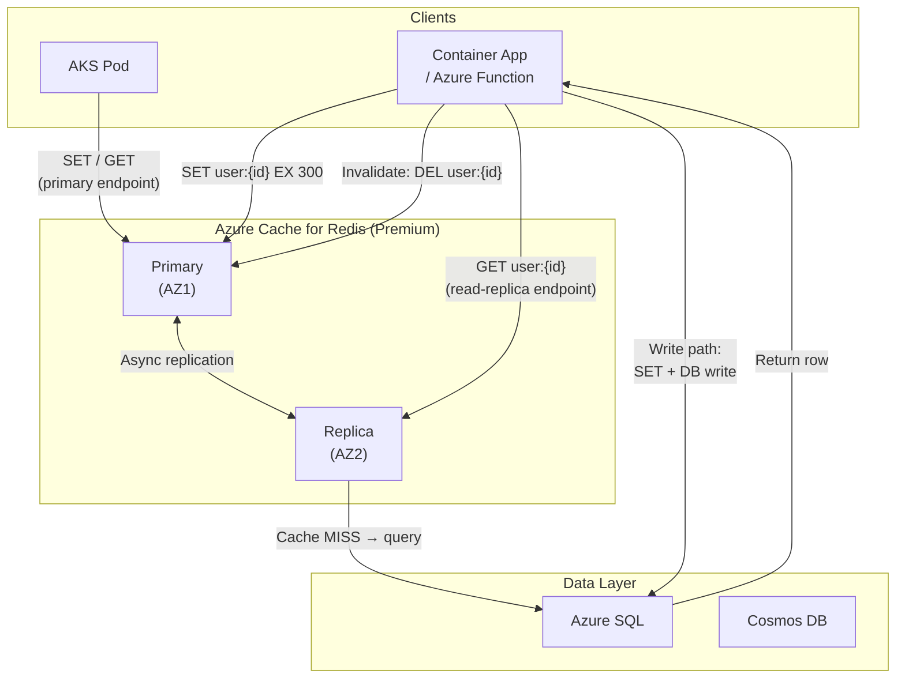

# Azure Cache for Redis — In-Memory Caching

## Category
Cloud Native, Caching, Performance, Azure Cache for Redis, Session Store, Rate Limiting

## Context

Azure Cache for Redis is a fully managed Redis service offering sub-millisecond latency for read-heavy workloads, session state, rate limiting, distributed locks, and pub/sub messaging.

**Service tiers**:
| Tier | Max memory | Clustering | Geo-replication | Private Link | Use when |
|------|-----------|-----------|----------------|-------------|---------|
| **Basic** | 53 GB | No | No | No | Dev/Test only — no SLA |
| **Standard** | 53 GB | No | No | No | Production single-region |
| **Premium** | 530 GB | Up to 10 shards | Active geo-replication | Yes | HA, DR, large datasets |
| **Enterprise** | 2 TB | Up to 80 shards | Active-active (CRDT) | Yes | Extreme scale, <1ms global |
| **Enterprise Flash** | 13 TB | Up to 80 shards | Active-active | Yes | Cost-optimised large dataset (NVMe) |

**Redis vs Azure-native alternatives**:
```
Sub-ms response for hot read data?      → Azure Cache for Redis
SDK-level query caching for Cosmos DB?  → Cosmos DB integrated cache
DynamoDB equivalent?                    → Cosmos DB (not Redis)
API Gateway response caching?           → APIM caching policies
Session storage across stateless pods?  → Azure Cache for Redis
Leaderboards / sorted ranking?          → Redis Sorted Sets (ZADD/ZRANGE)
Distributed lock across services?       → Redis SETNX + Lua (Redlock pattern)
Rate limiting per IP/user?              → Redis atomic INCR + TTL
```

**Caching patterns**:
| Pattern | Description | Stale risk | Complexity |
|---------|-------------|-----------|------------|
| **Cache-aside (lazy loading)** | Read cache; on miss query DB, populate, return | Yes (miss window) | Low |
| **Write-through** | Write to DB and cache simultaneously | No | Medium |
| **Write-behind** | Write to cache first, async flush to DB | Yes (flush fail) | High |
| **Read-through** | Cache proxies DB reads on miss (library-managed) | No | Medium |
| **Refresh-ahead** | Background job pre-warms before TTL expires | Very low | High |

**Eviction policies** — choose based on data access pattern:
| Policy | Behaviour | Use for |
|--------|-----------|---------|
| `allkeys-lru` | Evict least-recently used from all keys | General-purpose cache |
| `volatile-lru` | Evict LRU keys with TTL set | Mix of durable + ephemeral |
| `allkeys-lfu` | Evict least-frequently used | Frequency-biased access |
| `volatile-ttl` | Evict keys with shortest TTL | Time-windowed data |
| `noeviction` | Return error when full | Critical data — never evict |

**TTL design**:
- Too short → high miss rate → DB overload
- Too long → stale data served
- Rule of thumb: TTL = expected change interval × 2, with ±10–20% random jitter to prevent thundering herd

---

## Pros

- **Sub-millisecond latency**: P99 < 1 ms for read/write on warm data.
- **Rich data structures**: Strings, hashes, lists, sets, sorted sets, streams, HyperLogLog.
- **Managed Identity auth**: No connection strings — Entra ID token authentication (available from Redis 6+).
- **Persistence options**: RDB snapshots + AOF write-ahead log for durability.
- **Clustering**: Premium sharding distributes load and memory across up to 10 nodes.
- **Active geo-replication**: Enterprise tier supports multi-region write (active-active CRDT) for zero-RPO global caching.
- **Zone redundancy**: Standard+ supports AZ-redundant primaries.

---

## Cons

- **Memory-bound**: All active data must fit in RAM — plan capacity carefully with headroom for eviction.
- **Replication lag**: Replica reads are eventually consistent (milliseconds behind primary).
- **Cluster mode key constraints**: Multi-key commands require hash tags: `{user}.session`, `{user}.cart` to collocate in same shard.
- **Cold start**: Cache warm-up needed after restarts or failovers — build warm-up logic into deployment.
- **No ACID across keys**: Redis transactions (`MULTI/EXEC`) are single-node only; no cross-shard atomicity.
- **Cluster not available in Standard**: Sharding requires Premium — cost jump.
- **Connection pool management**: Lambda/Functions short-lived processes must reuse connections (global/module-scope clients).

---

## Design Diagram



---

## Code Sample

### Bicep — Azure Cache for Redis Premium with zone redundancy

```bicep
param name string
param location string = resourceGroup().location
param subnetId string            // Private Endpoint subnet

resource redis 'Microsoft.Cache/redis@2023-08-01' = {
  name: name
  location: location
  properties: {
    sku: {
      name: 'Premium'
      family: 'P'
      capacity: 1  // P1 = 6GB; P2 = 13GB; P3 = 26GB; P4 = 53GB; P5 = 120GB
    }
    enableNonSslPort: false        // SSL only
    minimumTlsVersion: '1.2'
    redisVersion: '7'

    // Persistence — RDB snapshots every 60 minutes
    redisConfiguration: {
      'rdb-backup-enabled': 'true'
      'rdb-backup-frequency': '60'
      'maxmemory-policy': 'allkeys-lru'
      'activerehashing': 'yes'
      'lazyfree-lazy-eviction': 'yes'  // async eviction reduces latency spikes
    }

    // Zone redundancy - primary in AZ1, replica in AZ2
    replicasPerPrimary: 1
    replicasPerMaster: 1   // deprecated alias; include both for compatibility
    zones: ['1', '2']

    publicNetworkAccess: 'Disabled'  // Private Endpoint only
  }

  tags: {
    environment: 'production'
    team: 'platform'
  }
}

// Private Endpoint
resource privateEndpoint 'Microsoft.Network/privateEndpoints@2023-06-01' = {
  name: '${name}-pe'
  location: location
  properties: {
    subnet: { id: subnetId }
    privateLinkServiceConnections: [
      {
        name: '${name}-plsc'
        properties: {
          privateLinkServiceId: redis.id
          groupIds: ['redisCache']
        }
      }
    ]
  }
}

resource dnsGroup 'Microsoft.Network/privateEndpoints/privateDnsZoneGroups@2023-06-01' = {
  parent: privateEndpoint
  name: 'default'
  properties: {
    privateDnsZoneConfigs: [
      {
        name: 'privatelink-redis-cache-windows-net'
        properties: {
          privateDnsZoneId: privateDnsZoneId  // privatelink.redis.cache.windows.net
        }
      }
    ]
  }
}

output primaryHostName string = redis.properties.hostName
output sslPort int = redis.properties.sslPort
```

### TypeScript — cache-aside pattern with ioredis

```typescript
import Redis from 'ioredis';
import { z } from 'zod';

// Use connection string from Key Vault reference / env var — never hardcode
const redis = new Redis({
  host: process.env.REDIS_HOST!,       // <name>.redis.cache.windows.net
  port: 6380,
  password: process.env.REDIS_PASSWORD!, // Access key from Key Vault reference
  tls: { servername: process.env.REDIS_HOST },
  connectTimeout: 5000,
  maxRetriesPerRequest: 2,
  enableReadyCheck: true,
  // Cluster mode: new Redis.Cluster([{ host, port }], { redisOptions: { tls, password } })
});

const UserSchema = z.object({
  id: z.string(),
  email: z.string().email(),
  name: z.string(),
  tier: z.enum(['free', 'pro', 'enterprise']),
});
type User = z.infer<typeof UserSchema>;

const CACHE_TTL_SECONDS = 300;
const JITTER_SECONDS = 30; // ±30s to avoid thundering herd

function ttlWithJitter(): number {
  return CACHE_TTL_SECONDS + Math.floor(Math.random() * JITTER_SECONDS * 2) - JITTER_SECONDS;
}

async function getUser(id: string, db: DatabaseClient): Promise<User | null> {
  const key = `user:${id}`;

  const cached = await redis.get(key);
  if (cached) {
    return UserSchema.parse(JSON.parse(cached));
  }

  const row = await db.query('SELECT * FROM users WHERE id = $1', [id]);
  if (!row) return null;

  const user = UserSchema.parse(row);
  await redis.set(key, JSON.stringify(user), 'EX', ttlWithJitter());
  return user;
}

async function updateUser(id: string, patch: Partial<User>, db: DatabaseClient): Promise<User> {
  const updated = await db.query('UPDATE users SET ... WHERE id = $1 RETURNING *', [id]);
  const user = UserSchema.parse(updated);
  await redis.del(`user:${id}`);  // Invalidate on write
  return user;
}
```

### Rate limiter — fixed window with atomic Lua

```typescript
async function checkRateLimit(
  identifier: string,  // IP, userId, apiKey
  limitPerMinute: number,
): Promise<{ allowed: boolean; remaining: number; resetAt: number }> {
  const window = Math.floor(Date.now() / 60_000);
  const key = `ratelimit:${identifier}:${window}`;

  // Atomic increment + expiry (Lua ensures atomicity across commands)
  const luaScript = `
    local count = redis.call('INCR', KEYS[1])
    if count == 1 then
      redis.call('EXPIRE', KEYS[1], 60)
    end
    return count
  `;

  const count = await redis.eval(luaScript, 1, key) as number;
  const allowed = count <= limitPerMinute;
  const resetAt = (window + 1) * 60_000;

  return { allowed, remaining: Math.max(0, limitPerMinute - count), resetAt };
}
```

### Distributed lock (Redlock single-node simplified)

```typescript
const LOCK_TTL_MS = 10_000;

async function acquireLock(resource: string, token: string): Promise<boolean> {
  const result = await redis.set(`lock:${resource}`, token, 'NX', 'PX', LOCK_TTL_MS);
  return result === 'OK';
}

async function releaseLock(resource: string, token: string): Promise<void> {
  // Atomic check-then-delete — only release locks we own
  const luaScript = `
    if redis.call('GET', KEYS[1]) == ARGV[1] then
      return redis.call('DEL', KEYS[1])
    else
      return 0
    end
  `;
  await redis.eval(luaScript, 1, `lock:${resource}`, token);
}
```

### Session storage for stateless services

```typescript
const SESSION_TTL = 3600; // 1 hour

async function createSession(userId: string, data: SessionData): Promise<string> {
  const sessionId = crypto.randomUUID();
  // Use a Redis Hash for session — efficient partial reads
  await redis.hset(`session:${sessionId}`, { userId, ...data, createdAt: Date.now() });
  await redis.expire(`session:${sessionId}`, SESSION_TTL);
  return sessionId;
}

async function refreshSession(sessionId: string): Promise<void> {
  // Sliding window — extend TTL on each request
  await redis.expire(`session:${sessionId}`, SESSION_TTL);
}

async function getSession(sessionId: string): Promise<Record<string, string> | null> {
  const data = await redis.hgetall(`session:${sessionId}`);
  return Object.keys(data).length > 0 ? data : null;
}
```

### Cache warm-up after deployment / failover

```typescript
async function warmCache(db: DatabaseClient): Promise<void> {
  const hotUsers = await db.query(
    'SELECT * FROM users ORDER BY last_seen DESC LIMIT 10000'
  );

  // Pipeline batch writes — much faster than individual SET calls
  const pipeline = redis.pipeline();
  for (const user of hotUsers) {
    pipeline.set(`user:${user.id}`, JSON.stringify(user), 'EX', ttlWithJitter());
  }
  await pipeline.exec();
}
```

---

## Key Patterns

### Sorted set leaderboard

```typescript
// Upsert score
await redis.zadd('leaderboard:global', score, userId);

// Top 10 with scores
const top10 = await redis.zrevrange('leaderboard:global', 0, 9, 'WITHSCORES');

// User's rank (0 = first place)
const rank = await redis.zrevrank('leaderboard:global', userId);
```

### Pub/Sub for real-time events (within same region)

```typescript
// Publisher
await redis.publish('order-events', JSON.stringify({ orderId, event: 'SHIPPED' }));

// Subscriber (separate connection — subscribing blocks the connection)
const subscriber = redis.duplicate();
await subscriber.subscribe('order-events');
subscriber.on('message', (_channel, message) => {
  const event = JSON.parse(message);
  // handle event
});
```

### Azure APIM caching policy (no Redis SDK needed)

```xml
<!-- Cache API responses in Redis via APIM policy -->
<policies>
  <inbound>
    <cache-lookup vary-by-developer="false" vary-by-developer-groups="false"
                  downstream-caching-type="none">
      <vary-by-header>Accept</vary-by-header>
      <vary-by-query-parameter>version</vary-by-query-parameter>
    </cache-lookup>
  </inbound>
  <outbound>
    <cache-store duration="300" />  <!-- 5 minutes -->
  </outbound>
</policies>
```

---

## Sizing Reference

| SKU | Memory | Max connections | Approx. monthly cost (West Europe) |
|-----|--------|----------------|-------------------------------------|
| `C0` Basic | 250 MB | 256 | ~€16 |
| `C1` Standard | 1 GB | 1,000 | ~€57 |
| `C2` Standard | 6 GB | 2,000 | ~€110 |
| `P1` Premium | 6 GB | 7,500 | ~€220 |
| `P2` Premium | 13 GB | 7,500 | ~€440 |
| `P3` Premium | 26 GB | 7,500 | ~€880 |

- Use **Premium** for production (Private Link, persistence, zone redundancy).
- Use **Standard C1/C2** for staging/pre-prod.
- Use **Basic** only for dev/test — no SLA, no replica.

### CloudWatch equivalent — key Azure Monitor alarms to set

```
ConnectedClients near limit → connection pool leak or insufficient pool sizing
UsedMemory > 80% of capacity → increase tier or reduce TTL
CacheMisses/(CacheHits+CacheMisses) > 20% → TTL too short or hot data changed
ServerLoad > 80% → scale up SKU or reduce hot key concentration (cluster mode)
Evictions > 0 sustained → cache is full, increase capacity or tune eviction policy
```

---

## Well-Architected Alignment

| Pillar | How Cache for Redis helps |
|--------|--------------------------|
| **Performance** | Sub-ms reads; offloads 80–90% of DB read pressure |
| **Reliability** | Zone-redundant replica; automatic failover < 30s |
| **Security** | Private Endpoint; SSL/TLS mandatory; Managed Identity (Redis 6+) |
| **Cost Optimisation** | Reduces Cosmos RU and SQL DTU consumption; scale-to-zero via TTL eviction |
| **Operational Excellence** | Azure Monitor metrics; connection count, memory, miss rate telemetry |

---

## Related Patterns

- [`07-azure-sql-cosmos.md`](07-azure-sql-cosmos.md) — SQL and Cosmos DB as source of truth behind the cache
- [`01-azure-functions.md`](01-azure-functions.md) — Functions + Redis: use module-scope client for connection reuse
- [`02-container-apps.md`](02-container-apps.md) — ACA Dapr state store can be backed by Redis
- [`06-api-management.md`](06-api-management.md) — APIM external cache integration for response caching
- [`16-key-vault.md`](16-key-vault.md) — Store Redis access key in Key Vault; reference via app settings
- [`15-cost-management.md`](15-cost-management.md) — Caching is highest-ROI cost lever for read-heavy workloads
