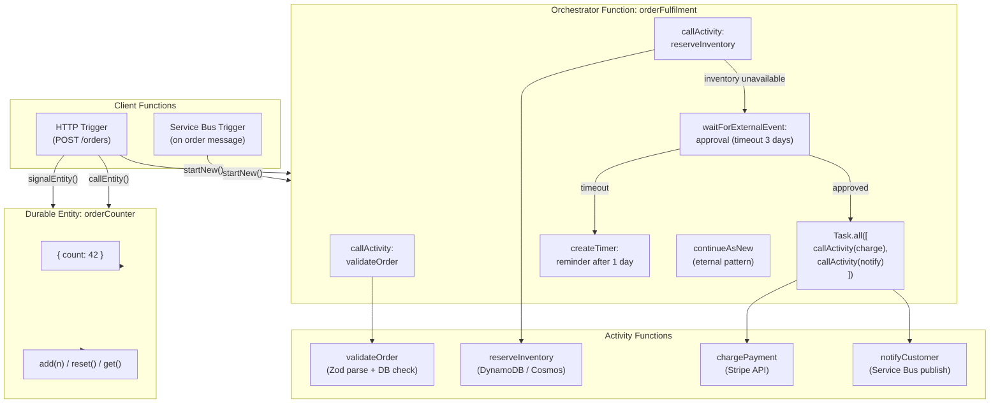

# Azure Durable Functions — Stateful Orchestration

## Category
Cloud Native, Orchestration, Serverless, Durable Functions, Stateful Workflows

## Context

Azure Durable Functions extends Azure Functions with durable state, long-running workflows, and coordination primitives — all without managing infrastructure. It is the Azure equivalent of AWS Step Functions but code-first (TypeScript/C#/Python) rather than JSON/YAML state machines.

**Core component types**:
| Component | Role | Execution model |
|-----------|------|----------------|
| **Orchestrator function** | Controls the workflow; calls activity and entity functions | Deterministic, replayed; must NOT have side effects |
| **Activity function** | Does the actual work (I/O, API calls, DB writes) | Standard Function; called by orchestrator |
| **Entity function** (Durable Entities) | Stateful singleton actor; maintains in-memory state across calls | All operations serialised per entity |
| **Client function** | Triggers and queries orchestration instances | HTTP trigger, SB trigger, timer, etc. |

**Storage backends**:
| Backend | Throughput | Cost | Use when |
|---------|-----------|------|---------|
| **Azure Storage (default)** | Moderate | Low | Dev/test, low-moderate concurrency |
| **Netherite (Event Hubs + Azure Storage)** | High | Medium | High concurrency (> 100 parallel orchestrations) |
| **MSSQL** | Moderate | Medium | Existing SQL investment; audit in SQL |

**The replay mechanism** (critical to understand):
Orchestrator code is replayed on every event. Durable Functions replays the entire function body using the history log to fast-forward past already-completed steps. Therefore:
- ✅ **Safe in orchestrators**: `context.df.callActivity()`, `context.df.waitForExternalEvent()`, `context.df.createTimer()`
- ❌ **Forbidden in orchestrators**: `Date.now()`, `Math.random()`, `fetch()`, reading env vars, generating UUIDs directly — these produce different values on replay → use `context.df.currentUtcDateTime`, `context.df.newGuid()`

**7 Durable Functions patterns**:
| Pattern | Description | Key API |
|---------|-------------|---------|
| **1. Function chaining** | Sequential steps, output → input | `callActivity()` chain |
| **2. Fan-out / Fan-in** | Parallel steps, wait for all | `Task.all(activities[])` |
| **3. Async HTTP API** | Kick off long job, poll for result | Client returns 202 + status URL |
| **4. Monitor** | Long-running polling loop | `createTimer()` + `continueAsNew()` |
| **5. Human interaction** | Wait for approval / external event | `waitForExternalEvent()` |
| **6. Aggregator (entity)** | Stateful counter/accumulator | `callEntity()` / `signalEntity()` |
| **7. Eternal orchestration** | Infinite loop with `continueAsNew()` | `continueAsNew()` to reset history |

---

## Pros

- **Durable state**: Crashes, redeploys, cold starts — the workflow continues from where it left off.
- **Code-first**: Workflow logic in the same language as the rest of the application — no YAML/JSON state machines.
- **Built-in retry**: Activity and sub-orchestration calls support `RetryOptions` with exponential backoff.
- **Fan-out at scale**: `Task.all()` with hundreds of parallel activities — all coordinated with a single await.
- **Human interaction at zero cost**: `waitForExternalEvent()` pauses indefinitely with no polling and no cost.
- **Entity functions**: Stateful actors replace Redis for simple counters, accumulators, and per-entity state.
- **Monitoring API**: Query all running orchestrations, terminate them, send events — built-in HTTP management endpoints.

---

## Cons

- **Replay constraint**: Orchestrator code must be deterministic — non-deterministic operations (random, time, I/O) cause undefined behaviour on replay.
- **History table growth**: Long-running orchestrations accumulate history events in Azure Storage — `continueAsNew()` is required to reset the history.
- **Storage IOPS bottleneck**: Default Azure Storage backend throttles at high concurrency — use Netherite for > 100 concurrent orchestrations.
- **Cold start amplification**: Fan-out creates N activity invocations — N potential cold starts on Consumption plan. Use Premium plan for latency-sensitive fan-out.
- **Debugging complexity**: Replay means log output repeats — use `context.df.isReplaying` guard to suppress duplicate log entries.
- **Entity consistency boundary**: Only per-entity serialisation — no cross-entity atomic operations.

---

## Design Diagram



---

## Code Sample

### Pattern 1 — Function chaining (TypeScript)

```typescript
import * as df from 'durable-functions';
import { app, HttpRequest, HttpResponse, InvocationContext } from '@azure/functions';

// Orchestrator — must be deterministic; NO Date.now(), Math.random(), fetch()
df.app.orchestration('orderFulfilment', function* (context: df.OrchestrationContext) {
  const orderId = context.df.getInput<string>();

  // Sequential steps — each activity runs exactly once; replayed from history
  const validated = yield context.df.callActivity('validateOrder', orderId);
  if (!validated.ok) {
    return { status: 'REJECTED', reason: validated.reason };
  }

  const reserved = yield context.df.callActivity('reserveInventory', {
    orderId,
    items: validated.items,
  });

  if (!reserved.ok) {
    // Wait for human approval — can pause for days at zero cost
    const deadline = context.df.currentUtcDateTime;
    deadline.setDate(deadline.getDate() + 3); // 3-day timeout

    const approvalTask = context.df.waitForExternalEvent<{ approved: boolean }>('orderApproval');
    const timeoutTask = context.df.createTimer(deadline);

    const winner = yield context.df.Task.any([approvalTask, timeoutTask]);
    timeoutTask.cancel(); // cancel the timer if approval arrived first

    if (winner === timeoutTask || !approvalTask.result?.approved) {
      yield context.df.callActivity('cancelReservation', orderId);
      return { status: 'TIMED_OUT' };
    }
  }

  // Fan-out — charge + notify run in parallel
  yield context.df.Task.all([
    context.df.callActivity('chargePayment', orderId),
    context.df.callActivity('notifyCustomer', { orderId, template: 'order_confirmed' }),
  ]);

  return { status: 'FULFILLED', orderId };
});
```

### Pattern 2 — Fan-out / Fan-in (process N items in parallel)

```typescript
df.app.orchestration('processReports', function* (context: df.OrchestrationContext) {
  const { reportIds } = context.df.getInput<{ reportIds: string[] }>();

  // Launch all activity instances in parallel
  const tasks = reportIds.map(id => context.df.callActivity('generateReport', id));
  const results = yield context.df.Task.all(tasks);

  // Aggregate results
  const failed = results.filter(r => !r.ok);
  if (failed.length > 0) {
    yield context.df.callActivity('notifyFailures', failed);
  }

  return { processed: results.length, failed: failed.length };
});
```

### Pattern 3 — Monitor / polling loop with continueAsNew

```typescript
df.app.orchestration('watchOrder', function* (context: df.OrchestrationContext) {
  const { orderId, checkCount } = context.df.getInput<{
    orderId: string;
    checkCount: number;
  }>();

  const status = yield context.df.callActivity('checkOrderStatus', orderId);

  if (status === 'COMPLETED' || status === 'FAILED') {
    yield context.df.callActivity('sendStatusNotification', { orderId, status });
    return { finalStatus: status, checks: checkCount };
  }

  if (checkCount >= 100) {
    yield context.df.callActivity('escalateOrder', orderId);
    return { finalStatus: 'ESCALATED', checks: checkCount };
  }

  // Wait 30 minutes then check again — history resets, no unbounded growth
  const nextCheck = new Date(context.df.currentUtcDateTime.getTime() + 30 * 60 * 1000);
  yield context.df.createTimer(nextCheck);

  // continueAsNew: start next iteration with fresh history
  context.df.continueAsNew({ orderId, checkCount: checkCount + 1 });
});
```

### Pattern 4 — Durable Entity (stateful actor)

```typescript
import * as df from 'durable-functions';

// Entity definition — maintains state across calls
df.app.entity('orderCounter', (context: df.EntityContext<number>) => {
  const currentValue = context.df.getState<number>(() => 0);

  switch (context.df.operationName) {
    case 'add':
      context.df.setState(currentValue + (context.df.getInput<number>() ?? 1));
      break;
    case 'reset':
      context.df.setState(0);
      break;
    case 'get':
      context.df.return(currentValue);
      break;
  }
});

// Reading/writing an entity from an orchestrator
df.app.orchestration('countOrders', function* (context: df.OrchestrationContext) {
  const entityId = new df.EntityId('orderCounter', 'daily-2026-04-12');

  // Signal (fire and forget — doesn't wait for entity to process)
  context.df.signalEntity(entityId, 'add', 1);

  // Call (waits for result)
  const count = yield context.df.callEntity(entityId, 'get');
  return { count };
});
```

### Activity functions with retry

```typescript
// Activity — does the actual I/O work
df.app.activity('chargePayment', {
  handler: async (orderId: string, context: InvocationContext) => {
    context.log(`Charging payment for order ${orderId}`);
    const result = await stripeClient.charges.create({ /* ... */ });
    return { ok: true, chargeId: result.id };
  },
});

// Calling with retry from orchestrator
const retryOptions = new df.RetryOptions(
  5_000,   // First retry after 5 seconds
  3,       // Max 3 attempts
);
retryOptions.backoffCoefficient = 2;      // Exponential: 5s → 10s → 20s
retryOptions.maxRetryIntervalInMilliseconds = 30_000; // Cap at 30s

const result = yield context.df.callActivityWithRetry(
  'chargePayment',
  retryOptions,
  orderId,
);
```

### Client function — HTTP trigger that starts and monitors an orchestration

```typescript
app.http('startOrderFulfilment', {
  methods: ['POST'],
  route: 'orders',
  extraInputs: [df.input.durableClient()],
  handler: async (req: HttpRequest, context: InvocationContext): Promise<HttpResponse> => {
    const client = df.getClient(context);
    const body = await req.json() as { orderId: string };

    // Idempotency: use orderId as instance ID to prevent duplicate starts
    const instanceId = `order-${body.orderId}`;

    try {
      await client.startNew('orderFulfilment', {
        instanceId,
        input: body.orderId,
      });
    } catch (e: any) {
      if (e.statusCode === 409) {
        // Orchestration already running — return current status
      } else throw e;
    }

    // Returns 202 + Location header with management URLs
    return client.createCheckStatusResponse(req, instanceId);
  },
});
```

### Approving human-interaction events from outside

```typescript
app.http('approveOrder', {
  methods: ['POST'],
  route: 'orders/{instanceId}/approve',
  extraInputs: [df.input.durableClient()],
  handler: async (req: HttpRequest, context: InvocationContext): Promise<HttpResponse> => {
    const client = df.getClient(context);
    const { instanceId } = req.params;
    const { approved, userId } = await req.json() as { approved: boolean; userId: string };

    await client.raiseEvent(instanceId, 'orderApproval', { approved, userId });
    return new HttpResponse({ status: 202 });
  },
});
```

### Bicep — Function App for Durable Functions

```bicep
param name string
param location string = resourceGroup().location
param storageAccountId string
param storageAccountName string
param appInsightsConnectionString string

resource hostingPlan 'Microsoft.Web/serverfarms@2023-01-01' = {
  name: '${name}-plan'
  location: location
  sku: {
    name: 'EP1'  // Premium Elastic (avoids cold starts in fan-out scenarios)
    tier: 'ElasticPremium'
  }
  kind: 'elastic'
  properties: {
    maximumElasticWorkerCount: 20
  }
}

resource functionApp 'Microsoft.Web/sites@2023-01-01' = {
  name: name
  location: location
  kind: 'functionapp'
  identity: { type: 'SystemAssigned' }
  properties: {
    serverFarmId: hostingPlan.id
    siteConfig: {
      appSettings: [
        { name: 'AzureWebJobsStorage__accountName'; value: storageAccountName }
        { name: 'AzureWebJobsStorage__credential'; value: 'managedidentity' }
        { name: 'APPLICATIONINSIGHTS_CONNECTION_STRING'; value: appInsightsConnectionString }
        { name: 'FUNCTIONS_EXTENSION_VERSION'; value: '~4' }
        { name: 'FUNCTIONS_WORKER_RUNTIME'; value: 'node' }
        { name: 'WEBSITE_RUN_FROM_PACKAGE'; value: '1' }
        // Durable Functions storage backend
        { name: 'DURABLE_STORAGE_TYPE'; value: 'AzureStorage' }
      ]
      ftpsState: 'Disabled'
      minTlsVersion: '1.2'
      http20Enabled: true
    }
    httpsOnly: true
  }
}

// Storage Blob Data Contributor role for the Function App's MI
resource storageRole 'Microsoft.Authorization/roleAssignments@2022-04-01' = {
  name: guid(storageAccountId, functionApp.identity.principalId, 'StorageBlobDataContributor')
  scope: resourceGroup()
  properties: {
    roleDefinitionId: subscriptionResourceId(
      'Microsoft.Authorization/roleDefinitions',
      'ba92f5b4-2d11-453d-a403-e96b0029c9fe'  // Storage Blob Data Contributor
    )
    principalId: functionApp.identity.principalId
    principalType: 'ServicePrincipal'
  }
}
```

---

## Pattern Selection Guide

```
Need sequential steps with shared state?          → Function chaining
Need parallel processing of N items?              → Fan-out / Fan-in
Need to expose long-running job via HTTP?         → Async HTTP API pattern (202 + status URL)
Need to poll an external system repeatedly?       → Monitor pattern + continueAsNew
Need human approval or external event?            → waitForExternalEvent + createTimer (timeout)
Need a per-entity counter / accumulator?          → Durable Entity
Need an infinite background loop?                 → Eternal orchestration with continueAsNew
Need sub-workflow reuse?                          → Sub-orchestrations (callSubOrchestrator)
```

## Durable vs Logic Apps

| | Durable Functions | Logic Apps |
|---|---|---|
| **Authoring** | Code (TypeScript, C#, Python) | Visual designer + JSON |
| **Connectors** | Custom via Activity functions | 1,000+ pre-built connectors |
| **Pricing** | Per execution + storage | Per action execution |
| **Customisation** | Full code control | Limited to connector capabilities |
| **Use when** | Complex business logic, code team owns the workflow | Integration heavy, low-code teams, SaaS connectors |

---

## Well-Architected Alignment

| Pillar | How Durable Functions helps |
|--------|----------------------------|
| **Reliability** | Durable state survives crashes and redeploys; built-in retry with backoff |
| **Operational Excellence** | Execution history queryable via management API; no external state machine to manage |
| **Security** | Managed Identity for storage + downstream services; no secrets in orchestration state |
| **Performance** | Premium plan eliminates cold starts in fan-out; Netherite backend for high throughput |
| **Cost Optimisation** | `waitForExternalEvent` pauses at zero cost; Consumption plan scales to zero |

---

## Related Patterns

- [`01-azure-functions.md`](01-azure-functions.md) — Activity functions are standard Azure Functions; hosting plan shared
- [`08-service-bus-event-grid.md`](08-service-bus-event-grid.md) — Service Bus trigger can start orchestrations; activities can publish events
- [`16-key-vault.md`](16-key-vault.md) — Activity functions retrieve secrets via Managed Identity
- [`10-azure-monitor.md`](10-azure-monitor.md) — Orchestration traces and duration metrics visible in Application Insights
