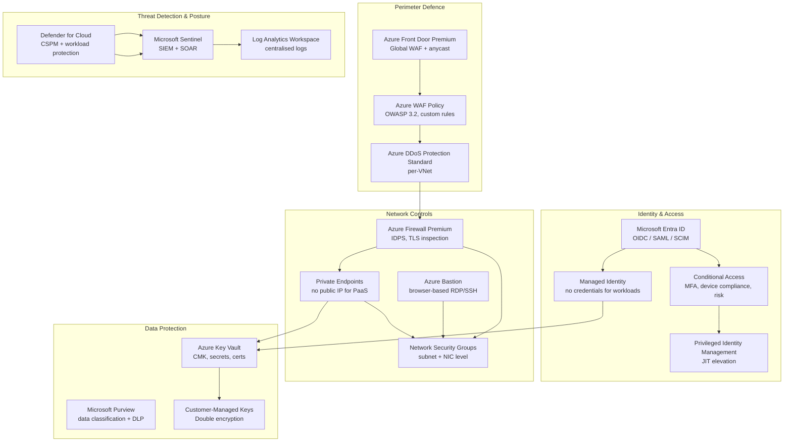

# Azure Security Best Practices

## Category

Cloud Native, Security, Azure, Well-Architected

## Context

Azure security follows a **Shared Responsibility Model** — Microsoft secures the physical infrastructure and the managed platform; you secure the workload, data, identity configuration, network rules, and application code deployed on top.

Microsoft's [Azure Security Benchmark (ASB)](https://learn.microsoft.com/en-us/security/benchmark/azure/) and the [Microsoft Cloud Security Benchmark (MCSB)](https://learn.microsoft.com/en-us/security/benchmark/azure/mcsb-introduction) organise controls into domains:

| Domain | Scope |
|--------|-------|
| **Identity Management** | Entra ID, Managed Identity, PIM, Conditional Access |
| **Privileged Access** | Just-in-time, Azure Bastion, no standing access |
| **Network Security** | NSGs, Azure Firewall, Private Endpoints, DDoS |
| **Data Protection** | Encryption, Key Vault CMK, Purview data classification |
| **Asset Management** | Defender for Cloud, CSPM, regulatory standards |
| **Logging & Threat Detection** | Microsoft Sentinel, Defender, Entra ID Logs |
| **Incident Response** | SOAR, Logic Apps automation, runbooks |

### Security Priority Matrix

| Risk | Default State | Recommended Control |
|------|--------------|---------------------|
| Credential exposure | App secret / password in code | Managed Identity (no credential at all) |
| Over-permissive RBAC | Contributor/Owner broad scope | RBAC at resource group level, PIM for privileged |
| Public storage accounts | Public access allowed by default | `allowBlobPublicAccess: false` at account level |
| Unencrypted data | Azure platform-managed keys | Customer-Managed Key (CMK) in Key Vault |
| No threat detection | Off by default | Microsoft Defender for Cloud (all plans) |
| Port 22/3389 open | Allowed via NSG | Azure Bastion + JIT VM Access |
| No secret rotation | Manual | Key Vault + Event Grid rotation automation |

---

## Pros

- **Managed Identity eliminates credentials entirely**: No passwords, no client secrets, no rotation burden for Azure-to-Azure communication.
- **Defender for Cloud covers multi-cloud**: Single pane of glass for Azure, AWS, and GCP posture.
- **Entra ID Conditional Access**: Risk-based, device-compliant, MFA-enforced access down to the API level.
- **Policy-as-Code (Azure Policy)**: Deny, audit, and auto-remediate non-compliant resources at scale.
- **Built-in compliance frameworks**: MCSB, CIS, PCI-DSS, ISO 27001, SOC 2, NIST available in Defender for Cloud.

## Cons

- **RBAC complexity at scale**: Hundreds of built-in roles and custom role definitions across subscriptions; sprawl is common.
- **Defender Plan costs**: Full coverage (Servers, Storage, Containers, SQL, AppService, KeyVault) can be significant.
- **Policy remediation ordering**: Deny policies must be created before resources; retroactive enforcement requires remediation tasks.
- **Entra Conditional Access misconfiguration risk**: Locking out admins is a real risk without emergency (break-glass) accounts.

---

## Design Diagram



---

## Code Sample

### 1. Managed Identity — Zero-Credential Authentication

```typescript
// Use DefaultAzureCredential — automatically picks the right credential:
// Managed Identity in Azure, developer credential (az login) locally
import { DefaultAzureCredential } from '@azure/identity';
import { SecretClient } from '@azure/keyvault-secrets';
import { BlobServiceClient } from '@azure/storage-blob';

const credential = new DefaultAzureCredential();

// Key Vault — no client secret required
const kvClient = new SecretClient(
  'https://payments-kv.vault.azure.net',
  credential
);
const dbPassword = await kvClient.getSecret('postgres-admin-password');

// Storage — Managed Identity instead of connection string
const blobClient = new BlobServiceClient(
  'https://paymentstorage.blob.core.windows.net',
  credential
);
```

```bicep
// Bicep — assign Managed Identity + RBAC (no connection strings)
resource paymentApp 'Microsoft.Web/sites@2023-01-01' = {
  name: 'payment-service'
  location: location
  identity: {
    type: 'SystemAssigned'   // Entra ID identity auto-provisioned
  }
  properties: {
    siteConfig: {
      // No AZURE_STORAGE_CONNECTION_STRING needed
      appSettings: [
        { name: 'KEY_VAULT_URI', value: keyVault.properties.vaultUri }
        { name: 'STORAGE_ACCOUNT_URI', value: storageAccount.properties.primaryEndpoints.blob }
      ]
    }
  }
}

// Grant Key Vault Secrets Reader — principle of least privilege
resource kvSecretsRole 'Microsoft.Authorization/roleAssignments@2022-04-01' = {
  name: guid(keyVault.id, paymentApp.id, 'Key Vault Secrets User')
  scope: keyVault
  properties: {
    roleDefinitionId: subscriptionResourceId(
      'Microsoft.Authorization/roleDefinitions',
      '4633458b-17de-408a-b874-0445c86b69e6'   // Key Vault Secrets User (read-only)
    )
    principalId: paymentApp.identity.principalId
    principalType: 'ServicePrincipal'
  }
}

// Grant Storage Blob Data Reader — narrow scope to container
resource blobRole 'Microsoft.Authorization/roleAssignments@2022-04-01' = {
  name: guid(storageAccount.id, paymentApp.id, 'Storage Blob Data Reader')
  scope: storageContainer  // scope to specific container, not whole account
  properties: {
    roleDefinitionId: subscriptionResourceId(
      'Microsoft.Authorization/roleDefinitions',
      '2a2b9908-6ea1-4ae2-8e65-a410df84e7d1'   // Storage Blob Data Reader
    )
    principalId: paymentApp.identity.principalId
    principalType: 'ServicePrincipal'
  }
}
```

---

### 2. Conditional Access — Risk-Based MFA + Device Compliance

```bicep
// Bicep/ARM — Entra ID Conditional Access policy (requires Entra ID P2)
resource conditionalAccessPolicy 'Microsoft.Graph/conditionalAccessPolicies@v1.0' = {
  displayName: 'Require MFA and compliant device for production access'
  state: 'enabled'
  conditions: {
    users: {
      includeGroups: [productionAccessGroupId]
      excludeUsers: [breakGlassAccount1Id, breakGlassAccount2Id]   // emergency access
    }
    applications: {
      includeApplications: ['All']
    }
    platforms: {
      includePlatforms: ['all']
    }
    signInRiskLevels: ['medium', 'high']    // Entra ID Identity Protection risk signal
    userRiskLevels: ['medium', 'high']
  }
  grantControls: {
    operator: 'AND'
    builtInControls: [
      'mfa'
      'compliantDevice'
    ]
  }
  sessionControls: {
    signInFrequency: {
      value: 8
      type: 'hours'
      isEnabled: true
    }
    persistentBrowser: {
      mode: 'never'
      isEnabled: true
    }
  }
}
```

---

### 3. Azure Policy — Deny Non-Compliant Resources

```bicep
// Deny creation of storage accounts with public blob access
resource denyPublicBlobPolicy 'Microsoft.Authorization/policyDefinitions@2023-04-01' = {
  name: 'deny-storage-public-blob-access'
  properties: {
    displayName: 'Deny Storage Account Public Blob Access'
    policyType: 'Custom'
    mode: 'All'
    policyRule: {
      if: {
        allOf: [
          {
            field: 'type'
            equals: 'Microsoft.Storage/storageAccounts'
          }
          {
            field: 'Microsoft.Storage/storageAccounts/allowBlobPublicAccess'
            equals: true
          }
        ]
      }
      then: {
        effect: 'Deny'
      }
    }
  }
}

// Require HTTPS-only on Storage Accounts
resource requireHttpsPolicy 'Microsoft.Authorization/policyDefinitions@2023-04-01' = {
  name: 'require-storage-https-only'
  properties: {
    displayName: 'Require HTTPS-only on Storage Accounts'
    mode: 'All'
    policyRule: {
      if: {
        allOf: [
          { field: 'type', equals: 'Microsoft.Storage/storageAccounts' }
          { field: 'Microsoft.Storage/storageAccounts/supportsHttpsTrafficOnly', equals: false }
        ]
      }
      then: { effect: 'Deny' }
    }
  }
}

// Assign both policies at subscription scope
resource policyInitiative 'Microsoft.Authorization/policySetDefinitions@2023-04-01' = {
  name: 'payments-security-baseline'
  properties: {
    displayName: 'Payments Platform Security Baseline'
    policyDefinitions: [
      { policyDefinitionId: denyPublicBlobPolicy.id }
      { policyDefinitionId: requireHttpsPolicy.id }
    ]
  }
}
```

---

### 4. Azure Key Vault — CMK + Secret Rotation

```bicep
// Key Vault with soft delete, purge protection, and network restrictions
resource keyVault 'Microsoft.KeyVault/vaults@2023-07-01' = {
  name: 'payments-kv-${uniqueString(resourceGroup().id)}'
  location: location
  properties: {
    sku: { family: 'A', name: 'premium' }   // premium = HSM-backed keys
    tenantId: subscription().tenantId
    enableSoftDelete: true
    softDeleteRetentionInDays: 90
    enablePurgeProtection: true             // cannot be disabled once enabled
    enableRbacAuthorization: true           // use RBAC not vault access policies
    publicNetworkAccess: 'Disabled'         // private endpoint only
    networkAcls: {
      defaultAction: 'Deny'
      bypass: 'AzureServices'
    }
  }
}

// Automatic secret rotation via Event Grid + Logic App / Function
resource rotationEventSub 'Microsoft.EventGrid/eventSubscriptions@2023-12-15-preview' = {
  name: 'secret-rotation-trigger'
  scope: keyVault
  properties: {
    eventDeliverySchema: 'EventGridSchema'
    includedEventTypes: [
      'Microsoft.KeyVault.SecretNearExpiry'    // fires 30 days before expiry
    ]
    destination: {
      endpointType: 'AzureFunction'
      properties: {
        resourceId: rotationFunction.id
      }
    }
  }
}
```

```typescript
// Rotation function — regenerate DB password and update Key Vault
import { SecretClient } from '@azure/keyvault-secrets';
import { DefaultAzureCredential } from '@azure/identity';
import { Client } from 'pg';

export async function rotateDbPassword(event: KeyVaultSecretNearExpiryEvent) {
  const credential = new DefaultAzureCredential();
  const kvClient = new SecretClient(event.data.vaultName, credential);

  // Generate a cryptographically secure new password
  const newPassword = generateSecurePassword(32);

  // Rotate the password in the database
  const db = new Client({ connectionString: await getAdminConnectionString() });
  await db.connect();
  await db.query(`ALTER USER payment_app PASSWORD $1`, [newPassword]);
  await db.end();

  // Store the new version in Key Vault (old version remains for rollback)
  await kvClient.setSecret(event.data.objectName, newPassword, {
    expiresOn: new Date(Date.now() + 30 * 24 * 60 * 60 * 1000),  // 30 days
    tags: { rotatedAt: new Date().toISOString() },
  });
}

function generateSecurePassword(length: number): string {
  const charset = 'abcdefghijklmnopqrstuvwxyzABCDEFGHIJKLMNOPQRSTUVWXYZ0123456789!@#$%^&*';
  const values = crypto.getRandomValues(new Uint8Array(length));
  return Array.from(values, v => charset[v % charset.length]).join('');
}
```

---

### 5. Private Endpoints — Remove PaaS Public Surface

```bicep
// Private Endpoint for Azure SQL — no public internet access
resource sqlPrivateEndpoint 'Microsoft.Network/privateEndpoints@2023-09-01' = {
  name: 'sql-private-endpoint'
  location: location
  properties: {
    subnet: {
      id: privateSubnet.id
    }
    privateLinkServiceConnections: [
      {
        name: 'sql-connection'
        properties: {
          privateLinkServiceId: sqlServer.id
          groupIds: ['sqlServer']
        }
      }
    ]
  }
}

// Private DNS zone — so workloads resolve the private IP
resource sqlPrivateDns 'Microsoft.Network/privateDnsZones@2020-06-01' = {
  name: 'privatelink.database.windows.net'
  location: 'global'
}

resource sqlDnsGroupLink 'Microsoft.Network/privateDnsZones/virtualNetworkLinks@2020-06-01' = {
  parent: sqlPrivateDns
  name: 'vnet-link'
  location: 'global'
  properties: {
    virtualNetwork: { id: vnet.id }
    registrationEnabled: false
  }
}

resource sqlDnsGroup 'Microsoft.Network/privateEndpoints/privateDnsZoneGroups@2023-09-01' = {
  parent: sqlPrivateEndpoint
  name: 'sql-dns-group'
  properties: {
    privateDnsZoneConfigs: [
      {
        name: 'config'
        properties: {
          privateDnsZoneId: sqlPrivateDns.id
        }
      }
    ]
  }
}

// Disable public network access on SQL Server
resource sqlServer 'Microsoft.Sql/servers@2023-05-01-preview' = {
  name: 'payments-sql'
  location: location
  properties: {
    publicNetworkAccess: 'Disabled'     // private endpoint only
    minimalTlsVersion: '1.2'
    administrators: {
      administratorType: 'ActiveDirectory'
      azureADOnlyAuthentication: true   // no SQL auth — Entra ID only
      login: 'payments-sql-admins'
      sid: sqlAdminsGroupId
      tenantId: subscription().tenantId
    }
  }
}
```

---

### 6. Microsoft Defender for Cloud — Enable All Plans

```bicep
// Enable Defender for Cloud plans at subscription level
resource defenderForServers 'Microsoft.Security/pricings@2023-01-01' = {
  name: 'VirtualMachines'
  properties: {
    pricingTier: 'Standard'
    subPlan: 'P2'     // Plan 2 = agentless scanning + EDR (Defender for Endpoint)
  }
}

resource defenderForContainers 'Microsoft.Security/pricings@2023-01-01' = {
  name: 'Containers'
  properties: { pricingTier: 'Standard' }  // AKS runtime, registry scanning, ACR
}

resource defenderForStorage 'Microsoft.Security/pricings@2023-01-01' = {
  name: 'StorageAccounts'
  properties: {
    pricingTier: 'Standard'
    subPlan: 'DefenderForStorageV2'
  }
}

resource defenderForKeyVault 'Microsoft.Security/pricings@2023-01-01' = {
  name: 'KeyVaults'
  properties: { pricingTier: 'Standard' }
}

resource defenderForSql 'Microsoft.Security/pricings@2023-01-01' = {
  name: 'SqlServers'
  properties: { pricingTier: 'Standard' }
}

resource defenderForAppService 'Microsoft.Security/pricings@2023-01-01' = {
  name: 'AppServices'
  properties: { pricingTier: 'Standard' }
}
```

---

### 7. Microsoft Sentinel — Threat Detection & SOAR

```typescript
// Sentinel analytics rule — detect impossible travel (sign-in from two distant locations)
// Deployed as ARM template / Bicep (simplified here as KQL logic)

// KQL — detect anomalous sign-ins
const impossibleTravelQuery = `
SigninLogs
| where ResultType == "0"  // successful sign-in
| project UserPrincipalName, IPAddress, Location, TimeGenerated
| order by UserPrincipalName asc, TimeGenerated asc
| extend prevIP       = prev(IPAddress, 1),
         prevLocation = prev(Location, 1),
         prevTime     = prev(TimeGenerated, 1),
         prevUser     = prev(UserPrincipalName, 1)
| where UserPrincipalName == prevUser
| extend timeDiffHours = datetime_diff('hour', TimeGenerated, prevTime)
| where timeDiffHours between (0 .. 4)      // 4 hours apart
    and Location != prevLocation
    and IPAddress != prevIP
| project UserPrincipalName, IPAddress, Location, prevIP, prevLocation, timeDiffHours
`;

// Automation rule — suspend user on HIGH severity incident
const soarPlaybook = `
{
  "trigger": "Microsoft.SecurityInsights/incidents",
  "condition": { "severity": ["High", "Critical"] },
  "actions": [
    { "type": "DisableADAccount", "target": "incident.entities.Account" },
    { "type": "AddComment",       "comment": "Account suspended by SOAR automation" },
    { "type": "CreateTicket",     "system": "ServiceNow", "priority": "P1" }
  ]
}
`;
```

---

### 8. Azure WAF — OWASP + Rate Limiting (Front Door)

```bicep
resource wafPolicy 'Microsoft.Network/FrontDoorWebApplicationFirewallPolicies@2022-05-01' = {
  name: 'paymentsWafPolicy'
  location: 'global'
  sku: { name: 'Premium_AzureFrontDoor' }
  properties: {
    policySettings: {
      mode: 'Prevention'          // block (not just log) on rule match
      enabledState: 'Enabled'
      requestBodyCheck: 'Enabled'
    }
    managedRules: {
      managedRuleSets: [
        {
          ruleSetType: 'Microsoft_DefaultRuleSet'
          ruleSetVersion: '2.1'    // OWASP CRS-equivalent managed set
          ruleSetAction: 'Block'
        }
        {
          ruleSetType: 'Microsoft_BotManagerRuleSet'
          ruleSetVersion: '1.1'
          ruleSetAction: 'Block'
        }
      ]
    }
    customRules: {
      rules: [
        // Rate limit — 1000 requests per 60 seconds per IP
        {
          name: 'RateLimitPerIp'
          priority: 10
          enabledState: 'Enabled'
          ruleType: 'RateLimitRule'
          rateLimitDurationInMinutes: 1
          rateLimitThreshold: 1000
          action: 'Block'
          matchConditions: [
            {
              matchVariable: 'SocketAddr'
              operator: 'IPMatch'
              negationConditon: false
              matchValue: ['0.0.0.0/0', '::/0']
            }
          ]
        }
        // Geo-filter — block unexpected countries
        {
          name: 'GeoBlock'
          priority: 5
          enabledState: 'Enabled'
          ruleType: 'MatchRule'
          action: 'Block'
          matchConditions: [
            {
              matchVariable: 'RemoteAddr'
              operator: 'GeoMatch'
              negationConditon: true
              matchValue: ['GB', 'IE', 'DE', 'NL', 'FR', 'BE', 'ES', 'IT']
            }
          ]
        }
      ]
    }
  }
}
```

---

### 9. Azure Bastion + JIT VM Access — Eliminate Public Ports

```bicep
// Azure Bastion — HTML5 browser-based RDP/SSH, no public IP on VMs
resource bastion 'Microsoft.Network/bastionHosts@2023-09-01' = {
  name: 'payments-bastion'
  location: location
  sku: { name: 'Standard' }   // Standard = native client support, IP-based connect
  properties: {
    ipConfigurations: [
      {
        name: 'IpConf'
        properties: {
          publicIPAddress: { id: bastionPublicIp.id }
          subnet: { id: bastionSubnet.id }   // dedicated AzureBastionSubnet (/26 minimum)
        }
      }
    ]
    enableTunneling: true               // native SSH/RDP client via tunnel
    enableIpConnect: true               // connect by private IP (no VM public IP)
    enableShareableLink: false          // disable shareable link for security
  }
}

// Microsoft Defender for Cloud — Just-in-Time VM Access
resource jitPolicy 'Microsoft.Security/locations/jitNetworkAccessPolicies@2020-01-01' = {
  name: 'jit-policy'
  properties: {
    virtualMachines: [
      {
        id: paymentVm.id
        ports: [
          {
            number: 22
            protocol: 'TCP'
            allowedSourceAddressPrefix: '*'
            maxRequestAccessDuration: 'PT3H'   // 3 hours max JIT window
          }
          {
            number: 3389
            protocol: 'TCP'
            allowedSourceAddressPrefix: '*'
            maxRequestAccessDuration: 'PT3H'
          }
        ]
      }
    ]
  }
}
```

---

### 10. Diagnostic Settings — Centralised Logging

```bicep
// Send all resource logs to Log Analytics + Storage (audit retention)
resource diagnosticSettings 'Microsoft.Insights/diagnosticSettings@2021-05-01-preview' = {
  name: 'payments-diagnostics'
  scope: keyVault
  properties: {
    workspaceId: logAnalyticsWorkspace.id
    storageAccountId: auditStorageAccount.id     // long-term immutable retention
    logs: [
      { category: 'AuditEvent', enabled: true, retentionPolicy: { days: 0, enabled: false } }
      { category: 'AzurePolicyEvaluationDetails', enabled: true, retentionPolicy: { days: 0, enabled: false } }
    ]
    metrics: [
      { category: 'AllMetrics', enabled: true }
    ]
  }
}

// Entra ID sign-in + audit logs → Sentinel
resource entraSignInDiag 'Microsoft.Insights/diagnosticSettings@2021-05-01-preview' = {
  name: 'entra-signins-to-sentinel'
  scope: tenantResource   // requires tenant-level deployment
  properties: {
    workspaceId: sentinelWorkspace.id
    logs: [
      { category: 'SignInLogs',              enabled: true }
      { category: 'AuditLogs',              enabled: true }
      { category: 'RiskyUsers',             enabled: true }
      { category: 'UserRiskEvents',         enabled: true }
      { category: 'NonInteractiveUserSignInLogs', enabled: true }
      { category: 'ServicePrincipalSignInLogs',   enabled: true }
    ]
  }
}
```

---

## Security Checklist

### Identity & Access
- [ ] All workloads use Managed Identity — no client secrets or connection strings
- [ ] Entra ID-only authentication on Azure SQL (`azureADOnlyAuthentication: true`)
- [ ] MFA enforced via Conditional Access for all human access
- [ ] Privileged Identity Management (PIM) enabled — no standing Owner/Contributor access
- [ ] Break-glass accounts created and access tested; excluded from Conditional Access
- [ ] External identities governed by Entra ID External Collaboration settings

### Data Protection
- [ ] Storage accounts: `allowBlobPublicAccess: false`, HTTPS-only
- [ ] Key Vault purge protection enabled, soft delete ≥ 90 days
- [ ] CMK configured for Azure SQL, Storage, Cosmos DB where required
- [ ] Key Vault RBAC mode (not vault access policies)
- [ ] Secret rotation automation via Event Grid + Function/Logic App
- [ ] Microsoft Purview data classification for sensitive data discovery

### Network
- [ ] Private Endpoints for all PaaS services (SQL, Key Vault, Storage, ACR, AKS API)
- [ ] Public network access disabled on PaaS (`publicNetworkAccess: 'Disabled'`)
- [ ] NSG flow logs enabled → Traffic Analytics in Log Analytics
- [ ] Azure Bastion deployed — no VM public IPs
- [ ] JIT VM Access configured via Defender for Cloud
- [ ] WAF in Prevention mode (not Detection) on Front Door / App Gateway
- [ ] DDoS Protection Standard enabled at VNet level

### Detection & Monitoring
- [ ] Microsoft Defender for Cloud enabled for all plans (Servers, Containers, Storage, SQL, KV, AppService)
- [ ] Microsoft Sentinel connected to Log Analytics workspace
- [ ] Entra ID SignIn + Audit logs streamed to Sentinel
- [ ] Azure Activity Log streamed to Log Analytics
- [ ] Diagnostic settings on all critical resources (Key Vault, SQL, AKS)
- [ ] Defender for Cloud auto-provisioning: Log Analytics agent + Defender extension

### Containers (AKS)
- [ ] Workload Identity (OIDC federation) — no pod-level client secrets
- [ ] Azure Policy for AKS — deny privileged containers, require read-only root filesystem
- [ ] Microsoft Defender for Containers — runtime threat detection + registry scanning
- [ ] ACR private endpoint — pull images without public internet
- [ ] Image signing with Notation / Cosign; admission controller enforces policy
- [ ] Network policies enabled (Cilium or Azure CNI) — deny traffic by default

---

## References

- [Microsoft Cloud Security Benchmark (MCSB)](https://learn.microsoft.com/en-us/security/benchmark/azure/mcsb-introduction)
- [Azure Security Best Practices](https://learn.microsoft.com/en-us/azure/security/fundamentals/best-practices-and-patterns)
- [Managed Identity — What it is and why to use it](https://learn.microsoft.com/en-us/azure/active-directory/managed-identities-azure-resources/overview)
- [Azure Key Vault Best Practices](https://learn.microsoft.com/en-us/azure/key-vault/general/best-practices)
- [Defender for Cloud — Enable Plans](https://learn.microsoft.com/en-us/azure/defender-for-cloud/enable-enhanced-security)
- [Microsoft Sentinel — Getting started](https://learn.microsoft.com/en-us/azure/sentinel/get-visibility)
- [Conditional Access — Policies](https://learn.microsoft.com/en-us/azure/active-directory/conditional-access/overview)
- [Azure WAF best practices](https://learn.microsoft.com/en-us/azure/web-application-firewall/afds/waf-front-door-best-practices)
- [CIS Microsoft Azure Foundations Benchmark](https://www.cisecurity.org/benchmark/azure)
