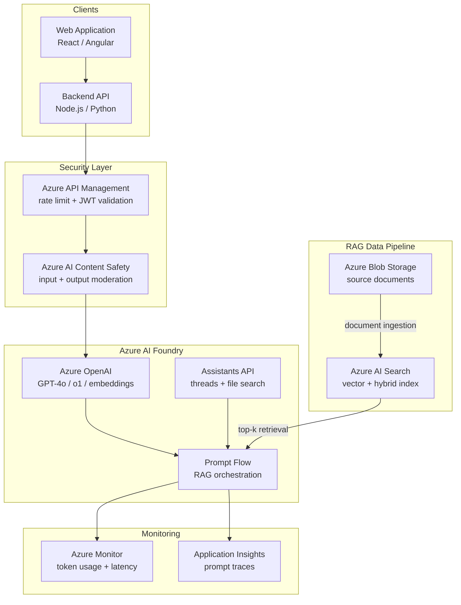

# Azure OpenAI & AI Foundry

## Category

Azure, Generative AI, LLM, Azure OpenAI, AI Foundry, RAG, Prompt Flow

## Context

**Azure OpenAI Service** provides enterprise access to OpenAI's models (GPT-4o, GPT-4o mini, o1, o3, DALL-E 3, Whisper, text-embedding-3) deployed within your Azure subscription — with Azure's data privacy, compliance, RBAC, private networking, and no data leaving your tenant for training.

**Azure AI Foundry** (formerly Azure AI Studio) is the unified platform for building, evaluating, and deploying generative AI applications on Azure — combining model access, prompt engineering, RAG (via AI Search), evaluation pipelines, and MLOps.

### Model & Service Comparison

| Model | Best For | Context Window |
|-------|---------|---------------|
| **GPT-4o** | General reasoning, vision, structured output | 128k tokens |
| **GPT-4o mini** | High-volume, cost-sensitive tasks | 128k tokens |
| **o1 / o3** | Complex multi-step reasoning, math, code | 200k tokens |
| **text-embedding-3-large** | Semantic search, RAG embeddings | 8k tokens |
| **DALL-E 3** | Image generation | — |
| **Whisper** | Speech-to-text transcription | — |
| **Phi-4** | Small language model; edge / low-cost | 16k tokens |

### Architecture Patterns

| Pattern | Description |
|---------|------------|
| **Direct Inference** | Call Azure OpenAI REST API; single-turn completions |
| **Chat Sessions** | Multi-turn conversations with system prompt and message history |
| **RAG via AI Search** | Azure AI Search as vector store; retrieve chunks + generate answer |
| **Prompt Flow** | Visual pipeline for prompt engineering, RAG, evaluation — deployed as managed endpoint |
| **Batch Inference** | Asynchronous large-scale document processing at ~50% cost |
| **Assistants API** | Persistent threads, tool use (code interpreter, file search), multi-step agents |

---

## Pros

- **Data sovereignty**: Models deployed within your Azure region — no data leaves your tenant; eligible for Azure compliance certifications (ISO 27001, SOC 2, PCI-DSS, GDPR).
- **Private endpoints**: Azure OpenAI deployed with Private Endpoint — traffic stays on your VNet, no public internet exposure.
- **Azure RBAC**: Managed Identity for apps — no API keys in code; fine-grained role assignments (`Cognitive Services OpenAI User` vs `Contributor`).
- **Content Safety built-in**: Azure AI Content Safety integration — moderate input/output for hate, violence, self-harm, and sexual content.
- **AI Foundry unifies the lifecycle**: Prompt engineering → evaluation → deployment → monitoring in one platform.

## Cons

- **Quota and rate limits per region**: TPM (tokens per minute) quotas are regional — high-traffic apps need quota increase requests or multi-region deployments.
- **Model availability lags OpenAI**: New OpenAI models arrive on Azure OpenAI weeks after openai.com availability.
- **Prompt Flow vendor lock-in**: Flows are proprietary to Azure AI Foundry — complex to migrate to other orchestration frameworks.
- **AI Search cost at scale**: Vector search in Azure AI Search scales expensively for large corpora — index partitioning and SKU selection are critical.

---

## Design Diagram



---

## Code Sample

### 1. Azure OpenAI — Chat Completion with Managed Identity

```typescript
import { AzureOpenAI } from 'openai';
import { DefaultAzureCredential, getBearerTokenProvider } from '@azure/identity';

// Use Managed Identity — no API keys in code or environment variables
const credential   = new DefaultAzureCredential();
const scope        = 'https://cognitiveservices.azure.com/.default';
const tokenProvider = getBearerTokenProvider(credential, scope);

const client = new AzureOpenAI({
  azureADTokenProvider: tokenProvider,
  endpoint:             process.env.AZURE_OPENAI_ENDPOINT!,   // e.g. https://my-aoai.openai.azure.com
  apiVersion:           '2025-01-01-preview',
  deployment:           'gpt-4o',   // deployment name (not model name)
});

interface Message { role: 'system' | 'user' | 'assistant'; content: string; }

async function chatCompletion(messages: Message[]): Promise<string> {
  const response = await client.chat.completions.create({
    model:       'gpt-4o',           // matches deployment name
    messages,
    max_tokens:  1024,
    temperature: 0.2,
    response_format: { type: 'json_object' },   // enforce JSON output
  });

  return response.choices[0].message.content ?? '';
}

// Streaming response — for chat UI
async function* chatStream(messages: Message[]): AsyncGenerator<string> {
  const stream = await client.chat.completions.create({
    model:    'gpt-4o',
    messages,
    stream:   true,
    max_tokens: 2048,
  });

  for await (const chunk of stream) {
    const delta = chunk.choices[0]?.delta?.content;
    if (delta) yield delta;
  }
}
```

### 2. RAG — Azure AI Search Vector Query + Generate

```typescript
import { SearchClient, AzureKeyCredential } from '@azure/search-documents';
import { AzureOpenAI } from 'openai';
import { DefaultAzureCredential, getBearerTokenProvider } from '@azure/identity';

interface SearchDocument {
  id:        string;
  content:   string;
  source:    string;
  embedding: number[];
}

const searchClient = new SearchClient<SearchDocument>(
  process.env.AI_SEARCH_ENDPOINT!,
  process.env.AI_SEARCH_INDEX!,
  new AzureKeyCredential(process.env.AI_SEARCH_ADMIN_KEY!),   // or Managed Identity
);

// Generate embedding for query
async function embedQuery(text: string): Promise<number[]> {
  const credential     = new DefaultAzureCredential();
  const tokenProvider  = getBearerTokenProvider(credential, 'https://cognitiveservices.azure.com/.default');
  const embeddingClient = new AzureOpenAI({
    azureADTokenProvider: tokenProvider,
    endpoint:   process.env.AZURE_OPENAI_ENDPOINT!,
    apiVersion: '2025-01-01-preview',
    deployment: 'text-embedding-3-large',
  });

  const response = await embeddingClient.embeddings.create({
    model: 'text-embedding-3-large',
    input: text,
  });
  return response.data[0].embedding;
}

// Hybrid search: keyword + vector (best recall)
async function hybridSearch(query: string, topK = 5): Promise<SearchDocument[]> {
  const queryEmbedding = await embedQuery(query);

  const results = await searchClient.search(query, {
    vectorSearchOptions: {
      queries: [{
        kind:        'vector',
        vector:      queryEmbedding,
        kNearestNeighborsCount: topK,
        fields:      ['embedding'],
      }],
    },
    queryType: 'semantic',
    semanticSearchOptions: {
      configurationName: 'default',
      captions:          { captionType: 'extractive' },
    },
    select: ['id', 'content', 'source'],
    top:    topK,
  });

  const docs: SearchDocument[] = [];
  for await (const result of results.results) {
    docs.push(result.document);
  }
  return docs;
}

// RAG: retrieve + generate
async function ragQuery(userQuestion: string): Promise<string> {
  const chunks = await hybridSearch(userQuestion);

  const context = chunks
    .map((c, i) => `[Source ${i + 1}: ${c.source}]\n${c.content}`)
    .join('\n\n---\n\n');

  const messages: Message[] = [
    {
      role:    'system',
      content: `You are a banking assistant. Answer using only the provided context below.
If the context doesn't contain the answer, say "I don't have that information."
Always cite the source number.

Context:
${context}`,
    },
    { role: 'user', content: userQuestion },
  ];

  return chatCompletion(messages);
}
```

### 3. Semantic Kernel — RAG + Plugin Orchestration

```csharp
// C# — Semantic Kernel with Azure OpenAI + AI Search plugin
using Microsoft.SemanticKernel;
using Microsoft.SemanticKernel.Connectors.AzureOpenAI;
using Microsoft.Extensions.DependencyInjection;

var builder = Kernel.CreateBuilder();

// Register Azure OpenAI with Managed Identity (no API key)
builder.AddAzureOpenAIChatCompletion(
    deploymentName: "gpt-4o",
    endpoint:       "https://my-aoai.openai.azure.com",
    credentials:    new DefaultAzureCredential()
);

builder.AddAzureOpenAITextEmbeddingGeneration(
    deploymentName: "text-embedding-3-large",
    endpoint:       "https://my-aoai.openai.azure.com",
    credentials:    new DefaultAzureCredential()
);

// Register Azure AI Search as vector store memory
builder.AddAzureAISearchVectorStoreRecordCollection<DocumentRecord>(
    collectionName: "payment-docs",
    endpoint:       new Uri("https://my-search.search.windows.net"),
    credential:     new DefaultAzureCredential()
);

var kernel = builder.Build();

// Register a plugin (tool) the LLM can call
kernel.ImportPluginFromObject(new PaymentPlugin(paymentService), "payments");

// Invoke with automatic tool selection and RAG retrieval
var result = await kernel.InvokePromptAsync(
    promptTemplate: """
        User question: {{$question}}
        Use the 'payments' plugin to look up account information if needed.
        Answer concisely.
    """,
    arguments: new KernelArguments { ["question"] = userInput }
);

Console.WriteLine(result);
```

### 4. AI Search — Document Ingestion Pipeline

```typescript
// Ingest documents into Azure AI Search with vector embeddings
import { SearchIndexClient, SearchIndex, AzureKeyCredential } from '@azure/search-documents';
import { AzureOpenAI } from 'openai';
import { DefaultAzureCredential, getBearerTokenProvider } from '@azure/identity';

// Create the search index with hybrid search support
async function createSearchIndex(adminClient: SearchIndexClient): Promise<void> {
  const index: SearchIndex = {
    name: 'payment-docs',
    fields: [
      { name: 'id',        type: 'Edm.String',       key: true,     filterable: true },
      { name: 'content',   type: 'Edm.String',       searchable: true, analyzerName: 'en.microsoft' },
      { name: 'source',    type: 'Edm.String',       filterable: true, retrievable: true },
      { name: 'category',  type: 'Edm.String',       filterable: true, facetable: true },
      {
        name:        'embedding',
        type:        'Collection(Edm.Single)',
        searchable:  true,
        vectorSearchDimensions: 3072,        // text-embedding-3-large dimensions
        vectorSearchProfileName: 'hnsw-profile',
      },
    ],
    vectorSearch: {
      profiles:    [{ name: 'hnsw-profile', algorithmConfigurationName: 'hnsw-config' }],
      algorithms:  [{ name: 'hnsw-config', kind: 'hnsw', parameters: { m: 4, efConstruction: 400 } }],
    },
    semanticSearch: {
      defaultConfigurationName: 'default',
      configurations: [{
        name:          'default',
        prioritizedFields: {
          contentFields: [{ fieldName: 'content' }],
        },
      }],
    },
  };

  await adminClient.createOrUpdateIndex(index);
}

// Chunk a document and ingest with embeddings
async function ingestDocument(
  filePath: string,
  content: string,
  searchClient: SearchClient<any>,
  embeddingClient: AzureOpenAI
): Promise<void> {
  // Simple fixed-size chunking (800 tokens, 100 token overlap)
  const chunks = chunkText(content, { chunkSize: 800, overlap: 100 });

  for (const [i, chunk] of chunks.entries()) {
    const embeddingResponse = await embeddingClient.embeddings.create({
      model: 'text-embedding-3-large',
      input: chunk,
    });

    await searchClient.uploadDocuments([{
      id:        `${filePath}-chunk-${i}`,
      content:   chunk,
      source:    filePath,
      embedding: embeddingResponse.data[0].embedding,
    }]);
  }
}
```

### 5. Bicep — Azure OpenAI + AI Search Deployment

```bicep
// modules/ai-platform.bicep

@description('Deployment region for Azure OpenAI (model availability varies by region)')
param location string = 'swedencentral'  // Sweden Central has widest model availability in EU

// Azure OpenAI resource
resource azureOpenAI 'Microsoft.CognitiveServices/accounts@2024-10-01' = {
  name:     'aoai-${uniqueString(resourceGroup().id)}'
  location: location
  kind:     'OpenAI'
  sku:      { name: 'S0' }
  identity: { type: 'SystemAssigned' }
  properties: {
    customSubDomainName:     'aoai-${uniqueString(resourceGroup().id)}'
    publicNetworkAccess:     'Disabled'   // private endpoint only
    networkAcls: {
      defaultAction: 'Deny'
    }
  }
}

// GPT-4o deployment
resource gpt4oDeployment 'Microsoft.CognitiveServices/accounts/deployments@2024-10-01' = {
  parent: azureOpenAI
  name:   'gpt-4o'
  sku: {
    name:     'GlobalStandard'   // global routing for highest throughput
    capacity: 100                // 100k TPM
  }
  properties: {
    model: {
      format:  'OpenAI'
      name:    'gpt-4o'
      version: '2024-11-20'
    }
  }
}

// Embedding model deployment
resource embeddingDeployment 'Microsoft.CognitiveServices/accounts/deployments@2024-10-01' = {
  parent:     azureOpenAI
  name:       'text-embedding-3-large'
  dependsOn:  [gpt4oDeployment]   // deployments must be sequential
  sku: {
    name:     'Standard'
    capacity: 50
  }
  properties: {
    model: {
      format:  'OpenAI'
      name:    'text-embedding-3-large'
      version: '1'
    }
  }
}

// Azure AI Search
resource aiSearch 'Microsoft.Search/searchServices@2024-06-01-preview' = {
  name:     'search-${uniqueString(resourceGroup().id)}'
  location: location
  sku:      { name: 'standard' }   // Standard for vector search
  identity: { type: 'SystemAssigned' }
  properties: {
    publicNetworkAccess: 'disabled'
    replicaCount:        2          // HA: minimum 2 replicas for SLA
    partitionCount:      1
    semanticSearch:      'free'     // enable semantic reranking
  }
}

// Grant AI Search Managed Identity → Azure OpenAI (for integrated vectorisation)
resource searchToOpenAIRole 'Microsoft.Authorization/roleAssignments@2022-04-01' = {
  scope: azureOpenAI
  name:  guid(azureOpenAI.id, aiSearch.id, 'CognitiveServicesOpenAIUser')
  properties: {
    roleDefinitionId: subscriptionResourceId('Microsoft.Authorization/roleDefinitions', '5e0bd9bd-7b93-4f28-af87-19fc36ad61bd')  // Cognitive Services OpenAI User
    principalId:      aiSearch.identity.principalId
    principalType:    'ServicePrincipal'
  }
}

output openAIEndpoint   string = azureOpenAI.properties.endpoint
output searchEndpoint   string = 'https://${aiSearch.name}.search.windows.net'
```

### 6. Content Safety — Moderate Input/Output

```typescript
import { ContentSafetyClient, isUnexpected } from '@azure-rest/ai-content-safety';
import { AzureKeyCredential } from '@azure/core-auth';
import { DefaultAzureCredential } from '@azure/identity';

const contentSafetyClient = ContentSafetyClient(
  process.env.CONTENT_SAFETY_ENDPOINT!,
  new DefaultAzureCredential()   // Managed Identity — no key needed
);

interface ModerationResult {
  allowed: boolean;
  reason?: string;
}

async function moderateText(text: string): Promise<ModerationResult> {
  const response = await contentSafetyClient.path('/text:analyze').post({
    body: {
      text,
      categories:       ['Hate', 'Violence', 'SelfHarm', 'Sexual'],
      outputType:       'FourSeverityLevels',
      blocklistNames:   ['financial-prohibited-topics'],   // custom blocklist
    },
  });

  if (isUnexpected(response)) {
    throw new Error(`Content Safety API error: ${response.status}`);
  }

  // Block if any category has severity >= 2 (medium or above)
  const blocked = response.body.categoriesAnalysis.some(
    cat => (cat.severity ?? 0) >= 2
  );

  return {
    allowed: !blocked,
    reason:  blocked
      ? response.body.categoriesAnalysis
          .filter(c => (c.severity ?? 0) >= 2)
          .map(c => `${c.category} (severity: ${c.severity})`)
          .join(', ')
      : undefined,
  };
}
```

---

## Security Checklist

- [ ] Azure OpenAI deployed with Private Endpoint — `publicNetworkAccess: Disabled`
- [ ] Applications use Managed Identity + `Cognitive Services OpenAI User` role — no API keys
- [ ] Content Safety moderation applied to user inputs and model outputs
- [ ] Azure RBAC: `Cognitive Services OpenAI User` for inference; `Contributor` restricted to platform team only
- [ ] Diagnostic settings enabled → Log Analytics: request logs, token usage, throttling events
- [ ] Token budget / rate limit enforced per user at API layer (APIM policy or application middleware)
- [ ] AI Search index uses private endpoint — not public internet
- [ ] Prompt injection detection applied before passing user input to Azure OpenAI (see [security/16-ai-llm-security.md](../../security/16-ai-llm-security.md))
- [ ] AI Foundry project logs all prompt/completion pairs for regulated workloads (audit trail)

---

## References

- [Azure OpenAI Service — Documentation](https://learn.microsoft.com/en-us/azure/ai-services/openai/)
- [Azure AI Foundry](https://learn.microsoft.com/en-us/azure/ai-foundry/)
- [Azure AI Search — Vector Search](https://learn.microsoft.com/en-us/azure/search/vector-search-overview)
- [Semantic Kernel — .NET / Python / Java](https://learn.microsoft.com/en-us/semantic-kernel/overview/)
- [Azure AI Content Safety](https://learn.microsoft.com/en-us/azure/ai-services/content-safety/)
- [Azure OpenAI Private Endpoints](https://learn.microsoft.com/en-us/azure/ai-services/cognitive-services-virtual-networks)
- [Responsible AI at Microsoft](https://www.microsoft.com/en-us/ai/responsible-ai)
- [OWASP LLM Top 10 defensive patterns → security/16-ai-llm-security.md](../../security/16-ai-llm-security.md)
