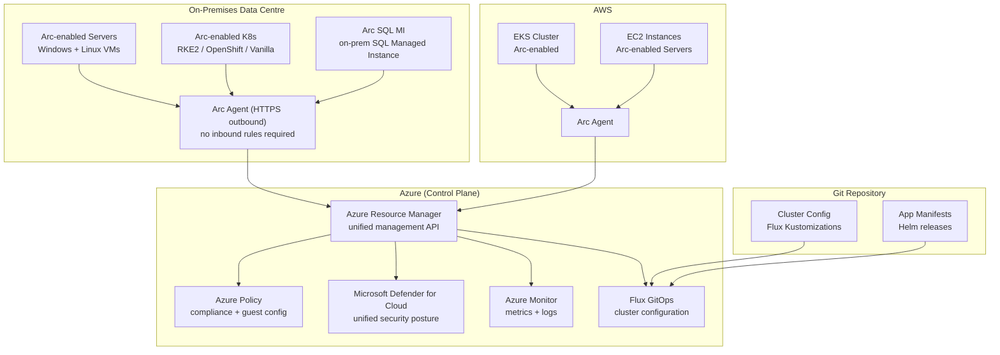

# Azure Arc — Hybrid & Multi-Cloud Management

## Category

Azure, Hybrid Cloud, Multi-Cloud, Arc, Kubernetes, GitOps, Policy

## Context

**Azure Arc** extends Azure management plane — RBAC, Policy, Defender, Monitor, GitOps, and Azure services — to infrastructure running anywhere: on-premises servers, other cloud providers (AWS, GCP), edge locations, and Kubernetes clusters outside Azure.

Azure Arc does not move workloads to Azure. It projects non-Azure resources into Azure Resource Manager (ARM) so they can be managed as first-class Azure resources.

### Azure Arc Components

| Component | What it manages | Key Use Cases |
|-----------|----------------|--------------|
| **Arc-enabled Servers** | Physical servers, VMs (on-prem / AWS / GCP) | Unified inventory, Defender for Servers, Policy, Guest Config |
| **Arc-enabled Kubernetes** | Any CNCF-conformant K8s cluster | GitOps (Flux), Azure Monitor, Defender for Containers, Policy |
| **Arc-enabled Data Services** | SQL MI and PostgreSQL running anywhere | Always-current SQL MI on-prem; elastic scale |
| **Arc-enabled App Services** | App Service, Functions, Logic Apps on Arc K8s | Run PaaS services on-prem or in other clouds |
| **Arc-enabled Machine Learning** | ML model training on Arc K8s | Data residency; GPU on-prem |
| **Azure Stack HCI** | Hyper-converged on-prem infrastructure | Azure-managed on-prem hypervisor |

### When to Use Azure Arc

| Scenario | Arc Solution |
|----------|-------------|
| Multi-cloud Kubernetes (EKS + AKS + on-prem) | Arc-enabled K8s + Flux GitOps across all clusters |
| Regulatory data residency (data cannot leave region) | Arc-enabled SQL MI deployed on-prem |
| Unified security posture across cloud + on-prem | Arc + Defender for Cloud (single pane of glass) |
| Consistent Azure Policy enforcement everywhere | Arc-enabled Servers + Azure Policy Guest Config |
| On-prem servers need patch management | Arc + Azure Update Manager |
| Edge Kubernetes (factory floor, retail, telco) | Arc-enabled K8s at edge |

---

## Pros

- **Single control plane**: Manage on-prem and multi-cloud resources from Azure Portal, CLI, and ARM — without separate tooling per environment.
- **Azure Policy everywhere**: Enforce compliance (CIS benchmarks, NIST, PCI-DSS) on non-Azure Kubernetes clusters and servers — same policy definitions as Azure-native resources.
- **GitOps at scale**: Deploy Flux configurations to hundreds of Arc-enabled clusters from a single Git repository — consistent application of cluster configurations.
- **Defender for Cloud unified**: Arc brings on-prem workloads under Azure Defender — unified security score and recommendations across clouds.
- **No network path required for Arc agents**: Arc agents connect outbound to Azure via HTTPS — no inbound firewall rules required.

## Cons

- **Agent dependency**: Every Arc-enabled resource requires a running Arc agent — if the agent is unhealthy, management capabilities are unavailable.
- **Latency for imperative operations**: Azure Portal/CLI commands traverse the internet to the Arc agent — not suitable for real-time control plane operations requiring < 100ms response.
- **Arc-enabled Data Services complexity**: SQL MI on Arc requires Arc data controller + significant K8s resources — not lightweight to operate.
- **Limited services in Arc App Services**: Not all Azure PaaS features available when deployed via Arc; some capabilities require Azure region deployments.

---

## Design Diagram



---

## Code Sample

### 1. Onboard Server to Azure Arc

```bash
# Generate onboarding script from Azure Portal or CLI
# This is executed on the target server (on-prem or other cloud)

# Generate service principal for onboarding (one-time, scoped to resource group)
az ad sp create-for-rbac \
  --name "arc-onboarding-sp" \
  --role "Azure Connected Machine Onboarding" \
  --scopes "/subscriptions/${SUBSCRIPTION_ID}/resourceGroups/${RESOURCE_GROUP}"

# On the target server — download and run the Arc agent installer
curl -sSL https://aka.ms/azcmagent | bash

# Connect the server to Azure Arc
azcmagent connect \
  --service-principal-id     "${SP_ID}" \
  --service-principal-secret "${SP_SECRET}" \
  --tenant-id                "${TENANT_ID}" \
  --subscription-id          "${SUBSCRIPTION_ID}" \
  --resource-group           "${RESOURCE_GROUP}" \
  --location                 "westeurope" \
  --tags                     "environment=production,team=payments"
```

### 2. Onboard Kubernetes Cluster to Azure Arc

```bash
# Prerequisite: kubectl context pointing to the target cluster

# Register Arc for Kubernetes providers
az provider register --namespace Microsoft.Kubernetes
az provider register --namespace Microsoft.KubernetesConfiguration

# Connect cluster — installs Arc agents into 'azure-arc' namespace
az connectedk8s connect \
  --name                "${CLUSTER_NAME}" \
  --resource-group      "${RESOURCE_GROUP}" \
  --location            "westeurope" \
  --distribution        "generic" \
  --tags                "environment=production,tier=backend"

# Verify Arc agents are running
kubectl get pods -n azure-arc

# Expected pods:
# cluster-metadata-operator-*
# clusterconnect-agent-*
# clusteridentityoperator-*
# config-agent-*
# controller-manager-*
# extension-manager-*
# flux-logs-agent-*
# kube-aad-proxy-*
# metrics-agent-*
# resource-sync-agent-*
```

### 3. GitOps with Flux — Apply Across Arc Clusters

```bash
# Create a Flux configuration that applies to an Arc-enabled cluster
# Flux will be installed by Arc and sync from the Git repository

az k8s-configuration flux create \
  --resource-group    "${RESOURCE_GROUP}" \
  --cluster-name      "${CLUSTER_NAME}" \
  --cluster-type      "connectedClusters" \
  --name              "cluster-config" \
  --namespace         "flux-system" \
  --scope             "cluster" \
  --url               "https://github.com/my-org/cluster-configs" \
  --branch            "main" \
  --ssh-private-key-file ~/.ssh/flux-deploy-key \
  --kustomization     name=infra path=./clusters/production/infra prune=true \
  --kustomization     name=apps path=./clusters/production/apps prune=true dependsOn=infra
```

```yaml
# clusters/production/infra/kustomization.yaml
# Applied by Flux to ALL Arc-enabled clusters configured with this repo
apiVersion: kustomize.toolkit.fluxcd.io/v1
kind: Kustomization
metadata:
  name:      infra
  namespace: flux-system
spec:
  interval:  10m
  path:      ./infrastructure/base
  prune:     true
  sourceRef:
    kind: GitRepository
    name: cluster-config
  patches:
    # Cluster-specific overrides
    - patch: |
        - op: replace
          path: /spec/replicas
          value: 3
      target:
        kind: Deployment
        name: ingress-nginx-controller
```

### 4. Azure Policy — Enforce on Arc-Enabled Kubernetes

```bicep
// Assign CIS Kubernetes Benchmark policy initiative to all Arc-enabled clusters
// in a management group (covers both AKS and Arc clusters)

@description('Management group scope for policy assignment')
param managementGroupId string

// Built-in initiative: "Kubernetes cluster pod security baseline standards"
var kubernetesPodSecurityBaseline = '/providers/Microsoft.Authorization/policySetDefinitions/a8640138-9b0a-4a28-b8cb-1666c838647d'

resource policyAssignment 'Microsoft.Authorization/policyAssignments@2023-04-01' = {
  name:  'k8s-pod-security-baseline'
  scope: tenantResourceId('Microsoft.Management/managementGroups', managementGroupId)
  identity: {
    type: 'SystemAssigned'
  }
  properties: {
    displayName:     'Kubernetes Pod Security Baseline — All Clusters'
    policyDefinitionId: kubernetesPodSecurityBaseline
    enforcementMode: 'Default'   // 'DoNotEnforce' for audit-only initially
    parameters: {
      excludedNamespaces: {
        value: ['kube-system', 'flux-system', 'azure-arc', 'monitoring']
      }
      effect: {
        value: 'Deny'
      }
    }
  }
}
```

### 5. Arc-Enabled SQL Managed Instance — Deploy on Kubernetes

```yaml
# Deploy SQL Managed Instance on Arc-enabled Kubernetes
# Requires: Arc data controller already deployed on the cluster

apiVersion: sql.arcdata.microsoft.com/v14
kind: SqlManagedInstance
metadata:
  name:      payments-sql-mi
  namespace: arc-data
  annotations:
    arc.microsoft.com/serviceType: NodePort
spec:
  tier:                 BusinessCritical   # GeneralPurpose or BusinessCritical
  dev:                  false
  licenseType:          LicenseIncluded
  replicas:             3                  # HA: 3 replicas (primary + 2 secondaries)
  readableSecondaries:  1
  storage:
    dataVolumes:
      - className: managed-premium
        accessMode: ReadWriteOnce
        size:       100Gi
    logsVolumes:
      - className: managed-premium
        accessMode: ReadWriteOnce
        size:       10Gi
    backups:
      - className: azureblob
        accessMode: ReadWriteMany
        size:       100Gi
  serviceType:          LoadBalancer
  security:
    adminLoginSecret:   sql-admin-credentials   # Kubernetes Secret
    activeDirectory:
      connector:        payments-ad-connector    # Active Directory integration
      accountName:      sql-payments-svc
```

### 6. Defender for Cloud — Arc Servers Security

```typescript
// Use Azure SDK to query Defender for Cloud recommendations
// for all Arc-enabled servers across subscriptions

import { SecurityCenter } from '@azure/arm-security';
import { DefaultAzureCredential } from '@azure/identity';

const credential = new DefaultAzureCredential();

async function getArcServerRecommendations(subscriptionId: string): Promise<void> {
  const client = new SecurityCenter(credential, subscriptionId);

  const recommendations = client.assessments.list(`/subscriptions/${subscriptionId}`);

  for await (const rec of recommendations) {
    // Filter for Arc-enabled machine recommendations
    if (rec.resourceDetails?.source !== 'Azure' || !rec.id?.includes('microsoft.hybridcompute')) {
      continue;
    }

    if (rec.status?.code === 'Unhealthy') {
      console.log({
        resource:       rec.resourceDetails,
        recommendation: rec.displayName,
        severity:       rec.metadata?.severity,
        remediation:    rec.metadata?.remediationDescription,
      });
    }
  }
}

// Get unified security score across all Arc + Azure resources
async function getSecureScore(subscriptionId: string): Promise<void> {
  const client = new SecurityCenter(credential, subscriptionId);
  const scores = client.secureScores.list();

  for await (const score of scores) {
    console.log({
      name:       score.name,
      score:      score.score?.current,
      maxScore:   score.score?.max,
      percentage: score.score?.percentage,
    });
  }
}
```

### 7. Terraform — Arc-Enable an EKS Cluster

```hcl
# terraform/arc-eks.tf
# Onboard an AWS EKS cluster to Azure Arc

terraform {
  required_providers {
    azapi  = { source = "azure/azapi" }
    helm   = { source = "hashicorp/helm" }
    aws    = { source = "hashicorp/aws" }
  }
}

data "aws_eks_cluster_auth" "eks" {
  name = var.eks_cluster_name
}

provider "helm" {
  kubernetes {
    host                   = data.aws_eks_cluster.eks.endpoint
    cluster_ca_certificate = base64decode(data.aws_eks_cluster.eks.certificate_authority[0].data)
    token                  = data.aws_eks_cluster_auth.eks.token
  }
}

# Register the EKS cluster as Azure Arc Connected Cluster
resource "azapi_resource" "arc_connected_cluster" {
  type      = "Microsoft.Kubernetes/connectedClusters@2024-01-01"
  name      = "arc-eks-${var.eks_cluster_name}"
  location  = var.azure_location
  parent_id = var.resource_group_id

  identity { type = "SystemAssigned" }

  body = jsonencode({
    properties = {
      agentPublicKeyCertificate = ""      # auto-populated by Arc agent on first connect
      distribution              = "eks"
      infrastructure            = "aws"
    }
  })
}

# Install Arc agents on EKS via Helm
resource "helm_release" "arc_agents" {
  name             = "azure-arc"
  repository       = "https://azurearcfork8s.azurecr.io/helm/v1/repo"
  chart            = "azure-arc-k8sagents"
  namespace        = "azure-arc"
  create_namespace = true

  set {
    name  = "global.subscriptionId"
    value = var.subscription_id
  }
  set {
    name  = "global.resourceGroupName"
    value = var.resource_group_name
  }
  set {
    name  = "global.resourceName"
    value = azapi_resource.arc_connected_cluster.name
  }
  set {
    name  = "global.location"
    value = var.azure_location
  }
  set {
    name  = "global.tenantId"
    value = var.tenant_id
  }

  depends_on = [azapi_resource.arc_connected_cluster]
}
```

---

## Security Checklist

- [ ] Arc agents connect outbound only (HTTPS/443) — verify no inbound firewall rules opened
- [ ] Arc service principal / Managed Identity scoped to minimum required roles (`Azure Connected Machine Onboarding` for registration only)
- [ ] Defender for Servers Plan 2 enabled on Arc-enabled servers — automatic MDE agent deployment
- [ ] Defender for Containers enabled on Arc-enabled Kubernetes clusters
- [ ] Azure Policy `Audit` → `Enforce` migration done gradually per cluster (start with `DoNotEnforce`)
- [ ] GitOps source repository protected: branch protection, signed commits, PR reviews required
- [ ] Arc SQL MI admin credentials stored in Kubernetes Secret — rotated regularly
- [ ] Network connectivity: Arc agents access only required Arc endpoints — restrict via egress firewall rules (see Azure Arc network requirements)

---

## References

- [Azure Arc — Overview](https://learn.microsoft.com/en-us/azure/azure-arc/overview)
- [Azure Arc-enabled Kubernetes](https://learn.microsoft.com/en-us/azure/azure-arc/kubernetes/overview)
- [GitOps with Flux on Arc](https://learn.microsoft.com/en-us/azure/azure-arc/kubernetes/gitops-flux2-tutorial)
- [Azure Arc-enabled Data Services](https://learn.microsoft.com/en-us/azure/azure-arc/data/overview)
- [Microsoft Defender for Cloud — Arc Integration](https://learn.microsoft.com/en-us/azure/defender-for-cloud/plan-defender-for-servers)
- [Azure Arc Network Requirements](https://learn.microsoft.com/en-us/azure/azure-arc/servers/network-requirements)
- [Azure Policy for Arc-enabled Kubernetes](https://learn.microsoft.com/en-us/azure/azure-arc/kubernetes/policy-reference)
