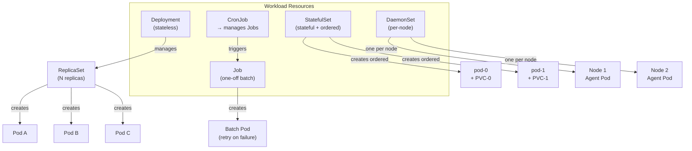

# Kubernetes Workloads

## Category
Core, Scheduling, Kubernetes

## Context

Kubernetes workload resources describe *how* to run containers. Choosing the right workload type is fundamental to correctness, scalability, and operational simplicity.

| Resource | Stable identity | Ordered start/stop | Persistent storage | Use case |
|----------|----------------|-------------------|-------------------|----------|
| **Deployment** | No | No | No (ephemeral) | Stateless APIs, web servers, workers |
| **StatefulSet** | Yes (`pod-0`, `pod-1`) | Yes | Yes (per-pod PVC) | Databases, Kafka, ZooKeeper, Elasticsearch |
| **DaemonSet** | Per-node | N/A | Optional | Log agents, monitoring agents, CNI plugins |
| **Job** | Yes (per completion) | N/A | Optional | Batch processing, DB migrations, one-off scripts |
| **CronJob** | Managed by Job | N/A | Optional | Scheduled reports, cache warm-up, cleanup |
| **ReplicaSet** | No | No | No | Rarely used directly; Deployment manages these |

**Key Deployment fields:**
| Field | Purpose |
|-------|---------|
| `replicas` | Desired pod count |
| `strategy.type` | `RollingUpdate` (default) or `Recreate` |
| `strategy.rollingUpdate.maxUnavailable` | Pods that can be unavailable during rollout |
| `strategy.rollingUpdate.maxSurge` | Extra pods allowed during rollout |
| `revisionHistoryLimit` | Old ReplicaSets to retain for rollback |
| `minReadySeconds` | Time a pod must be ready before counted as available |

**StatefulSet guarantees:**
- Pods get stable DNS: `pod-0.svc-name.namespace.svc.cluster.local`
- Pods are created in order (0 → N) and deleted in reverse (N → 0)
- Each pod gets its own PVC via `volumeClaimTemplates`
- Updates are applied one pod at a time by default

---

## Pros

- **Deployment**: Simple rollout, rollback (`kubectl rollout undo`), zero-downtime updates with rolling strategy.
- **StatefulSet**: Ordered, deterministic pod management; ideal for clustered databases that need self-registration by hostname.
- **DaemonSet**: Guarantees exactly one pod per node without any scheduling complexity.
- **Job**: Kubernetes handles retry on failure; supports parallel batch (`completions` + `parallelism`).
- **CronJob**: Native cron scheduling without an external scheduler; concurrency policy controls overlapping runs.

---

## Cons

- **Deployment**: Cannot guarantee pod identity — bad for anything requiring stable hostnames or per-pod storage.
- **StatefulSet**: Slower rollouts; manual PVC cleanup after scale-down; headless service required for stable DNS.
- **DaemonSet**: No HPA — scales only with node count; risky to run heavy agents on every node.
- **Job**: Completed pods consume quota until cleaned up; requires `ttlSecondsAfterFinished` for auto-cleanup.
- **CronJob**: Missed runs (due to backoff) are not retried by default; `startingDeadlineSeconds` must be tuned.

---

## Design Diagram



---

## Code Sample

### Deployment with rolling update and resource limits

```yaml
# deploy/order-service.yaml
apiVersion: apps/v1
kind: Deployment
metadata:
  name: order-service
  namespace: production
  labels:
    app: order-service
    version: "1.4.2"
spec:
  replicas: 3
  revisionHistoryLimit: 5
  minReadySeconds: 10
  selector:
    matchLabels:
      app: order-service
  strategy:
    type: RollingUpdate
    rollingUpdate:
      maxUnavailable: 0      # Never take pods offline during rollout
      maxSurge: 1            # One extra pod at a time
  template:
    metadata:
      labels:
        app: order-service
        version: "1.4.2"
    spec:
      terminationGracePeriodSeconds: 30
      containers:
        - name: order-service
          image: myregistry.io/order-service:1.4.2
          ports:
            - containerPort: 8080
          resources:
            requests:
              cpu: "250m"
              memory: "256Mi"
            limits:
              cpu: "500m"
              memory: "512Mi"
          readinessProbe:
            httpGet:
              path: /ready
              port: 8080
            initialDelaySeconds: 5
            periodSeconds: 10
          livenessProbe:
            httpGet:
              path: /live
              port: 8080
            initialDelaySeconds: 15
            periodSeconds: 20
          envFrom:
            - configMapRef:
                name: order-service-config
            - secretRef:
                name: order-service-secrets
```

### StatefulSet for PostgreSQL

```yaml
# statefulset/postgres.yaml
apiVersion: apps/v1
kind: StatefulSet
metadata:
  name: postgres
  namespace: data
spec:
  serviceName: postgres-headless   # Required for stable DNS
  replicas: 3
  selector:
    matchLabels:
      app: postgres
  template:
    metadata:
      labels:
        app: postgres
    spec:
      containers:
        - name: postgres
          image: postgres:16-alpine
          env:
            - name: POSTGRES_PASSWORD
              valueFrom:
                secretKeyRef:
                  name: postgres-secret
                  key: password
          ports:
            - containerPort: 5432
          volumeMounts:
            - name: data
              mountPath: /var/lib/postgresql/data
          resources:
            requests:
              cpu: "500m"
              memory: "1Gi"
            limits:
              cpu: "2"
              memory: "4Gi"
  volumeClaimTemplates:
    - metadata:
        name: data
      spec:
        accessModes: ["ReadWriteOnce"]
        storageClassName: fast-ssd
        resources:
          requests:
            storage: 50Gi
---
# Headless service for stable pod DNS
apiVersion: v1
kind: Service
metadata:
  name: postgres-headless
  namespace: data
spec:
  clusterIP: None
  selector:
    app: postgres
  ports:
    - port: 5432
```

### Job with retry and TTL cleanup

```yaml
# job/db-migration.yaml
apiVersion: batch/v1
kind: Job
metadata:
  name: db-migration-v1-4-2
  namespace: production
spec:
  ttlSecondsAfterFinished: 3600    # Auto-delete after 1 hour
  backoffLimit: 3                  # Retry up to 3 times
  template:
    spec:
      restartPolicy: OnFailure
      containers:
        - name: migrate
          image: myregistry.io/order-service:1.4.2
          command: ["node", "scripts/migrate.js"]
          envFrom:
            - secretRef:
                name: order-service-secrets
```

### CronJob for scheduled cleanup

```yaml
# cronjob/cleanup.yaml
apiVersion: batch/v1
kind: CronJob
metadata:
  name: order-cleanup
  namespace: production
spec:
  schedule: "0 2 * * *"             # Daily at 2 AM
  concurrencyPolicy: Forbid          # Do not run overlapping jobs
  startingDeadlineSeconds: 300       # Skip if missed by 5 minutes
  successfulJobsHistoryLimit: 3
  failedJobsHistoryLimit: 1
  jobTemplate:
    spec:
      ttlSecondsAfterFinished: 1800
      template:
        spec:
          restartPolicy: OnFailure
          containers:
            - name: cleanup
              image: myregistry.io/order-service:1.4.2
              command: ["node", "scripts/cleanup-old-orders.js"]
```

---

## Related

- [02 — Networking & Services](./02-networking-services.md) — Expose workloads via Services and Ingress
- [03 — Storage](./03-storage.md) — Persistent storage for StatefulSets
- [06 — Autoscaling](./06-autoscaling.md) — HPA/VPA for Deployments; KEDA for event-driven scaling
- [13 — Pod Reliability](./13-pod-reliability.md) — PDBs, topology spread, and probe tuning
