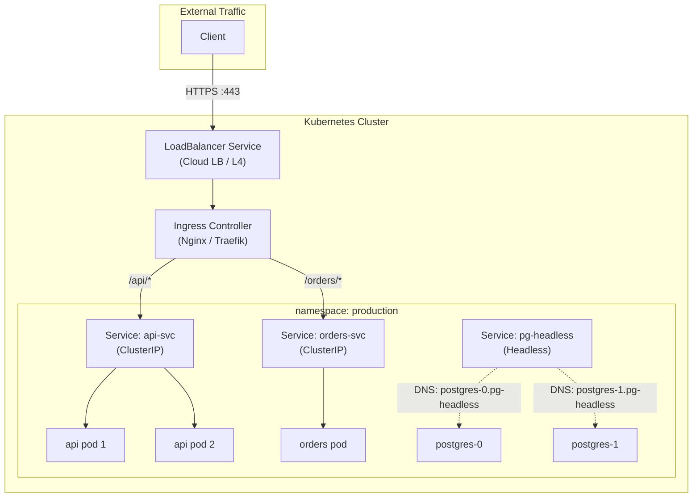

# Kubernetes Networking & Services

## Category
Networking, Kubernetes, Ingress

## Context

Kubernetes networking follows four rules: every pod gets a unique cluster-wide IP; pods can communicate with all other pods without NAT; nodes can communicate with all pods; and the IP a pod sees itself as is the same IP others see it as.

**Service types:**
| Type | Accessibility | Use case |
|------|-------------|----------|
| `ClusterIP` | Cluster-internal only | Default; service-to-service traffic |
| `NodePort` | Cluster nodes (`nodeIP:port`) | Dev/debug; non-cloud environments |
| `LoadBalancer` | External cloud LB (L4) | Production external exposure (TCP/UDP) |
| `ExternalName` | DNS CNAME alias | Proxy to external service by DNS name |
| `Headless` (`clusterIP: None`) | Pod IPs directly | StatefulSet DNS; service discovery |

**Ingress vs Gateway API:**
| Feature | Ingress | Gateway API |
|---------|---------|-------------|
| Maturity | Stable | GA (v1.2+) |
| HTTP routing | Path, host | Path, host, headers, methods, params |
| gRPC routing | Controller-specific | Native `GRPCRoute` |
| TLS | Annotation-based | Native `TLSRoute` |
| Traffic splitting | Controller-specific | Native weight-based split |
| Multi-tenancy | Single owner | Role separation (Infra / App teams) |

**NetworkPolicy** controls L3/L4 traffic between pods using label selectors. It is additive — no policy = allow all; any policy = deny everything not explicitly allowed.

---

## Pros

- **Services**: Stable virtual IP and DNS (`svc.namespace.svc.cluster.local`) even as pods restart.
- **Ingress**: Single load balancer entry point with TLS termination and path-based routing.
- **Gateway API**: Expressive routing rules, native traffic splitting, cleaner multi-tenancy model.
- **NetworkPolicy**: Zero-trust segmentation without changing application code.
- **Headless services**: Pod-level DNS for stateful workloads without a proxy layer.

---

## Cons

- **NodePort**: Limited to ports 30000–32767; not suitable for production.
- **Ingress**: No standard for traffic splitting or header routing — each controller uses annotations differently.
- **Gateway API**: Requires installing a compatible controller (Istio, Envoy Gateway, Nginx Gateway Fabric).
- **NetworkPolicy**: Requires a CNI that enforces it (Calico, Cilium, Weave); the default `kubenet` does not.
- **LoadBalancer**: Creates one cloud LB per service — expensive at scale. Use Ingress or Gateway API for HTTP.

---

## Design Diagram



---

## Code Sample

### ClusterIP Service + Deployment

```yaml
# service/api-service.yaml
apiVersion: v1
kind: Service
metadata:
  name: api-svc
  namespace: production
spec:
  selector:
    app: api
  ports:
    - name: http
      port: 80
      targetPort: 8080
      protocol: TCP
  type: ClusterIP
```

### Ingress with TLS and path routing

```yaml
# ingress/api-ingress.yaml
apiVersion: networking.k8s.io/v1
kind: Ingress
metadata:
  name: api-ingress
  namespace: production
  annotations:
    nginx.ingress.kubernetes.io/ssl-redirect: "true"
    nginx.ingress.kubernetes.io/proxy-body-size: "10m"
spec:
  ingressClassName: nginx
  tls:
    - hosts:
        - api.myapp.com
      secretName: api-tls-cert         # cert-manager populates this
  rules:
    - host: api.myapp.com
      http:
        paths:
          - path: /api/v1
            pathType: Prefix
            backend:
              service:
                name: api-svc
                port:
                  number: 80
          - path: /orders
            pathType: Prefix
            backend:
              service:
                name: orders-svc
                port:
                  number: 80
```

### Gateway API — HTTPRoute with traffic splitting

```yaml
# gateway-api/gateway.yaml
apiVersion: gateway.networking.k8s.io/v1
kind: Gateway
metadata:
  name: prod-gateway
  namespace: production
spec:
  gatewayClassName: envoy-gateway
  listeners:
    - name: https
      port: 443
      protocol: HTTPS
      tls:
        mode: Terminate
        certificateRefs:
          - name: api-tls-cert
---
# gateway-api/httproute-canary.yaml
apiVersion: gateway.networking.k8s.io/v1
kind: HTTPRoute
metadata:
  name: api-route
  namespace: production
spec:
  parentRefs:
    - name: prod-gateway
  hostnames:
    - api.myapp.com
  rules:
    - backendRefs:
        - name: api-svc-stable
          weight: 90
        - name: api-svc-canary
          weight: 10         # 10% canary split
```

### NetworkPolicy — deny all, then allow selectively

```yaml
# netpol/deny-all.yaml
apiVersion: networking.k8s.io/v1
kind: NetworkPolicy
metadata:
  name: default-deny-all
  namespace: production
spec:
  podSelector: {}         # Applies to all pods in namespace
  policyTypes:
    - Ingress
    - Egress
---
# netpol/allow-api-to-orders.yaml
apiVersion: networking.k8s.io/v1
kind: NetworkPolicy
metadata:
  name: allow-api-to-orders
  namespace: production
spec:
  podSelector:
    matchLabels:
      app: orders
  policyTypes:
    - Ingress
  ingress:
    - from:
        - podSelector:
            matchLabels:
              app: api
      ports:
        - protocol: TCP
          port: 8080
---
# netpol/allow-egress-dns.yaml
# Allow all pods to reach kube-dns
apiVersion: networking.k8s.io/v1
kind: NetworkPolicy
metadata:
  name: allow-dns-egress
  namespace: production
spec:
  podSelector: {}
  policyTypes:
    - Egress
  egress:
    - ports:
        - protocol: UDP
          port: 53
        - protocol: TCP
          port: 53
```

---

## Related

- [01 — Workloads](./01-workloads.md) — Workload resources exposed through Services
- [05 — RBAC & Security](./05-rbac-security.md) — NetworkPolicy for zero-trust pod segmentation
- [10 — Service Mesh](./10-service-mesh.md) — L7 mTLS and traffic management beyond NetworkPolicy
- [13 — Pod Reliability](./13-pod-reliability.md) — Topology spread and affinity for availability
