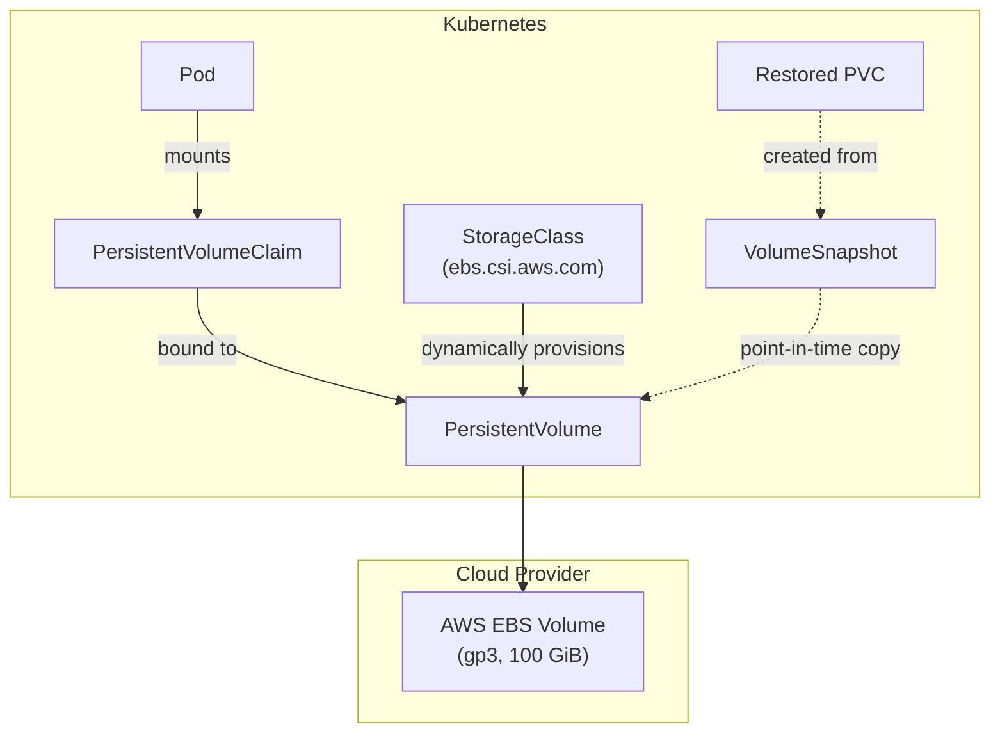

# Kubernetes Storage

## Category
Storage, Stateful, Kubernetes

## Context

Kubernetes decouples storage provisioning from consumption via three abstractions:

| Resource | Role |
|----------|------|
| **PersistentVolume (PV)** | A piece of storage in the cluster (statically or dynamically provisioned) |
| **PersistentVolumeClaim (PVC)** | A request for storage by a pod; bound to a PV |
| **StorageClass** | A template for dynamic provisioning; references a CSI driver |

**Access modes:**
| Mode | Short | Description |
|------|-------|-------------|
| `ReadWriteOnce` | RWO | One node can mount read-write — most block storage |
| `ReadWriteMany` | RWX | Many nodes can mount read-write — NFS, EFS, CephFS |
| `ReadOnlyMany` | ROX | Many nodes can mount read-only |
| `ReadWriteOncePod` | RWOP | Only one **pod** can mount r/w (k8s 1.22+) |

**Volume types commonly used in production:**
| Driver | Cloud | Use case |
|--------|-------|----------|
| `ebs.csi.aws.com` | AWS | Block; RWO; EC2 nodes |
| `efs.csi.aws.com` | AWS | File (NFS); RWX; shared across AZs |
| `disk.csi.azure.com` | Azure | Block; RWO |
| `file.csi.azure.com` | Azure | SMB/NFS; RWX |
| `pd.csi.storage.gke.io` | GCP | Block; RWO |
| `rook-ceph.rbd.csi.ceph.com` | On-prem | Block; RWO |
| `rook-ceph.cephfs.csi.ceph.com` | On-prem | File; RWX |

**Volume binding modes:**
| Mode | Behaviour |
|------|-----------|
| `Immediate` | PV provisioned when PVC created (may be in wrong AZ) |
| `WaitForFirstConsumer` | PV provisioned only when pod is scheduled; ensures AZ alignment |

---

## Pros

- **Dynamic provisioning** via StorageClass eliminates manual PV management.
- **PVC abstraction**: Pods reference a PVC; the underlying storage technology is swappable.
- **StatefulSet + volumeClaimTemplates**: Automatically creates a dedicated PVC per pod replica.
- **Volume snapshots** (`VolumeSnapshot` API): Cloud-native backup and restore without third-party tools.
- **CSI drivers**: Standardised interface; any vendor can build a CSI driver without Kubernetes changes.

---

## Cons

- **RWX is expensive**: EFS/CephFS adds latency; block storage native performance requires RWO.
- **AZ pinning**: RWO volumes are AZ-specific — pod can only run in the AZ where its PV resides.
- **PVC not deleted on StatefulSet scale-down**: Must be cleaned up manually or via a finalizer.
- **Snapshot support**: Not all CSI drivers support `VolumeSnapshot`; verify before relying on it.
- **Storage resizing**: In-place resizing requires both the CSI driver and the `allowVolumeExpansion: true` StorageClass flag. Shrinking is not supported.

---

## Design Diagram



---

## Code Sample

### StorageClass — AWS gp3 with WaitForFirstConsumer

```yaml
# storageclass/fast-ssd.yaml
apiVersion: storage.k8s.io/v1
kind: StorageClass
metadata:
  name: fast-ssd
  annotations:
    storageclass.kubernetes.io/is-default-class: "true"
provisioner: ebs.csi.aws.com
parameters:
  type: gp3
  iops: "3000"
  throughput: "125"       # MiB/s
  encrypted: "true"
volumeBindingMode: WaitForFirstConsumer   # AZ-aware provisioning
allowVolumeExpansion: true
reclaimPolicy: Retain                      # Don't delete EBS volume on PVC delete
```

### PVC and pod mounting

```yaml
# pvc/postgres-data.yaml
apiVersion: v1
kind: PersistentVolumeClaim
metadata:
  name: postgres-data
  namespace: data
spec:
  accessModes:
    - ReadWriteOnce
  storageClassName: fast-ssd
  resources:
    requests:
      storage: 100Gi
---
# pod/postgres.yaml (snippet)
volumes:
  - name: data
    persistentVolumeClaim:
      claimName: postgres-data
containers:
  - name: postgres
    volumeMounts:
      - name: data
        mountPath: /var/lib/postgresql/data
```

### VolumeSnapshot — backup and restore

```yaml
# snapshot/postgres-snapshot.yaml
apiVersion: snapshot.storage.k8s.io/v1
kind: VolumeSnapshot
metadata:
  name: postgres-data-snap-2026-04-12
  namespace: data
spec:
  volumeSnapshotClassName: csi-aws-vsc
  source:
    persistentVolumeClaimName: postgres-data
---
# Restore from snapshot — create a new PVC
apiVersion: v1
kind: PersistentVolumeClaim
metadata:
  name: postgres-data-restored
  namespace: data
spec:
  accessModes:
    - ReadWriteOnce
  storageClassName: fast-ssd
  resources:
    requests:
      storage: 100Gi
  dataSource:
    name: postgres-data-snap-2026-04-12
    kind: VolumeSnapshot
    apiGroup: snapshot.storage.k8s.io
```

### StatefulSet with volumeClaimTemplates (each pod gets its own PVC)

```yaml
# statefulset/kafka.yaml
apiVersion: apps/v1
kind: StatefulSet
metadata:
  name: kafka
  namespace: messaging
spec:
  serviceName: kafka-headless
  replicas: 3
  selector:
    matchLabels:
      app: kafka
  template:
    metadata:
      labels:
        app: kafka
    spec:
      containers:
        - name: kafka
          image: confluentinc/cp-kafka:7.6.0
          volumeMounts:
            - name: data
              mountPath: /var/lib/kafka/data
          resources:
            requests:
              cpu: "500m"
              memory: "2Gi"
            limits:
              cpu: "2"
              memory: "4Gi"
  volumeClaimTemplates:
    - metadata:
        name: data
      spec:
        accessModes: ["ReadWriteOnce"]
        storageClassName: fast-ssd
        resources:
          requests:
            storage: 200Gi
```

### Resize a PVC (expand storage)

```bash
# Patch PVC to request more storage (StorageClass must have allowVolumeExpansion: true)
kubectl patch pvc postgres-data -n data \
  -p '{"spec":{"resources":{"requests":{"storage":"200Gi"}}}}'

# Verify the resize completes
kubectl get pvc postgres-data -n data -w
```

---

## Related

- [01 — Workloads](./01-workloads.md) — StatefulSets pair with volumeClaimTemplates
- [04 — Configuration & Secrets](./04-configuration-secrets.md) — ConfigMap/Secret as read-only volumes
- [13 — Pod Reliability](./13-pod-reliability.md) — Topology spread ensures pods (and their PVCs) land in the right AZ
